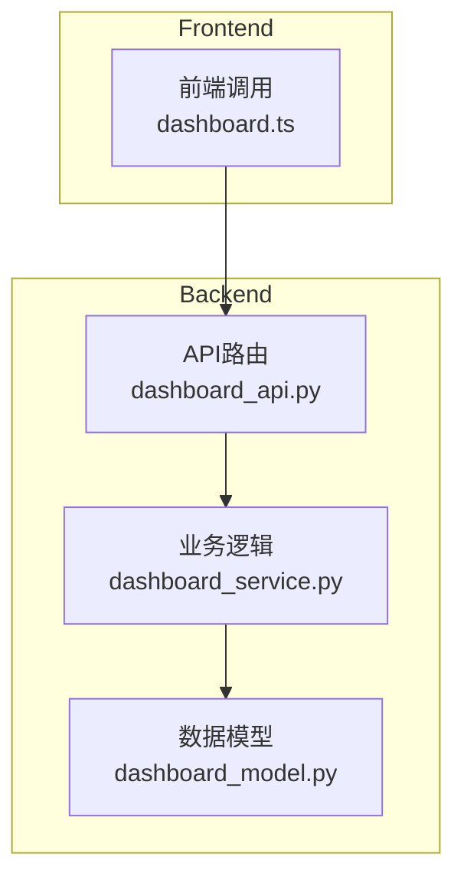
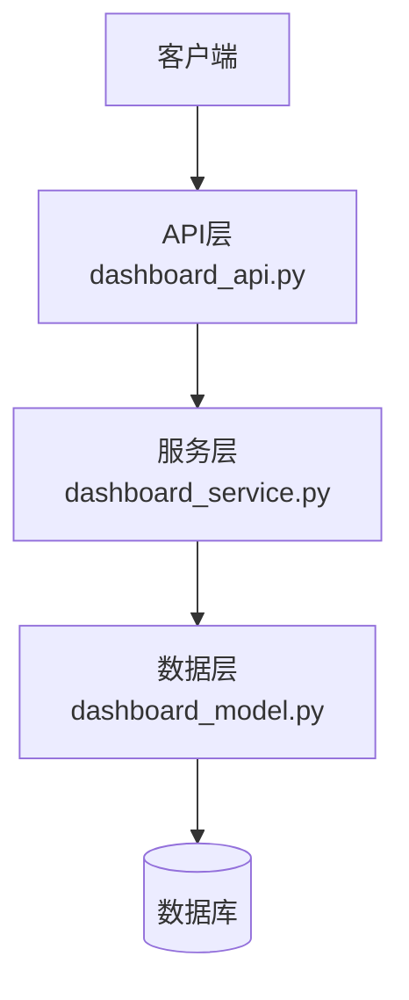
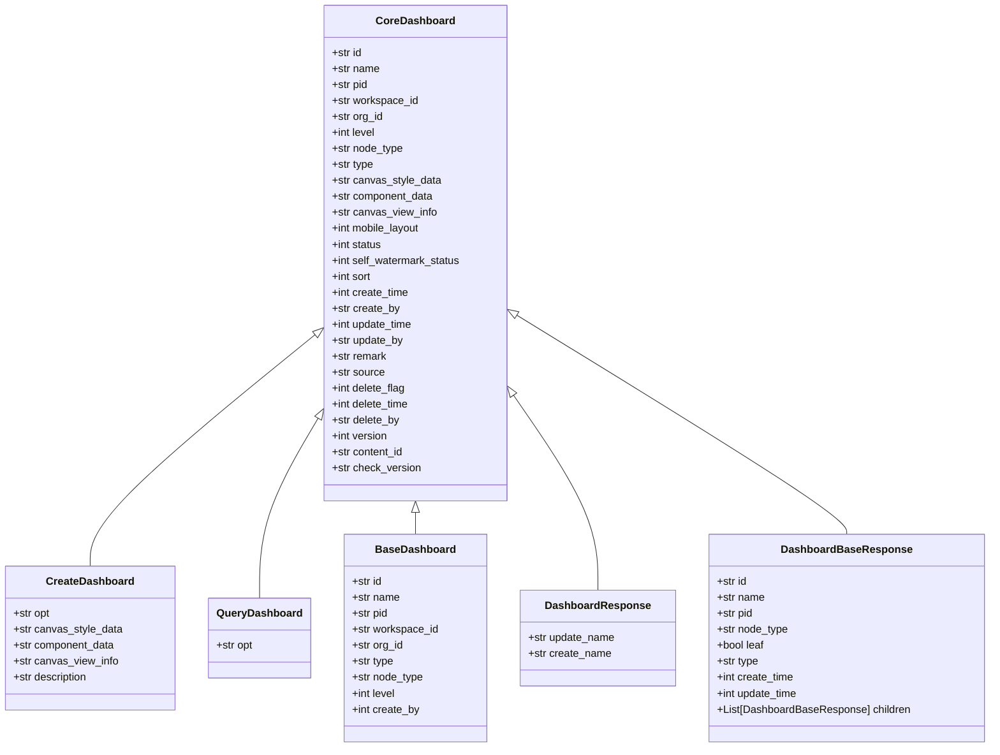
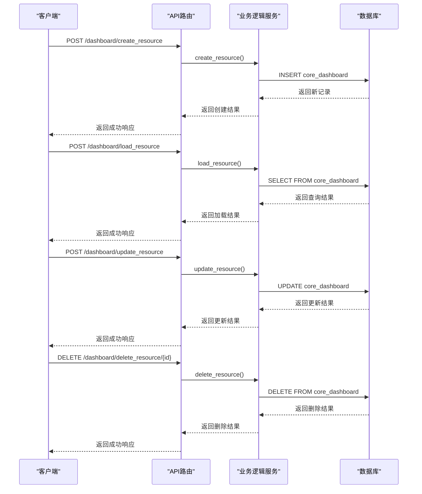
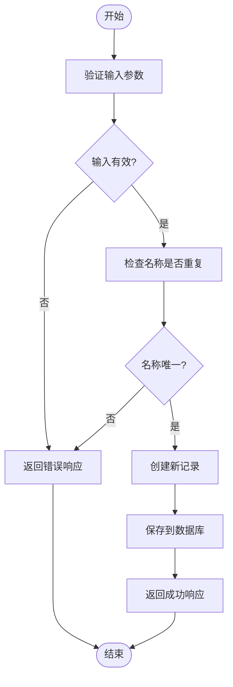
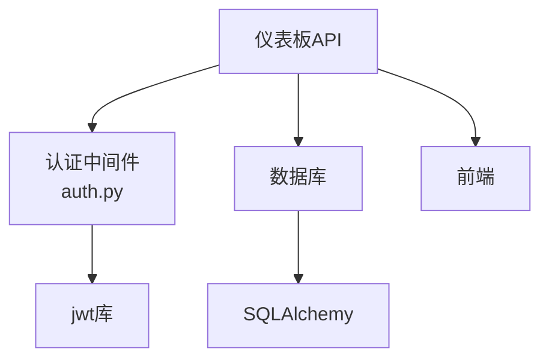

# 仪表板API

<cite>
**本文档中引用的文件**  
- [dashboard_api.py](file://backend/apps/dashboard/api/dashboard_api.py)
- [dashboard_service.py](file://backend/apps/dashboard/crud/dashboard_service.py)
- [dashboard_model.py](file://backend/apps/dashboard/models/dashboard_model.py)
- [auth.py](file://backend/apps/system/middleware/auth.py)
- [schemas.py](file://backend/common/core/schemas.py)
</cite>

## 目录
1. [简介](#简介)
2. [项目结构](#项目结构)
3. [核心组件](#核心组件)
4. [架构概述](#架构概述)
5. [详细组件分析](#详细组件分析)
6. [依赖分析](#依赖分析)
7. [性能考虑](#性能考虑)
8. [故障排除指南](#故障排除指南)
9. [结论](#结论)

## 简介
仪表板API为SQLBot系统提供了一套完整的仪表板管理功能，支持仪表板的创建、读取、更新和删除（CRUD）操作，以及组件管理和布局配置。该API通过JWT认证确保安全性，并支持与聊天记录的关联和快照功能。API设计遵循RESTful原则，使用JSON格式进行数据交换。

## 项目结构
仪表板API的实现分布在后端的多个模块中，主要包括API路由、业务逻辑处理和数据模型定义。前端通过API调用与后端交互，实现用户界面的功能。

**图表来源**  
- [dashboard_api.py](file://backend/apps/dashboard/api/dashboard_api.py#L1-L48)
- [dashboard_service.py](file://backend/apps/dashboard/crud/dashboard_service.py#L1-L137)
- [dashboard_model.py](file://backend/apps/dashboard/models/dashboard_model.py#L1-L164)
- [dashboard.ts](file://frontend/src/api/dashboard.ts#L1-L13)

**章节来源**  
- [dashboard_api.py](file://backend/apps/dashboard/api/dashboard_api.py#L1-L48)
- [dashboard_service.py](file://backend/apps/dashboard/crud/dashboard_service.py#L1-L137)
- [dashboard_model.py](file://backend/apps/dashboard/models/dashboard_model.py#L1-L164)

## 核心组件
仪表板API的核心组件包括API路由、业务逻辑服务和数据模型。API路由定义了HTTP端点，业务逻辑服务处理具体的业务操作，数据模型定义了数据库表结构和数据验证规则。

**章节来源**  
- [dashboard_api.py](file://backend/apps/dashboard/api/dashboard_api.py#L1-L48)
- [dashboard_service.py](file://backend/apps/dashboard/crud/dashboard_service.py#L1-L137)
- [dashboard_model.py](file://backend/apps/dashboard/models/dashboard_model.py#L1-L164)

## 架构概述
仪表板API采用分层架构，包括API层、服务层和数据层。API层负责处理HTTP请求和响应，服务层实现业务逻辑，数据层负责数据持久化。

**图表来源**  
- [dashboard_api.py](file://backend/apps/dashboard/api/dashboard_api.py#L1-L48)
- [dashboard_service.py](file://backend/apps/dashboard/crud/dashboard_service.py#L1-L137)
- [dashboard_model.py](file://backend/apps/dashboard/models/dashboard_model.py#L1-L164)

## 详细组件分析

### 仪表板管理分析
仪表板管理功能包括创建、读取、更新和删除操作，以及资源列表的获取和名称验证。

#### 对象导向组件

**图表来源**  
- [dashboard_model.py](file://backend/apps/dashboard/models/dashboard_model.py#L5-L126)

#### API/服务组件

**图表来源**  
- [dashboard_api.py](file://backend/apps/dashboard/api/dashboard_api.py#L1-L48)
- [dashboard_service.py](file://backend/apps/dashboard/crud/dashboard_service.py#L1-L137)

### 组件管理分析
组件管理功能允许用户在仪表板中添加、更新和删除图表组件，以及管理布局配置。

#### 复杂逻辑组件

**图表来源**  
- [dashboard_service.py](file://backend/apps/dashboard/crud/dashboard_service.py#L101-L136)

**章节来源**  
- [dashboard_api.py](file://backend/apps/dashboard/api/dashboard_api.py#L1-L48)
- [dashboard_service.py](file://backend/apps/dashboard/crud/dashboard_service.py#L1-L137)
- [dashboard_model.py](file://backend/apps/dashboard/models/dashboard_model.py#L1-L164)

## 依赖分析
仪表板API依赖于系统中间件进行JWT认证，依赖于数据库进行数据持久化，并依赖于前端进行用户交互。

**图表来源**  
- [dashboard_api.py](file://backend/apps/dashboard/api/dashboard_api.py#L1-L48)
- [auth.py](file://backend/apps/system/middleware/auth.py#L1-L198)
- [dashboard_model.py](file://backend/apps/dashboard/models/dashboard_model.py#L1-L164)

**章节来源**  
- [dashboard_api.py](file://backend/apps/dashboard/api/dashboard_api.py#L1-L48)
- [auth.py](file://backend/apps/system/middleware/auth.py#L1-L198)
- [dashboard_model.py](file://backend/apps/dashboard/models/dashboard_model.py#L1-L164)

## 性能考虑
为了优化大型仪表板的加载时间和组件渲染效率，建议使用分页参数和过滤条件来减少数据传输量。此外，可以考虑使用缓存机制来存储频繁访问的数据。

## 故障排除指南
常见问题包括资源不存在、权限不足等。对于资源不存在的情况，应检查资源ID是否正确；对于权限不足的情况，应检查用户是否有相应的操作权限。

**章节来源**  
- [dashboard_service.py](file://backend/apps/dashboard/crud/dashboard_service.py#L1-L137)
- [auth.py](file://backend/apps/system/middleware/auth.py#L1-L198)

## 结论
仪表板API为SQLBot系统提供了强大的仪表板管理功能，支持CRUD操作、组件管理和布局配置。通过JWT认证确保安全性，通过分页和过滤优化性能。未来可以考虑增加更多高级功能，如仪表板共享和协作编辑。