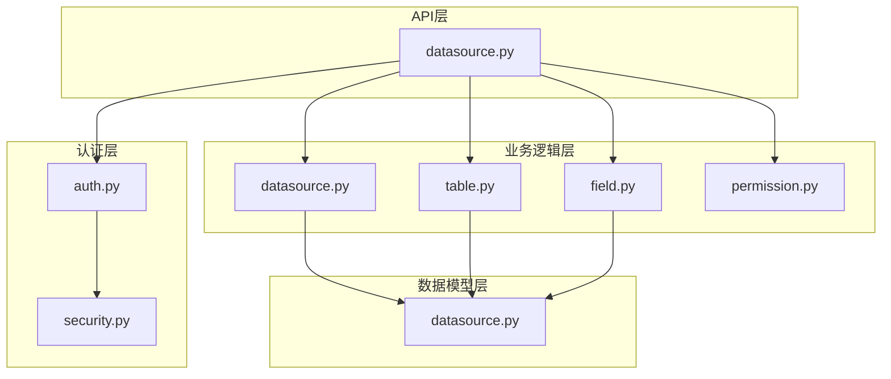
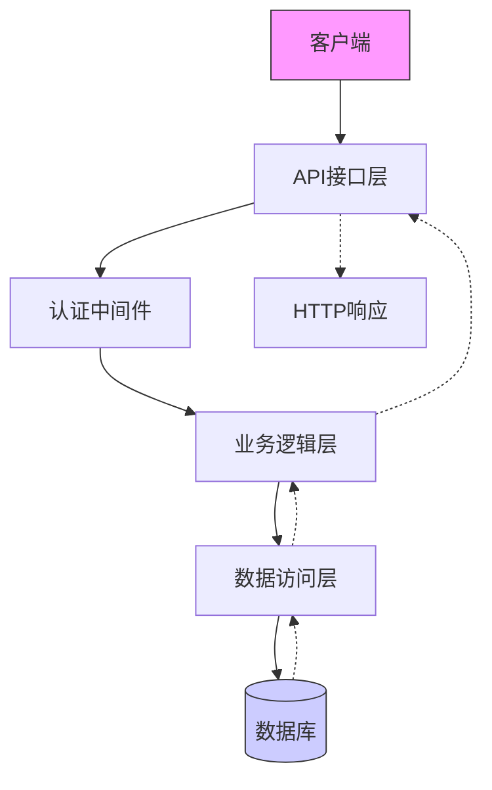
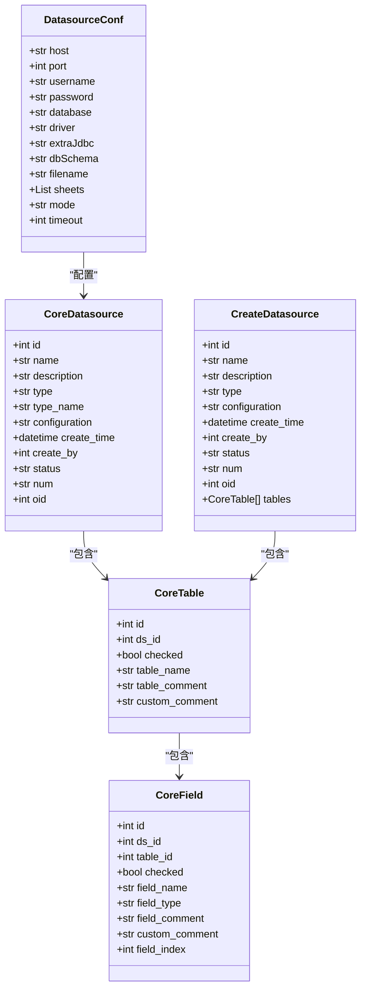
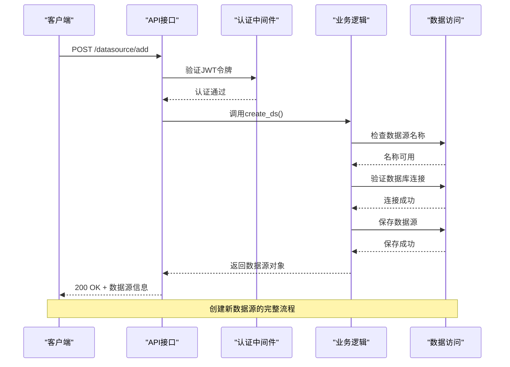
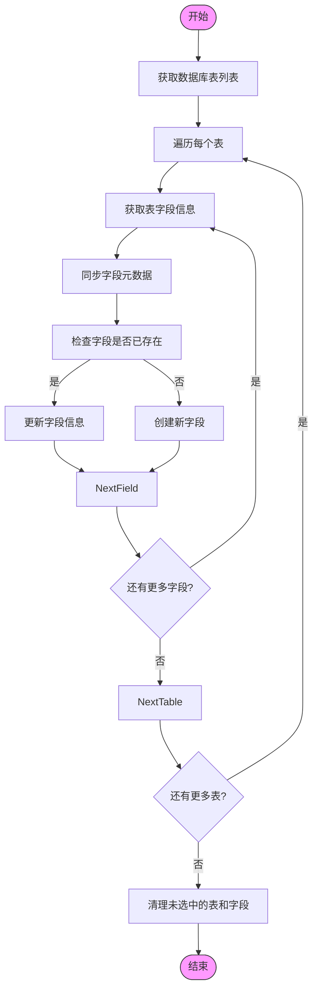
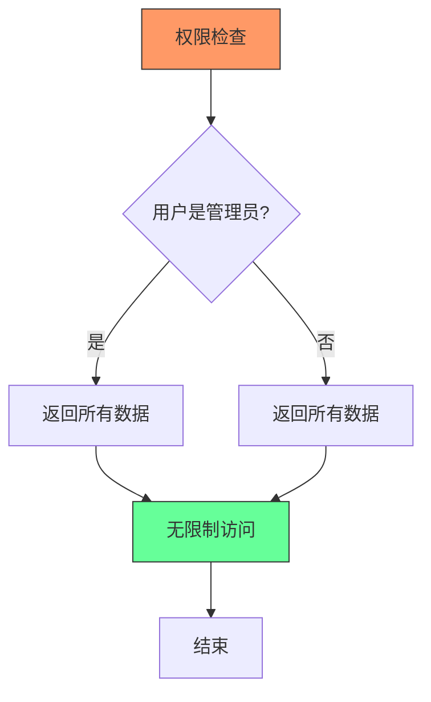
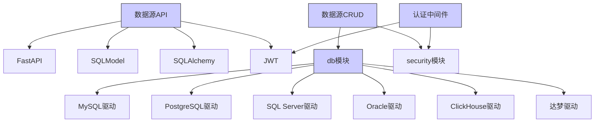

# 数据源API

<cite>
**本文档引用的文件**
- [datasource.py](file://backend/apps/datasource/api/datasource.py)
- [datasource.py](file://backend/apps/datasource/crud/datasource.py)
- [datasource.py](file://backend/apps/datasource/models/datasource.py)
- [permission.py](file://backend/apps/datasource/crud/permission.py)
- [table.py](file://backend/apps/datasource/crud/table.py)
- [field.py](file://backend/apps/datasource/crud/field.py)
- [auth.py](file://backend/apps/system/middleware/auth.py)
- [security.py](file://backend/common/core/security.py)
</cite>

## 目录
1. [简介](#简介)
2. [项目结构](#项目结构)
3. [核心组件](#核心组件)
4. [架构概述](#架构概述)
5. [详细组件分析](#详细组件分析)
6. [依赖分析](#依赖分析)
7. [性能考虑](#性能考虑)
8. [故障排除指南](#故障排除指南)
9. [结论](#结论)

## 简介
本文档为SQLBot的数据源管理API提供详细的参考文档。文档记录了数据源相关端点的HTTP方法、URL路径、请求头（JWT认证）和请求/响应schema。重点文档化数据源的增删改查操作、连接测试接口、表结构获取接口和字段配置接口。提供curl示例展示如何创建新的数据库连接（如PostgreSQL、MySQL）和验证连接。详细说明数据源元数据管理机制，包括表和字段的元数据存储与检索。解释权限控制逻辑，如行级和列级权限的API实现。说明错误处理，如数据库连接失败、无效凭证等场景的响应格式。提供安全最佳实践，包括敏感连接信息的加密存储和传输。

## 项目结构
SQLBot的后端数据源管理模块采用分层架构设计，主要包含API接口层、业务逻辑层和数据模型层。API接口定义在`backend/apps/datasource/api/datasource.py`中，处理HTTP请求和响应。业务逻辑实现在`backend/apps/datasource/crud/`目录下的多个文件中，包括数据源、表、字段和权限的CRUD操作。数据模型定义在`backend/apps/datasource/models/datasource.py`中，使用SQLModel定义了核心数据结构。权限控制逻辑在`backend/apps/datasource/crud/permission.py`中实现，而认证机制则通过`backend/apps/system/middleware/auth.py`中的中间件处理。

**Diagram sources**
- [datasource.py](file://backend/apps/datasource/api/datasource.py)
- [datasource.py](file://backend/apps/datasource/crud/datasource.py)
- [table.py](file://backend/apps/datasource/crud/table.py)
- [field.py](file://backend/apps/datasource/crud/field.py)
- [permission.py](file://backend/apps/datasource/crud/permission.py)
- [datasource.py](file://backend/apps/datasource/models/datasource.py)
- [auth.py](file://backend/apps/system/middleware/auth.py)
- [security.py](file://backend/common/core/security.py)

**Section sources**
- [datasource.py](file://backend/apps/datasource/api/datasource.py)
- [datasource.py](file://backend/apps/datasource/crud/datasource.py)
- [table.py](file://backend/apps/datasource/crud/table.py)
- [field.py](file://backend/apps/datasource/crud/field.py)
- [permission.py](file://backend/apps/datasource/crud/permission.py)
- [datasource.py](file://backend/apps/datasource/models/datasource.py)
- [auth.py](file://backend/apps/system/middleware/auth.py)

## 核心组件
数据源管理API的核心组件包括数据源CRUD操作、表结构管理、字段配置和权限控制。数据源CRUD操作通过`create_ds`、`update_ds`、`delete_ds`和`get_datasource_list`等函数实现，支持对数据源的全生命周期管理。表结构管理功能允许用户获取数据库中的表列表并通过`getTables`和`getTablesByDs`函数进行操作。字段配置功能通过`getFields`和`updateField`等函数实现，支持对表字段的元数据进行管理。权限控制组件虽然在代码中存在，但根据`permission.py`文件中的注释，许可功能已被移除，权限系统已简化。

**Section sources**
- [datasource.py](file://backend/apps/datasource/crud/datasource.py#L1-L374)
- [table.py](file://backend/apps/datasource/crud/table.py#L1-L22)
- [field.py](file://backend/apps/datasource/crud/field.py#L1-L20)
- [permission.py](file://backend/apps/datasource/crud/permission.py#L1-L38)

## 架构概述
数据源管理API采用典型的分层架构，从上到下分为API接口层、业务逻辑层和数据访问层。API接口层负责处理HTTP请求，验证JWT令牌，并将请求转发给相应的业务逻辑处理函数。业务逻辑层包含核心的CRUD操作，处理数据源的创建、更新、删除和查询。数据访问层通过SQLModel与数据库交互，执行具体的数据库操作。整个系统通过中间件进行统一的认证和授权处理，确保只有经过验证的用户才能访问数据源管理功能。

**Diagram sources**
- [datasource.py](file://backend/apps/datasource/api/datasource.py#L1-L329)
- [auth.py](file://backend/apps/system/middleware/auth.py#L1-L199)
- [datasource.py](file://backend/apps/datasource/crud/datasource.py#L1-L374)

## 详细组件分析

### 数据源管理分析
数据源管理组件提供了完整的CRUD操作接口，支持对各种类型的数据库连接进行管理。创建数据源时，系统会验证连接配置的有效性，并将敏感信息（如密码）进行加密存储。更新操作会重新验证数据库连接状态，并更新相应的状态字段。删除操作不仅会从元数据表中移除数据源记录，还会清理相关的表和字段元数据。

#### 对于对象导向组件：

**Diagram sources**
- [datasource.py](file://backend/apps/datasource/models/datasource.py#L1-L129)

#### 对于API/服务组件：

**Diagram sources**
- [datasource.py](file://backend/apps/datasource/api/datasource.py#L1-L329)
- [datasource.py](file://backend/apps/datasource/crud/datasource.py#L1-L374)

### 表结构与字段管理分析
表结构与字段管理组件提供了获取数据库表结构和字段信息的功能。系统通过`getTables`和`getFields`函数从目标数据库获取元数据，并将其存储在本地元数据表中。用户可以对表和字段的注释进行自定义，这些信息存储在`custom_comment`字段中，与数据库原始的注释信息分离。预览功能允许用户在不直接访问数据库的情况下查看表数据的前100行。

#### 对于复杂逻辑组件：

**Diagram sources**
- [datasource.py](file://backend/apps/datasource/crud/datasource.py#L1-L374)
- [table.py](file://backend/apps/datasource/crud/table.py#L1-L22)
- [field.py](file://backend/apps/datasource/crud/field.py#L1-L20)

**Section sources**
- [datasource.py](file://backend/apps/datasource/crud/datasource.py#L1-L374)
- [table.py](file://backend/apps/datasource/crud/table.py#L1-L22)
- [field.py](file://backend/apps/datasource/crud/field.py#L1-L20)

### 权限控制分析
权限控制组件目前处于简化状态，根据代码注释，许可功能已被移除。`get_row_permission_filters`和`get_column_permission_fields`函数分别返回空列表和所有字段，表示当前系统不实施行级或列级权限控制。`is_normal_user`函数用于判断用户是否为普通用户（非ID为1的管理员用户），但这一信息在当前的权限检查中未被使用。

**Diagram sources**
- [permission.py](file://backend/apps/datasource/crud/permission.py#L1-L38)

**Section sources**
- [permission.py](file://backend/apps/datasource/crud/permission.py#L1-L38)

## 依赖分析
数据源管理模块依赖于多个其他模块和外部库。核心依赖包括FastAPI用于构建REST API，SQLModel用于ORM操作，SQLAlchemy用于数据库连接，以及JWT用于认证。系统通过`backend/apps/db/`目录下的模块与各种数据库类型（如MySQL、PostgreSQL、SQL Server等）进行交互。认证依赖于`backend/common/core/security.py`中的工具函数进行密码哈希和令牌生成。错误处理依赖于`backend/common/error.py`中定义的异常类。

**Diagram sources**
- [datasource.py](file://backend/apps/datasource/api/datasource.py)
- [datasource.py](file://backend/apps/datasource/crud/datasource.py)
- [auth.py](file://backend/apps/system/middleware/auth.py)
- [db.py](file://backend/apps/db/db.py)

**Section sources**
- [datasource.py](file://backend/apps/datasource/api/datasource.py)
- [datasource.py](file://backend/apps/datasource/crud/datasource.py)
- [auth.py](file://backend/apps/system/middleware/auth.py)
- [db.py](file://backend/apps/db/db.py)

## 性能考虑
数据源管理API在设计时考虑了性能因素。对于耗时的操作，如数据库连接测试和表结构获取，系统使用`asyncio.to_thread`将同步操作移至线程池中执行，避免阻塞事件循环。元数据缓存机制通过`get_table_schema`函数实现，该函数从本地元数据表中获取信息，而不是每次都查询目标数据库。批量操作如`chooseTables`和`update_table_and_fields`被设计为单次数据库事务，减少了数据库往返次数。对于大数据集的预览，系统限制返回结果为100行，并根据数据库类型使用适当的LIMIT语法。

## 故障排除指南
当遇到数据源管理API的问题时，可以按照以下步骤进行排查。首先检查JWT令牌是否有效且未过期，无效的认证令牌会导致401错误。对于数据库连接失败，检查`configuration`字段中的连接参数是否正确，特别是主机、端口、用户名和密码。如果表结构获取失败，确认数据库用户具有足够的权限来查询系统表。对于500内部服务器错误，查看服务器日志中的详细错误信息，通常位于`SQLBotLogUtil`记录的日志中。如果遇到权限相关的问题，检查用户角色和权限设置，尽管当前系统已简化权限控制。

**Section sources**
- [datasource.py](file://backend/apps/datasource/crud/datasource.py#L1-L374)
- [auth.py](file://backend/apps/system/middleware/auth.py#L1-L199)
- [error.py](file://backend/common/error.py#L1-L7)

## 结论
SQLBot的数据源管理API提供了一套完整的RESTful接口，用于管理各种类型的数据库连接。系统通过分层架构实现了关注点分离，使代码更易于维护和扩展。尽管当前的权限控制系统已被简化，但其模块化设计为未来重新引入复杂的权限功能提供了基础。API设计考虑了性能和安全性，使用异步处理避免阻塞，并通过加密存储保护敏感的连接信息。整体而言，该API为SQLBot的核心功能——数据库连接和元数据管理——提供了稳定可靠的基础。