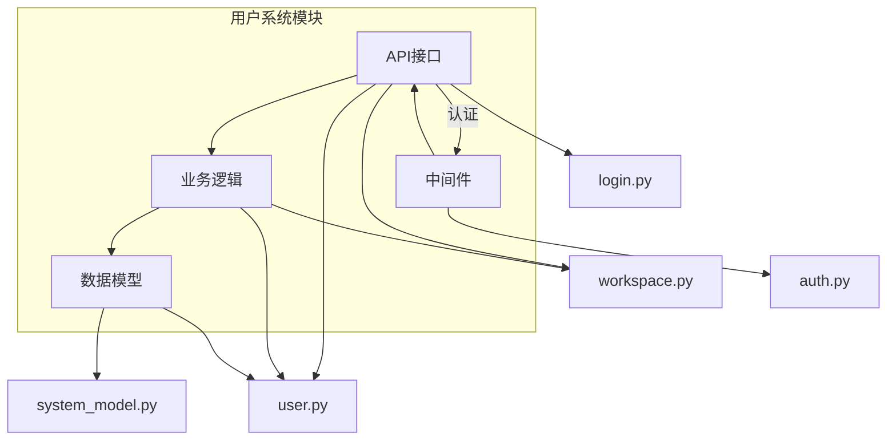
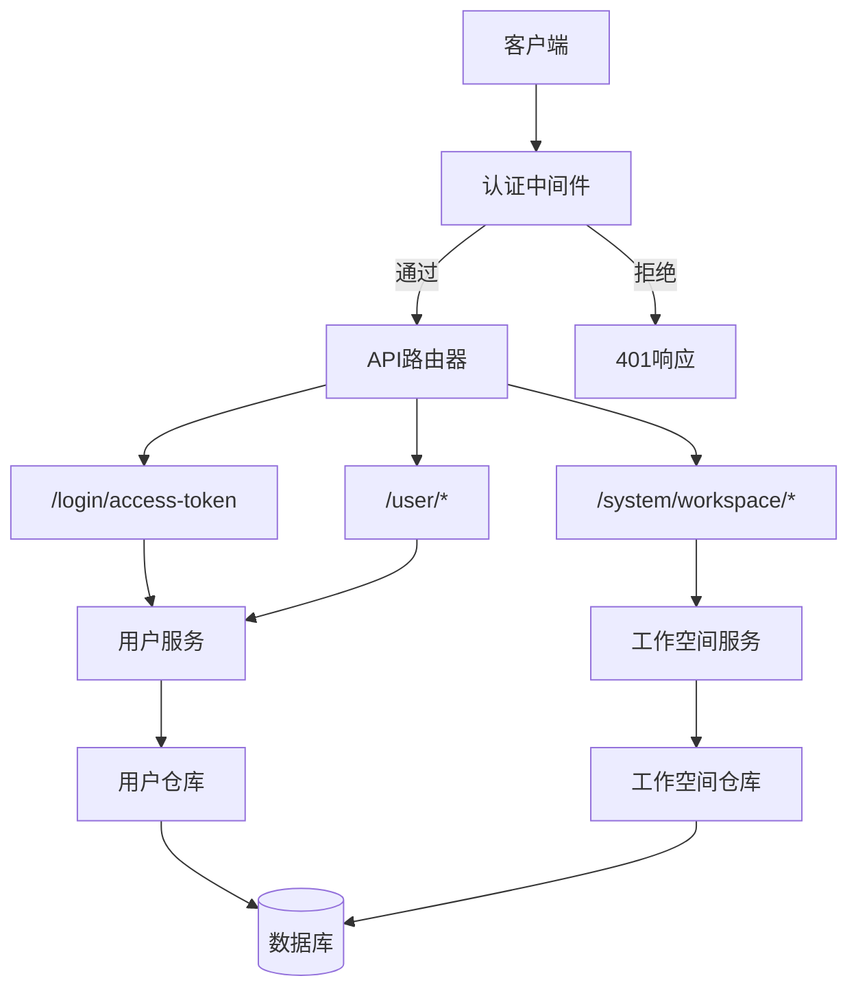
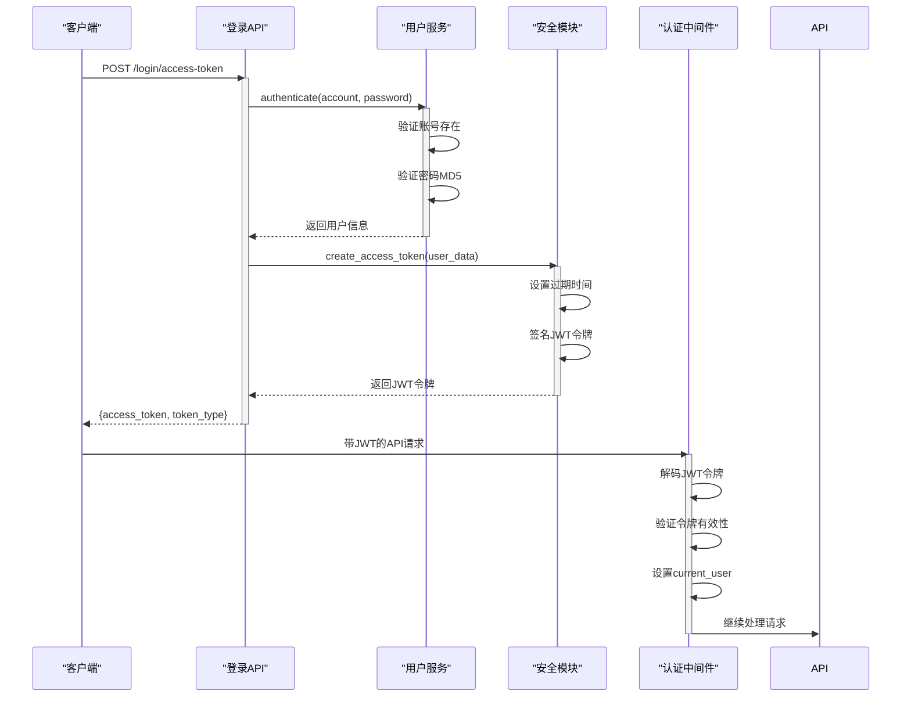
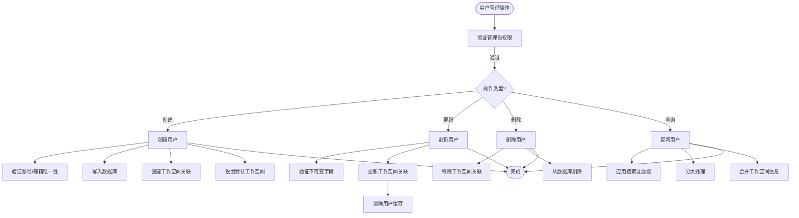
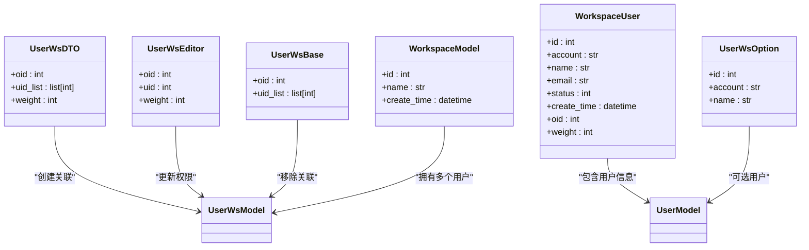
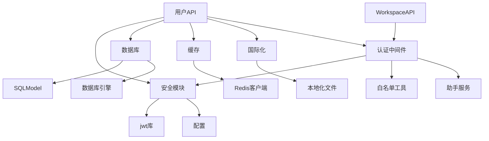

# 用户系统API

<cite>
**本文档中引用的文件**  
- [login.py](file://backend/apps/system/api/login.py)
- [user.py](file://backend/apps/system/api/user.py)
- [workspace.py](file://backend/apps/system/api/workspace.py)
- [auth.py](file://backend/apps/system/middleware/auth.py)
- [auth.py](file://backend/apps/system/schemas/auth.py)
- [user.py](file://backend/apps/system/crud/user.py)
- [workspace.py](file://backend/apps/system/crud/workspace.py)
- [security.py](file://backend/common/core/security.py)
- [deps.py](file://backend/common/core/deps.py)
- [schemas.py](file://backend/common/core/schemas.py)
- [system_schema.py](file://backend/apps/system/schemas/system_schema.py)
</cite>

## 目录
1. [简介](#简介)
2. [项目结构](#项目结构)
3. [核心组件](#核心组件)
4. [架构概述](#架构概述)
5. [详细组件分析](#详细组件分析)
6. [依赖分析](#依赖分析)
7. [性能考虑](#性能考虑)
8. [故障排除指南](#故障排除指南)
9. [结论](#结论)

## 简介
本文档为SQLBot的用户系统API提供详细的参考文档。文档涵盖认证流程、用户管理、工作空间管理、权限控制和安全机制。重点描述了JWT令牌的获取、刷新和验证机制，以及基于中间件的请求拦截和白名单机制。同时提供错误处理指南和实际使用示例。

## 项目结构
用户系统API主要位于`backend/apps/system/`目录下，包含API接口、业务逻辑、数据模型和中间件。API端点分布在`api`子目录中，而核心认证逻辑位于`middleware`目录。

**Diagram sources**
- [login.py](file://backend/apps/system/api/login.py#L1-L35)
- [user.py](file://backend/apps/system/api/user.py#L1-L237)
- [workspace.py](file://backend/apps/system/api/workspace.py#L1-L226)
- [auth.py](file://backend/apps/system/middleware/auth.py#L1-L199)

**Section sources**
- [login.py](file://backend/apps/system/api/login.py#L1-L35)
- [user.py](file://backend/apps/system/api/user.py#L1-L237)
- [workspace.py](file://backend/apps/system/api/workspace.py#L1-L226)

## 核心组件
用户系统API的核心组件包括认证端点、用户管理接口、工作空间管理接口和认证中间件。认证流程通过JWT令牌实现，用户信息存储在数据库中并通过缓存优化性能。权限控制通过中间件拦截和角色判断实现。

**Section sources**
- [login.py](file://backend/apps/system/api/login.py#L1-L35)
- [auth.py](file://backend/apps/system/middleware/auth.py#L1-L199)
- [user.py](file://backend/apps/system/crud/user.py#L38-L44)

## 架构概述
用户系统采用分层架构，包括API层、业务逻辑层、数据访问层和安全中间件。所有请求首先经过认证中间件验证，然后路由到相应的API处理器。用户和工作空间的CRUD操作通过统一的业务逻辑层处理。

**Diagram sources**
- [auth.py](file://backend/apps/system/middleware/auth.py#L1-L199)
- [login.py](file://backend/apps/system/api/login.py#L1-L35)
- [user.py](file://backend/apps/system/api/user.py#L1-L237)
- [workspace.py](file://backend/apps/system/api/workspace.py#L1-L226)

## 详细组件分析

### 认证流程分析
用户认证通过`/login/access-token`端点实现，采用OAuth2密码模式。系统验证凭据后生成JWT令牌，包含用户身份信息和过期时间。

**Diagram sources**
- [login.py](file://backend/apps/system/api/login.py#L1-L35)
- [user.py](file://backend/apps/system/crud/user.py#L38-L44)
- [security.py](file://backend/common/core/security.py#L14-L20)
- [auth.py](file://backend/apps/system/middleware/auth.py#L1-L199)

**Section sources**
- [login.py](file://backend/apps/system/api/login.py#L1-L35)
- [user.py](file://backend/apps/system/crud/user.py#L38-L44)

### 用户管理功能分析
用户管理API提供完整的CRUD操作，包括用户创建、查询、更新和删除。系统通过缓存机制优化性能，并在关键操作后清除相关缓存。

**Diagram sources**
- [user.py](file://backend/apps/system/api/user.py#L1-L237)
- [user.py](file://backend/apps/system/crud/user.py#L38-L44)

**Section sources**
- [user.py](file://backend/apps/system/api/user.py#L1-L237)

### 工作空间管理分析
工作空间管理功能允许管理员管理用户与工作空间的关联关系，包括授权、权限设置和工作空间切换。

**Diagram sources**
- [workspace.py](file://backend/apps/system/api/workspace.py#L1-L226)
- [user.py](file://backend/apps/system/api/user.py#L1-L237)

**Section sources**
- [workspace.py](file://backend/apps/system/api/workspace.py#L1-L226)

## 依赖分析
用户系统API依赖多个核心模块，包括数据库访问、安全认证、国际化和缓存管理。这些依赖通过清晰的接口定义和依赖注入实现松耦合。

**Diagram sources**
- [auth.py](file://backend/apps/system/middleware/auth.py#L1-L199)
- [deps.py](file://backend/common/core/deps.py#L20-L20)
- [schemas.py](file://backend/common/core/schemas.py#L13-L15)

**Section sources**
- [auth.py](file://backend/apps/system/middleware/auth.py#L1-L199)
- [deps.py](file://backend/common/core/deps.py#L20-L20)

## 性能考虑
用户系统通过多种机制优化性能，包括缓存用户信息、批量操作和分页查询。关键操作后会清除相关缓存以保证数据一致性。

- **缓存策略**：用户信息和权限数据使用Redis缓存
- **批量操作**：支持批量用户删除和工作空间授权
- **分页查询**：所有列表查询都支持分页，避免大数据量传输
- **数据库索引**：关键字段如账号、邮箱、工作空间ID都有索引

## 故障排除指南
常见问题及解决方案：

**认证失败**
- 检查用户名和密码是否正确
- 确认用户状态是否为启用（status=1）
- 验证用户是否关联了工作空间（oid>0）

**权限不足**
- 确认当前用户是否为管理员（isAdmin=True）
- 检查请求路径是否在白名单中
- 验证JWT令牌是否过期

**缓存问题**
- 使用`clear_cache`装饰器确保关键操作后清除缓存
- 检查Redis连接是否正常
- 验证缓存键命名空间是否正确

**Section sources**
- [auth.py](file://backend/apps/system/middleware/auth.py#L1-L199)
- [user.py](file://backend/apps/system/api/user.py#L1-L237)
- [workspace.py](file://backend/apps/system/api/workspace.py#L1-L226)

## 结论
SQLBot用户系统API提供了完整的用户管理和认证功能，具有良好的安全性和扩展性。通过JWT认证、中间件拦截和缓存优化，系统能够高效处理用户请求。建议在使用时遵循最佳实践，如定期轮换密钥、监控认证失败日志和合理设置缓存过期时间。