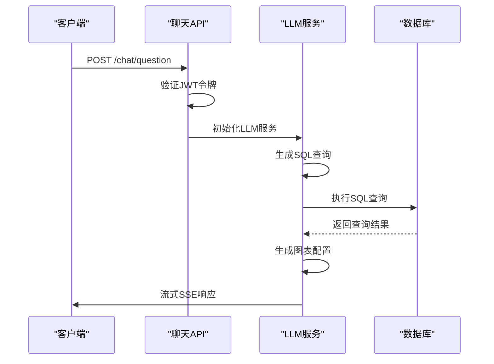
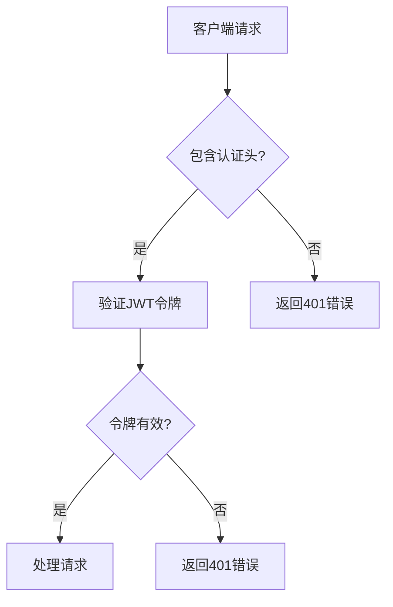
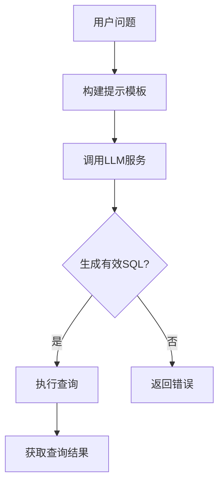
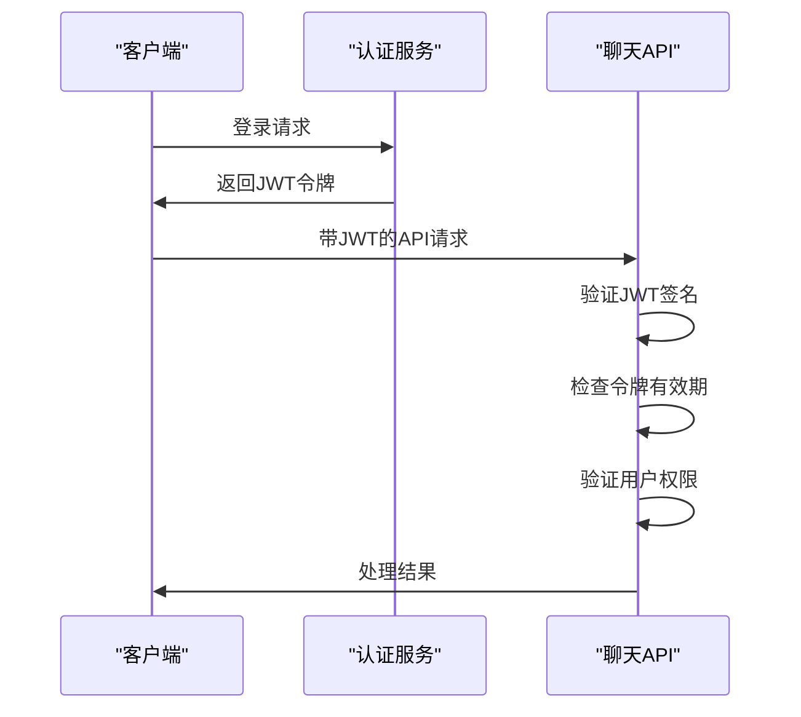

# 聊天API

<cite>
**本文档引用的文件**
- [chat.py](file://backend/apps/chat/api/chat.py)
- [auth.py](file://backend/apps/system/middleware/auth.py)
- [chat_model.py](file://backend/apps/chat/models/chat_model.py)
- [llm.py](file://backend/apps/chat/task/llm.py)
- [error.py](file://backend/common/error.py)
</cite>

## 目录
1. [简介](#简介)
2. [API端点](#api端点)
3. [请求处理流程](#请求处理流程)
4. [错误处理](#错误处理)
5. [安全机制](#安全机制)
6. [性能优化建议](#性能优化建议)
7. [使用示例](#使用示例)

## 简介
聊天API是SQLBot的核心功能之一，允许用户通过自然语言提问来生成SQL查询、执行数据库操作并生成可视化结果。该API采用流式SSE（Server-Sent Events）响应模式，能够实时返回处理结果。API设计遵循RESTful原则，通过POST方法在/chat/question端点接收用户请求，包含问题文本、会话ID和数据源ID等关键信息。

**聊天API**支持完整的问答生命周期，从接收用户问题开始，经过LLM（大语言模型）处理生成SQL，执行查询获取数据，再到生成图表和可视化结果。整个流程通过异步任务处理，确保响应的及时性和用户体验的流畅性。系统还支持推荐问题生成功能，能够基于历史对话上下文为用户提供相关问题建议。

该API集成了JWT认证机制，确保只有授权用户才能访问敏感数据。通过TokenMiddleware中间件实现认证验证，支持多种认证模式，包括标准JWT、助手模式和嵌入模式。API还实现了详细的错误处理机制，能够返回清晰的错误码和消息，帮助客户端进行问题诊断和处理。

**Section sources**
- [chat.py](file://backend/apps/chat/api/chat.py#L130-L154)

## API端点

### /chat/question 端点
/chat/question是聊天API的主要端点，用于处理用户的自然语言查询请求。该端点接受POST请求，需要在请求头中包含JWT认证令牌，并在请求体中提供问题文本、会话ID和数据源ID等信息。API返回流式SSE响应，允许客户端实时接收处理结果。



**Diagram sources**
- [chat.py](file://backend/apps/chat/api/chat.py#L130-L154)
- [llm.py](file://backend/apps/chat/task/llm.py#L47-L1112)

### 请求头
聊天API要求在请求头中包含JWT认证令牌。认证令牌通过特定的请求头字段传递，具体字段名称由系统配置决定。请求头中还应包含标准的Content-Type，设置为application/json以表明请求体格式。



**Diagram sources**
- [auth.py](file://backend/apps/system/middleware/auth.py#L20-L198)

### 请求体Schema
请求体遵循ChatQuestion模型定义，包含以下关键字段：chat_id（会话ID）、question（问题文本）、datasource（数据源ID）、engine_type（数据库类型）等。这些字段共同构成了LLM服务处理用户查询所需的所有上下文信息。

| 字段 | 类型 | 必需 | 描述 |
|------|------|------|------|
| chat_id | 整数 | 是 | 会话唯一标识符 |
| question | 字符串 | 是 | 用户提出的自然语言问题 |
| datasource | 整数 | 否 | 数据源ID，用于指定查询的数据库 |
| engine_type | 字符串 | 否 | 数据库类型，如MySQL、PostgreSQL等 |
| ai_modal_id | 整数 | 否 | 使用的AI模型ID |
| lang | 字符串 | 否 | 语言设置，默认为简体中文 |

**Section sources**
- [chat_model.py](file://backend/apps/chat/models/chat_model.py#L225-L227)

### 响应格式
API采用流式SSE响应格式，通过StreamingResponse返回处理结果。响应内容为text/event-stream媒体类型，允许服务器向客户端推送多个事件。每个事件包含处理过程中的中间结果，如SQL生成、查询执行状态和最终的可视化配置。

响应数据以JSON格式编码，包含content和reasoning_content字段。content字段包含主要的处理结果，如生成的SQL语句或图表配置；reasoning_content字段包含LLM的思考过程，可用于调试和审计。流式响应在处理完成后自动结束。

**Section sources**
- [chat.py](file://backend/apps/chat/api/chat.py#L130-L154)

## 请求处理流程
聊天API的请求处理流程是一个复杂的异步过程，涉及多个组件的协同工作。当接收到用户请求后，系统首先验证JWT令牌，然后初始化LLM服务实例，开始处理用户的自然语言问题。整个流程可以分为几个关键阶段：SQL生成、查询执行、图表生成和结果返回。

### SQL生成阶段
在SQL生成阶段，LLM服务根据用户问题和数据库模式生成相应的SQL查询。系统使用预定义的提示模板（prompt template）来指导LLM生成准确的SQL语句。提示模板包含数据库结构信息、查询规则和语言设置，确保生成的SQL符合目标数据库的语法要求。



**Diagram sources**
- [llm.py](file://backend/apps/chat/task/llm.py#L47-L1112)
- [generator.py](file://backend/apps/template/generate_sql/generator.py#L1-L7)

### 查询执行阶段
一旦生成了有效的SQL查询，系统会立即执行该查询并获取结果。查询执行在独立的数据库会话中进行，确保事务的隔离性和数据的一致性。执行结果以JSON格式存储，包括数据行、列信息和元数据，为后续的图表生成提供基础数据。

在执行查询时，系统会处理各种可能的错误情况，如语法错误、权限不足或连接超时。这些错误会被捕获并转换为用户友好的错误消息，通过流式响应返回给客户端。对于大型结果集，系统会实施适当的分页和流式处理策略，避免内存溢出。

### 图表生成阶段
在获取查询结果后，系统进入图表生成阶段。LLM服务再次被调用，这次是根据查询结果和用户问题生成图表配置。图表配置包括图表类型、坐标轴设置、颜色方案和交互功能等。生成的配置遵循预定义的JSON模式，确保前端能够正确解析和渲染。

图表生成过程考虑了数据的语义和上下文，选择最合适的可视化方式来呈现结果。例如，时间序列数据通常生成折线图，分类数据生成柱状图或饼图。系统还支持多种高级图表类型，如热力图、散点图和地理地图，满足复杂的分析需求。

**Section sources**
- [llm.py](file://backend/apps/chat/task/llm.py#L47-L1112)

## 错误处理
聊天API实现了全面的错误处理机制，能够识别和响应各种错误情况。系统使用HTTP状态码来表示不同类型的错误，配合详细的错误消息帮助客户端进行问题诊断。错误处理贯穿整个请求处理流程，从请求验证到最终结果生成。

### 错误码体系
API定义了清晰的错误码体系，每个错误码对应特定的错误类型和处理建议。400系列错误表示客户端错误，如请求格式不正确或问题无法解析；404错误表示资源未找到，如指定的数据源不存在；500系列错误表示服务器内部错误，如查询执行失败或系统异常。

| 错误码 | 错误类型 | 描述 |
|--------|----------|------|
| 400 | 客户端错误 | 请求格式不正确或问题无法解析 |
| 401 | 认证失败 | JWT令牌无效或已过期 |
| 404 | 资源未找到 | 指定的会话或数据源不存在 |
| 500 | 服务器错误 | 查询执行失败或系统内部异常 |
| 504 | 网关超时 | 处理请求超时 |

**Section sources**
- [error.py](file://backend/common/error.py#L1-L7)

### 错误响应格式
当发生错误时，API返回标准化的错误响应格式。响应包含错误消息、错误代码和可选的跟踪信息。对于复杂的错误，系统会提供详细的traceback信息，帮助开发人员定位问题根源。错误消息经过本地化处理，支持多种语言显示。

在流式响应中，错误处理更加复杂。系统需要在流式传输过程中检测错误并及时终止响应。一旦检测到错误，系统会发送一个包含错误信息的最终事件，然后关闭连接。这种机制确保客户端能够及时获知错误情况，避免无限等待。

## 安全机制
聊天API通过多层次的安全机制保护系统和数据安全。核心安全组件是TokenMiddleware中间件，负责处理所有传入请求的认证验证。该中间件支持多种认证模式，包括标准JWT、助手模式和嵌入模式，满足不同的使用场景和安全要求。

### JWT认证
系统使用JWT（JSON Web Token）进行用户认证和授权。JWT令牌包含用户身份信息、权限声明和过期时间，通过数字签名确保令牌的完整性和防篡改性。客户端需要在每次请求时提供有效的JWT令牌，服务器会验证令牌的签名、有效期和声明。



**Diagram sources**
- [auth.py](file://backend/apps/system/middleware/auth.py#L20-L198)

### 白名单路径
系统实现了白名单路径机制，允许某些公共接口在没有认证的情况下访问。白名单路径通常用于健康检查、公开信息获取等不需要认证的场景。对于白名单路径，系统会设置默认的管理员用户上下文，确保后续处理逻辑的一致性。

白名单机制通过whiteUtils工具类实现，该工具类维护一个允许匿名访问的路径列表。当请求到达时，TokenMiddleware会首先检查请求路径是否在白名单中，如果是则跳过JWT验证，直接处理请求。这种设计既保证了安全性，又提供了必要的灵活性。

**Section sources**
- [auth.py](file://backend/apps/system/middleware/auth.py#L20-L198)

## 性能优化建议
为了确保聊天API的高性能和可扩展性，建议采取一系列性能优化措施。这些措施涵盖请求处理、资源管理和系统配置等多个方面，旨在提高响应速度、降低资源消耗和增强系统稳定性。

### 超时设置
合理设置请求处理超时是性能优化的关键。过长的超时可能导致资源占用和响应延迟，而过短的超时可能中断正常的处理流程。建议根据实际业务需求和系统负载情况，设置适当的超时值。对于复杂的查询，可以采用分级超时策略，为不同阶段设置不同的超时限制。

在流式响应中，超时设置尤为重要。系统需要监控每个流式连接的活动状态，及时清理长时间无活动的连接。这不仅可以释放服务器资源，还能防止潜在的DDoS攻击。建议实现连接心跳机制，定期检查连接状态并清理无效连接。

### 大型结果集处理
处理大型结果集时，应避免一次性加载所有数据到内存。建议采用分页查询和流式处理策略，将大数据集分解为小块进行处理和传输。这不仅可以降低内存消耗，还能提高响应速度，让用户更快地看到部分结果。

对于需要生成图表的大型数据集，可以考虑数据聚合和采样技术。通过预计算和缓存常用聚合结果，可以显著提高查询性能。对于实时性要求不高的场景，可以采用异步处理模式，先返回处理中状态，完成后通过回调通知客户端。

## 使用示例
以下示例展示了如何使用curl命令调用聊天API。示例包括完整的请求头设置、请求体构造和流式响应处理。通过这些示例，开发者可以快速了解API的使用方法，并将其集成到自己的应用中。

### 发起聊天请求
```bash
curl -X POST https://api.sqlbot.com/chat/question \
  -H "Authorization: Bearer YOUR_JWT_TOKEN" \
  -H "Content-Type: application/json" \
  -d '{
    "chat_id": 123,
    "question": "上个月销售额最高的产品是什么？",
    "datasource": 456,
    "engine_type": "MySQL"
  }'
```

### 处理流式响应
```bash
curl -X POST https://api.sqlbot.com/chat/question \
  -H "Authorization: Bearer YOUR_JWT_TOKEN" \
  -H "Content-Type: application/json" \
  -d '{
    "chat_id": 123,
    "question": "请分析销售趋势",
    "datasource": 456
  }' \
  --no-buffer | while read line; do
    echo "Received: $line"
    # 在这里处理每一行流式响应
  done
```

**Section sources**
- [chat.py](file://backend/apps/chat/api/chat.py#L130-L154)