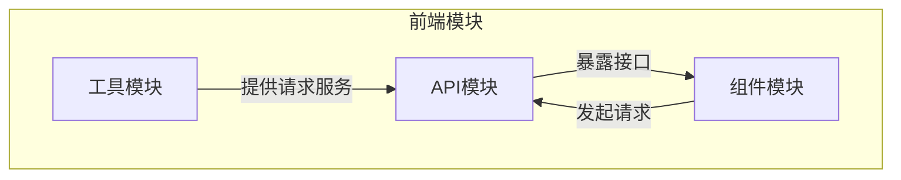
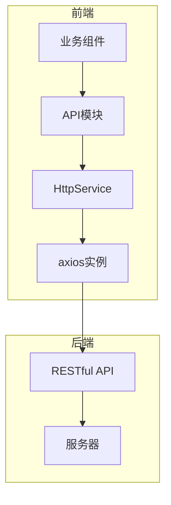
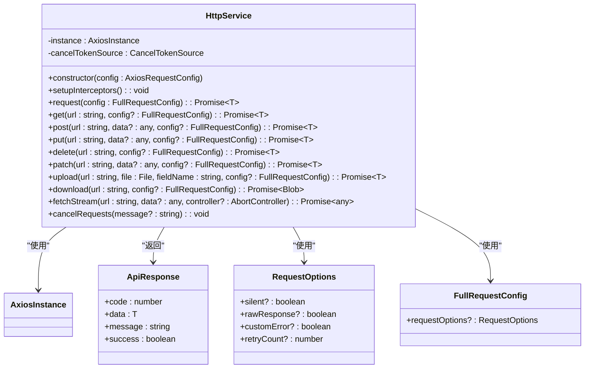
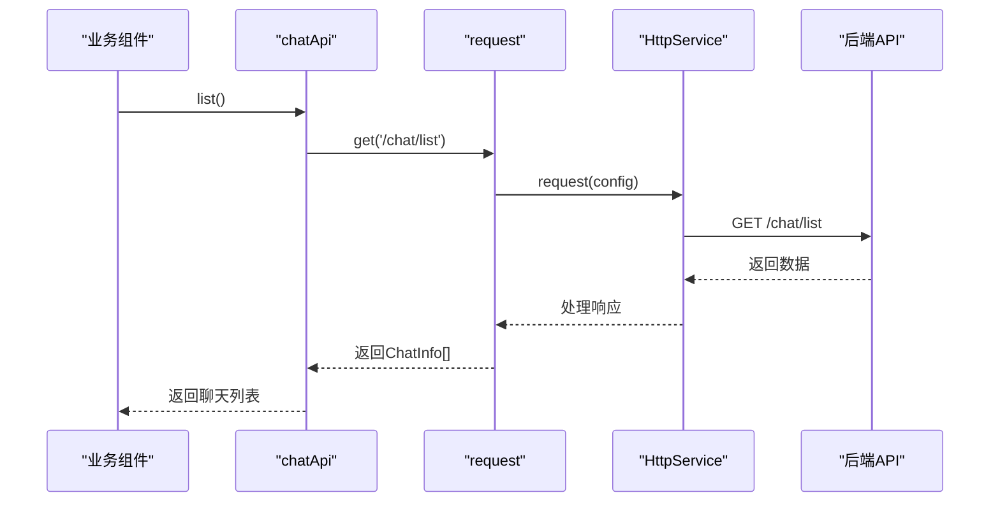
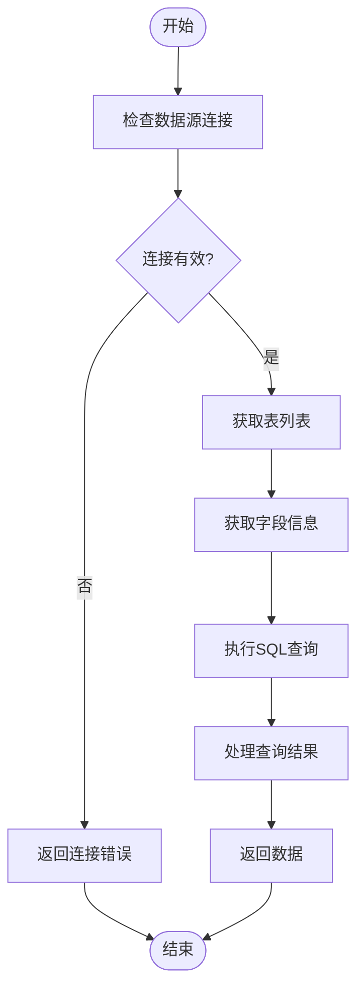
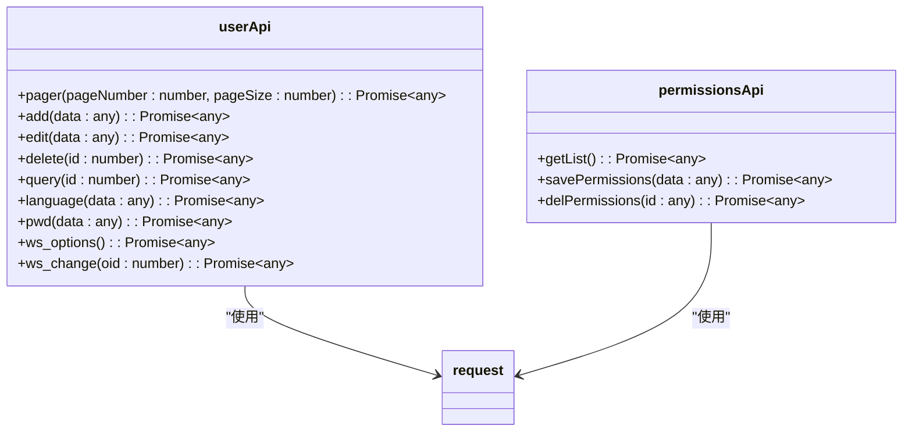
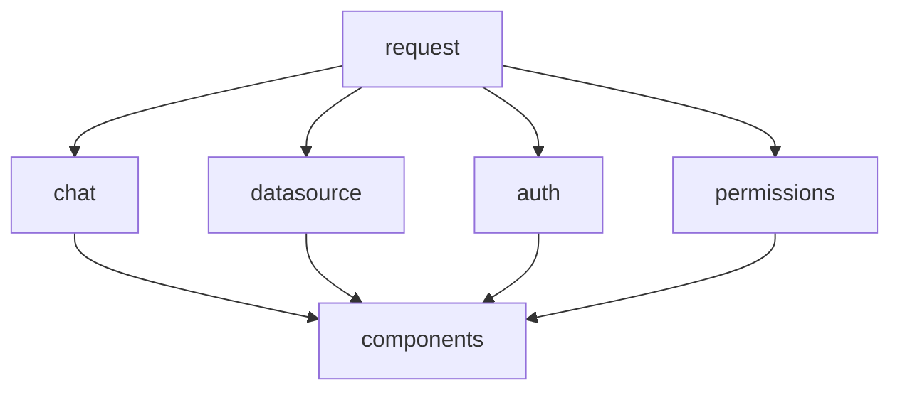

# API集成

<cite>
**本文档引用的文件**  
- [request.ts](file://frontend/src/utils/request.ts)
- [chat.ts](file://frontend/src/api/chat.ts)
- [datasource.ts](file://frontend/src/api/datasource.ts)
- [auth.ts](file://frontend/src/api/auth.ts)
- [permissions.ts](file://frontend/src/api/permissions.ts)
</cite>

## 目录
1. [引言](#引言)
2. [项目结构](#项目结构)
3. [核心组件](#核心组件)
4. [架构概览](#架构概览)
5. [详细组件分析](#详细组件分析)
6. [依赖分析](#依赖分析)
7. [性能考虑](#性能考虑)
8. [故障排查指南](#故障排查指南)
9. [结论](#结论)

## 引言
本文档系统阐述了SQLBot前端系统的API集成机制，重点描述基于TypeScript的类型安全请求封装。通过分析`request.ts`中axios实例的配置（拦截器、错误处理、认证头注入），解释`chat.ts`、`datasource.ts`等API模块如何定义接口契约与请求参数，全面展示前端与后端的通信机制。文档还详细说明了API调用在组件中的使用模式，包括异步处理、加载状态管理和错误反馈，并结合用户认证（`auth.ts`）和权限控制（`permissions.ts`）场景，展示安全通信的实现方式。最后提供API版本管理、缓存策略和性能优化建议，并列举常见网络异常的排查方法。

## 项目结构
前端API集成机制位于`frontend/src`目录下，采用模块化设计，将API请求逻辑与业务组件分离。核心请求封装位于`utils/request.ts`，各业务模块（如chat、datasource、auth等）在`api/`目录下定义具体的接口契约。这种分层架构确保了代码的可维护性和可扩展性。

**图示来源**  
- [request.ts](file://frontend/src/utils/request.ts)
- [chat.ts](file://frontend/src/api/chat.ts)
- [datasource.ts](file://frontend/src/api/datasource.ts)

**本节来源**  
- [request.ts](file://frontend/src/utils/request.ts)
- [api](file://frontend/src/api)

## 核心组件
前端API集成的核心是`HttpService`类，它封装了axios实例的创建、拦截器配置、错误处理和请求方法。通过单例模式导出的`request`实例，为所有API模块提供统一的请求接口。各业务API模块（如`chatApi`、`datasourceApi`）基于此实例定义具体的业务接口，实现了类型安全的请求调用。

**本节来源**  
- [request.ts](file://frontend/src/utils/request.ts#L20-L454)
- [chat.ts](file://frontend/src/api/chat.ts#L1-L336)

## 架构概览
系统采用分层架构，前端通过`request.ts`提供的统一接口与后端RESTful API进行通信。`HttpService`类负责处理所有网络请求的共性逻辑，包括认证头注入、错误处理、请求取消等。各业务模块在`api/`目录下定义具体的接口契约，通过类型定义（如`ChatRecord`、`ChatInfo`）确保数据交互的类型安全。

**图示来源**  
- [request.ts](file://frontend/src/utils/request.ts#L20-L454)
- [chat.ts](file://frontend/src/api/chat.ts#L1-L336)

## 详细组件分析

### 请求服务分析
`HttpService`类是API集成的核心，它通过axios拦截器实现了请求的统一处理。请求拦截器负责注入认证令牌、处理多语言头、管理FormData的Content-Type等。响应拦截器则处理业务逻辑的成功/失败状态，统一错误处理，并支持重试机制。

#### 类图

**图示来源**  
- [request.ts](file://frontend/src/utils/request.ts#L20-L454)

**本节来源**  
- [request.ts](file://frontend/src/utils/request.ts#L20-L454)

### 聊天模块分析
`chat.ts`模块定义了聊天功能的API接口契约，包括消息记录（`ChatRecord`）、聊天会话（`Chat`）和聊天信息（`ChatInfo`）的数据结构。通过`chatApi`对象暴露具体的API方法，支持分页获取聊天列表、创建新聊天、重命名聊天、删除聊天等操作。

#### 序列图

**图示来源**  
- [chat.ts](file://frontend/src/api/chat.ts#L1-L336)
- [request.ts](file://frontend/src/utils/request.ts#L20-L454)

**本节来源**  
- [chat.ts](file://frontend/src/api/chat.ts#L1-L336)

### 数据源模块分析
`datasource.ts`模块提供了数据源管理的API接口，包括数据源的增删改查、表结构获取、字段查询、SQL执行等功能。通过`datasourceApi`对象统一暴露接口，支持异步操作和请求取消。

#### 流程图

**图示来源**  
- [datasource.ts](file://frontend/src/api/datasource.ts#L1-L26)
- [request.ts](file://frontend/src/utils/request.ts#L20-L454)

**本节来源**  
- [datasource.ts](file://frontend/src/api/datasource.ts#L1-L26)

### 认证与权限模块分析
`auth.ts`和`permissions.ts`模块实现了用户认证和权限控制的API接口。`auth.ts`提供了用户分页、语言设置、密码修改等功能，而`permissions.ts`则专注于数据源权限的管理，包括权限列表获取、保存和删除。

#### 类图

**图示来源**  
- [auth.ts](file://frontend/src/api/auth.ts#L1-L14)
- [permissions.ts](file://frontend/src/api/permissions.ts#L1-L5)
- [request.ts](file://frontend/src/utils/request.ts#L20-L454)

**本节来源**  
- [auth.ts](file://frontend/src/api/auth.ts#L1-L14)
- [permissions.ts](file://frontend/src/api/permissions.ts#L1-L5)

## 依赖分析
前端API模块之间存在清晰的依赖关系。`request.ts`作为基础服务，被所有API模块（`chat.ts`、`datasource.ts`、`auth.ts`、`permissions.ts`）所依赖。各API模块通过导入`request`实例，获得统一的请求能力，实现了代码的复用和维护的便利。

**图示来源**  
- [request.ts](file://frontend/src/utils/request.ts)
- [chat.ts](file://frontend/src/api/chat.ts)
- [datasource.ts](file://frontend/src/api/datasource.ts)
- [auth.ts](file://frontend/src/api/auth.ts)
- [permissions.ts](file://frontend/src/api/permissions.ts)

**本节来源**  
- [request.ts](file://frontend/src/utils/request.ts)
- [api](file://frontend/src/api)

## 性能考虑
系统在API集成方面考虑了多项性能优化措施。`HttpService`支持请求取消，避免不必要的网络开销。对于流式响应（如`fetchStream`），采用`fetch` API直接处理，提高大文件传输效率。同时，通过`retryCount`配置支持失败重试，增强网络不稳定环境下的用户体验。

## 故障排查指南
常见网络异常包括401未授权、403禁止访问、500服务器错误等。系统通过统一的错误处理机制，在`handleError`方法中根据HTTP状态码给出相应的错误提示。对于401错误，系统会自动清除本地token并刷新页面，引导用户重新登录。对于网络连接问题，会提示"服务器无响应"。

**本节来源**  
- [request.ts](file://frontend/src/utils/request.ts#L269-L338)

## 结论
SQLBot前端API集成机制通过`HttpService`类实现了类型安全、可维护的请求封装。各业务模块基于统一的请求实例定义接口契约，确保了代码的一致性和可扩展性。系统通过拦截器实现了认证、错误处理等横切关注点的统一管理，同时支持流式响应、请求取消等高级特性，为复杂的数据交互场景提供了可靠的通信基础。