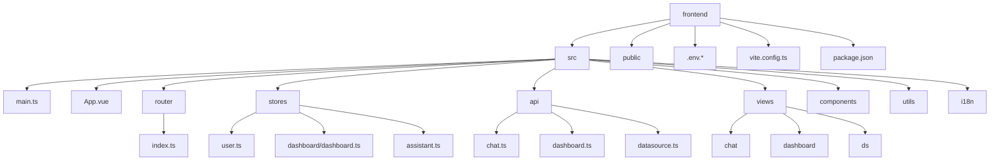
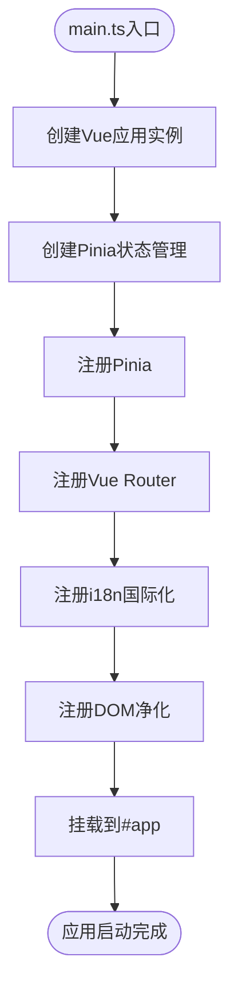
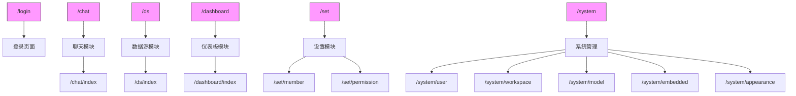
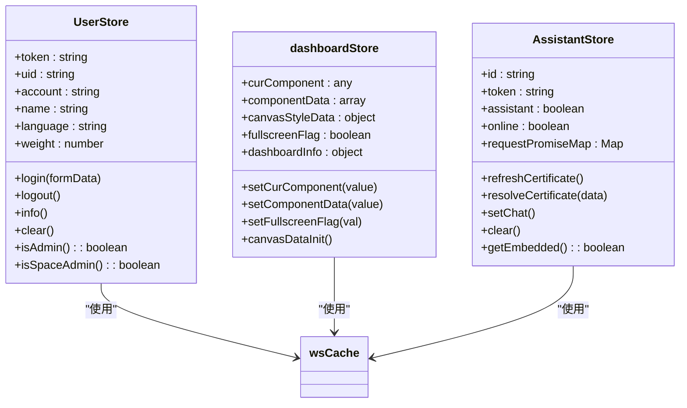
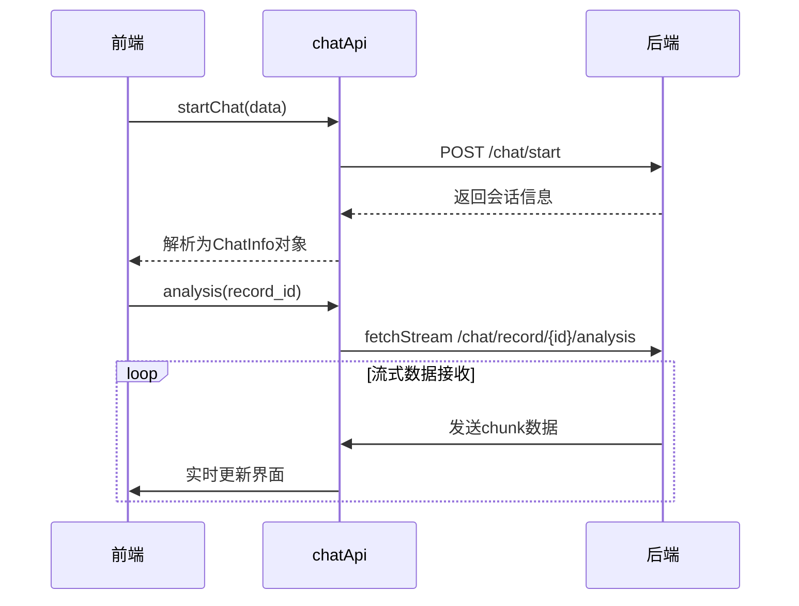
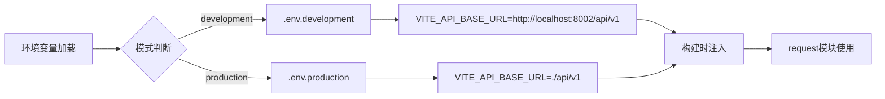

# 前端架构

<cite>
**本文档中引用的文件**  
- [main.ts](file://frontend/src/main.ts)
- [App.vue](file://frontend/src/App.vue)
- [router/index.ts](file://frontend/src/router/index.ts)
- [stores/user.ts](file://frontend/src/stores/user.ts)
- [stores/dashboard/dashboard.ts](file://frontend/src/stores/dashboard/dashboard.ts)
- [stores/assistant.ts](file://frontend/src/stores/assistant.ts)
- [api/chat.ts](file://frontend/src/api/chat.ts)
- [api/dashboard.ts](file://frontend/src/api/dashboard.ts)
- [api/datasource.ts](file://frontend/src/api/datasource.ts)
- [vite.config.ts](file://frontend/vite.config.ts)
- [.env.development](file://frontend/.env.development)
- [.env.production](file://frontend/.env.production)
</cite>

## 目录
1. [项目结构](#项目结构)
2. [核心组件](#核心组件)
3. [应用初始化流程](#应用初始化流程)
4. [根组件布局](#根组件布局)
5. [路由系统配置](#路由系统配置)
6. [Pinia状态管理](#pinia状态管理)
7. [API客户端封装](#api客户端封装)
8. [前端性能优化策略](#前端性能优化策略)
9. [构建流程与环境配置](#构建流程与环境配置)

## 项目结构

**图示来源**  
- [main.ts](file://frontend/src/main.ts#L1-L18)
- [App.vue](file://frontend/src/App.vue#L1-L17)
- [router/index.ts](file://frontend/src/router/index.ts#L1-L203)
- [stores/user.ts](file://frontend/src/stores/user.ts#L1-L165)

## 核心组件

前端采用Vue 3构建单页应用，基于模块化设计组织代码结构。src目录下包含核心模块：router负责页面导航，stores实现全局状态管理，api封装后端接口，views承载功能视图，components提供可复用UI组件。

**本节来源**  
- [main.ts](file://frontend/src/main.ts#L1-L18)
- [App.vue](file://frontend/src/App.vue#L1-L17)

## 应用初始化流程

应用入口main.ts完成Vue实例创建与核心插件注册。通过createApp初始化App组件，集成Pinia状态管理、Vue Router路由系统、i18n国际化支持及VueDOMPurifyHTML内容净化模块。所有插件通过app.use()方法依次注入，最终挂载至DOM根节点。

**图示来源**  
- [main.ts](file://frontend/src/main.ts#L1-L18)

## 根组件布局

App.vue作为根组件，使用ElConfigProvider包裹整个应用以支持Element Plus组件库的国际化配置。模板中仅包含<router-view />占位符，由Vue Router动态渲染对应视图。通过computed计算属性实时获取当前语言环境并传递给配置提供者。

**本节来源**  
- [App.vue](file://frontend/src/App.vue#L1-L17)

## 路由系统配置

路由系统采用Vue Router的hash模式，通过createWebHashHistory创建历史记录实例。路由配置定义了登录、聊天、数据源、仪表板、系统设置等核心功能模块的路径映射。LayoutDsl和SinglePage作为布局容器，配合嵌套路由实现多级页面结构。路由元信息包含菜单标题与图标标识，支持动态国际化翻译。

**图示来源**  
- [router/index.ts](file://frontend/src/router/index.ts#L1-L203)

## Pinia状态管理

### 用户状态管理

user.ts定义UserStore管理用户会话状态，包括token、用户信息、权限标识及语言偏好。通过actions提供登录、登出、信息获取等操作，结合wsCache实现浏览器存储持久化。getters暴露isAdmin和isSpaceAdmin等计算属性用于权限判断。

### 仪表板状态管理

dashboard.ts中dashboardStore维护仪表板编辑器的运行时状态，包括当前选中组件、画布样式、组件数据、全屏标识及仪表板元信息。提供canvasDataInit方法重置画布状态，支持组件编辑与视图切换。

### 助手状态管理

assistant.ts实现AssistantStore管理嵌入式助手的状态，包括连接标识、证书信息、在线状态及请求承诺队列。通过postMessage与父窗口通信，支持异步证书验证机制。

**图示来源**  
- [stores/user.ts](file://frontend/src/stores/user.ts#L22-L159)
- [stores/dashboard/dashboard.ts](file://frontend/src/stores/dashboard/dashboard.ts#L3-L100)
- [stores/assistant.ts](file://frontend/src/stores/assistant.ts#L24-L137)

## API客户端封装

### 聊天模块API

chat.ts定义chatApi对象封装聊天相关RESTful接口，包括会话列表获取、会话创建、重命名、删除，以及记录分析、预测、推荐问题等流式请求。通过fetchStream支持SSE流式响应，toChatInfo系列方法实现数据模型转换。

### 仪表板模块API

dashboard.ts中dashboardApi提供仪表板资源的增删改查、画布操作及名称校验接口，统一采用POST方法提交数据，支持资源移动与删除操作。

### 数据源模块API

datasource.ts封装数据源管理API，涵盖连接测试、增删改查、表字段获取、SQL执行、数据预览等功能。提供getSchema、getTablesByConf等方法支持配置化元数据查询。

**图示来源**  
- [api/chat.ts](file://frontend/src/api/chat.ts#L1-L337)
- [api/dashboard.ts](file://frontend/src/api/dashboard.ts#L1-L15)
- [api/datasource.ts](file://frontend/src/api/datasource.ts#L1-L27)

## 前端性能优化策略

### 组件懒加载

路由配置中采用动态导入语法`() => import('@/views/ds/TableList.vue')`实现组件懒加载，将代码分割为独立chunk，按需加载以减少初始包体积。

### 状态缓存机制

通过useCache工具封装wsCache，利用浏览器Storage实现用户状态持久化。UserStore、AssistantStore等在状态变更时自动同步至本地存储，避免页面刷新丢失会话信息。

### 构建优化

vite.config.ts配置rollupOptions.manualChunks将element-plus-secondary独立打包，降低主包体积。设置chunkSizeWarningLimit为2000KB抑制体积警告。

**本节来源**  
- [router/index.ts](file://frontend/src/router/index.ts#L1-L203)
- [utils/useCache.ts](file://frontend/src/utils/useCache.ts)
- [vite.config.ts](file://frontend/vite.config.ts#L1-L58)

## 构建流程与环境配置

### 构建配置

vite.config.ts定义Vite构建配置，设置base为'./'支持相对路径部署。配置@别名指向src目录，启用Less变量支持。集成AutoImport和Components插件实现API自动导入与组件按需加载。SVG Loader配置支持SVG组件化。

### 环境变量

通过.env.development和.env.production文件定义环境变量。VITE_API_BASE_URL指定API基础路径，开发环境指向localhost:8002，生产环境使用相对路径。VITE_APP_TITLE设置应用标题，支持环境差异化配置。

**图示来源**  
- [vite.config.ts](file://frontend/vite.config.ts#L1-L58)
- [.env.development](file://frontend/.env.development#L1-L2)
- [.env.production](file://frontend/.env.production#L1-L2)