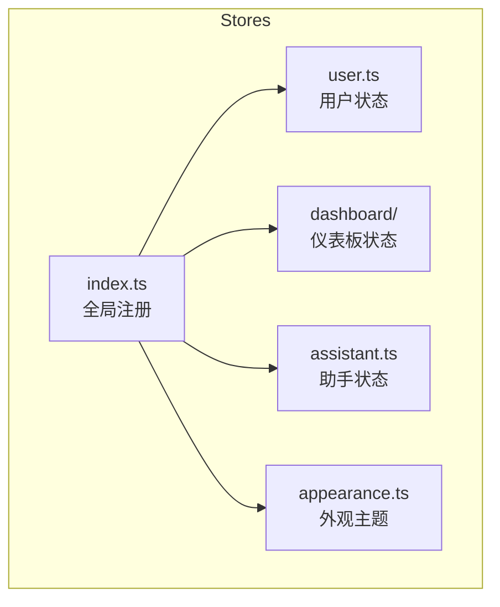
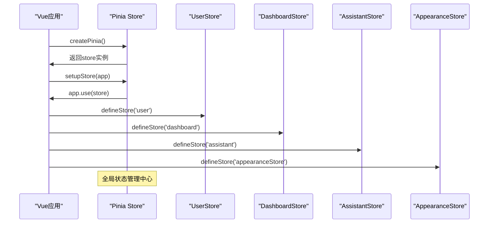
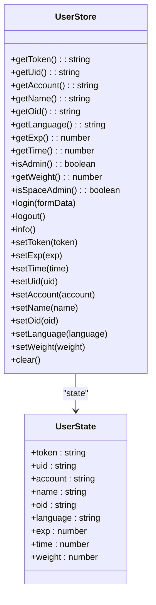
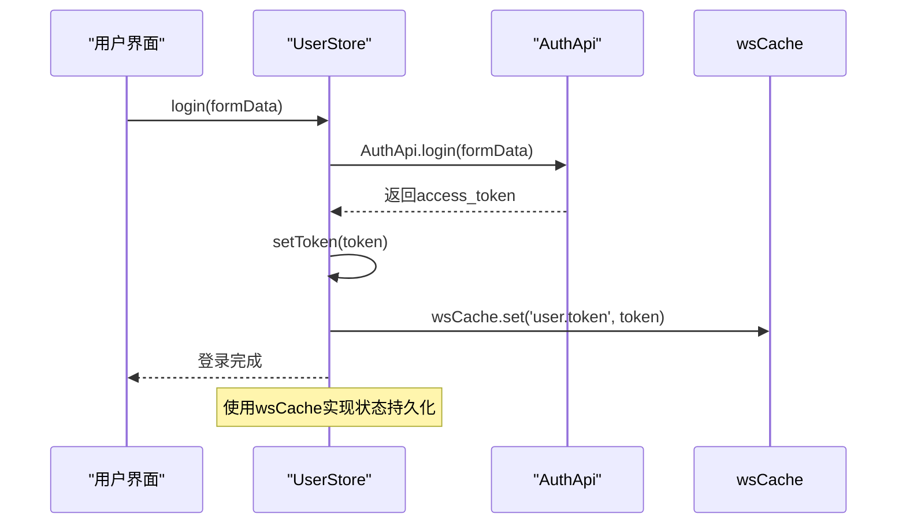
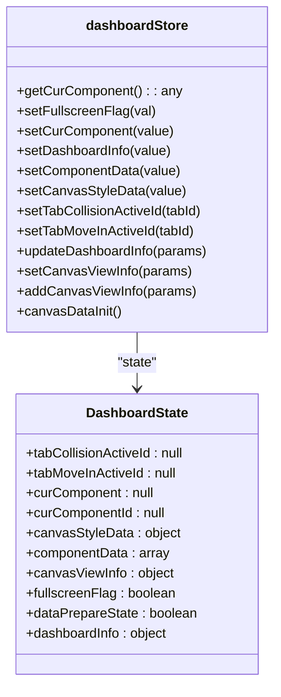
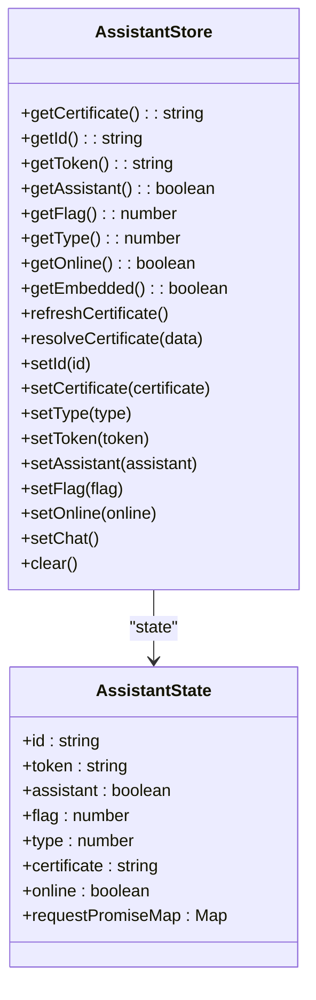
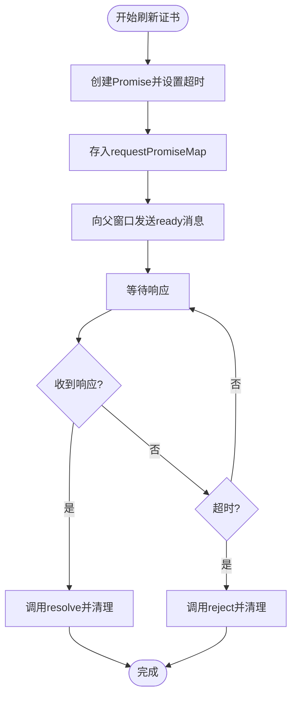
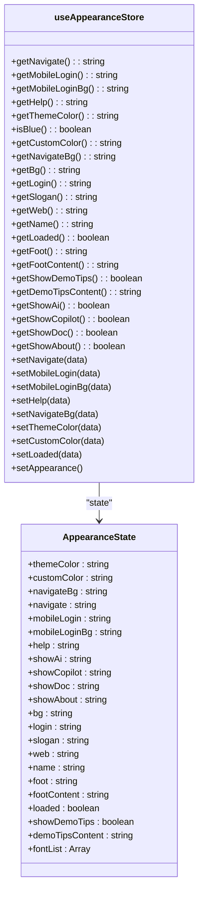
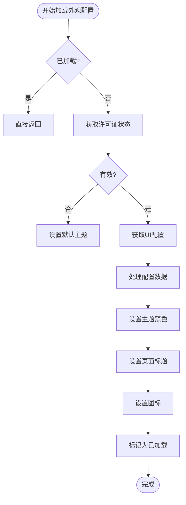
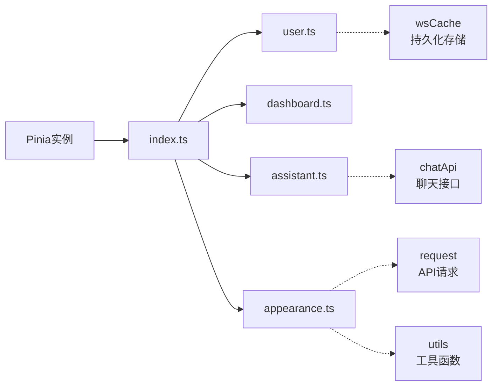

# 状态管理

<cite>
**本文档中引用的文件**
- [index.ts](file://frontend/src/stores/index.ts)
- [user.ts](file://frontend/src/stores/user.ts)
- [dashboard.ts](file://frontend/src/stores/dashboard/dashboard.ts)
- [assistant.ts](file://frontend/src/stores/assistant.ts)
- [appearance.ts](file://frontend/src/stores/appearance.ts)
</cite>

## 目录
1. [简介](#简介)
2. [项目结构](#项目结构)
3. [核心组件](#核心组件)
4. [架构概述](#架构概述)
5. [详细组件分析](#详细组件分析)
6. [依赖分析](#依赖分析)
7. [性能考虑](#性能考虑)
8. [故障排除指南](#故障排除指南)
9. [结论](#结论)

## 简介
本文档全面解析基于Pinia的状态管理架构，重点描述store的模块化设计。涵盖全局store的注册与初始化机制、用户状态管理逻辑、仪表板元数据持久化策略、助手会话生命周期管理以及主题外观配置的响应式更新机制。结合实际业务场景，展示状态订阅、actions调用和getters计算属性的使用模式，并提供状态持久化、模块热重载和错误处理的最佳实践指南。

## 项目结构
前端状态管理模块采用模块化设计，所有store文件集中存放在`frontend/src/stores/`目录下，通过index.ts统一注册和导出。主要包含用户状态(user.ts)、仪表板状态(dashboard/)、助手状态(assistant.ts)和外观主题(appearance.ts)四大核心模块。

**图示来源**
- [index.ts](file://frontend/src/stores/index.ts)
- [user.ts](file://frontend/src/stores/user.ts)
- [dashboard.ts](file://frontend/src/stores/dashboard/dashboard.ts)
- [assistant.ts](file://frontend/src/stores/assistant.ts)
- [appearance.ts](file://frontend/src/stores/appearance.ts)

**章节来源**
- [index.ts](file://frontend/src/stores/index.ts)
- [user.ts](file://frontend/src/stores/user.ts)

## 核心组件
本系统基于Pinia实现状态管理，各store模块职责分明，通过defineStore定义独立的状态容器。核心组件包括用户认证状态、仪表板元数据、助手会话管理和界面外观配置，均采用一致的state-getters-actions模式进行组织。

**章节来源**
- [user.ts](file://frontend/src/stores/user.ts#L22-L159)
- [dashboard.ts](file://frontend/src/stores/dashboard/dashboard.ts#L3-L100)
- [assistant.ts](file://frontend/src/stores/assistant.ts#L24-L137)
- [appearance.ts](file://frontend/src/stores/appearance.ts#L41-L299)

## 架构概述
系统采用Pinia作为状态管理方案，通过createPinia创建全局store实例，并在应用启动时通过setupStore函数注入Vue应用。各业务模块(store)独立定义，实现了良好的模块化和可维护性。

**图示来源**
- [index.ts](file://frontend/src/stores/index.ts#L5-L7)
- [user.ts](file://frontend/src/stores/user.ts#L22-L159)
- [dashboard.ts](file://frontend/src/stores/dashboard/dashboard.ts#L3-L100)
- [assistant.ts](file://frontend/src/stores/assistant.ts#L24-L137)
- [appearance.ts](file://frontend/src/stores/appearance.ts#L41-L299)

## 详细组件分析

### 用户状态管理分析
UserStore负责管理用户登录信息、权限等核心状态，通过localStorage实现持久化存储。

#### 用户状态类图

**图示来源**
- [user.ts](file://frontend/src/stores/user.ts#L22-L159)

#### 用户登录流程序列图

**图示来源**
- [user.ts](file://frontend/src/stores/user.ts#L22-L159)

**章节来源**
- [user.ts](file://frontend/src/stores/user.ts#L22-L159)

### 仪表板状态管理分析
dashboardStore管理仪表板的元数据和视图状态，包括组件数据、画布样式、全屏状态等。

#### 仪表板状态类图

**图示来源**
- [dashboard.ts](file://frontend/src/stores/dashboard/dashboard.ts#L3-L100)

**章节来源**
- [dashboard.ts](file://frontend/src/stores/dashboard/dashboard.ts#L3-L100)

### 助手会话状态管理分析
AssistantStore管理助手会话的生命周期，包括连接状态、证书管理和在线状态。

#### 助手状态类图

**图示来源**
- [assistant.ts](file://frontend/src/stores/assistant.ts#L24-L137)

#### 助手证书刷新流程

**图示来源**
- [assistant.ts](file://frontend/src/stores/assistant.ts#L24-L137)

**章节来源**
- [assistant.ts](file://frontend/src/stores/assistant.ts#L24-L137)

### 外观主题管理分析
useAppearanceStore管理界面外观配置，实现主题颜色、背景图片等的动态更新。

#### 外观状态类图

**图示来源**
- [appearance.ts](file://frontend/src/stores/appearance.ts#L41-L299)

#### 外观配置加载流程

**图示来源**
- [appearance.ts](file://frontend/src/stores/appearance.ts#L41-L299)

**章节来源**
- [appearance.ts](file://frontend/src/stores/appearance.ts#L41-L299)

## 依赖分析
各store模块通过index.ts统一注册到全局Pinia实例，形成清晰的依赖关系。

**图示来源**
- [index.ts](file://frontend/src/stores/index.ts)
- [user.ts](file://frontend/src/stores/user.ts)
- [dashboard.ts](file://frontend/src/stores/dashboard/dashboard.ts)
- [assistant.ts](file://frontend/src/stores/assistant.ts)
- [appearance.ts](file://frontend/src/stores/appearance.ts)

**章节来源**
- [index.ts](file://frontend/src/stores/index.ts)
- [user.ts](file://frontend/src/stores/user.ts)
- [assistant.ts](file://frontend/src/stores/assistant.ts)
- [appearance.ts](file://frontend/src/stores/appearance.ts)

## 性能考虑
- 采用模块化store设计，避免状态过度集中
- 使用getters进行计算属性缓存，提高性能
- 通过actions封装异步操作，保持状态变更的可预测性
- 利用Pinia的devtools集成，便于调试和性能分析
- 合理使用持久化存储，减少重复API调用

## 故障排除指南
- **状态未持久化**：检查wsCache的使用是否正确，确保关键状态在变更时同步存储
- **主题未更新**：确认setAppearance方法是否正确调用，检查API返回数据格式
- **助手连接失败**：验证证书刷新流程，检查postMessage通信是否正常
- **仪表板状态混乱**：使用canvasDataInit方法重置画布状态
- **内存泄漏**：注意清理requestPromiseMap中的过期Promise

**章节来源**
- [user.ts](file://frontend/src/stores/user.ts#L140-L159)
- [assistant.ts](file://frontend/src/stores/assistant.ts#L125-L137)
- [dashboard.ts](file://frontend/src/stores/dashboard/dashboard.ts#L90-L100)

## 结论
本系统基于Pinia构建了完善的前端状态管理体系，通过模块化设计实现了用户状态、仪表板元数据、助手会话和外观主题的高效管理。各store职责分明，通过统一的state-getters-actions模式组织代码，结合持久化存储和响应式更新机制，为应用提供了稳定可靠的状态管理解决方案。建议在实际开发中遵循现有模式，合理使用getters进行计算优化，通过actions封装业务逻辑，确保状态变更的可预测性和可维护性。