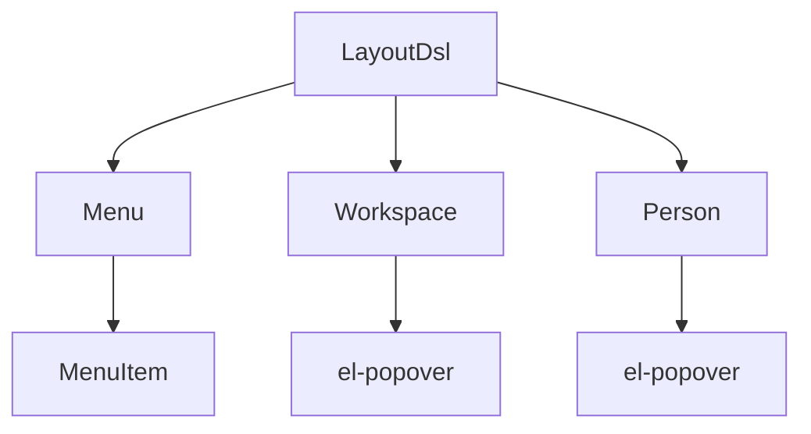
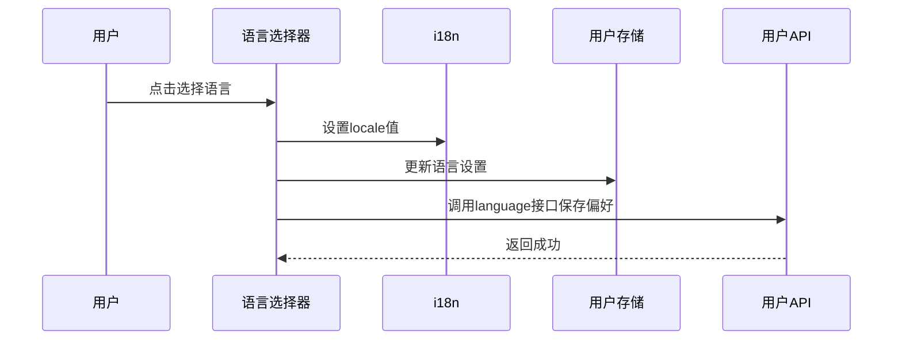
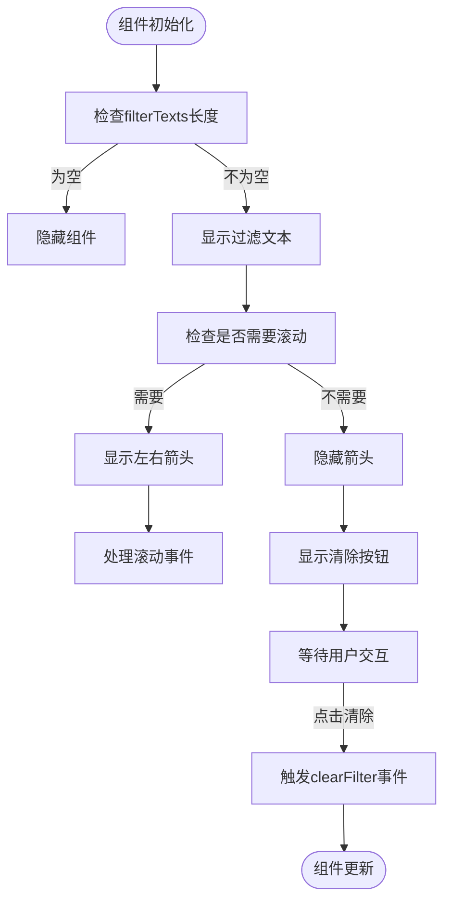
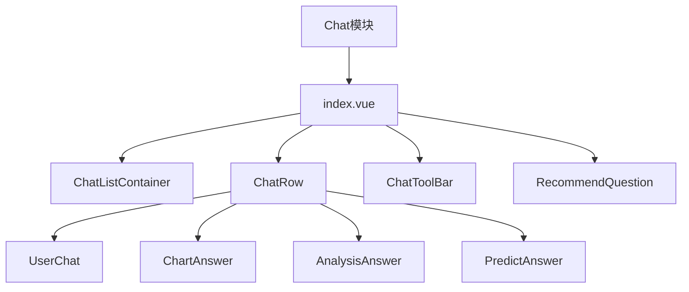
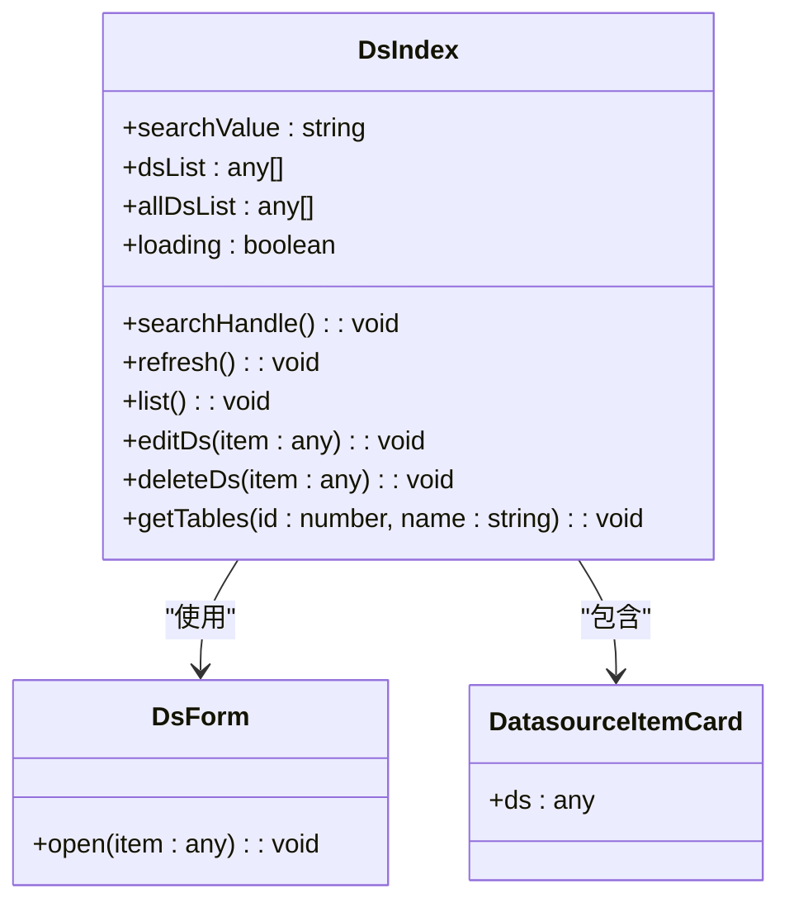
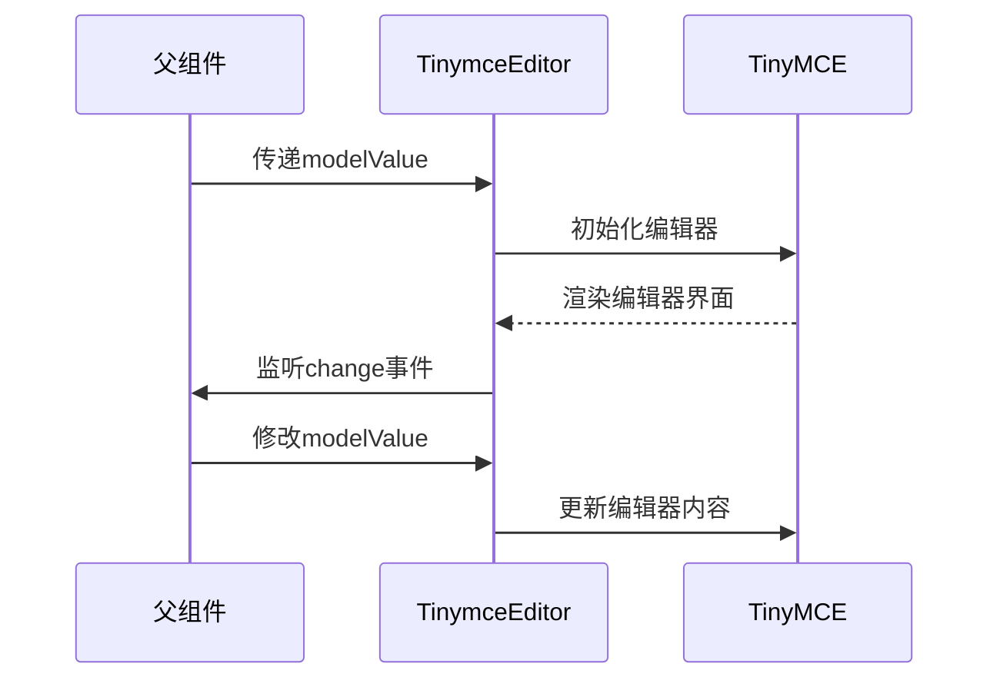
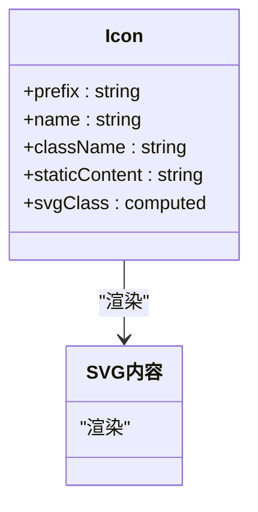

# 组件体系

<cite>
**本文档引用的文件**
- [LayoutDsl.vue](file://frontend/src/components/layout/LayoutDsl.vue)
- [Menu.vue](file://frontend/src/components/layout/Menu.vue)
- [Workspace.vue](file://frontend/src/components/layout/Workspace.vue)
- [Language-selector/index.vue](file://frontend/src/components/Language-selector/index.vue)
- [drawer-filter/src/DrawerFilter.vue](file://frontend/src/components/drawer-filter/src/DrawerFilter.vue)
- [filter-text/src/FilterText.vue](file://frontend/src/components/filter-text/src/FilterText.vue)
- [icon-custom/src/Icon.vue](file://frontend/src/components/icon-custom/src/Icon.vue)
- [TinymceEditor.vue](file://frontend/src/components/rich-text/TinymceEditor.vue)
- [chat/index.vue](file://frontend/src/views/chat/index.vue)
- [dashboard/index.vue](file://frontend/src/views/dashboard/index.vue)
- [ds/index.vue](file://frontend/src/views/ds/index.vue)
</cite>

## 目录
1. [简介](#简介)
2. [布局组件体系](#布局组件体系)
3. [通用组件设计模式](#通用组件设计模式)
4. [业务模块组件组织](#业务模块组件组织)
5. [基础组件封装规范](#基础组件封装规范)
6. [组件通信与动态加载](#组件通信与动态加载)
7. [可访问性与响应式设计](#可访问性与响应式设计)
8. [结论](#结论)

## 简介
本项目采用Vue 3构建前端组件体系，实现了清晰的分层架构和高效的组件复用机制。组件体系分为布局组件、通用组件、业务组件和基础组件四个层次，通过合理的组件划分和设计模式，确保了应用的可维护性和扩展性。布局组件构建了应用的整体框架，通用组件提供了跨模块的复用功能，业务组件实现了具体的功能需求，基础组件则封装了第三方库和自定义元素。

## 布局组件体系

布局组件位于`frontend/src/components/layout`目录下，主要包括`LayoutDsl`、`Menu`、`Workspace`等核心组件，共同构建了应用的整体框架结构。

**图示来源**
- [LayoutDsl.vue](file://frontend/src/components/layout/LayoutDsl.vue#L1-L213)
- [Menu.vue](file://frontend/src/components/layout/Menu.vue#L1-L124)
- [Workspace.vue](file://frontend/src/components/layout/Workspace.vue#L1-L244)

`LayoutDsl`作为根布局组件，采用左右分栏的设计模式，左侧为导航区域，右侧为内容展示区域。通过`collapse`状态控制侧边栏的展开与折叠，实现了灵活的界面布局。组件通过`useEmitt`机制监听折叠状态的变化，确保了组件间的通信效率。

`Menu`组件基于Vue Router的路由配置动态生成菜单项，通过`formatRoute`函数处理嵌套路由结构，实现了菜单的层级展示。组件使用Element Plus的`el-menu`组件，通过CSS变量自定义了菜单的样式，包括高度、背景色和圆角等视觉属性。

`Workspace`组件实现了工作空间的选择功能，通过`el-popover`组件创建下拉选择器，用户可以方便地在不同的工作空间之间切换。组件通过`userApi.ws_options()`获取可用的工作空间列表，并在选择后通过`userApi.ws_change()`更新当前工作空间，同时触发页面刷新以应用新的上下文。

**本节来源**
- [LayoutDsl.vue](file://frontend/src/components/layout/LayoutDsl.vue#L1-L213)
- [Menu.vue](file://frontend/src/components/layout/Menu.vue#L1-L124)
- [Workspace.vue](file://frontend/src/components/layout/Workspace.vue#L1-L244)

## 通用组件设计模式

通用组件包括`Language-selector`、`drawer-filter`、`filter-text`等，这些组件设计遵循高内聚、低耦合的原则，提供了跨模块的复用功能。

### 语言选择器组件

`Language-selector`组件实现了应用的多语言切换功能，通过Element Plus的`el-dropdown`组件创建下拉菜单，用户可以选择"中文"或"English"两种语言。组件通过`useI18n`获取当前语言环境，并通过`userApi.language()`将用户的语言偏好保存到服务器端。

**图示来源**
- [Language-selector/index.vue](file://frontend/src/components/Language-selector/index.vue#L1-L67)

### 抽屉过滤组件

`drawer-filter`组件提供了灵活的过滤功能，包含`DrawerFilter`和`DrawerEnumFilter`两个子组件。`DrawerFilter`组件通过`el-select`实现多选过滤，支持搜索和清空功能。组件通过`useEmitt`机制监听全局的清空事件，确保在需要时可以重置过滤状态。

### 文本过滤组件

`filter-text`组件用于展示当前的过滤条件，并提供清除功能。组件通过`scrollPre`和`scrollNext`方法实现横向滚动，当过滤文本较多时用户可以通过箭头按钮查看完整内容。组件还提供了"清除所有过滤"的快捷按钮，提升了用户体验。

**图示来源**
- [filter-text/src/FilterText.vue](file://frontend/src/components/filter-text/src/FilterText.vue#L1-L207)

**本节来源**
- [Language-selector/index.vue](file://frontend/src/components/Language-selector/index.vue#L1-L67)
- [drawer-filter/src/DrawerFilter.vue](file://frontend/src/components/drawer-filter/src/DrawerFilter.vue#L1-L91)
- [filter-text/src/FilterText.vue](file://frontend/src/components/filter-text/src/FilterText.vue#L1-L207)

## 业务模块组件组织

业务模块组件位于`frontend/src/views`目录下，主要包括`chat`、`dashboard`、`ds`等模块，每个模块都有清晰的组件组织结构。

### 聊天模块

`chat`模块是应用的核心功能之一，其组件组织体现了复杂的交互逻辑。`index.vue`作为入口组件，包含了`ChatListContainer`、`ChatRow`、`ChatToolBar`等多个子组件。`ChatRow`组件根据消息角色（用户或助手）渲染不同的内容，`ChartAnswer`、`AnalysisAnswer`和`PredictAnswer`组件分别处理不同类型的回答。

**图示来源**
- [chat/index.vue](file://frontend/src/views/chat/index.vue#L1-L799)

### 仪表板模块

`dashboard`模块的结构相对简单，`index.vue`作为入口组件，主要包含`SQPreviewShow`组件。这种设计模式体现了单一职责原则，将复杂的预览功能封装在独立的组件中，保持了入口组件的简洁性。

### 数据源模块

`ds`模块负责数据源的管理，`index.vue`组件展示了数据源列表，并提供了添加、编辑和删除功能。组件通过`DatasourceItemCard`展示每个数据源的详细信息，并通过`DsForm`组件实现数据源的增删改查操作。

**图示来源**
- [ds/index.vue](file://frontend/src/views/ds/index.vue#L1-L164)

**本节来源**
- [chat/index.vue](file://frontend/src/views/chat/index.vue#L1-L799)
- [dashboard/index.vue](file://frontend/src/views/dashboard/index.vue#L1-L8)
- [ds/index.vue](file://frontend/src/views/ds/index.vue#L1-L164)

## 基础组件封装规范

基础组件包括`TinymceEditor`富文本编辑器和`Icon`自定义图标组件，这些组件封装了第三方库的功能，提供了统一的API接口。

### 富文本编辑器组件

`TinymceEditor`组件封装了TinyMCE编辑器，通过`@tinymce/tinymce-vue`提供的Vue组件进行集成。组件通过`init`配置对象定义了编辑器的工具栏、插件、字体等属性，并通过`watch`监听`modelValue`的变化，实现了双向数据绑定。

**图示来源**
- [TinymceEditor.vue](file://frontend/src/components/rich-text/TinymceEditor.vue#L1-L143)

### 自定义图标组件

`Icon`组件提供了一种灵活的图标使用方式，通过`v-dompurify-html`指令安全地渲染SVG内容。组件支持通过`name`属性指定图标名称，并通过`className`属性添加自定义样式类。

**图示来源**
- [icon-custom/src/Icon.vue](file://frontend/src/components/icon-custom/src/Icon.vue#L1-L61)

**本节来源**
- [TinymceEditor.vue](file://frontend/src/components/rich-text/TinymceEditor.vue#L1-L143)
- [icon-custom/src/Icon.vue](file://frontend/src/components/icon-custom/src/Icon.vue#L1-L61)

## 组件通信与动态加载

组件间通信主要通过props、emit、Vuex store和自定义事件总线四种方式实现。`useEmitt`是项目中自定义的事件总线，用于处理跨层级组件的通信需求。

### 组件通信模式

布局组件通过`useEmitt`机制实现跨层级通信，如`LayoutDsl`监听折叠状态的变化。业务组件通过Vuex store共享状态，如`useUserStore`管理用户信息。父子组件间通过props和emit进行直接通信，确保了数据流的清晰性。

### 动态组件加载

项目中使用了动态组件加载技术，如`ChatRow`组件根据消息类型动态渲染不同的回答组件。这种模式提高了组件的灵活性和可扩展性，使得新增回答类型时无需修改主组件逻辑。

**本节来源**
- [LayoutDsl.vue](file://frontend/src/components/layout/LayoutDsl.vue#L1-L213)
- [Language-selector/index.vue](file://frontend/src/components/Language-selector/index.vue#L1-L67)
- [stores/user.ts](file://frontend/src/stores/user.ts)

## 可访问性与响应式设计

项目在可访问性和响应式设计方面做了充分考虑。通过使用语义化的HTML元素和ARIA属性，提升了应用的可访问性。响应式设计方面，组件通过CSS媒体查询和弹性布局，确保了在不同设备上的良好显示效果。

`LayoutDsl`组件的侧边栏支持折叠功能，适应了小屏幕设备的显示需求。`filter-text`组件的横向滚动功能，确保了在空间有限的情况下仍能展示完整的过滤条件。这些设计细节体现了对用户体验的重视。

**本节来源**
- [LayoutDsl.vue](file://frontend/src/components/layout/LayoutDsl.vue#L1-L213)
- [filter-text/src/FilterText.vue](file://frontend/src/components/filter-text/src/FilterText.vue#L1-L207)

## 结论

本项目的组件体系结构清晰，分层合理，通过布局组件、通用组件、业务组件和基础组件的有机结合，构建了一个高效、可维护的前端应用。组件设计遵循了高内聚、低耦合的原则，通过合理的通信机制和复用模式，确保了代码的可读性和可扩展性。未来可以进一步优化组件的性能，如引入懒加载和代码分割技术，提升应用的加载速度和运行效率。