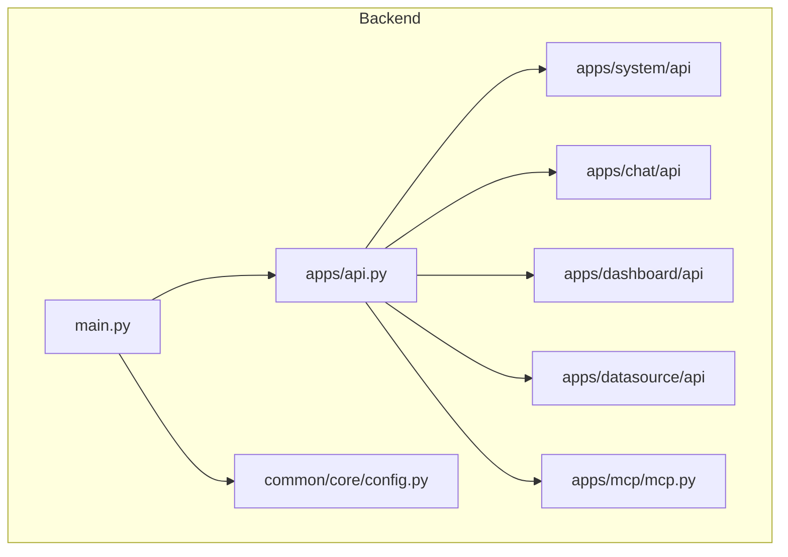
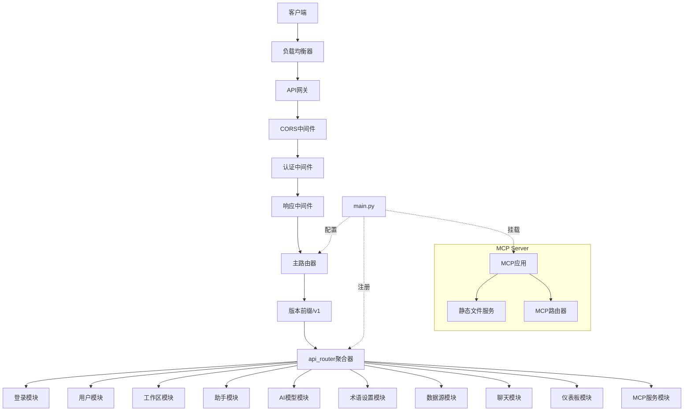
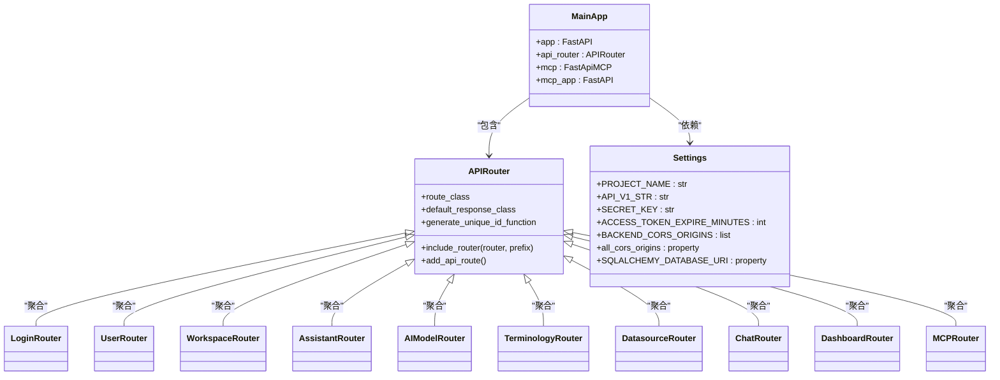
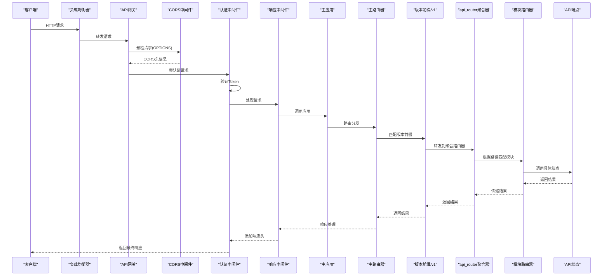
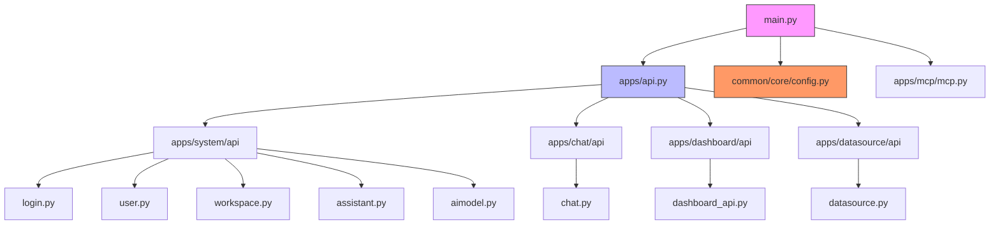

# API端点

<cite>
**本文档中引用的文件**   
- [main.py](file://backend/main.py)
- [api.py](file://backend/apps/api.py)
- [login.py](file://backend/apps/system/api/login.py)
- [config.py](file://backend/common/core/config.py)
- [chat.py](file://backend/apps/chat/api/chat.py)
- [dashboard_api.py](file://backend/apps/dashboard/api/dashboard_api.py)
- [datasource.py](file://backend/apps/datasource/api/datasource.py)
- [mcp.py](file://backend/apps/mcp/mcp.py)
</cite>

## 目录
1. [简介](#简介)
2. [项目结构](#项目结构)
3. [核心组件](#核心组件)
4. [架构概述](#架构概述)
5. [详细组件分析](#详细组件分析)
6. [依赖分析](#依赖分析)
7. [性能考虑](#性能考虑)
8. [故障排除指南](#故障排除指南)
9. [结论](#结论)

## 简介
本文档详细描述了SQLBot系统的API端点设计与实现，重点阐述了API路由聚合机制、模块化路由注册、版本控制策略、端点标识生成规则以及MCP服务的特殊挂载方式。通过分析核心代码文件，展示了从HTTP请求到达至路由分发的完整处理流程，并提供了添加新API路由的实际示例。

## 项目结构



**图示来源**
- [main.py](file://backend/main.py#L1-L100)
- [api.py](file://backend/apps/api.py#L1-L22)
- [config.py](file://backend/common/core/config.py#L1-L93)

**本节来源**
- [main.py](file://backend/main.py#L1-L100)
- [api.py](file://backend/apps/api.py#L1-L22)

## 核心组件

本文档深入分析了API路由聚合器(api_router)、FastAPI应用实例(app)、自定义唯一ID生成函数(custom_generate_unique_id)、MCP服务集成(mcp)以及API版本控制设置(settings.API_V1_STR)等核心组件。这些组件共同构成了系统的API基础设施，实现了模块化路由管理、版本控制和统一的端点标识策略。

**本节来源**
- [main.py](file://backend/main.py#L45-L55)
- [api.py](file://backend/apps/api.py#L9-L21)
- [config.py](file://backend/common/core/config.py#L30-L31)

## 架构概述



**图示来源**
- [main.py](file://backend/main.py#L50-L85)
- [api.py](file://backend/apps/api.py#L9-L21)
- [config.py](file://backend/common/core/config.py#L30-L31)

## 详细组件分析

### API路由聚合机制分析



**图示来源**
- [main.py](file://backend/main.py#L9-L100)
- [api.py](file://backend/apps/api.py#L9-L21)
- [config.py](file://backend/common/core/config.py#L15-L93)

#### API模块路由注册机制

系统采用模块化设计，通过`api.py`文件中的`api_router`聚合所有功能模块的路由。每个API模块（如chat、dashboard、datasource、system等）在各自的目录中定义自己的路由器实例，并通过`include_router`方法注册到主聚合路由器中。这种设计实现了关注点分离，使得各个功能模块可以独立开发和维护。

```python
# backend/apps/api.py
api_router = APIRouter()
api_router.include_router(login.router)
api_router.include_router(user.router)
api_router.include_router(workspace.router)
api_router.include_router(assistant.router)
api_router.include_router(aimodel.router)
api_router.include_router(terminology.router)
api_router.include_router(datasource.router)
api_router.include_router(chat.router)
api_router.include_router(dashboard_api.router)
api_router.include_router(mcp.router)
```

**本节来源**
- [api.py](file://backend/apps/api.py#L9-L21)

#### API版本控制策略分析

系统通过`settings.API_V1_STR`配置项实现API版本控制。在`main.py`中，主应用实例通过`include_router`方法将`api_router`挂载到由`settings.API_V1_STR`指定的版本前缀路径下。当前配置为`/api/v1`，这确保了所有API端点都遵循统一的版本化URL结构，便于未来进行版本迭代和兼容性管理。

```python
# backend/main.py
app.include_router(api_router, prefix=settings.API_V1_STR)
```

```python
# backend/common/core/config.py
API_V1_STR: str = "/api/v1"
```

**本节来源**
- [main.py](file://backend/main.py#L82-L83)
- [config.py](file://backend/common/core/config.py#L30-L31)

#### API端点标签与唯一ID生成规则

系统实现了自定义的端点唯一ID生成策略，通过`custom_generate_unique_id`函数结合路由标签(tags)和名称(name)生成唯一的操作ID。该函数首先获取路由的第一个标签（如果存在），然后将其与路由名称组合成`{tag}-{name}`格式的唯一标识符。这个唯一ID被用于OpenAPI文档生成，确保了不同模块间端点标识的唯一性和可读性。

```python
# backend/main.py
def custom_generate_unique_id(route: APIRoute) -> str:
    tag = route.tags[0] if route.tags and len(route.tags) > 0 else ""
    return f"{tag}-{route.name}"

app = FastAPI(
    title=settings.PROJECT_NAME,
    openapi_url=f"{settings.API_V1_STR}/openapi.json",
    generate_unique_id_function=custom_generate_unique_id,
    lifespan=lifespan
)
```

**本节来源**
- [main.py](file://backend/main.py#L45-L55)

#### MCP服务API特殊挂载机制

MCP服务采用了特殊的双重挂载机制。首先，系统创建了一个独立的`mcp_app` FastAPI实例，用于挂载静态文件服务（如/images路径）。然后，使用`FastApiMCP`类将主应用的功能封装为MCP服务器，并将其挂载到`mcp_app`上。最后，在主应用的生命周期事件中调用`mcp.setup_server()`完成MCP服务器的设置。这种设计实现了MCP服务与主应用的逻辑分离，同时保持了功能集成。

```python
# backend/main.py
mcp_app = FastAPI()
mcp_app.mount("/images", StaticFiles(directory=settings.MCP_IMAGE_PATH), name="images")

mcp = FastApiMCP(
    app,
    name="SQLBot MCP Server",
    description="SQLBot MCP Server",
    describe_all_responses=True,
    describe_full_response_schema=True,
    include_operations=["get_datasource_list", "get_model_list", "mcp_question", "mcp_start"]
)

mcp.mount(mcp_app)
mcp.setup_server()
```

**本节来源**
- [main.py](file://backend/main.py#L57-L68)
- [mcp.py](file://backend/apps/mcp/mcp.py#L1-L113)

#### API请求处理流程



**图示来源**
- [main.py](file://backend/main.py#L50-L85)
- [api.py](file://backend/apps/api.py#L9-L21)
- [response_middleware.py](file://backend/common/core/response_middleware.py#L1-L44)

### 如何添加新的API路由

要添加新的API路由，需要遵循以下步骤：首先在`apps`目录下创建新的功能模块目录；然后在该目录中创建`api`子目录并定义路由器实例；最后在`backend/apps/api.py`文件中导入新模块的路由器，并通过`api_router.include_router()`方法将其注册到主聚合路由器中。这种方法保持了代码的模块化和可维护性。

**本节来源**
- [api.py](file://backend/apps/api.py#L9-L21)

## 依赖分析



**图示来源**
- [main.py](file://backend/main.py#L1-L100)
- [api.py](file://backend/apps/api.py#L1-L22)

**本节来源**
- [main.py](file://backend/main.py#L1-L100)
- [api.py](file://backend/apps/api.py#L1-L22)

## 性能考虑

系统在API设计中考虑了多项性能优化策略。通过使用异步上下文管理器(lifespan)实现数据库迁移和缓存初始化，减少了应用启动时间。采用模块化路由聚合机制，提高了路由匹配效率。自定义响应中间件对JSON响应进行统一包装，减少了重复代码。MCP服务的独立挂载机制实现了功能隔离，避免了相互影响。此外，系统还集成了SQLAlchemy ORM和连接池，优化了数据库访问性能。

## 故障排除指南

当遇到API路由相关问题时，应首先检查`backend/apps/api.py`文件中的路由注册是否正确。确认新添加的模块路由器已通过`include_router`方法注册到`api_router`。检查`main.py`中`include_router`的前缀是否与`settings.API_V1_STR`一致。验证`custom_generate_unique_id`函数是否正常工作，确保OpenAPI文档能正确生成。对于MCP服务问题，检查`mcp.mount(mcp_app)`和`mcp.setup_server()`调用是否完整。使用`uvicorn`运行应用时，确保端口配置正确且无冲突。

**本节来源**
- [main.py](file://backend/main.py#L45-L100)
- [api.py](file://backend/apps/api.py#L9-L21)

## 结论

SQLBot系统的API架构设计体现了良好的模块化和可扩展性。通过`api_router`聚合器实现了各功能模块路由的集中管理，`settings.API_V1_STR`提供了清晰的版本控制策略，`custom_generate_unique_id`函数确保了端点标识的唯一性，而MCP服务的特殊挂载机制则实现了功能的灵活集成。整个API体系结构清晰、易于维护，为系统的持续发展奠定了坚实基础。