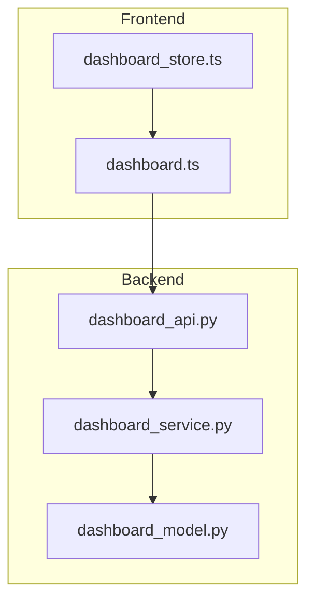
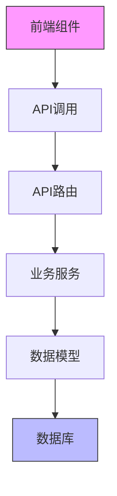
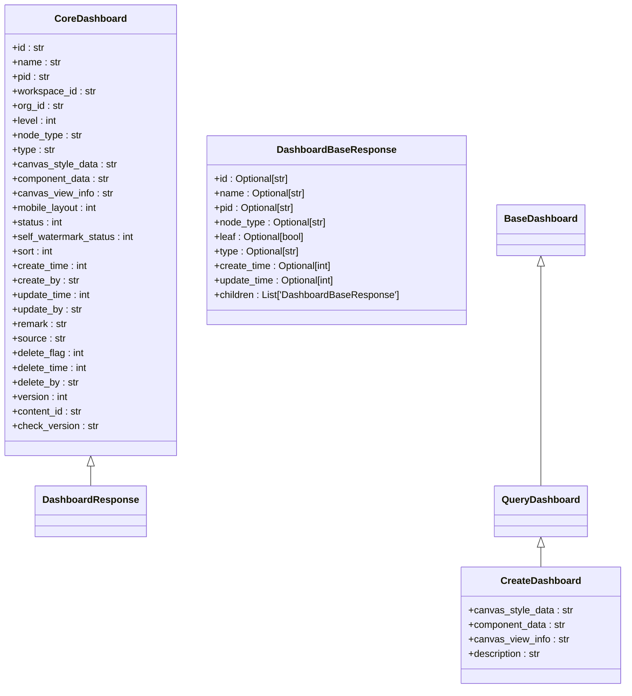
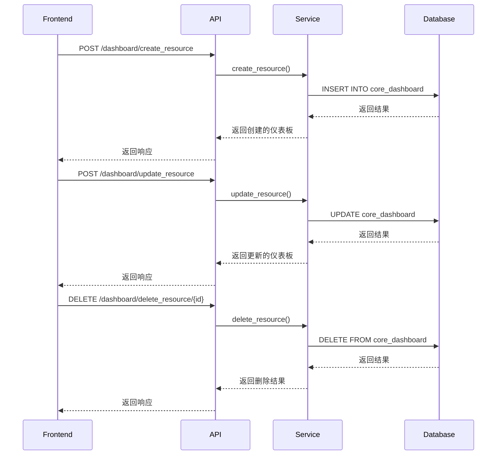
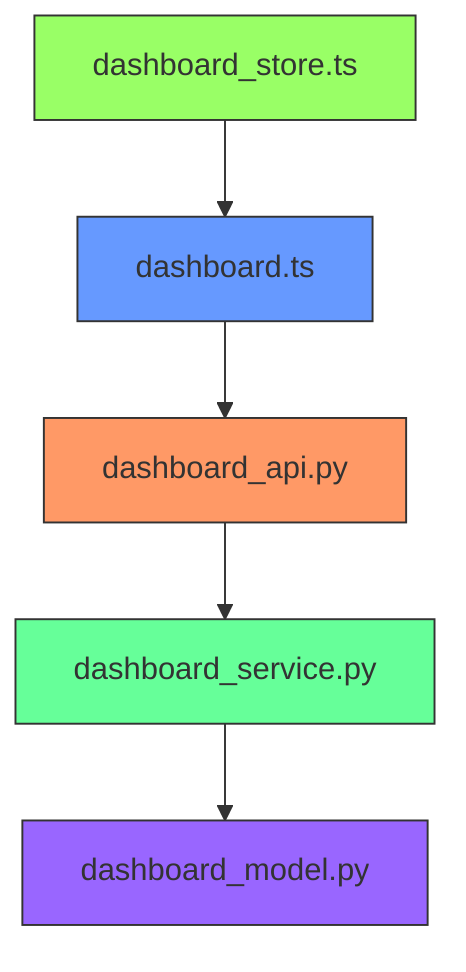

# 仪表板API

<cite>
**Referenced Files in This Document**   
- [dashboard_api.py](file://backend/apps/dashboard/api/dashboard_api.py)
- [dashboard_model.py](file://backend/apps/dashboard/models/dashboard_model.py)
- [dashboard_service.py](file://backend/apps/dashboard/crud/dashboard_service.py)
- [dashboard.ts](file://frontend/src/api/dashboard.ts)
- [dashboard.ts](file://frontend/src/stores/dashboard/dashboard.ts)
</cite>

## 目录
1. [介绍](#介绍)
2. [项目结构](#项目结构)
3. [核心组件](#核心组件)
4. [架构概述](#架构概述)
5. [详细组件分析](#详细组件分析)
6. [依赖分析](#依赖分析)
7. [性能考虑](#性能考虑)
8. [故障排除指南](#故障排除指南)
9. [结论](#结论)

## 介绍
本文档详细描述了仪表板API的实现，重点介绍/dashboard端点的CRUD操作。文档涵盖了仪表板创建、更新、删除和查询接口的设计原理，解释了仪表板模型与前端组件的数据交互格式，并阐述了图表组件在画布上的布局管理机制和状态同步策略。此外，文档还提供了API调用示例、错误处理机制以及性能优化措施。

## 项目结构
仪表板功能模块在项目中具有清晰的分层结构，分为API接口层、业务逻辑层和数据模型层。前端部分包含API调用封装和状态管理。



**Diagram sources**
- [dashboard_api.py](file://backend/apps/dashboard/api/dashboard_api.py)
- [dashboard_service.py](file://backend/apps/dashboard/crud/dashboard_service.py)
- [dashboard_model.py](file://backend/apps/dashboard/models/dashboard_model.py)
- [dashboard.ts](file://frontend/src/api/dashboard.ts)
- [dashboard.ts](file://frontend/src/stores/dashboard/dashboard.ts)

**Section sources**
- [dashboard_api.py](file://backend/apps/dashboard/api/dashboard_api.py)
- [dashboard_service.py](file://backend/apps/dashboard/crud/dashboard_service.py)
- [dashboard_model.py](file://backend/apps/dashboard/models/dashboard_model.py)
- [dashboard.ts](file://frontend/src/api/dashboard.ts)
- [dashboard.ts](file://frontend/src/stores/dashboard/dashboard.ts)

## 核心组件
核心组件包括仪表板API控制器、业务服务、数据模型以及前端API封装和状态管理。API控制器处理HTTP请求，业务服务实现核心逻辑，数据模型定义数据结构，前端组件负责状态管理和API调用。

**Section sources**
- [dashboard_api.py](file://backend/apps/dashboard/api/dashboard_api.py#L1-L48)
- [dashboard_service.py](file://backend/apps/dashboard/crud/dashboard_service.py#L1-L137)
- [dashboard_model.py](file://backend/apps/dashboard/models/dashboard_model.py#L1-L164)

## 架构概述
系统采用典型的分层架构，从前端到后端各层职责分明。前端通过API调用与后端交互，后端采用MVC模式组织代码。



**Diagram sources**
- [dashboard_api.py](file://backend/apps/dashboard/api/dashboard_api.py)
- [dashboard_service.py](file://backend/apps/dashboard/crud/dashboard_service.py)
- [dashboard_model.py](file://backend/apps/dashboard/models/dashboard_model.py)
- [dashboard.ts](file://frontend/src/api/dashboard.ts)

## 详细组件分析

### 仪表板模型分析
仪表板模型定义了核心数据结构，包含仪表板的元数据、布局信息和组件数据。



**Diagram sources**
- [dashboard_model.py](file://backend/apps/dashboard/models/dashboard_model.py#L5-L126)

**Section sources**
- [dashboard_model.py](file://backend/apps/dashboard/models/dashboard_model.py#L5-L164)

### CRUD操作分析
CRUD操作通过API端点暴露，每个操作都有对应的业务逻辑处理。

#### API端点调用流程


**Diagram sources**
- [dashboard_api.py](file://backend/apps/dashboard/api/dashboard_api.py#L1-L48)
- [dashboard_service.py](file://backend/apps/dashboard/crud/dashboard_service.py#L1-L137)

**Section sources**
- [dashboard_api.py](file://backend/apps/dashboard/api/dashboard_api.py#L1-L48)
- [dashboard_service.py](file://backend/apps/dashboard/crud/dashboard_service.py#L1-L137)

### 前端状态管理分析
前端使用Pinia进行状态管理，维护仪表板的当前状态。

```mermaid
classDiagram
class dashboardStore {
+tabCollisionActiveId : null
+tabMoveInActiveId : null
+curComponent : null
+curComponentId : null
+canvasStyleData : {}
+componentData : []
+canvasViewInfo : {}
+fullscreenFlag : false
+dataPrepareState : false
+dashboardInfo : {}
+setFullscreenFlag(val : boolean)
+setCurComponent(value : any)
+setDashboardInfo(value : any)
+setComponentData(value : any)
+setCanvasStyleData(value : any)
+setTabCollisionActiveId(tabId : any)
+setTabMoveInActiveId(tabId : any)
+updateDashboardInfo(params : any)
+setCanvasViewInfo(params : any)
+addCanvasViewInfo(params : any)
+canvasDataInit()
}
class dashboardApi {
+list_resource(params : any)
+load_resource(params : any)
+create_resource(params : any)
+update_resource(params : any)
+create_canvas(params : any)
+update_canvas(params : any)
+check_name(params : any)
+delete_resource(params : any)
+move_resource(params : any)
}
dashboardApi --> dashboardStore : 调用状态管理方法
```

**Diagram sources**
- [dashboard.ts](file://frontend/src/stores/dashboard/dashboard.ts#L1-L105)
- [dashboard.ts](file://frontend/src/api/dashboard.ts#L1-L14)

**Section sources**
- [dashboard.ts](file://frontend/src/stores/dashboard/dashboard.ts#L1-L105)
- [dashboard.ts](file://frontend/src/api/dashboard.ts#L1-L14)

## 依赖分析
各组件之间存在明确的依赖关系，形成了清晰的调用链。



**Diagram sources**
- [dashboard_api.py](file://backend/apps/dashboard/api/dashboard_api.py)
- [dashboard_service.py](file://backend/apps/dashboard/crud/dashboard_service.py)
- [dashboard_model.py](file://backend/apps/dashboard/models/dashboard_model.py)
- [dashboard.ts](file://frontend/src/api/dashboard.ts)
- [dashboard.ts](file://frontend/src/stores/dashboard/dashboard.ts)

**Section sources**
- [dashboard_api.py](file://backend/apps/dashboard/api/dashboard_api.py)
- [dashboard_service.py](file://backend/apps/dashboard/crud/dashboard_service.py)
- [dashboard_model.py](file://backend/apps/dashboard/models/dashboard_model.py)
- [dashboard.ts](file://frontend/src/api/dashboard.ts)
- [dashboard.ts](file://frontend/src/stores/dashboard/dashboard.ts)

## 性能考虑
系统在性能方面采取了多项优化措施，包括数据懒加载和缓存策略。API设计考虑了批量操作和分页查询，以减少网络请求次数。数据库查询使用参数化查询防止SQL注入，同时通过索引优化查询性能。

## 故障排除指南
常见问题包括权限验证失败、重复名称校验错误和数据格式问题。错误处理机制通过validate_name函数实现重复名称校验，通过CurrentUser依赖实现权限验证。建议检查用户权限、名称唯一性和数据格式是否符合API要求。

**Section sources**
- [dashboard_service.py](file://backend/apps/dashboard/crud/dashboard_service.py#L101-L129)
- [dashboard_api.py](file://backend/apps/dashboard/api/dashboard_api.py#L45-L48)

## 结论
仪表板API提供了完整的CRUD功能，通过清晰的分层架构实现了前后端分离。系统设计考虑了性能、安全性和可维护性，为仪表板管理提供了可靠的基础。建议在使用时遵循API文档规范，注意权限控制和数据验证。