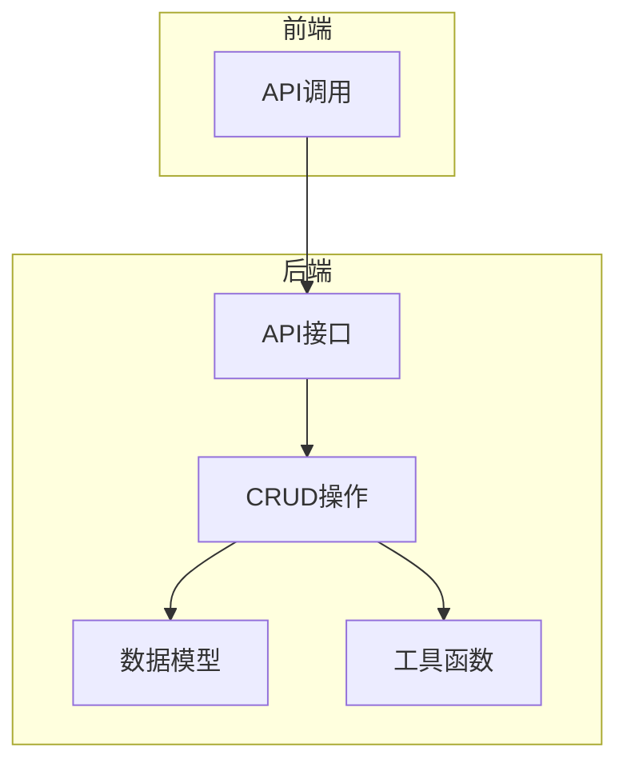
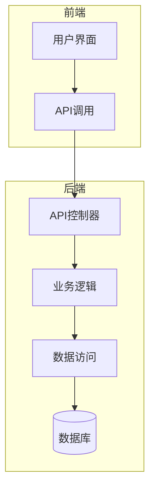
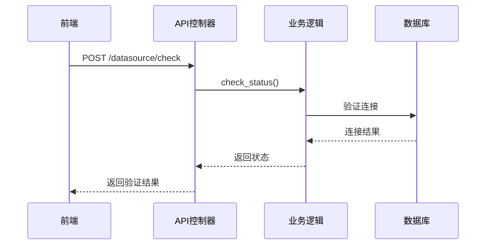
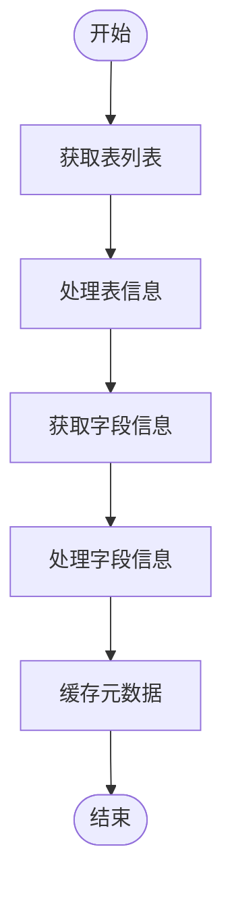
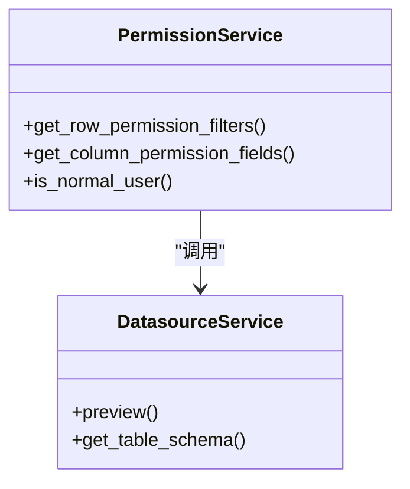
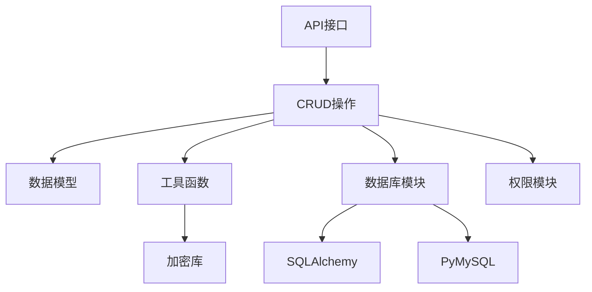

# 数据源API

<cite>
**本文档中引用的文件**  
- [datasource.py](file://backend/apps/datasource/api/datasource.py)
- [datasource.py](file://backend/apps/datasource/crud/datasource.py)
- [datasource.py](file://backend/apps/datasource/models/datasource.py)
- [utils.py](file://backend/apps/datasource/utils/utils.py)
- [db.py](file://backend/apps/db/db.py)
- [permission.py](file://backend/apps/datasource/crud/permission.py)
- [table.py](file://backend/apps/datasource/crud/table.py)
- [datasource.ts](file://frontend/src/api/datasource.ts)
</cite>

## 目录
1. [简介](#简介)
2. [项目结构](#项目结构)
3. [核心组件](#核心组件)
4. [架构概述](#架构概述)
5. [详细组件分析](#详细组件分析)
6. [依赖分析](#依赖分析)
7. [性能考虑](#性能考虑)
8. [故障排除指南](#故障排除指南)
9. [结论](#结论)

## 简介
本文档详细描述了数据源API的功能，重点介绍`/datasource`端点的元数据管理功能。文档涵盖数据源连接配置的验证与加密存储机制、表结构和字段信息的获取与缓存策略、行级和列级权限过滤的实现方式、API使用示例（包括测试连接和同步元数据等操作）、安全考虑（如敏感信息加密和连接池管理）以及如何扩展支持新的数据库类型。

## 项目结构
数据源相关功能主要分布在后端的`backend/apps/datasource`目录和前端的`frontend/src/api/datasource.ts`文件中。后端分为API接口、CRUD操作、数据模型和工具函数四个主要部分，前端通过API调用与后端交互。

**图示来源**  
- [datasource.py](file://backend/apps/datasource/api/datasource.py)
- [datasource.py](file://backend/apps/datasource/crud/datasource.py)
- [datasource.py](file://backend/apps/datasource/models/datasource.py)
- [utils.py](file://backend/apps/datasource/utils/utils.py)
- [datasource.ts](file://frontend/src/api/datasource.ts)

**本节来源**  
- [datasource.py](file://backend/apps/datasource/api/datasource.py)
- [datasource.py](file://backend/apps/datasource/crud/datasource.py)
- [datasource.py](file://backend/apps/datasource/models/datasource.py)
- [utils.py](file://backend/apps/datasource/utils/utils.py)
- [datasource.ts](file://frontend/src/api/datasource.ts)

## 核心组件
数据源API的核心组件包括数据源配置模型、连接验证机制、元数据获取服务、权限过滤系统和加密存储功能。这些组件协同工作，实现了安全、高效的数据源管理功能。

**本节来源**  
- [datasource.py](file://backend/apps/datasource/api/datasource.py)
- [datasource.py](file://backend/apps/datasource/crud/datasource.py)
- [datasource.py](file://backend/apps/datasource/models/datasource.py)
- [utils.py](file://backend/apps/datasource/utils/utils.py)

## 架构概述
数据源API采用分层架构设计，从前端API接口到后端CRUD操作，再到数据库交互层，形成了清晰的调用链路。系统通过配置加密、连接池管理和权限控制等机制，确保了数据访问的安全性和性能。

**图示来源**  
- [datasource.py](file://backend/apps/datasource/api/datasource.py)
- [datasource.py](file://backend/apps/datasource/crud/datasource.py)
- [db.py](file://backend/apps/db/db.py)

**本节来源**  
- [datasource.py](file://backend/apps/datasource/api/datasource.py)
- [datasource.py](file://backend/apps/datasource/crud/datasource.py)
- [db.py](file://backend/apps/db/db.py)

## 详细组件分析
### 数据源配置与验证分析
数据源配置和验证功能通过API端点和CRUD操作协同实现，确保连接配置的正确性和安全性。

#### 对于API/服务组件：

**图示来源**  
- [datasource.py](file://backend/apps/datasource/api/datasource.py#L100-L120)
- [datasource.py](file://backend/apps/datasource/crud/datasource.py#L50-L70)
- [db.py](file://backend/apps/db/db.py#L150-L180)

**本节来源**  
- [datasource.py](file://backend/apps/datasource/api/datasource.py)
- [datasource.py](file://backend/apps/datasource/crud/datasource.py)
- [db.py](file://backend/apps/db/db.py)

### 元数据管理分析
元数据管理功能负责获取和缓存表结构及字段信息，为上层应用提供数据字典支持。

#### 对于复杂逻辑组件：

**图示来源**  
- [datasource.py](file://backend/apps/datasource/crud/datasource.py#L200-L250)
- [db.py](file://backend/apps/db/db.py#L200-L230)

**本节来源**  
- [datasource.py](file://backend/apps/datasource/crud/datasource.py)
- [db.py](file://backend/apps/db/db.py)

### 权限过滤分析
权限过滤系统实现了行级和列级的数据访问控制，确保用户只能访问授权的数据。

#### 对于对象导向组件：

**图示来源**  
- [permission.py](file://backend/apps/datasource/crud/permission.py)
- [datasource.py](file://backend/apps/datasource/crud/datasource.py)

**本节来源**  
- [permission.py](file://backend/apps/datasource/crud/permission.py)
- [datasource.py](file://backend/apps/datasource/crud/datasource.py)

## 依赖分析
数据源模块依赖于多个核心组件，包括数据库连接管理、加密工具和权限系统。这些依赖关系确保了功能的完整性和安全性。

**图示来源**  
- [datasource.py](file://backend/apps/datasource/api/datasource.py)
- [datasource.py](file://backend/apps/datasource/crud/datasource.py)
- [utils.py](file://backend/apps/datasource/utils/utils.py)
- [db.py](file://backend/apps/db/db.py)
- [permission.py](file://backend/apps/datasource/crud/permission.py)

**本节来源**  
- [datasource.py](file://backend/apps/datasource/api/datasource.py)
- [datasource.py](file://backend/apps/datasource/crud/datasource.py)
- [utils.py](file://backend/apps/datasource/utils/utils.py)
- [db.py](file://backend/apps/db/db.py)
- [permission.py](file://backend/apps/datasource/crud/permission.py)

## 性能考虑
系统通过连接池管理、元数据缓存和异步处理等机制优化性能。数据库连接使用连接池避免频繁创建和销毁连接，元数据在首次获取后会被缓存以减少数据库查询，耗时操作通过`asyncio.to_thread`在后台线程执行以避免阻塞主线程。

## 故障排除指南
当遇到数据源连接问题时，首先检查连接配置是否正确，包括主机、端口、用户名、密码等信息。如果连接失败，系统会返回详细的错误信息。对于元数据获取问题，确保数据库用户有足够的权限查询系统表。如果遇到权限相关问题，检查用户角色和权限设置。

**本节来源**  
- [datasource.py](file://backend/apps/datasource/api/datasource.py)
- [datasource.py](file://backend/apps/datasource/crud/datasource.py)
- [db.py](file://backend/apps/db/db.py)

## 结论
数据源API提供了一套完整的数据源管理解决方案，涵盖了连接配置、元数据管理、权限控制和安全存储等核心功能。通过清晰的架构设计和模块化实现，系统既保证了功能的完整性，又确保了良好的可维护性和扩展性。未来可以通过扩展数据库类型支持和增强权限控制功能来进一步提升系统能力。