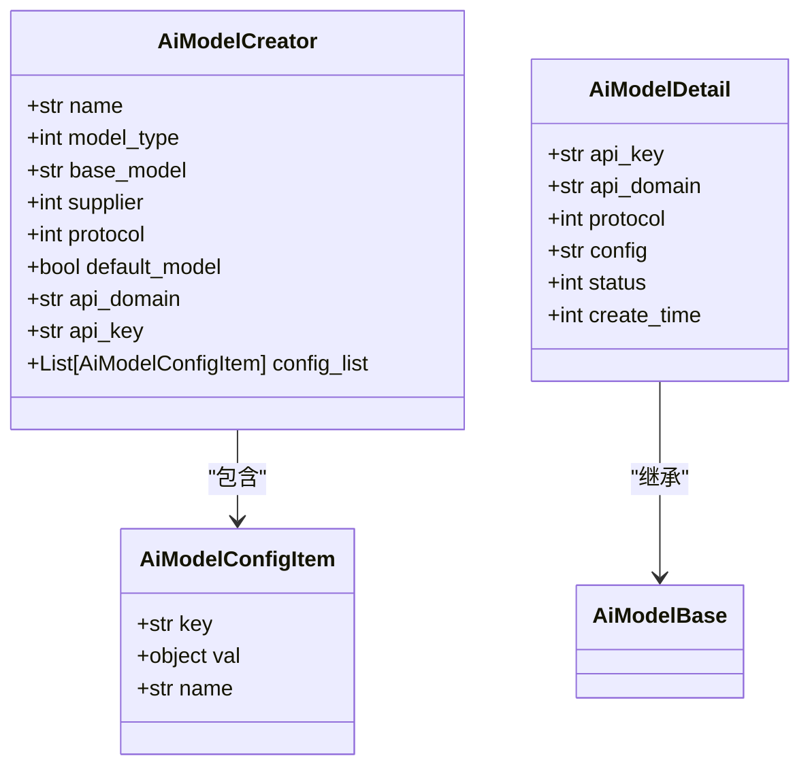
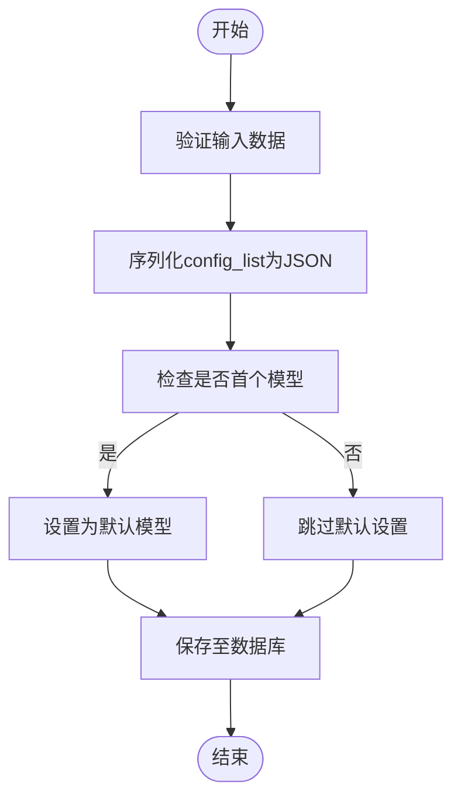
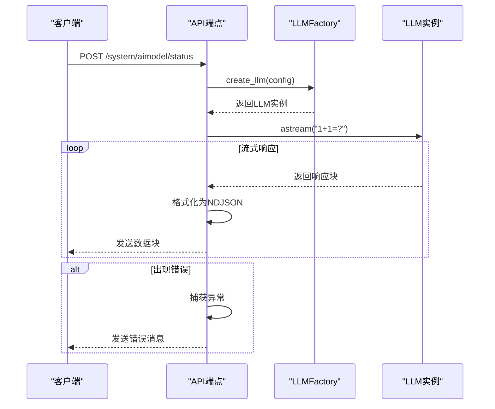
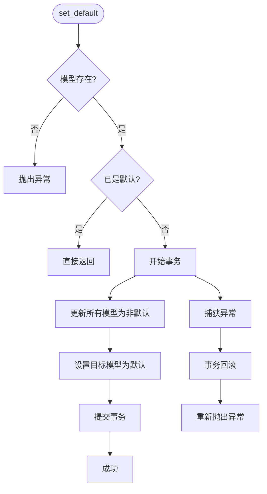
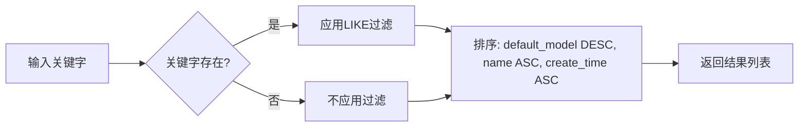
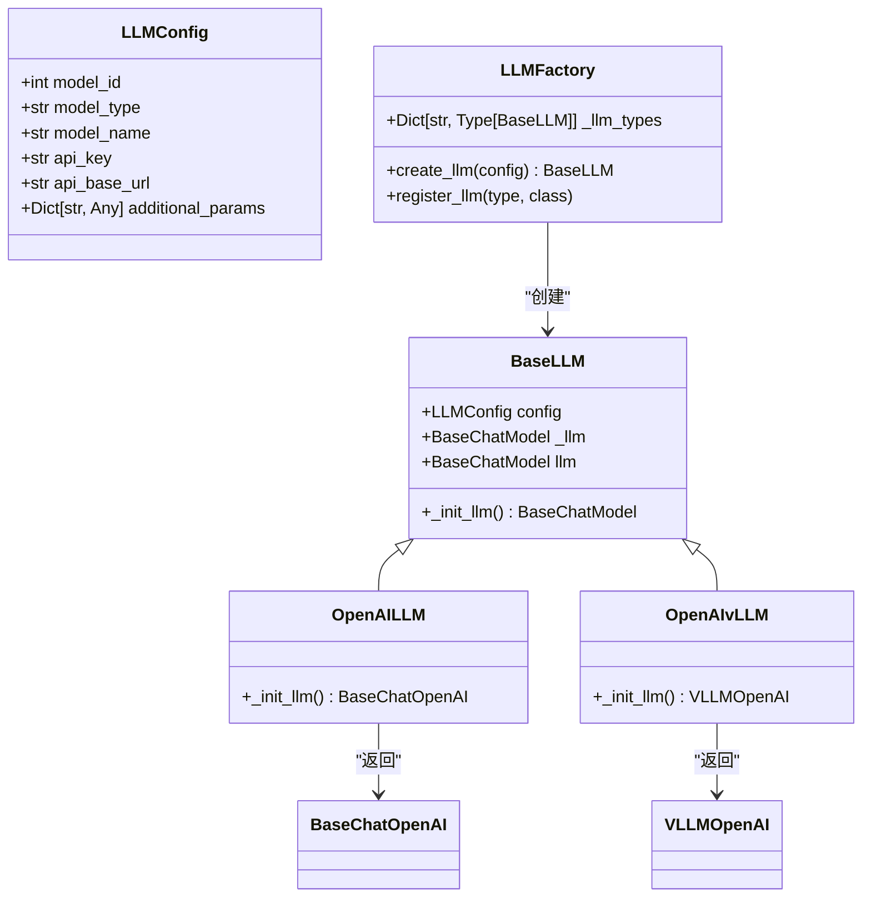
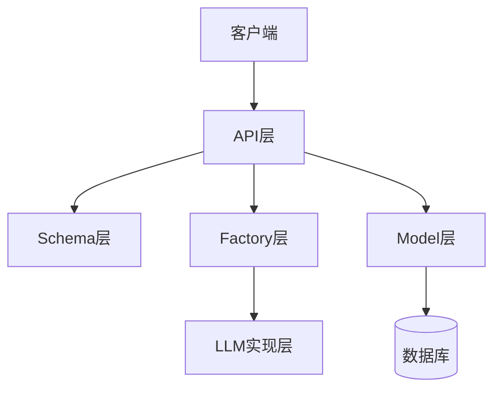

# AI模型管理API

<cite>
**本文档引用的文件**
- [aimodel.py](file://backend/apps/system/api/aimodel.py)
- [model_factory.py](file://backend/apps/ai_model/model_factory.py)
- [ai_model_schema.py](file://backend/apps/system/schemas/ai_model_schema.py)
- [system_model.py](file://backend/apps/system/models/system_model.py)
- [llm.py](file://backend/apps/ai_model/openai/llm.py)
</cite>

## 目录
1. [简介](#简介)
2. [核心功能](#核心功能)
3. [AI模型配置与测试](#ai模型配置与测试)
4. [增删改查操作](#增删改查操作)
5. [流式响应机制](#流式响应机制)
6. [默认模型管理](#默认模型管理)
7. [查询与排序逻辑](#查询与排序逻辑)
8. [动态加载与切换机制](#动态加载与切换机制)
9. [架构概览](#架构概览)
10. [依赖分析](#依赖分析)

## 简介
本文档详细描述了AI模型管理API的核心功能，包括AI模型的配置、测试、设为默认以及增删改查等操作。重点阐述了`check_llm`端点的流式响应机制、`LLMFactory`的实例创建与模型连通性测试、`config_list`配置项的JSON序列化存储方式、`set_default`端点的事务性操作、`query`端点的排序逻辑以及AI模型配置的动态加载和切换机制。

## 核心功能
AI模型管理API提供了完整的模型生命周期管理能力，支持对AI模型进行配置、测试、启用/禁用、设为默认及增删改查操作。系统通过统一的接口规范实现对不同协议（如OpenAI、vLLM）的支持，并确保在多模型环境下始终有且仅有一个默认模型可用。

**本文档引用的文件**
- [aimodel.py](file://backend/apps/system/api/aimodel.py)
- [model_factory.py](file://backend/apps/ai_model/model_factory.py)

## AI模型配置与测试
### 配置结构
AI模型的配置信息通过`AiModelCreator`和`AiModelEditor`数据传输对象（DTO）进行定义，其中包含基础信息（如名称、供应商、基础模型）和高级配置（`config_list`）。`config_list`字段允许用户添加任意键值对形式的附加参数，这些参数将被序列化为JSON字符串后存储于数据库的`config`字段中。

**图示来源**
- [ai_model_schema.py](file://backend/apps/system/schemas/ai_model_schema.py#L1-L28)
- [system_model.py](file://backend/apps/system/models/system_model.py#L14-L21)

### 模型连通性测试
`check_llm`端点用于验证AI模型的连通性和可用性。该端点接收`AiModelCreator`对象作为输入，利用`LLMFactory`根据提供的配置创建对应的LLM实例，并发送测试请求“1+1=?”以验证模型响应能力。

**段落来源**
- [aimodel.py](file://backend/apps/system/api/aimodel.py#L17-L41)
- [model_factory.py](file://backend/apps/ai_model/model_factory.py#L85-L105)

## 增删改查操作
### 添加模型
`add_model`端点负责将新的AI模型持久化到数据库。在保存前，系统会将`config_list`列表中的配置项转换为JSON字符串并赋值给`config`字段，同时移除原始的`config_list`字段。若当前系统中无任何模型，则新添加的模型自动设为默认模型。

**图示来源**
- [aimodel.py](file://backend/apps/system/api/aimodel.py#L110-L123)

### 更新模型
`update_model`端点用于更新现有AI模型的信息。与添加操作类似，系统会先将`config_list`序列化为JSON字符串，再通过`sqlmodel_update`方法更新数据库记录，确保所有变更被正确持久化。

**段落来源**
- [aimodel.py](file://backend/apps/system/api/aimodel.py#L126-L138)

### 删除模型
`delete_model`端点用于从系统中移除指定的AI模型。删除前会进行安全检查：若尝试删除的是当前默认模型，系统将抛出异常以防止系统处于无默认模型的状态。

**段落来源**
- [aimodel.py](file://backend/apps/system/api/aimodel.py#L140-L153)

## 流式响应机制
`check_llm`端点采用`StreamingResponse`返回类型，实现服务器向客户端的流式数据推送。其内部通过异步生成器函数`generate()`逐块返回模型响应内容，媒体类型设置为`application/x-ndjson`，每行输出一个JSON对象，包含`content`或`error`字段。

**图示来源**
- [aimodel.py](file://backend/apps/system/api/aimodel.py#L17-L41)
- [model_factory.py](file://backend/apps/ai_model/model_factory.py#L85-L105)
- [llm.py](file://backend/apps/ai_model/openai/llm.py#L100-L120)

## 默认模型管理
### 设为默认操作
`set_default`端点用于将指定ID的AI模型设为系统默认模型。此操作具有事务性：首先将所有现有模型的`default_model`字段置为`False`，然后将目标模型的该字段设为`True`，最后提交事务。若过程中发生异常，事务将回滚以保证数据一致性。

**图示来源**
- [aimodel.py](file://backend/apps/system/api/aimodel.py#L52-L68)

### 默认模型检查
`check_default`端点用于验证系统中是否存在默认模型。若查询结果为空，则抛出异常提示用户必须设置一个默认模型，确保系统始终具备可用的AI服务能力。

**段落来源**
- [aimodel.py](file://backend/apps/system/api/aimodel.py#L44-L50)

## 查询与排序逻辑
`query`端点提供AI模型的查询功能，支持按名称关键字进行模糊搜索。查询结果采用特定排序策略：首先按`default_model`字段降序排列（即默认模型排在最前），其次按模型名称升序，最后按创建时间升序，确保用户能优先看到当前生效的默认模型。

**图示来源**
- [aimodel.py](file://backend/apps/system/api/aimodel.py#L71-L86)

## 动态加载与切换机制
系统通过`LLMFactory`类实现AI模型的动态加载与实例化。该工厂类基于`LLMConfig`配置对象，根据`model_type`字段选择合适的LLM实现类（如`OpenAILLM`或`OpenAIvLLM`），并通过`@lru_cache`装饰器缓存已创建的实例，提升性能并避免重复初始化。

**图示来源**
- [model_factory.py](file://backend/apps/ai_model/model_factory.py#L17-L42)
- [model_factory.py](file://backend/apps/ai_model/model_factory.py#L85-L105)

## 架构概览
AI模型管理模块采用分层架构设计，各组件职责明确：
- **API层**：处理HTTP请求，调用业务逻辑
- **Schema层**：定义数据传输结构
- **Model层**：映射数据库表结构
- **Factory层**：负责LLM实例的创建与管理
- **LLM实现层**：封装具体的大语言模型调用逻辑

**图示来源**
- [aimodel.py](file://backend/apps/system/api/aimodel.py)
- [model_factory.py](file://backend/apps/ai_model/model_factory.py)
- [ai_model_schema.py](file://backend/apps/system/schemas/ai_model_schema.py)
- [system_model.py](file://backend/apps/system/models/system_model.py)

## 依赖分析
AI模型管理功能依赖于多个核心模块：
- **数据库访问层**：通过SQLModel进行ORM操作
- **国际化支持**：使用`trans`函数实现多语言消息输出
- **日志记录**：通过`SQLBotLogUtil`记录操作日志
- **缓存机制**：`LLMFactory`使用LRU缓存优化实例创建
- **第三方库集成**：基于LangChain和LangChain-OpenAI实现LLM调用

**段落来源**
- [aimodel.py](file://backend/apps/system/api/aimodel.py)
- [model_factory.py](file://backend/apps/ai_model/model_factory.py)
- [llm.py](file://backend/apps/ai_model/openai/llm.py)