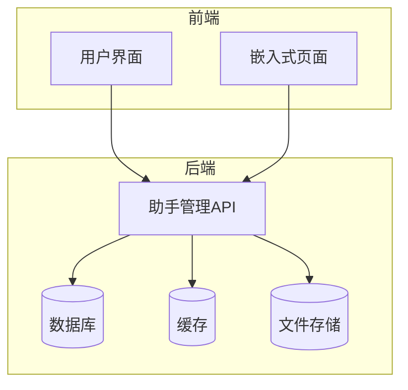
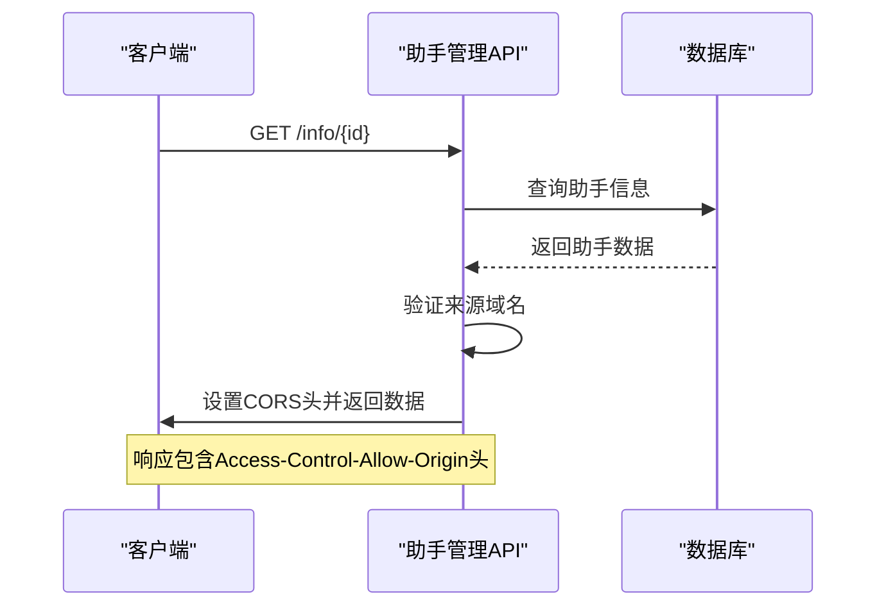
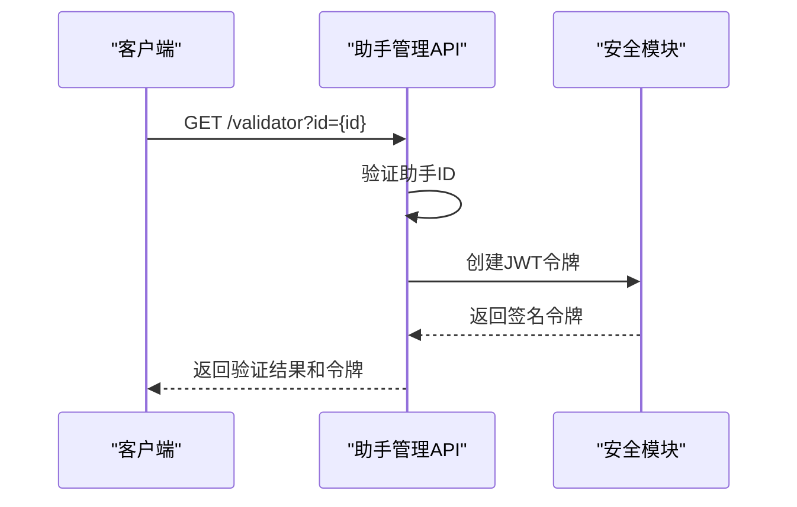
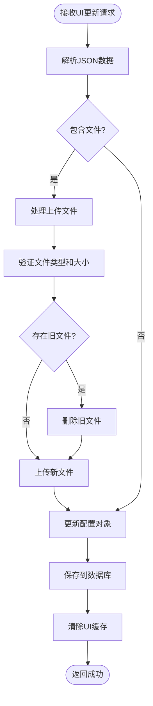
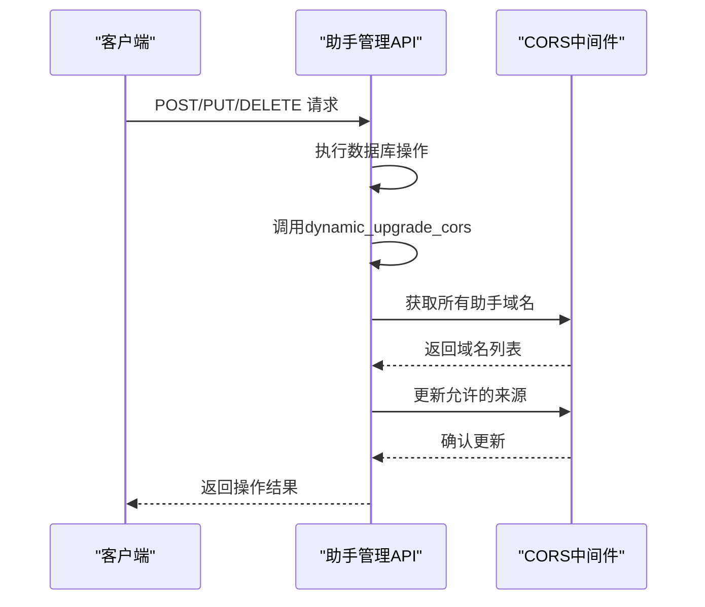
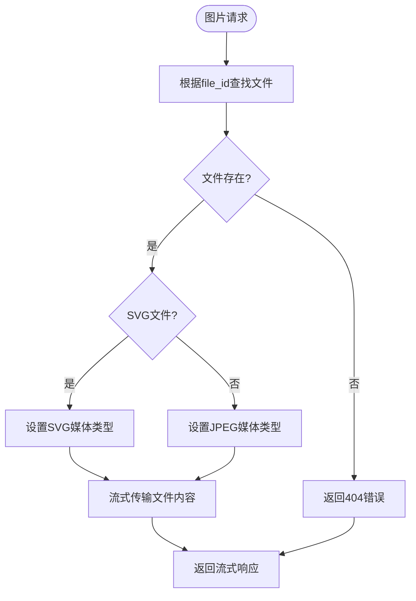
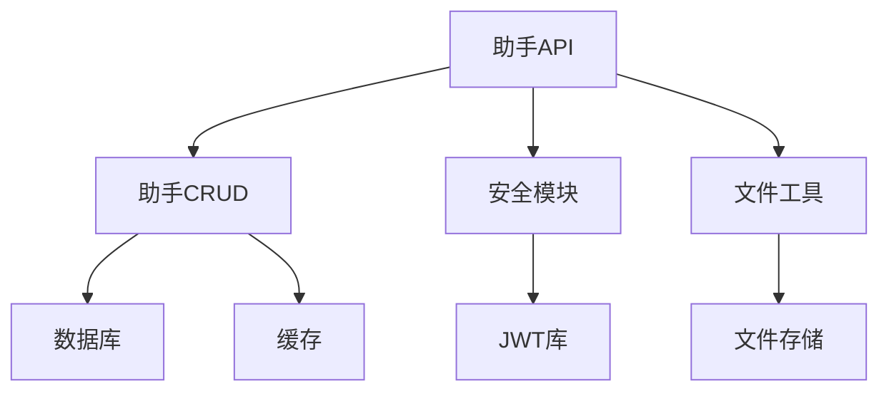

# 助手管理API

<cite>
**本文档中引用的文件**  
- [assistant.py](file://backend/apps/system/api/assistant.py)
- [assistant.py](file://backend/apps/system/crud/assistant.py)
- [assistant_manage.py](file://backend/apps/system/crud/assistant_manage.py)
- [security.py](file://backend/common/core/security.py)
- [file_utils.py](file://backend/common/utils/file_utils.py)
- [system_model.py](file://backend/apps/system/models/system_model.py)
- [system_schema.py](file://backend/apps/system/schemas/system_schema.py)
- [auth.py](file://backend/apps/system/schemas/auth.py)
</cite>

## 目录
1. [简介](#简介)
2. [核心组件](#核心组件)
3. [架构概述](#架构概述)
4. [详细组件分析](#详细组件分析)
5. [依赖分析](#依赖分析)
6. [性能考虑](#性能考虑)
7. [故障排除指南](#故障排除指南)
8. [结论](#结论)

## 简介
助手管理API提供了一套完整的嵌入式助手管理功能，包括配置管理、UI定制、验证机制和生命周期操作。该API支持通过CORS策略进行跨域资源共享控制，实现域名验证逻辑，并为嵌入式场景生成JWT访问令牌。系统还提供了文件上传处理机制，用于管理logo和浮动图标等UI资源，并通过动态CORS更新机制确保安全的跨域访问。

## 核心组件

助手管理API的核心功能围绕嵌入式助手的全生命周期管理展开，包括创建、更新、删除助手实例，以及配置UI元素、处理文件上传和生成安全令牌。API通过清晰的端点划分实现了关注点分离，每个端点负责特定的业务功能，同时保持了整体架构的一致性和可维护性。

**Section sources**
- [assistant.py](file://backend/apps/system/api/assistant.py#L1-L161)
- [system_model.py](file://backend/apps/system/models/system_model.py#L45-L56)
- [system_schema.py](file://backend/apps/system/schemas/system_schema.py#L88-L180)

## 架构概述

**Diagram sources**
- [assistant.py](file://backend/apps/system/api/assistant.py#L1-L161)
- [assistant_manage.py](file://backend/apps/system/crud/assistant_manage.py#L1-L38)

## 详细组件分析

### info端点分析

info端点负责处理嵌入式助手的CORS（跨域资源共享）策略和域名验证逻辑。当客户端请求助手信息时，服务器会根据存储的域名配置设置相应的Access-Control-Allow-Origin响应头，实现精确的跨域控制。

**Diagram sources**
- [assistant.py](file://backend/apps/system/api/assistant.py#L20-L35)
- [assistant.py](file://backend/apps/system/crud/assistant.py#L21-L23)

**Section sources**
- [assistant.py](file://backend/apps/system/api/assistant.py#L20-L35)
- [assistant.py](file://backend/apps/system/crud/assistant.py#L21-L23)

### validator端点分析

validator端点为嵌入式场景生成JWT访问令牌，实现安全的身份验证机制。该端点创建包含助手标识信息的访问令牌，用于后续API调用的身份验证。

**Diagram sources**
- [assistant.py](file://backend/apps/system/api/assistant.py#L37-L52)
- [security.py](file://backend/common/core/security.py#L14-L20)

**Section sources**
- [assistant.py](file://backend/apps/system/api/assistant.py#L37-L52)
- [security.py](file://backend/common/core/security.py#L14-L20)
- [system_schema.py](file://backend/apps/system/schemas/system_schema.py#L103-L123)

### ui端点分析

ui端点处理嵌入式助手的UI定制功能，包括文件上传、存储和旧文件清理。该端点支持logo和浮动图标的上传，并在更新时自动清理旧文件。

**Diagram sources**
- [assistant.py](file://backend/apps/system/api/assistant.py#L76-L108)
- [file_utils.py](file://backend/common/utils/file_utils.py#L6-L64)

**Section sources**
- [assistant.py](file://backend/apps/system/api/assistant.py#L76-L108)
- [file_utils.py](file://backend/common/utils/file_utils.py#L6-L64)
- [system_schema.py](file://backend/apps/system/schemas/system_schema.py#L168-L180)

### add、update和delete端点分析

这些端点通过dynamic_upgrade_cors函数动态更新CORS策略，确保在助手配置变更后，跨域访问策略能够及时同步更新。

**Diagram sources**
- [assistant.py](file://backend/apps/system/api/assistant.py#L114-L161)
- [assistant_manage.py](file://backend/apps/system/crud/assistant_manage.py#L11-L30)

**Section sources**
- [assistant.py](file://backend/apps/system/api/assistant.py#L114-L161)
- [assistant_manage.py](file://backend/apps/system/crud/assistant_manage.py#L11-L30)

### picture端点分析

picture端点实现文件服务功能，根据文件ID提供存储的图片资源，并使用clear_ui_cache装饰器管理缓存。

**Diagram sources**
- [assistant.py](file://backend/apps/system/api/assistant.py#L54-L74)
- [file_utils.py](file://backend/common/utils/file_utils.py#L10-L13)

**Section sources**
- [assistant.py](file://backend/apps/system/api/assistant.py#L54-L74)
- [file_utils.py](file://backend/common/utils/file_utils.py#L10-L13)

## 依赖分析

**Diagram sources**
- [assistant.py](file://backend/apps/system/api/assistant.py#L1-L161)
- [assistant.py](file://backend/apps/system/crud/assistant.py#L1-L222)
- [security.py](file://backend/common/core/security.py#L1-L43)
- [file_utils.py](file://backend/common/utils/file_utils.py#L1-L64)

**Section sources**
- [assistant.py](file://backend/apps/system/api/assistant.py#L1-L161)
- [assistant.py](file://backend/apps/system/crud/assistant.py#L1-L222)
- [security.py](file://backend/common/core/security.py#L1-L43)
- [file_utils.py](file://backend/common/utils/file_utils.py#L1-L64)

## 性能考虑
助手管理API在设计时考虑了性能优化，通过缓存机制减少数据库查询，使用流式响应处理文件传输，并在文件上传时进行大小和类型验证以防止资源滥用。CORS策略的动态更新机制避免了应用重启，提高了系统的响应速度和可用性。

## 故障排除指南

当遇到助手管理API相关问题时，可参考以下排查步骤：
1. 检查CORS错误：验证请求来源是否与配置的域名匹配
2. 文件上传失败：确认文件类型和大小是否符合要求
3. 令牌生成问题：检查JWT密钥配置和过期时间设置
4. 缓存不一致：验证缓存清除装饰器是否正确应用
5. 数据库连接：确保数据库服务正常运行且连接配置正确

**Section sources**
- [assistant.py](file://backend/apps/system/api/assistant.py#L20-L161)
- [assistant_manage.py](file://backend/apps/system/crud/assistant_manage.py#L1-L38)
- [security.py](file://backend/common/core/security.py#L14-L20)
- [file_utils.py](file://backend/common/utils/file_utils.py#L6-L64)

## 结论
助手管理API提供了一套完整且安全的嵌入式助手管理解决方案，通过清晰的端点设计和合理的架构分层，实现了配置管理、UI定制、身份验证和生命周期操作等核心功能。系统的CORS动态更新机制、JWT令牌生成和文件管理功能确保了跨域访问的安全性和用户体验的一致性。