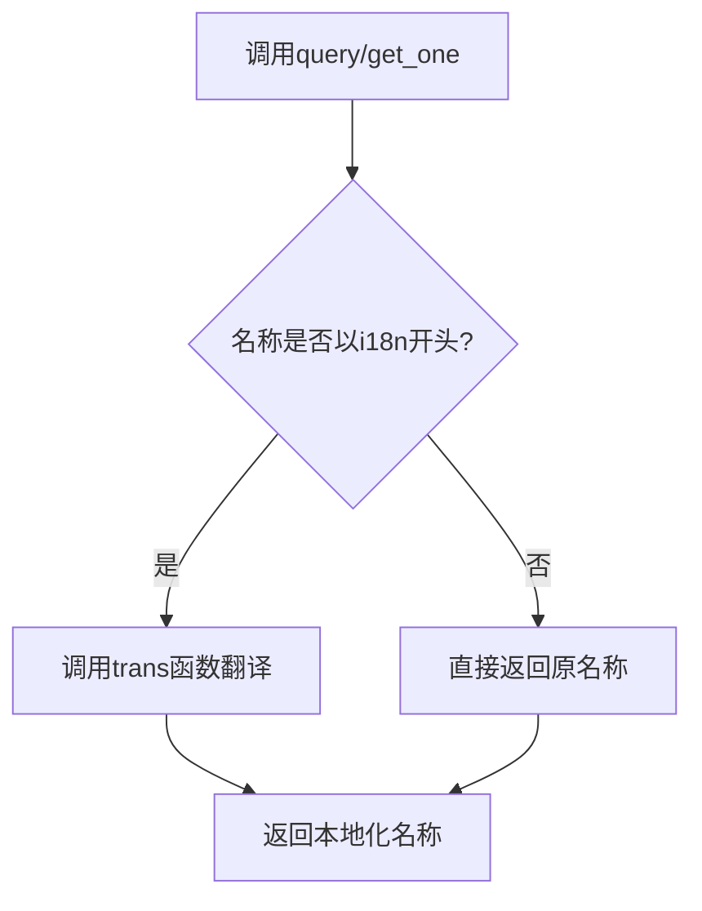
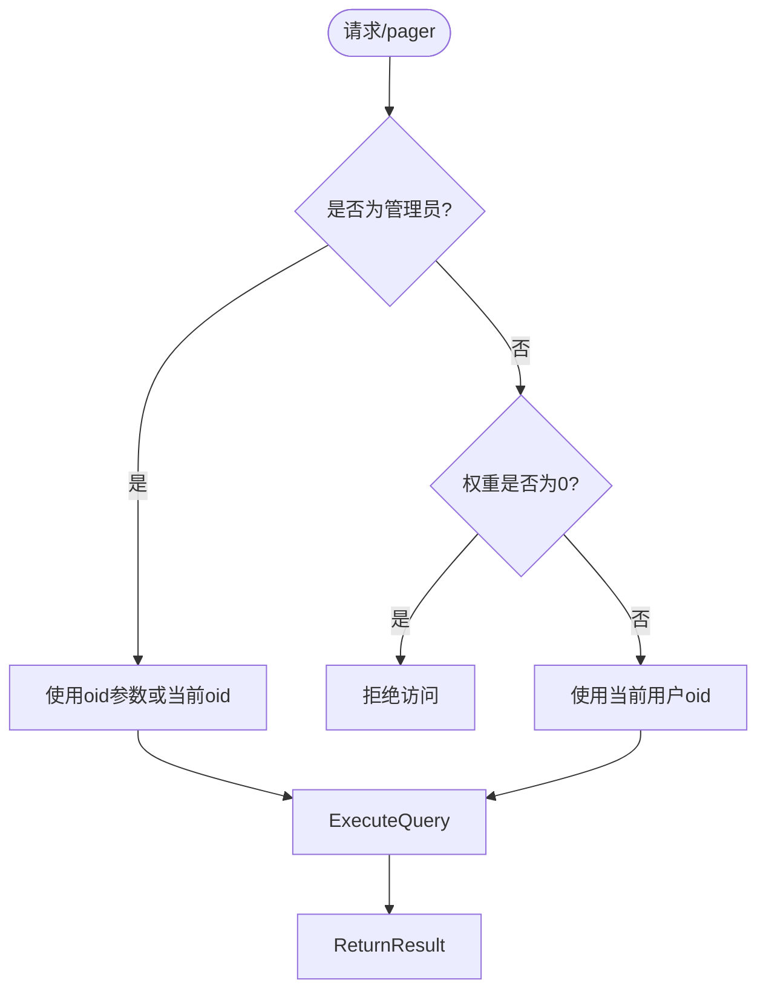
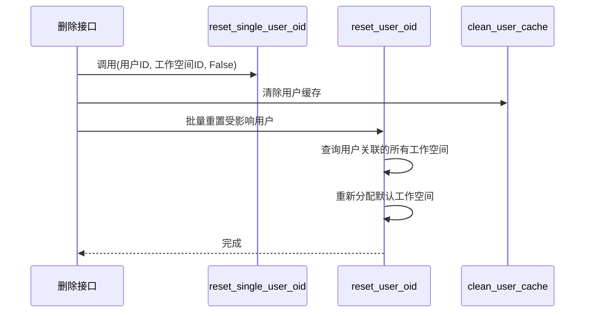
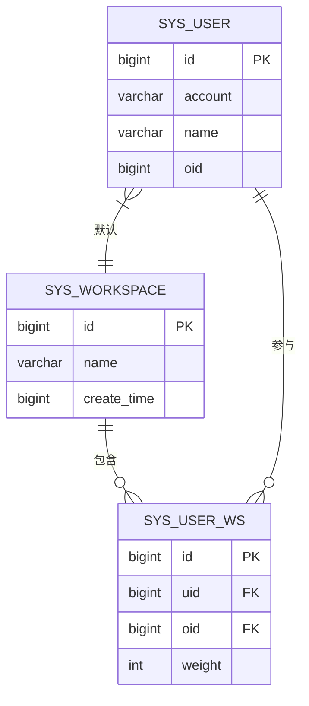

# 工作空间管理API

<cite>
**本文档中引用的文件**  
- [workspace.py](file://backend/apps/system/api/workspace.py)
- [workspace.py](file://backend/apps/system/crud/workspace.py)
- [system_model.py](file://backend/apps/system/models/system_model.py)
- [020_workspace_ddl.py](file://backend/alembic/versions/020_workspace_ddl.py)
- [021_user_ws_ddl.py](file://backend/alembic/versions/021_user_ws_ddl.py)
</cite>

## 目录
1. [简介](#简介)
2. [核心功能概述](#核心功能概述)
3. [工作空间增删改查接口](#工作空间增删改查接口)
4. [用户-工作空间关系管理](#用户-工作空间关系管理)
5. [国际化名称处理机制](#国际化名称处理机制)
6. [分页权限控制逻辑](#分页权限控制逻辑)
7. [未加入用户选择接口](#未加入用户选择接口)
8. [用户默认工作空间变更协同机制](#用户默认工作空间变更协同机制)
9. [工作空间隔离机制](#工作空间隔离机制)
10. [数据模型与表结构](#数据模型与表结构)

## 简介
本API提供完整的工作空间（Workspace）生命周期管理功能，包括创建、查询、修改和删除操作，同时支持对用户与工作空间之间关系的精细化管理。系统通过`sys_workspace`和`sys_user_ws`两张核心表实现多租户隔离架构，确保不同工作空间之间的数据安全与权限边界。

**Section sources**
- [workspace.py](file://backend/apps/system/api/workspace.py#L1-L225)

## 核心功能概述
工作空间管理API主要包含两大功能模块：工作空间资源管理与用户-工作空间关系管理。前者负责工作空间的元数据维护，后者实现用户在多个工作空间间的权限分配与角色控制。所有接口均基于FastAPI框架构建，并集成国际化支持与细粒度权限验证。

**Section sources**
- [workspace.py](file://backend/apps/system/api/workspace.py#L1-L225)

## 工作空间增删改查接口

### 查询所有工作空间
`GET /system/workspace` 接口返回所有工作空间列表。当工作空间名称以`i18n`前缀开头时，系统会自动调用翻译函数将其转换为当前用户语言环境下的本地化名称。

### 获取单个工作空间
`GET /system/workspace/{id}` 接口根据ID获取指定工作空间详情。与列表查询相同，若名称为国际化键，则进行实时翻译处理。

### 创建工作空间
`POST /system/workspace` 接口用于创建新的工作空间。仅管理员或具有创建权限的用户可调用。创建后自动记录时间戳。

### 修改工作空间
`PUT /system/workspace` 接口允许更新工作空间名称等基本信息。需提供完整编辑对象。

### 删除工作空间
`DELETE /system/workspace/{id}` 接口执行软删除操作。删除前会清理关联的用户缓存，并重置受影响用户的默认工作空间设置。

**Section sources**
- [workspace.py](file://backend/apps/system/api/workspace.py#L148-L225)

## 用户-工作空间关系管理

### 添加用户到工作空间
`POST /system/workspace/uws` 接口将指定用户列表加入目标工作空间。管理员可指定任意工作空间ID和权限权重；普通管理员仅能操作自己所属工作空间，且新成员权限默认为0。

### 修改用户权限
`PUT /system/workspace/uws` 接口用于调整用户在特定工作空间中的权限等级（weight）。每次修改后会触发用户缓存清理。

### 移除用户
`DELETE /system/workspace/uws` 接口从指定工作空间中移除用户。若被移除的是用户的默认工作空间，系统将尝试将其重置为其他可用工作空间或置零。

**Section sources**
- [workspace.py](file://backend/apps/system/api/workspace.py#L84-L147)

## 国际化名称处理机制
系统采用前缀识别机制处理多语言工作空间名称。当`query`和`get_one`接口返回结果时，若`WorkspaceModel.name`字段以`i18n`开头，则通过依赖注入的`trans`函数进行动态翻译。该机制确保前端展示始终符合用户语言偏好。

**Diagram sources**
- [workspace.py](file://backend/apps/system/api/workspace.py#L148-L168)

## 分页权限控制逻辑
`pager`端点实现差异化权限策略：

- **管理员用户**：可通过`oid`参数查询任意工作空间成员列表
- **普通管理员**：只能查看当前用户所在工作空间的成员信息，忽略传入的`oid`参数
- **权限验证**：非管理员且权重为0的用户无权访问此接口

该逻辑确保了组织间数据隔离的同时，赋予管理员足够的管理灵活性。

**Diagram sources**
- [workspace.py](file://backend/apps/system/api/workspace.py#L52-L83)

## 未加入用户选择接口
`option_pager`和`option_user`端点用于筛选尚未加入指定工作空间的用户：

- **option_pager**：分页查询可添加用户，仅管理员可用
- **option_user**：精确搜索单个可添加用户，管理员或普通管理员可用

两个接口均使用`EXISTS`子查询排除已在目标工作空间中的用户，并排除系统超级管理员（ID=1）。

**Section sources**
- [workspace.py](file://backend/apps/system/api/workspace.py#L20-L51)

## 用户默认工作空间变更协同机制
当用户从其默认工作空间被移除或该工作空间被删除时，系统通过以下组件协同工作：

1. `reset_single_user_oid`：重置单个用户的默认工作空间ID
2. `reset_user_oid`：批量处理用户默认工作空间迁移
3. `clean_user_cache`：清除用户缓存以确保配置即时生效

这种协同机制保证了用户始终具有有效的工作空间上下文，避免出现"孤立"用户状态。

**Diagram sources**
- [workspace.py](file://backend/apps/system/api/workspace.py#L115-L147)
- [workspace.py](file://backend/apps/system/crud/workspace.py#L1-L69)

## 工作空间隔离机制
系统通过`UserWsModel`关系表实现多对多的用户-工作空间映射。每个用户可属于多个工作空间，但仅有一个默认工作空间（由`UserModel.oid`字段表示）。所有数据访问均需通过工作空间上下文进行过滤，形成天然的数据隔离层。

**Section sources**
- [system_model.py](file://backend/apps/system/models/system_model.py#L35-L45)

## 数据模型与表结构

### 工作空间模型

**Diagram sources**
- [system_model.py](file://backend/apps/system/models/system_model.py#L30-L45)
- [020_workspace_ddl.py](file://backend/alembic/versions/020_workspace_ddl.py#L1-L20)
- [021_user_ws_ddl.py](file://backend/alembic/versions/021_user_ws_ddl.py#L1-L20)