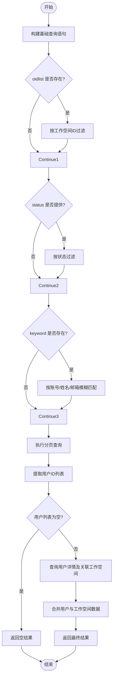
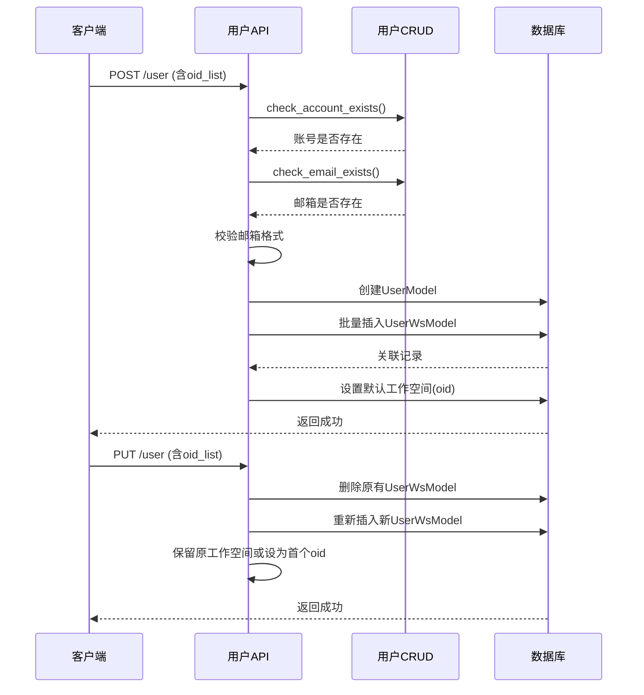
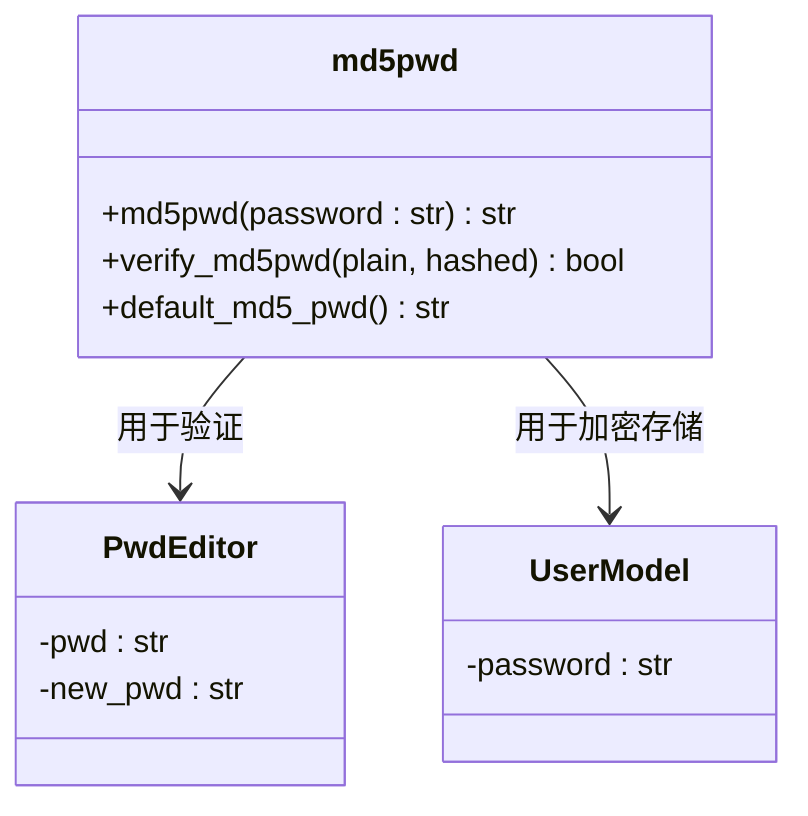
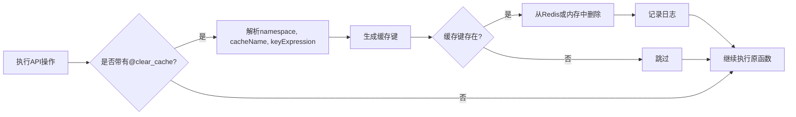

# 用户管理API

<cite>
**本文档中引用的文件**  
- [user.py](file://backend/apps/system/api/user.py)
- [user.py](file://backend/apps/system/crud/user.py)
- [security.py](file://backend/common/core/security.py)
- [locale.py](file://backend/common/utils/locale.py)
- [sqlbot_cache.py](file://backend/common/core/sqlbot_cache.py)
</cite>

## 目录
1. [简介](#简介)
2. [核心功能概述](#核心功能概述)
3. [分页查询（pager）](#分页查询pager)
4. [用户创建与更新](#用户创建与更新)
5. [密码管理](#密码管理)
6. [语言设置与缓存机制](#语言设置与缓存机制)
7. [权限控制说明](#权限控制说明)
8. [请求示例](#请求示例)
9. [结论](#结论)

## 简介

本API文档详细描述了用户管理模块的核心功能，涵盖用户信息查询、分页列表获取、用户创建、更新、删除、密码修改、状态变更及语言设置等操作。系统基于FastAPI构建，结合SQLModel实现数据持久化，并通过缓存机制提升性能。所有操作均需经过身份验证和权限校验。

**Section sources**  
- [user.py](file://backend/apps/system/api/user.py#L1-L236)

## 核心功能概述

用户管理API提供以下主要端点：

- `GET /user/info`：获取当前用户信息
- `GET /user/pager/{pageNum}/{pageSize}`：分页查询用户列表（支持多条件过滤）
- `GET /user/{id}`：根据ID查询用户详情
- `POST /user`：创建新用户
- `PUT /user`：更新用户信息
- `DELETE /user/{id}`：删除指定用户
- `PUT /user/pwd`：修改当前用户密码
- `PATCH /user/pwd/{id}`：管理员重置用户密码
- `PATCH /user/status`：管理员更改用户状态
- `PUT /user/language`：更改当前用户语言偏好
- `PUT /user/ws/{oid}`：切换当前用户工作空间

这些接口统一采用JSON格式进行请求和响应，遵循RESTful设计原则。

**Section sources**  
- [user.py](file://backend/apps/system/api/user.py#L1-L236)

## 分页查询（pager）

### 复杂查询逻辑分析

`/user/pager` 端点支持多条件组合过滤和结果合并机制，适用于后台用户管理场景。



**Diagram sources**  
- [user.py](file://backend/apps/system/api/user.py#L22-L81)

#### 多条件过滤机制

该接口支持以下参数进行动态过滤：

- `keyword`：对用户账号、姓名、邮箱进行模糊匹配（ILIKE）
- `status`：精确匹配用户状态（0:禁用, 1:启用）
- `oidlist`：限定用户所属的工作空间ID集合

查询使用外连接（LEFT JOIN）确保即使未分配工作空间的用户也能被检索。

#### 结果合并机制

由于用户与工作空间为多对多关系，系统采用两阶段查询策略：

1. 第一阶段：仅查询符合条件的用户ID，完成分页裁剪
2. 第二阶段：根据用户ID批量查询其完整信息及关联的工作空间OID列表

通过 `defaultdict(list)` 将同一用户的多个工作空间记录合并为 `oid_list` 字段，避免前端重复处理。

**Section sources**  
- [user.py](file://backend/apps/system/api/user.py#L22-L81)

## 用户创建与更新

### 用户与工作空间关联逻辑

在创建和更新用户时，系统会处理用户与工作空间的关联关系。



**Diagram sources**  
- [user.py](file://backend/apps/system/api/user.py#L120-L145)
- [user.py](file://backend/apps/system/api/user.py#L147-L177)

#### 创建逻辑（create）

- 自动校验账号唯一性、邮箱唯一性及格式合法性
- 默认语言设置为 `"zh-CN"`
- 若提供 `oid_list`，则创建对应数量的 `UserWsModel` 记录
- 用户主记录中的 `oid` 字段设为 `oid_list` 中的第一个值（作为默认工作空间）

#### 更新逻辑（update）

- 不允许更改用户账号
- 更新邮箱时需重新校验唯一性和格式
- 先删除该用户所有原有的工作空间关联记录
- 重新插入新的 `UserWsModel` 记录
- `oid` 字段更新为：若原工作空间仍在新列表中，则保留；否则设为新列表首个值

此机制确保用户工作空间关系的完整性和一致性。

**Section sources**  
- [user.py](file://backend/apps/system/api/user.py#L120-L177)

## 密码管理

### 密码加密与验证流程

系统采用MD5算法对用户密码进行哈希存储，相关逻辑封装在 `security.py` 模块中。



**Diagram sources**  
- [security.py](file://backend/common/core/security.py#L30-L43)
- [user.py](file://backend/apps/system/api/user.py#L200-L215)

#### pwdUpdate 端点

- 接收 `PwdEditor` 对象，包含原密码和新密码
- 校验新密码格式是否符合正则要求
- 使用 `verify_md5pwd()` 验证原密码正确性
- 成功后使用 `md5pwd()` 加密新密码并更新数据库

#### pwdReset 端点

- 仅管理员可调用
- 将指定用户的密码重置为系统默认密码的MD5值
- 使用 `default_md5_pwd()` 生成标准初始密码

所有密码操作完成后均会清除对应用户的缓存信息，确保下次登录使用最新凭证。

**Section sources**  
- [user.py](file://backend/apps/system/api/user.py#L200-L225)
- [security.py](file://backend/common/core/security.py#L30-L43)

## 语言设置与缓存机制

### 国际化语言设置（langChange）

`PUT /user/language` 端点允许用户更改其界面语言偏好。

- 支持 `"zh-CN"` 和 `"en"` 两种语言
- 输入非法语言代码将抛出异常
- 更新后立即持久化到数据库

### 缓存清除机制

系统使用装饰器 `@clear_cache` 在关键操作后自动清理相关缓存：



**Diagram sources**  
- [sqlbot_cache.py](file://backend/common/core/sqlbot_cache.py#L70-L108)

- `namespace=AUTH_INFO`, `cacheName=USER_INFO` 表示用户认证信息缓存
- `keyExpression="current_user.id"` 动态生成当前用户缓存键
- 支持单个键或键列表的批量清除
- 兼容内存和Redis两种缓存后端

此机制确保用户信息变更后能及时生效，避免脏数据问题。

**Section sources**  
- [user.py](file://backend/apps/system/api/user.py#L185-L198)
- [sqlbot_cache.py](file://backend/common/core/sqlbot_cache.py#L70-L108)

## 权限控制说明

系统通过以下方式实现细粒度权限控制：

- 所有接口依赖 `CurrentUser` 依赖项完成JWT身份验证
- `isAdmin` 字段判断是否为超级管理员（id=1且account='admin'）
- 敏感操作如密码重置、状态变更仅允许管理员执行
- 工作空间切换需验证目标空间是否属于该用户权限范围
- 使用 `Trans` 对象实现国际化错误消息返回

错误响应统一抛出 `HTTPException` 或自定义异常，携带本地化提示信息。

**Section sources**  
- [user.py](file://backend/apps/system/api/user.py#L217-L235)
- [crud/user.py](file://backend/apps/system/crud/user.py#L30-L35)

## 请求示例

### 分页查询用户
```http
GET /user/pager/1/10?keyword=张&status=1&oidlist=1,2
Authorization: Bearer <token>
```

### 创建用户
```json
POST /user
{
  "account": "testuser",
  "name": "测试用户",
  "email": "test@example.com",
  "oid_list": [1, 2]
}
```

### 修改密码
```json
PUT /user/pwd
{
  "pwd": "old_password",
  "new_pwd": "new_secure_password"
}
```

### 切换语言
```http
PUT /user/language?language=en
```

**Section sources**  
- [user.py](file://backend/apps/system/api/user.py#L1-L236)

## 结论

用户管理API设计合理，功能完整，具备良好的安全性与可维护性。通过分页优化、缓存机制和权限校验，保障了系统的高性能与数据安全。建议前端在调用敏感接口时增加二次确认，并对错误信息做友好展示。