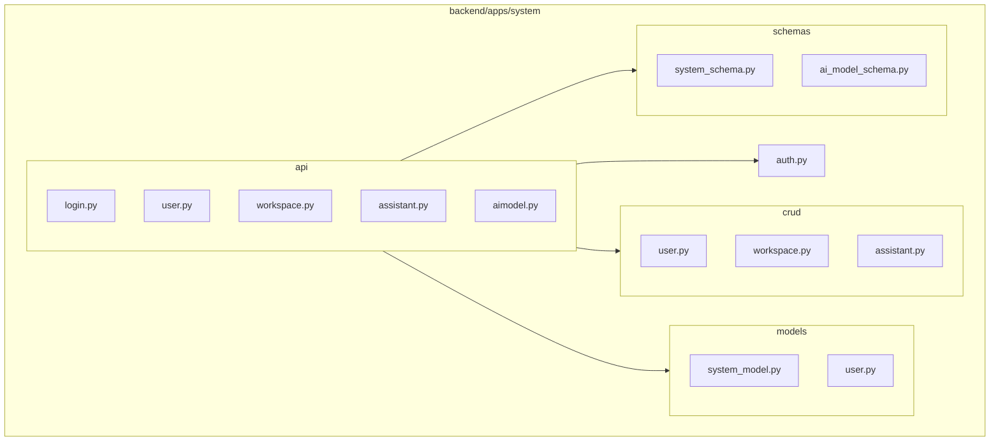
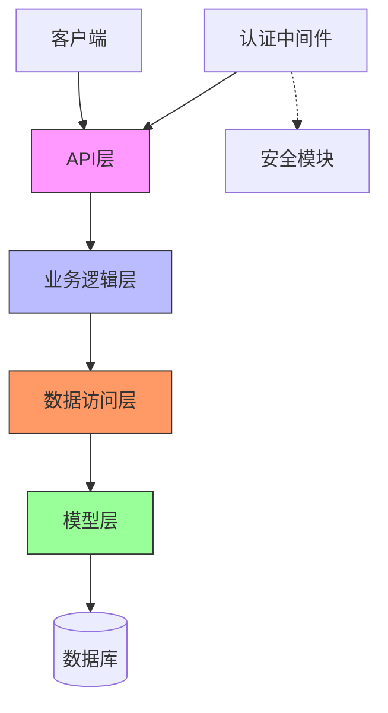
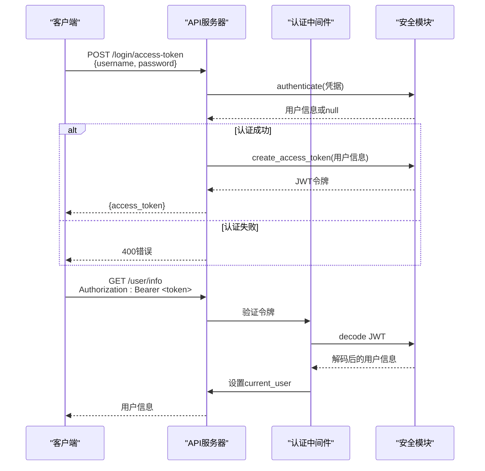
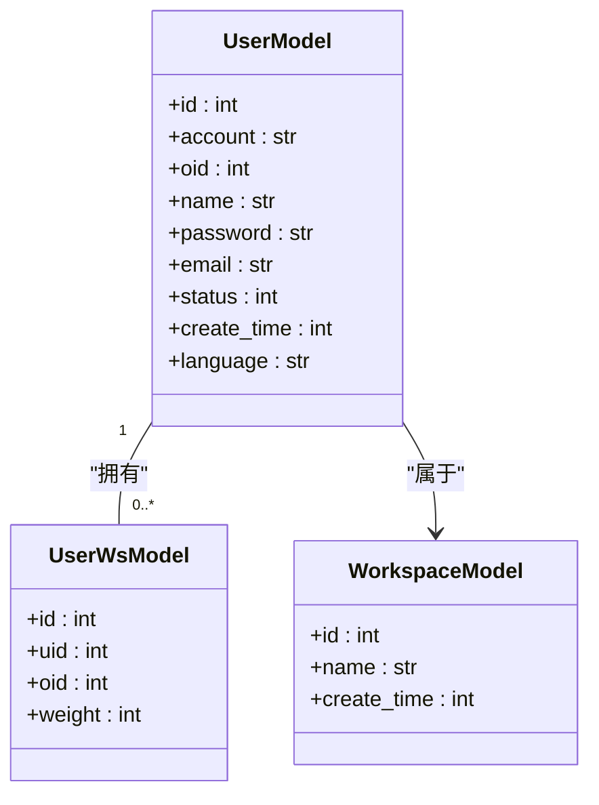
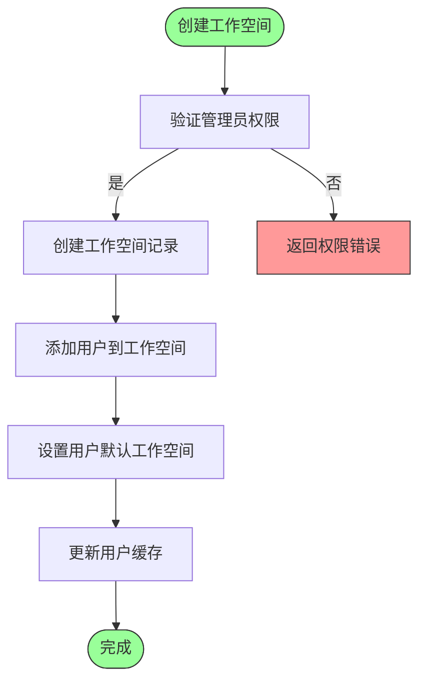
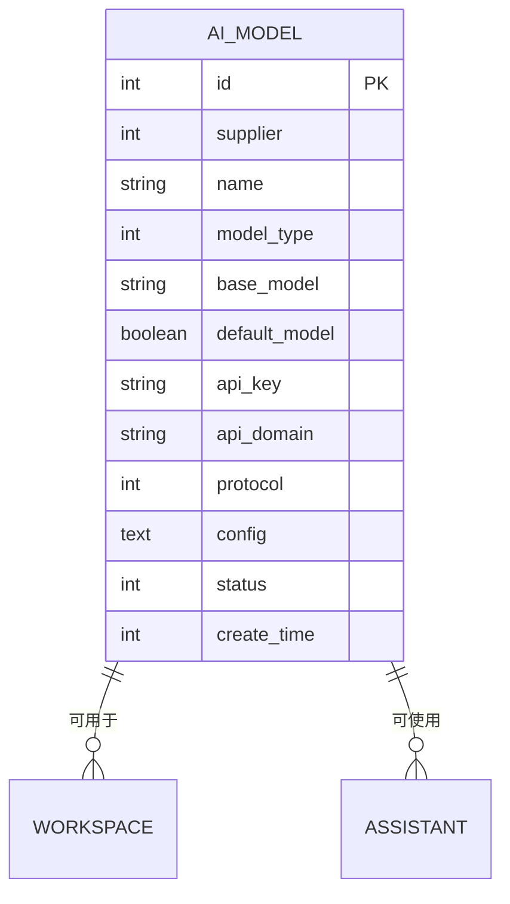
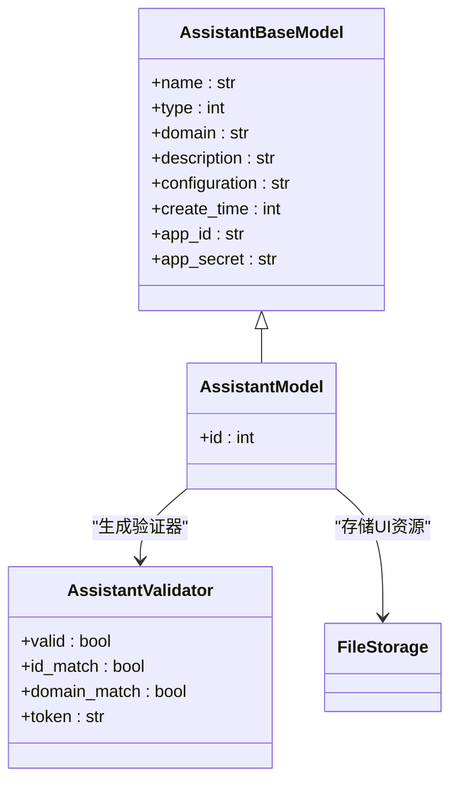
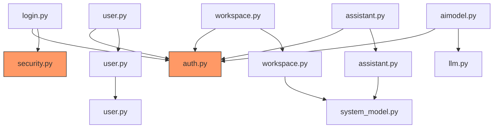

# 系统管理API

<cite>
**本文档引用的文件**
- [login.py](file://backend/apps/system/api/login.py)
- [user.py](file://backend/apps/system/api/user.py)
- [workspace.py](file://backend/apps/system/api/workspace.py)
- [assistant.py](file://backend/apps/system/api/assistant.py)
- [aimodel.py](file://backend/apps/system/api/aimodel.py)
- [auth.py](file://backend/apps/system/middleware/auth.py)
- [security.py](file://backend/common/core/security.py)
- [system_model.py](file://backend/apps/system/models/system_model.py)
- [user.py](file://backend/apps/system/models/user.py)
</cite>

## 目录
1. [简介](#简介)
2. [项目结构](#项目结构)
3. [核心组件](#核心组件)
4. [架构概述](#架构概述)
5. [详细组件分析](#详细组件分析)
6. [依赖分析](#依赖分析)
7. [性能考虑](#性能考虑)
8. [故障排除指南](#故障排除指南)
9. [结论](#结论)

## 简介
本文档详细描述了系统管理API，涵盖用户认证、用户管理、工作空间、AI模型和助手等子系统。重点阐述了/login端点的JWT认证机制和令牌刷新流程，解释了用户增删改查和权限分配的实现逻辑，阐述了工作空间的隔离机制和资源管理，说明了AI模型配置的动态加载和切换机制，并详细描述了助手（assistant）的创建和管理接口。同时提供了各端点的请求示例和响应模式，并说明了中间件（auth.py）如何统一处理认证和权限校验。

## 项目结构
系统管理API位于`backend/apps/system`目录下，主要包含api、crud、models、schemas和middleware五个子目录。api目录包含各个功能模块的路由定义，crud目录包含数据访问逻辑，models目录定义了数据库模型，schemas目录定义了数据传输对象，middleware目录包含认证中间件。系统通过`api.py`文件将各个模块的路由聚合到主应用中。

**图示来源**
- [login.py](file://backend/apps/system/api/login.py)
- [user.py](file://backend/apps/system/api/user.py)
- [workspace.py](file://backend/apps/system/api/workspace.py)
- [assistant.py](file://backend/apps/system/api/assistant.py)
- [aimodel.py](file://backend/apps/system/api/aimodel.py)
- [auth.py](file://backend/apps/system/middleware/auth.py)

**本节来源**
- [backend](file://backend)

## 核心组件
系统管理API的核心组件包括用户认证、用户管理、工作空间管理、AI模型管理和助手管理。用户认证通过JWT实现，用户管理提供完整的CRUD操作，工作空间实现多租户隔离，AI模型支持动态配置和切换，助手管理提供嵌入式AI应用的创建和管理功能。所有API端点都通过统一的认证中间件进行权限校验。

**本节来源**
- [login.py](file://backend/apps/system/api/login.py#L15-L34)
- [user.py](file://backend/apps/system/api/user.py#L22-L81)
- [workspace.py](file://backend/apps/system/api/workspace.py#L77-L113)
- [assistant.py](file://backend/apps/system/api/assistant.py#L115-L117)
- [aimodel.py](file://backend/apps/system/api/aimodel.py#L71-L86)

## 架构概述
系统管理API采用分层架构，包括API层、业务逻辑层、数据访问层和模型层。API层定义路由和处理HTTP请求，业务逻辑在crud模块中实现，数据访问通过SQLModel ORM进行，模型层定义了数据库表结构。认证和权限校验由独立的中间件统一处理，确保所有API端点的安全性。

**图示来源**
- [login.py](file://backend/apps/system/api/login.py)
- [user.py](file://backend/apps/system/api/user.py)
- [workspace.py](file://backend/apps/system/api/workspace.py)
- [assistant.py](file://backend/apps/system/api/assistant.py)
- [aimodel.py](file://backend/apps/system/api/aimodel.py)
- [auth.py](file://backend/apps/system/middleware/auth.py)

## 详细组件分析

### 用户认证分析
用户认证通过/login/access-token端点实现，采用JWT令牌机制。客户端提交用户名和密码后，系统验证凭据并生成带有过期时间的JWT令牌。令牌包含用户信息和过期时间，客户端在后续请求中通过Authorization头传递令牌。

**图示来源**
- [login.py](file://backend/apps/system/api/login.py#L15-L34)
- [auth.py](file://backend/apps/system/middleware/auth.py#L97-L126)
- [security.py](file://backend/common/core/security.py#L14-L20)

**本节来源**
- [login.py](file://backend/apps/system/api/login.py#L15-L34)
- [auth.py](file://backend/apps/system/middleware/auth.py#L97-L126)
- [security.py](file://backend/common/core/security.py#L14-L20)

### 用户管理分析
用户管理提供完整的CRUD操作和权限分配功能。系统通过UserModel和UserWsModel两个表实现用户与工作空间的多对多关系。管理员可以创建、更新、删除用户，并为用户分配一个或多个工作空间及相应权重。

**图示来源**
- [user.py](file://backend/apps/system/models/user.py#L10-L18)
- [system_model.py](file://backend/apps/system/models/system_model.py#L26-L34)
- [user.py](file://backend/apps/system/models/system_model.py#L45-L53)

**本节来源**
- [user.py](file://backend/apps/system/api/user.py#L22-L81)
- [user.py](file://backend/apps/system/models/user.py#L10-L18)
- [system_model.py](file://backend/apps/system/models/system_model.py#L26-L34)

### 工作空间分析
工作空间实现多租户隔离机制，通过WorkspaceModel表存储工作空间信息，通过UserWsModel表管理用户与工作空间的关联。每个用户可以属于多个工作空间，但有且只有一个默认工作空间（oid）。

**图示来源**
- [workspace.py](file://backend/apps/system/api/workspace.py#L180-L184)
- [workspace.py](file://backend/apps/system/api/workspace.py#L187-L194)
- [workspace.py](file://backend/apps/system/api/workspace.py#L155-L169)

**本节来源**
- [workspace.py](file://backend/apps/system/api/workspace.py#L180-L194)
- [workspace.py](file://backend/apps/system/api/workspace.py#L155-L169)
- [system_model.py](file://backend/apps/system/models/system_model.py#L26-L34)

### AI模型分析
AI模型管理支持动态加载和切换机制。系统通过AiModelDetail表存储AI模型配置，包括供应商、模型类型、基础模型、协议等信息。支持设置默认模型，并提供模型验证功能。

**图示来源**
- [aimodel.py](file://backend/apps/system/models/system_model.py#L7-L21)
- [aimodel.py](file://backend/apps/system/models/system_model.py#L14-L21)

**本节来源**
- [aimodel.py](file://backend/apps/system/api/aimodel.py#L71-L86)
- [system_model.py](file://backend/apps/system/models/system_model.py#L7-L21)

### 助手管理分析
助手管理提供嵌入式AI应用的创建和管理接口。通过AssistantModel表存储助手信息，包括名称、类型、域名、描述和配置。支持上传和管理助手的UI资源，如logo和浮动图标。

**图示来源**
- [assistant.py](file://backend/apps/system/models/system_model.py#L45-L53)
- [assistant.py](file://backend/apps/system/schemas/system_schema.py#97-L147)

**本节来源**
- [assistant.py](file://backend/apps/system/api/assistant.py#L115-L117)
- [system_model.py](file://backend/apps/system/models/system_model.py#L45-L53)
- [system_schema.py](file://backend/apps/system/schemas/system_schema.py#97-L147)

## 依赖分析
系统管理API的各个组件之间存在明确的依赖关系。API层依赖于crud层实现业务逻辑，crud层依赖于models层定义数据结构，所有层都依赖于认证中间件进行权限校验。外部依赖包括SQLModel ORM、JWT库和Passlib密码哈希库。

**图示来源**
- [login.py](file://backend/apps/system/api/login.py)
- [user.py](file://backend/apps/system/api/user.py)
- [workspace.py](file://backend/apps/system/api/workspace.py)
- [assistant.py](file://backend/apps/system/api/assistant.py)
- [aimodel.py](file://backend/apps/system/api/aimodel.py)
- [auth.py](file://backend/apps/system/middleware/auth.py)
- [security.py](file://backend/common/core/security.py)

**本节来源**
- [login.py](file://backend/apps/system/api/login.py)
- [user.py](file://backend/apps/system/api/user.py)
- [workspace.py](file://backend/apps/system/api/workspace.py)
- [assistant.py](file://backend/apps/system/api/assistant.py)
- [aimodel.py](file://backend/apps/system/api/aimodel.py)
- [auth.py](file://backend/apps/system/middleware/auth.py)

## 性能考虑
系统在性能方面进行了多项优化。使用SQLModel ORM的查询优化功能减少数据库访问次数，通过缓存机制减少重复计算，采用异步处理提高并发性能。认证中间件对令牌验证进行了优化，避免了不必要的数据库查询。

## 故障排除指南
常见问题包括认证失败、权限不足和数据库连接错误。认证失败通常是由于用户名密码错误或令牌过期；权限不足是由于用户没有相应操作权限；数据库连接错误可能是配置问题或数据库服务不可用。建议检查日志文件获取详细错误信息。

**本节来源**
- [auth.py](file://backend/apps/system/middleware/auth.py#L97-L126)
- [login.py](file://backend/apps/system/api/login.py#L15-L34)
- [security.py](file://backend/common/core/security.py#L14-L20)

## 结论
系统管理API提供了一套完整的用户、工作空间、AI模型和助手管理功能。通过JWT认证和统一的权限校验中间件，确保了系统的安全性。模块化的设计使得各个功能组件易于维护和扩展。建议在生产环境中配置适当的监控和日志记录，以确保系统的稳定运行。