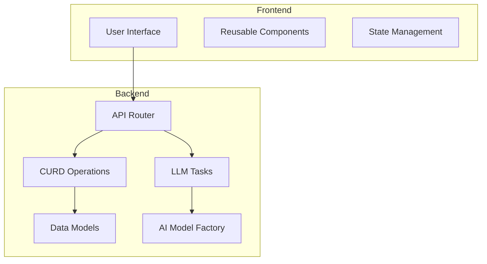
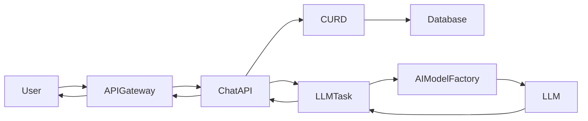
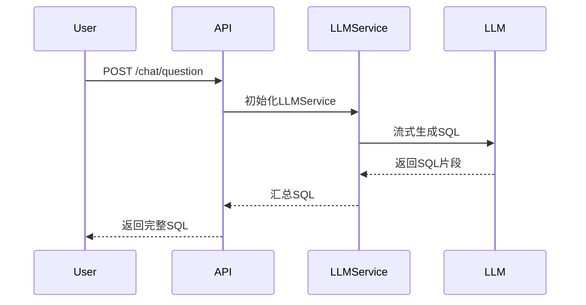
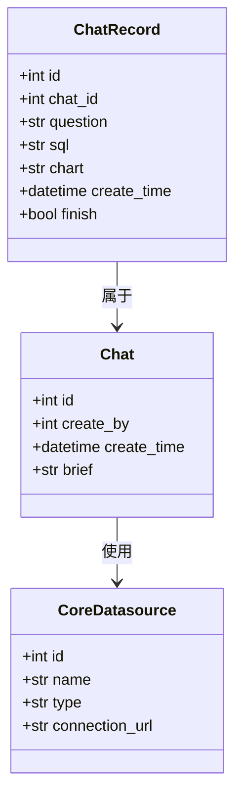
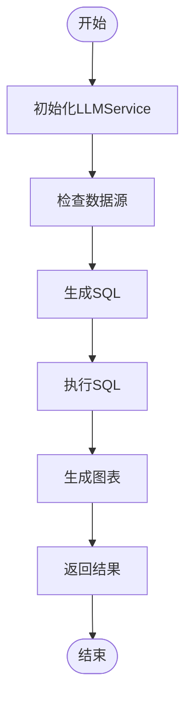
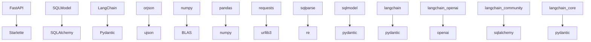

# 聊天API

<cite>
**本文档中引用的文件**  
- [chat.py](file://backend/apps/chat/api/chat.py)
- [chat_model.py](file://backend/apps/chat/models/chat_model.py)
- [llm.py](file://backend/apps/chat/task/llm.py)
- [llm.py](file://backend/apps/ai_model/openai/llm.py)
- [chat.py](file://backend/apps/chat/curd/chat.py)
</cite>

## 目录
1. [介绍](#介绍)
2. [项目结构](#项目结构)
3. [核心组件](#核心组件)
4. [架构概述](#架构概述)
5. [详细组件分析](#详细组件分析)
6. [依赖分析](#依赖分析)
7. [性能考虑](#性能考虑)
8. [故障排除指南](#故障排除指南)
9. [结论](#结论)

## 介绍
本项目是一个基于Python的SQLBot系统，旨在通过自然语言处理技术实现用户与数据库之间的交互。系统允许用户以自然语言提问，并自动将其转换为SQL查询，执行后返回结果。该系统支持流式响应和非流式响应两种模式，能够处理复杂的自然语言到SQL的转换任务。此外，系统还具备推荐问题生成、数据分析、预测等功能，适用于多种应用场景。

## 项目结构
项目采用分层架构设计，主要包括后端（backend）、前端（frontend）和安装脚本（installer）等部分。后端使用FastAPI框架构建RESTful API，结合SQLModel进行数据库操作，利用LangChain库集成大语言模型（LLM），实现自然语言到SQL的转换。前端使用Vue.js框架开发，提供用户友好的界面。系统通过Docker容器化部署，确保环境一致性。

**Diagram sources**
- [chat.py](file://backend/apps/chat/api/chat.py)
- [chat_model.py](file://backend/apps/chat/models/chat_model.py)
- [chat.py](file://backend/apps/chat/curd/chat.py)
- [llm.py](file://backend/apps/chat/task/llm.py)
- [llm.py](file://backend/apps/ai_model/openai/llm.py)

**Section sources**
- [chat.py](file://backend/apps/chat/api/chat.py)
- [chat_model.py](file://backend/apps/chat/models/chat_model.py)
- [chat.py](file://backend/apps/chat/curd/chat.py)
- [llm.py](file://backend/apps/chat/task/llm.py)
- [llm.py](file://backend/apps/ai_model/openai/llm.py)

## 核心组件
系统的核心组件包括聊天API、数据模型、任务调度器和AI模型工厂。聊天API负责接收用户请求并返回响应；数据模型定义了数据库表结构；任务调度器管理LLM任务的执行；AI模型工厂负责创建和配置LLM实例。

**Section sources**
- [chat.py](file://backend/apps/chat/api/chat.py)
- [chat_model.py](file://backend/apps/chat/models/chat_model.py)
- [llm.py](file://backend/apps/chat/task/llm.py)
- [llm.py](file://backend/apps/ai_model/openai/llm.py)

## 架构概述
系统采用微服务架构，各组件之间通过API进行通信。用户请求首先到达API网关，然后被路由到相应的处理模块。处理模块调用CURD操作访问数据库，或通过任务调度器触发LLM任务。LLM任务由AI模型工厂创建的LLM实例执行，结果返回给处理模块，最终通过API网关返回给用户。

**Diagram sources**
- [chat.py](file://backend/apps/chat/api/chat.py)
- [chat.py](file://backend/apps/chat/curd/chat.py)
- [llm.py](file://backend/apps/chat/task/llm.py)
- [llm.py](file://backend/apps/ai_model/openai/llm.py)

## 详细组件分析
### 聊天API分析
聊天API是系统的入口点，负责处理用户的聊天请求。它提供了多个端点，如`/chat/question`用于提交问题，`/chat/list`用于获取聊天列表等。API使用FastAPI框架构建，支持异步处理，提高了系统的响应速度。

#### 对于API/服务组件：

**Diagram sources**
- [chat.py](file://backend/apps/chat/api/chat.py)
- [llm.py](file://backend/apps/chat/task/llm.py)

### 数据模型分析
数据模型定义了系统中使用的数据库表结构，包括聊天记录、数据源、用户信息等。这些模型使用SQLModel库定义，支持ORM操作，简化了数据库访问。

#### 对于对象导向组件：

**Diagram sources**
- [chat_model.py](file://backend/apps/chat/models/chat_model.py)

### 任务调度器分析
任务调度器负责管理LLM任务的执行，包括SQL生成、图表生成、数据分析等。它通过`LLMService`类实现，支持异步任务处理，提高了系统的并发能力。

#### 对于复杂逻辑组件：

**Diagram sources**
- [llm.py](file://backend/apps/chat/task/llm.py)

**Section sources**
- [chat.py](file://backend/apps/chat/api/chat.py)
- [llm.py](file://backend/apps/chat/task/llm.py)
- [chat_model.py](file://backend/apps/chat/models/chat_model.py)

## 依赖分析
系统依赖于多个外部库，如FastAPI、SQLModel、LangChain等。这些库提供了Web服务、数据库操作和自然语言处理功能。通过`pyproject.toml`文件管理依赖关系，确保项目的一致性和可维护性。

**Diagram sources**
- [pyproject.toml](file://pyproject.toml)

**Section sources**
- [pyproject.toml](file://pyproject.toml)

## 性能考虑
为了提高系统性能，采用了多种优化策略。例如，使用异步处理提高响应速度，通过缓存减少重复计算，利用数据库索引加速查询。此外，还对LLM任务进行了并行化处理，进一步提升了系统的吞吐量。

## 故障排除指南
当遇到问题时，可以参考以下步骤进行排查：
1. 检查API日志，查看是否有错误信息。
2. 确认数据库连接是否正常。
3. 验证LLM模型配置是否正确。
4. 检查网络连接，确保所有服务都能正常通信。

**Section sources**
- [chat.py](file://backend/apps/chat/api/chat.py)
- [llm.py](file://backend/apps/chat/task/llm.py)

## 结论
SQLBot系统通过集成先进的自然语言处理技术和数据库操作，实现了高效、易用的数据库查询功能。其模块化设计和丰富的功能集使其适用于各种应用场景。未来可以通过增加更多AI模型支持、优化性能等方式进一步提升系统能力。