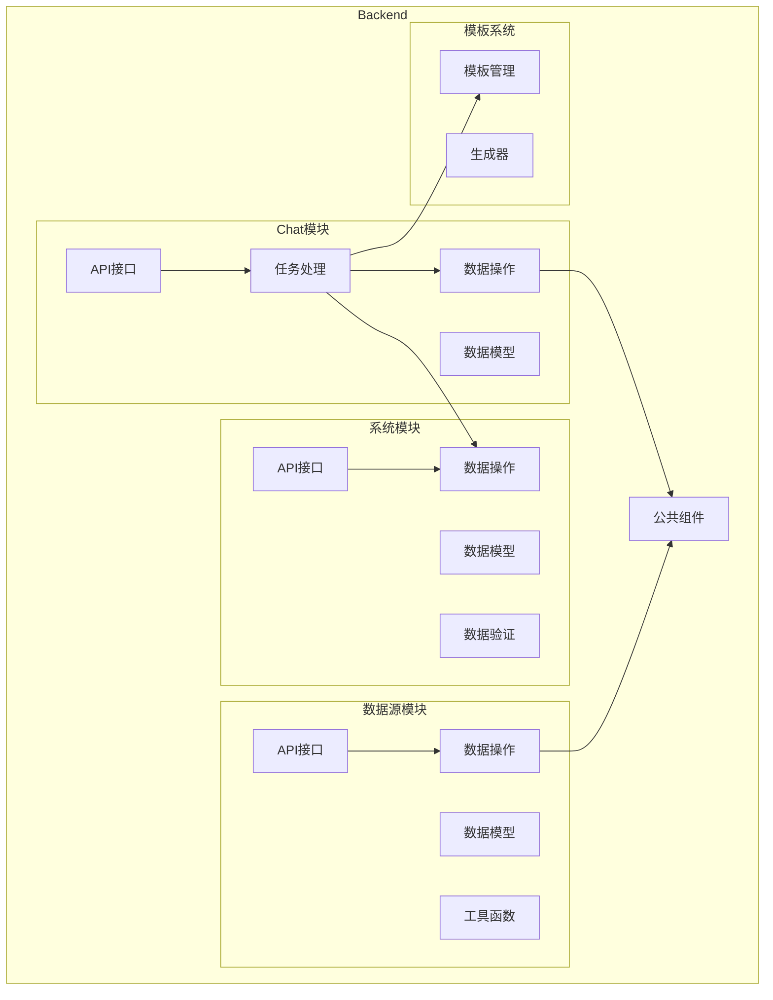
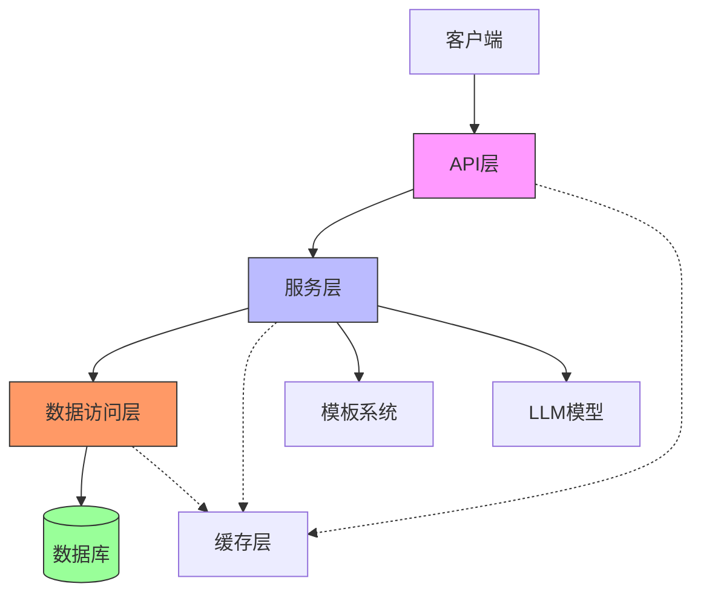
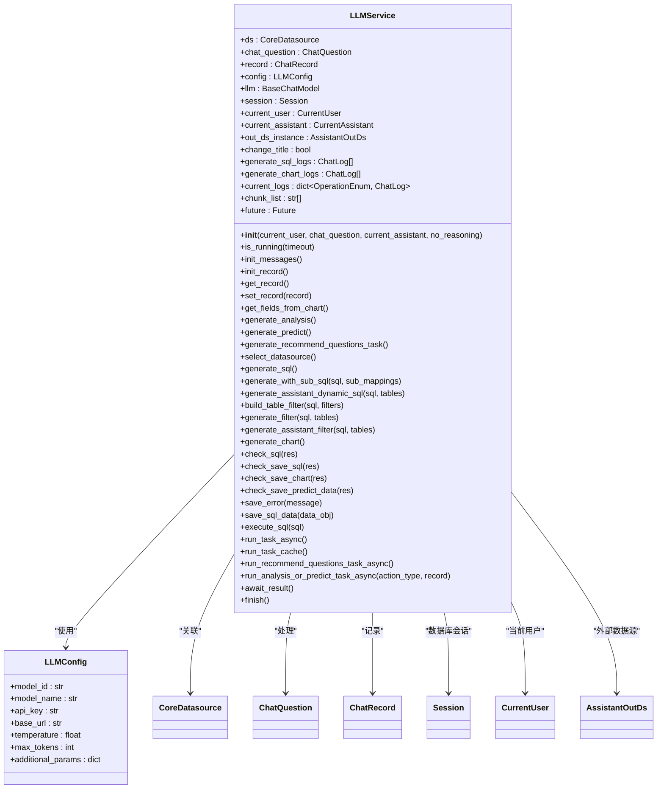
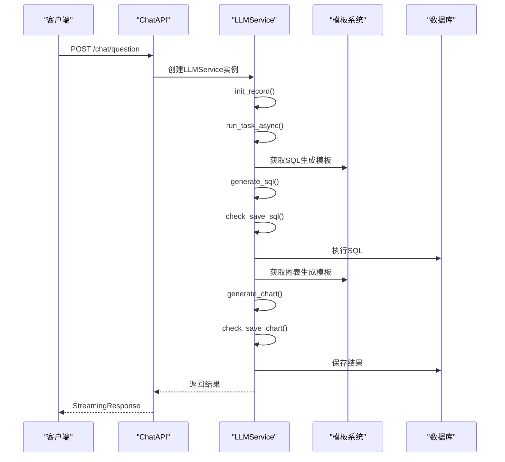
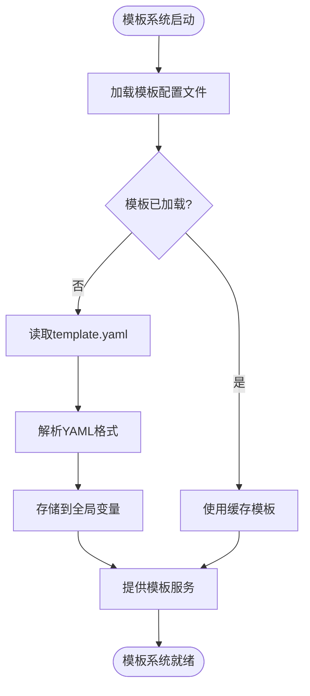
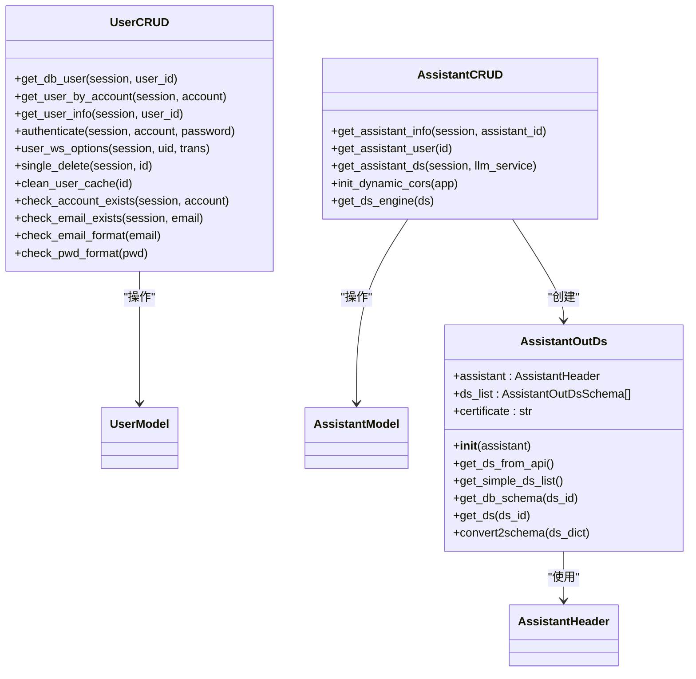
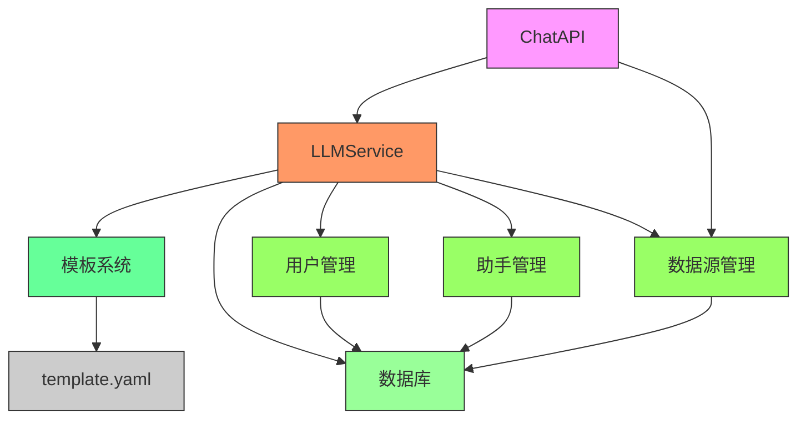

# 业务逻辑层

<cite>
**本文档引用的文件**
- [llm.py](file://backend/apps/chat/task/llm.py)
- [template.py](file://backend/apps/template/template.py)
- [user.py](file://backend/apps/system/crud/user.py)
- [assistant.py](file://backend/apps/system/crud/assistant.py)
- [chat.py](file://backend/apps/chat/api/chat.py)
- [datasource.py](file://backend/apps/datasource/crud/datasource.py)
</cite>

## 目录
1. [介绍](#介绍)
2. [项目结构](#项目结构)
3. [核心组件](#核心组件)
4. [架构概述](#架构概述)
5. [详细组件分析](#详细组件分析)
6. [依赖分析](#依赖分析)
7. [性能考虑](#性能考虑)
8. [故障排除指南](#故障排除指南)
9. [结论](#结论)
10. [附录](#附录)（如有必要）

## 介绍
本文档旨在全面解释SQLBot系统中业务逻辑层的实现模式。尽管系统没有显式分层，但业务逻辑处理模式隐含在调用链中。文档重点分析了聊天模块中LLM任务处理的异步执行机制，模板系统在SQL生成、图表生成、预测分析等场景的应用，以及用户管理、助手管理等系统功能的业务规则实现。同时，阐述了业务逻辑与API层、数据访问层的交互模式，并提供了业务异常处理的最佳实践和性能优化建议。

## 项目结构
SQLBot系统的业务逻辑主要分布在backend/apps目录下的多个子模块中。核心业务逻辑集中在chat、system、datasource等模块中，通过清晰的职责划分实现了高内聚低耦合的设计。模板系统独立存在于template目录中，为各种生成任务提供统一的模板支持。系统采用模块化设计，每个功能模块都有独立的api、crud和models子目录，形成了清晰的三层架构模式。

**图表来源**
- [llm.py](file://backend/apps/chat/task/llm.py)
- [template.py](file://backend/apps/template/template.py)
- [user.py](file://backend/apps/system/crud/user.py)
- [assistant.py](file://backend/apps/system/crud/assistant.py)
- [chat.py](file://backend/apps/chat/api/chat.py)
- [datasource.py](file://backend/apps/datasource/crud/datasource.py)

**章节来源**
- [llm.py](file://backend/apps/chat/task/llm.py)
- [template.py](file://backend/apps/template/template.py)

## 核心组件
业务逻辑层的核心组件包括LLM服务、模板引擎、用户管理、助手管理和数据源管理。LLM服务（LLMService）是聊天功能的核心，负责协调各种生成任务的执行。模板引擎为SQL生成、图表生成、预测分析等任务提供统一的模板支持。用户管理和助手管理组件实现了系统用户和嵌入式助手的完整生命周期管理。数据源管理组件则负责数据源的配置、权限控制和连接管理。

**章节来源**
- [llm.py](file://backend/apps/chat/task/llm.py#L1-L100)
- [template.py](file://backend/apps/template/template.py#L1-L20)
- [user.py](file://backend/apps/system/crud/user.py#L1-L50)
- [assistant.py](file://backend/apps/system/crud/assistant.py#L1-L50)

## 架构概述
系统采用基于调用链的隐式分层架构，业务逻辑分布在API层、服务层和数据访问层之间。API层负责接收和验证请求，服务层协调业务逻辑的执行，数据访问层负责与数据库交互。这种架构模式通过清晰的职责划分和松散耦合的设计，实现了系统的可维护性和可扩展性。

**图表来源**
- [llm.py](file://backend/apps/chat/task/llm.py)
- [template.py](file://backend/apps/template/template.py)
- [chat.py](file://backend/apps/chat/api/chat.py)

## 详细组件分析

### LLM任务处理分析
LLM任务处理是聊天功能的核心，通过LLMService类实现。该服务采用异步执行机制，支持多种生成任务的并行处理。

#### 对象导向组件

**图表来源**
- [llm.py](file://backend/apps/chat/task/llm.py#L1-L50)

#### API/服务组件

**图表来源**
- [llm.py](file://backend/apps/chat/task/llm.py)
- [chat.py](file://backend/apps/chat/api/chat.py)

**章节来源**
- [llm.py](file://backend/apps/chat/task/llm.py#L1-L1000)
- [chat.py](file://backend/apps/chat/api/chat.py#L1-L200)

### 模板系统分析
模板系统为各种生成任务提供统一的模板支持，包括SQL生成、图表生成、预测分析等。

#### 复杂逻辑组件

**图表来源**
- [template.py](file://backend/apps/template/template.py#L1-L20)

**章节来源**
- [template.py](file://backend/apps/template/template.py#L1-L20)

### 用户管理分析
用户管理组件实现了系统用户和嵌入式助手的完整生命周期管理。

#### 对象导向组件

**图表来源**
- [user.py](file://backend/apps/system/crud/user.py#L1-L100)
- [assistant.py](file://backend/apps/system/crud/assistant.py#L1-L100)

**章节来源**
- [user.py](file://backend/apps/system/crud/user.py#L1-L100)
- [assistant.py](file://backend/apps/system/crud/assistant.py#L1-L100)

## 依赖分析
系统各组件之间通过清晰的接口进行交互，形成了松散耦合的依赖关系。LLM服务依赖于模板系统、用户管理、助手管理和数据源管理组件，但通过接口隔离实现了低耦合。数据访问层通过SQLModel ORM与数据库交互，提供了统一的数据访问接口。

**图表来源**
- [llm.py](file://backend/apps/chat/task/llm.py)
- [template.py](file://backend/apps/template/template.py)
- [user.py](file://backend/apps/system/crud/user.py)
- [assistant.py](file://backend/apps/system/crud/assistant.py)
- [datasource.py](file://backend/apps/datasource/crud/datasource.py)
- [chat.py](file://backend/apps/chat/api/chat.py)

**章节来源**
- [llm.py](file://backend/apps/chat/task/llm.py#L1-L100)
- [template.py](file://backend/apps/template/template.py#L1-L20)
- [user.py](file://backend/apps/system/crud/user.py#L1-L50)
- [assistant.py](file://backend/apps/system/crud/assistant.py#L1-L50)
- [datasource.py](file://backend/apps/datasource/crud/datasource.py#L1-L50)
- [chat.py](file://backend/apps/chat/api/chat.py#L1-L50)

## 性能考虑
系统在性能方面采用了多项优化策略。首先，通过ThreadPoolExecutor实现了LLM任务的异步并发处理，提高了系统吞吐量。其次，利用缓存机制减少了重复的数据库查询和外部API调用。此外，SQL查询结果采用分页和限制返回行数的策略，避免了大数据量查询对系统性能的影响。最后，模板系统采用全局单例模式，避免了重复加载模板文件的开销。

## 故障排除指南
当系统出现异常时，可以按照以下步骤进行排查：
1. 检查API请求参数是否正确
2. 查看数据库连接是否正常
3. 验证LLM模型配置是否正确
4. 检查模板文件是否存在且格式正确
5. 查看系统日志获取详细错误信息

**章节来源**
- [llm.py](file://backend/apps/chat/task/llm.py#L1-L100)
- [template.py](file://backend/apps/template/template.py#L1-L20)
- [user.py](file://backend/apps/system/crud/user.py#L1-L50)
- [assistant.py](file://backend/apps/system/crud/assistant.py#L1-L50)

## 结论
SQLBot系统的业务逻辑层通过隐式分层和清晰的职责划分，实现了高效、可维护的系统架构。LLM任务处理的异步执行机制确保了系统的响应性能，模板系统为各种生成任务提供了统一的支持。用户管理、助手管理和数据源管理组件实现了完整的业务功能。通过合理的依赖管理和性能优化，系统具备了良好的可扩展性和稳定性。

## 附录
本文档引用的所有文件路径：
- backend/apps/chat/task/llm.py
- backend/apps/template/template.py
- backend/apps/system/crud/user.py
- backend/apps/system/crud/assistant.py
- backend/apps/chat/api/chat.py
- backend/apps/datasource/crud/datasource.py