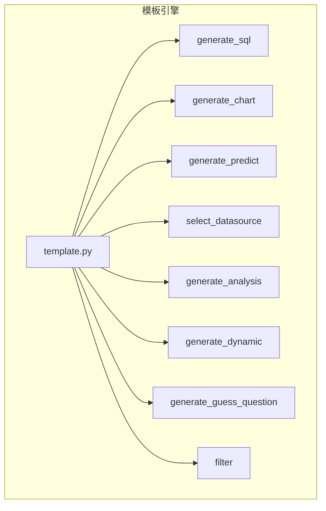
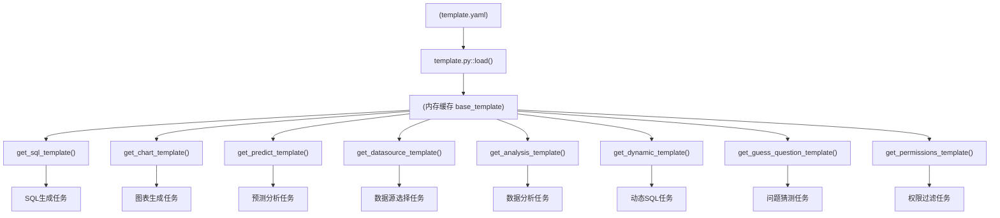
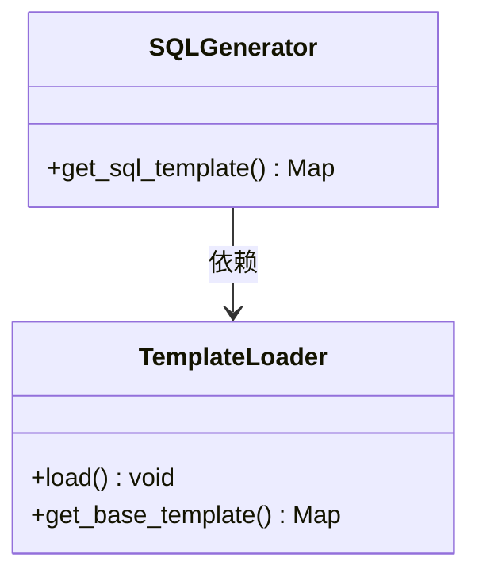
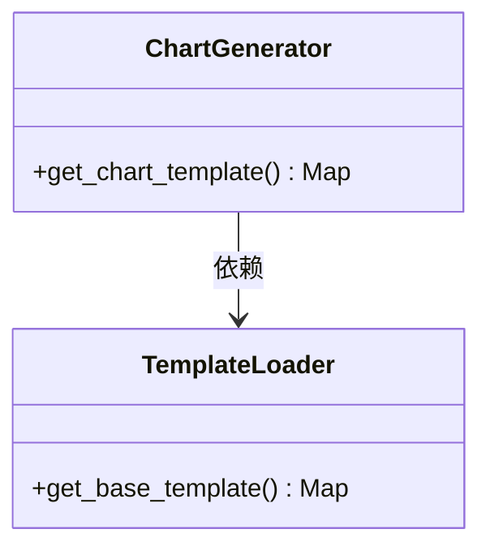
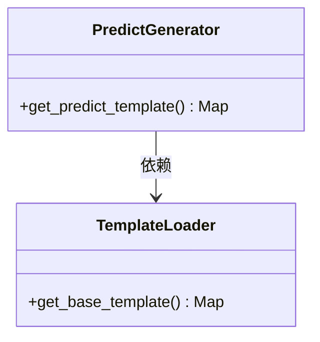
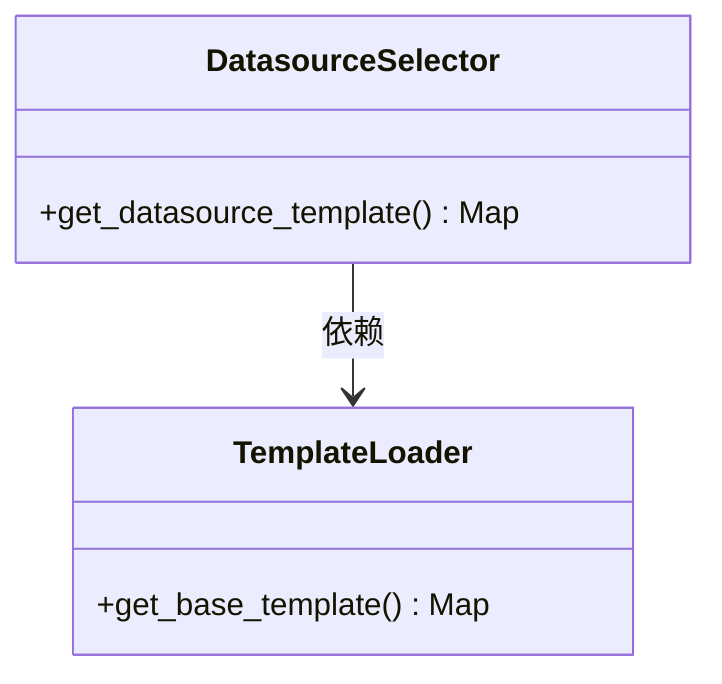
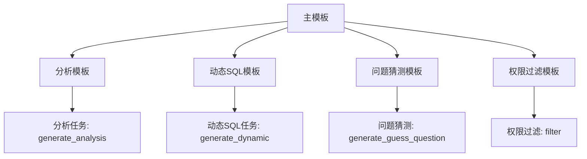
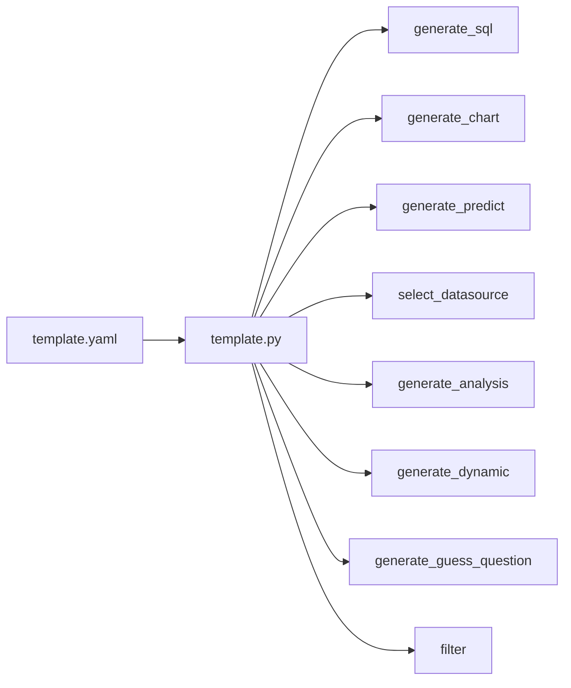

# 模板引擎

<cite>
**本文档引用的文件**  
- [template.py](file://backend/apps/template/template.py)
- [generate_sql/generator.py](file://backend/apps/template/generate_sql/generator.py)
- [generate_chart/generator.py](file://backend/apps/template/generate_chart/generator.py)
- [generate_predict/generator.py](file://backend/apps/template/generate_predict/generator.py)
- [select_datasource/generator.py](file://backend/apps/template/select_datasource/generator.py)
- [generate_analysis/generator.py](file://backend/apps/template/generate_analysis/generator.py)
- [generate_dynamic/generator.py](file://backend/apps/template/generate_dynamic/generator.py)
- [generate_guess_question/generator.py](file://backend/apps/template/generate_guess_question/generator.py)
- [filter/generator.py](file://backend/apps/template/filter/generator.py)
- [template.yaml](file://backend/template.yaml)
</cite>

## 目录
1. [简介](#简介)
2. [项目结构](#项目结构)
3. [核心组件](#核心组件)
4. [架构概述](#架构概述)
5. [详细组件分析](#详细组件分析)
6. [依赖分析](#依赖分析)
7. [性能考虑](#性能考虑)
8. [故障排除指南](#故障排除指南)
9. [结论](#结论)

## 简介
本技术文档全面解析 SQLBot 项目中的模板引擎机制，重点分析 `template.py` 作为核心调度器的工作原理。文档详细阐述了 SQL 生成、图表生成、预测分析、数据源选择等子模块的实现逻辑，涵盖模板变量注入、动态代码生成与执行流程。同时说明了不同场景下的模板选择策略与优先级机制，并提供创建自定义模板类型的示例。此外，还解释了模板引擎如何与聊天模块和数据源模块集成，以及内容安全性的保障措施。最后，提供性能调优建议，包括模板缓存策略与并发处理能力。

## 项目结构
模板引擎位于 `backend/apps/template/` 目录下，采用模块化设计，每个功能子模块独立封装在单独的子目录中。主调度器 `template.py` 负责加载全局模板配置并提供访问接口，各子模块通过调用该接口获取对应模板内容。

**图示来源**  
- [template.py](file://backend/apps/template/template.py)
- 各子模块 generator.py 文件

**本节来源**  
- [template.py](file://backend/apps/template/template.py)

## 核心组件
`template.py` 是模板引擎的核心调度模块，负责从 `template.yaml` 文件中加载所有模板内容，并提供全局访问接口。其主要功能包括初始化模板缓存、按需返回特定类型模板。其他所有生成器模块均依赖此模块获取基础模板结构。

**本节来源**  
- [template.py](file://backend/apps/template/template.py#L1-L15)

## 架构概述
模板引擎采用集中式配置 + 分布式调用的架构模式。`template.yaml` 作为唯一配置源，定义了所有任务类型的提示模板（Prompt Template），包括 SQL 生成、图表生成、预测分析、数据源选择等。`template.py` 模块在运行时加载该配置文件并驻留内存，各子模块通过专用函数接口按需提取对应模板片段。

**图示来源**  
- [template.py](file://backend/apps/template/template.py#L1-L15)
- [template.yaml](file://backend/template.yaml)

## 详细组件分析
### SQL 生成模块分析
该模块负责根据用户问题和数据库结构生成符合规范的 SQL 查询语句。它使用 `get_sql_template()` 函数从主模板中提取 SQL 生成模板，并注入语言、数据库引擎、表结构等上下文变量。

**图示来源**  
- [generate_sql/generator.py](file://backend/apps/template/generate_sql/generator.py#L1-L6)
- [template.py](file://backend/apps/template/template.py#L1-L15)

### 图表生成模块分析
该模块根据 SQL 查询结果和用户问题生成可视化图表配置。通过 `get_chart_template()` 获取图表生成模板，支持多种图表类型（柱状图、折线图、饼图等），并严格遵循 JSON 输出格式。

**图示来源**  
- [generate_chart/generator.py](file://backend/apps/template/generate_chart/generator.py#L1-L6)
- [template.py](file://backend/apps/template/template.py#L1-L15)

### 预测分析模块分析
该模块用于对时间序列数据进行趋势预测。通过 `get_predict_template()` 获取预测模板，接收字段信息和历史数据，输出未来趋势数据（至少两个周期），格式与输入保持一致。

**图示来源**  
- [generate_predict/generator.py](file://backend/apps/template/generate_predict/generator.py#L1-L6)
- [template.py](file://backend/apps/template/template.py#L1-L15)

### 数据源选择模块分析
该模块根据用户问题从多个可用数据源中选择最匹配的一个。通过 `get_datasource_template()` 获取选择逻辑模板，输入数据源列表和问题，输出匹配的数据源 ID。

**图示来源**  
- [select_datasource/generator.py](file://backend/apps/template/select_datasource/generator.py#L1-L6)
- [template.py](file://backend/apps/template/template.py#L1-L15)

### 分析与动态模块分析
该模块包含多个辅助功能：
- **分析模块**：对查询结果进行语义化分析
- **动态SQL模块**：将表名替换为子查询
- **问题猜测模块**：基于上下文推测用户可能的后续问题
- **过滤模块**：为 SQL 添加行级权限过滤条件

**图示来源**  
- [generate_analysis/generator.py](file://backend/apps/template/generate_analysis/generator.py#L1-L6)
- [generate_dynamic/generator.py](file://backend/apps/template/generate_dynamic/generator.py#L1-L6)
- [generate_guess_question/generator.py](file://backend/apps/template/generate_guess_question/generator.py#L1-L6)
- [filter/generator.py](file://backend/apps/template/filter/generator.py#L1-L6)
- [template.py](file://backend/apps/template/template.py#L1-L15)

## 依赖分析
模板引擎各组件之间存在清晰的依赖关系：所有子模块均依赖 `template.py` 提供的模板加载服务，而 `template.py` 本身依赖外部 `template.yaml` 配置文件。整个系统无循环依赖，结构清晰。

**图示来源**  
- [template.py](file://backend/apps/template/template.py#L1-L15)
- [template.yaml](file://backend/template.yaml)

**本节来源**  
- [template.py](file://backend/apps/template/template.py#L1-L15)

## 性能考虑
虽然当前实现未显式使用缓存机制，但 `base_template` 变量在首次加载后驻留内存，避免了重复读取文件的开销。建议在高并发场景下引入更高级的缓存策略（如 Redis 缓存模板内容）以进一步提升性能。此外，所有模板提取操作均为内存读取，响应速度快，适合高频调用。

## 故障排除指南
常见问题及解决方案：
- **模板加载失败**：检查 `template.yaml` 文件路径是否正确，确保文件存在且可读。
- **JSON 解析错误**：验证 `template.yaml` 中的模板内容是否包含非法字符或格式错误。
- **模板字段缺失**：确认请求的模板类型（如 `sql`, `chart`）在配置文件中正确定义。
- **语言变量未替换**：确保调用时正确传入 `{lang}` 参数。

**本节来源**  
- [template.py](file://backend/apps/template/template.py#L5-L10)
- [template.yaml](file://backend/template.yaml)

## 结论
模板引擎通过集中式配置与模块化设计实现了高度可维护性和扩展性。`template.py` 作为核心调度器，有效解耦了模板管理与具体业务逻辑。各子模块职责分明，易于新增功能类型。未来可通过引入缓存机制和异步加载进一步优化性能，满足大规模部署需求。