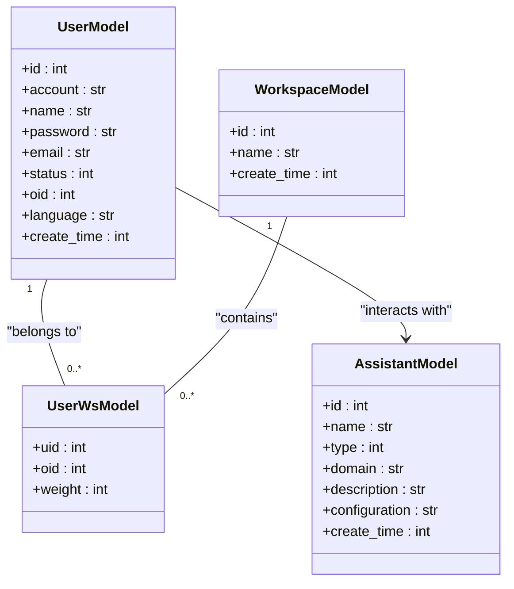
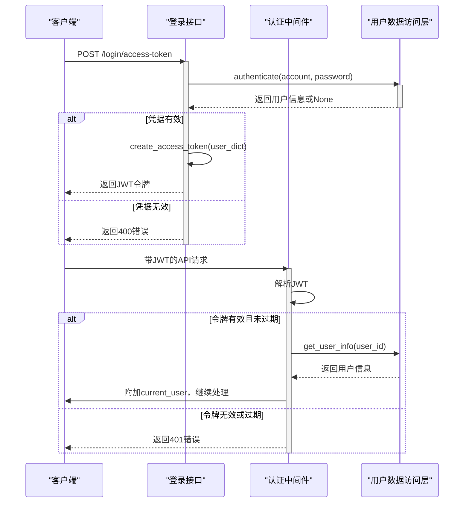
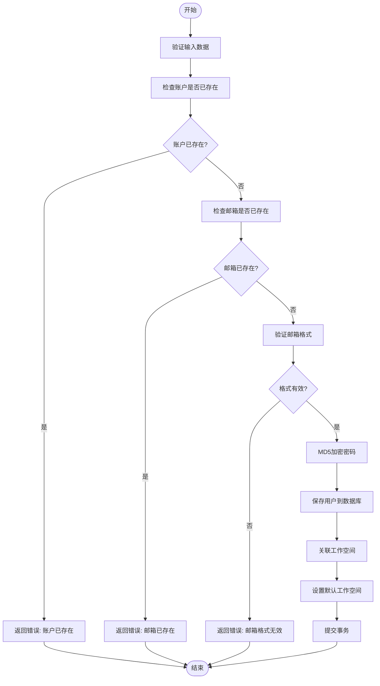
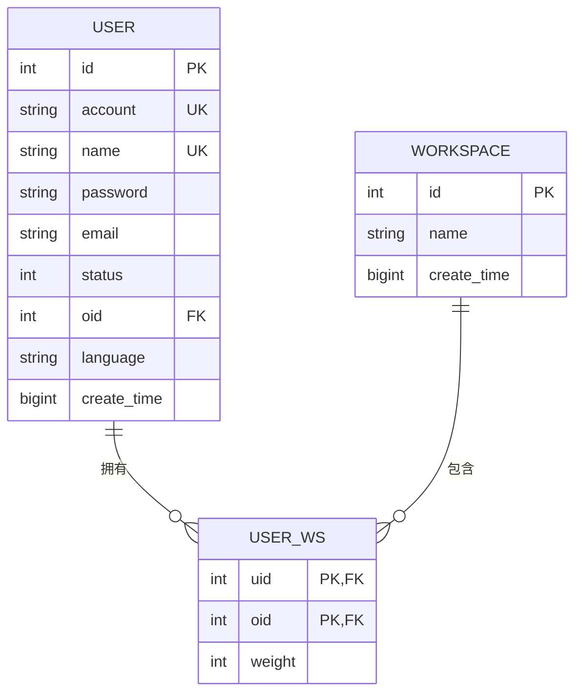
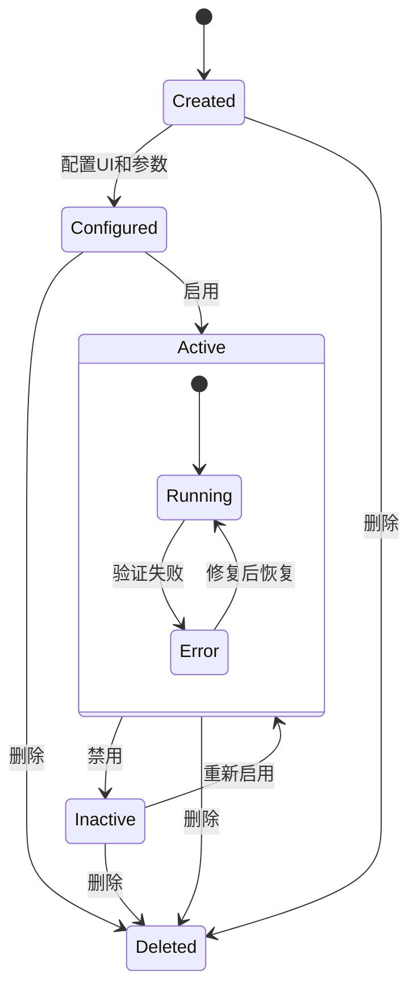

# 系统管理

<cite>
**本文档引用的文件**
- [user.py](file://backend/apps/system/api/user.py)
- [workspace.py](file://backend/apps/system/api/workspace.py)
- [assistant.py](file://backend/apps/system/api/assistant.py)
- [login.py](file://backend/apps/system/api/login.py)
- [auth.py](file://backend/apps/system/middleware/auth.py)
- [user.py](file://backend/apps/system/crud/user.py)
- [workspace.py](file://backend/apps/system/crud/workspace.py)
- [assistant.py](file://backend/apps/system/crud/assistant.py)
- [user.py](file://backend/apps/system/models/user.py)
- [system_model.py](file://backend/apps/system/models/system_model.py)
</cite>

## 目录
1. [简介](#简介)
2. [核心实体与业务逻辑](#核心实体与业务逻辑)
3. [用户认证流程分析](#用户认证流程分析)
4. [用户CRUD操作与业务规则](#用户crud操作与业务规则)
5. [工作空间组织与资源隔离](#工作空间组织与资源隔离)
6. [助手生命周期管理](#助手生命周期管理)
7. [权限控制实现细节](#权限控制实现细节)
8. [异常处理指南](#异常处理指南)
9. [结论](#结论)

## 简介
本文档全面阐述了SQLBot系统中用户、助手、工作空间三大核心实体的业务逻辑实现。深入分析了基于JWT的用户认证流程、权限验证中间件工作机制、用户CRUD操作的业务规则（如密码加密存储、状态管理）、工作空间的组织结构和资源隔离策略，以及助手的生命周期管理。同时结合代码示例展示了基于OID的访问控制和多租户支持等权限控制实现细节，并提供了并发修改冲突、权限不足等常见异常的解决方案。

## 核心实体与业务逻辑

本文档重点分析系统管理模块中的三大核心实体：用户（User）、工作空间（Workspace）和助手（Assistant）。这些实体通过API接口、数据访问层（CRUD）和模型定义共同构成了系统的权限与组织架构基础。

**图示来源**
- [user.py](file://backend/apps/system/models/user.py#L1-L24)
- [system_model.py](file://backend/apps/system/models/system_model.py#L30-L57)

**本节来源**
- [user.py](file://backend/apps/system/models/user.py#L1-L24)
- [system_model.py](file://backend/apps/system/models/system_model.py#L30-L57)

## 用户认证流程分析

系统采用基于JWT（JSON Web Token）的认证机制，通过中间件对请求进行身份验证。认证流程始于用户登录，系统验证凭据后生成JWT令牌，并在后续请求中通过中间件解析和验证该令牌。

**图示来源**
- [login.py](file://backend/apps/system/api/login.py#L1-L35)
- [auth.py](file://backend/apps/system/middleware/auth.py#L1-L199)
- [user.py](file://backend/apps/system/crud/user.py#L1-L89)

**本节来源**
- [login.py](file://backend/apps/system/api/login.py#L1-L35)
- [auth.py](file://backend/apps/system/middleware/auth.py#L1-L199)

## 用户CRUD操作与业务规则

用户管理API提供了完整的CRUD（创建、读取、更新、删除）功能，并实施了严格的业务规则，包括账户唯一性检查、邮箱格式验证、密码加密存储和状态管理。

### 创建用户
创建用户时，系统会检查账户和邮箱的唯一性，并验证邮箱格式。新用户的密码会通过MD5算法加密后存储，初始状态为启用（status=1），并可关联一个或多个工作空间。

### 更新用户
更新用户信息时，账户名不可更改。若修改邮箱，需确保新邮箱未被占用且格式正确。密码更新需提供原密码进行验证，并使用MD5加密新密码。用户的工作空间关联关系可被重新分配。

### 删除用户
删除用户会级联删除其在`sys_user_ws`表中的所有工作空间关联记录，并清理相关缓存。

**图示来源**
- [user.py](file://backend/apps/system/api/user.py#L1-L236)
- [user.py](file://backend/apps/system/crud/user.py#L1-L89)

**本节来源**
- [user.py](file://backend/apps/system/api/user.py#L1-L236)

## 工作空间组织与资源隔离

工作空间（Workspace）是实现多租户资源隔离的核心概念。每个用户可以属于一个或多个工作空间，而系统通过`sys_user_ws`关联表管理这种多对多关系，并利用OID（组织ID）进行数据隔离。

### 组织结构
- **管理员**：ID为1的特殊用户（admin），默认拥有所有工作空间的访问权限。
- **普通用户**：通过`sys_user_ws`表关联到特定工作空间，并拥有一个默认工作空间（由`UserModel.oid`字段指定）。
- **工作空间**：代表一个独立的业务单元或租户，其下的数据和资源对非关联用户不可见。

### 资源隔离策略
系统在查询数据时，会根据当前用户的`oid`和`isAdmin`标志动态构建查询条件，确保用户只能访问其所属工作空间的数据。例如，在分页查询用户列表时，会先查询用户关联的工作空间ID，再以此为条件过滤结果。

**图示来源**
- [workspace.py](file://backend/apps/system/api/workspace.py#L1-L225)
- [system_model.py](file://backend/apps/system/models/system_model.py#L30-L57)

**本节来源**
- [workspace.py](file://backend/apps/system/api/workspace.py#L1-L225)

## 助手生命周期管理

助手（Assistant）代表一个嵌入式或独立的应用实例，其生命周期由系统统一管理，包括创建、配置、启用/禁用和删除。

### 核心功能
- **创建与配置**：通过`POST /system/assistant`创建助手，可配置其名称、域名、类型和JSON格式的配置信息。
- **UI管理**：支持上传和更新助手的Logo、浮动图标等UI元素，文件存储于服务器并生成唯一ID。
- **域名校验**：通过`/info/{id}`接口获取助手信息时，会校验请求来源（Origin）是否与助手配置的域名匹配，防止跨站请求伪造。
- **生命周期操作**：提供标准的CRUD接口，删除助手时会清除其缓存并更新CORS配置。

**图示来源**
- [assistant.py](file://backend/apps/system/api/assistant.py#L1-L161)
- [assistant.py](file://backend/apps/system/crud/assistant.py#L1-L222)

**本节来源**
- [assistant.py](file://backend/apps/system/api/assistant.py#L1-L161)

## 权限控制实现细节

系统的权限控制基于JWT令牌和中间件实现，结合用户角色（管理员/普通用户）和OID进行细粒度的访问控制。

### 基于OID的访问控制
- **管理员**：`isAdmin`为True，可访问所有工作空间的数据，其操作可通过`oid`参数指定目标空间。
- **普通用户**：只能访问其`oid_list`中包含的工作空间。在执行操作（如添加用户到工作空间）时，会校验其权限。

### 多租户支持
通过`sys_user_ws`表和`UserModel.oid`字段，系统实现了数据层面的多租户隔离。所有涉及用户或工作空间的查询都必须考虑`oid`条件，确保数据不会越界。

### 缓存清理
在用户信息、工作空间或助手信息发生变更时，系统会通过`@clear_cache`装饰器自动清理相关的缓存，确保后续请求获取到最新数据。

**本节来源**
- [auth.py](file://backend/apps/system/middleware/auth.py#L1-L199)
- [workspace.py](file://backend/apps/system/api/workspace.py#L1-L225)
- [user.py](file://backend/apps/system/api/user.py#L1-L236)

## 异常处理指南

系统对常见的业务异常和并发问题提供了明确的处理机制。

### 并发修改冲突
系统目前未显式处理并发修改（如两个请求同时修改同一用户）。建议在关键业务逻辑中引入数据库行级锁或乐观锁（通过版本号字段）来避免数据覆盖。

### 权限不足
当用户尝试执行超出其权限的操作时（如非管理员尝试修改其他用户密码），系统会抛出带有明确信息的异常，并由中间件统一转换为401或403响应。

### 其他常见异常
- **资源不存在**：查询或操作不存在的用户、工作空间或助手时，返回404错误。
- **参数缺失**：必要参数未提供时，返回带有`i18n_miss_args`提示的异常。
- **格式无效**：邮箱、密码等字段格式不正确时，返回`i18n_format_invalid`提示。
- **令牌过期**：JWT令牌过期时，返回`i18n_permission.token_expired`提示。

**本节来源**
- [user.py](file://backend/apps/system/api/user.py#L1-L236)
- [workspace.py](file://backend/apps/system/api/workspace.py#L1-L225)
- [auth.py](file://backend/apps/system/middleware/auth.py#L1-L199)

## 结论
本文档详细解析了SQLBot系统管理模块的核心功能。系统通过JWT实现安全的用户认证，利用OID和关联表实现灵活的工作空间组织与多租户资源隔离，并通过精细的权限控制和缓存机制保障了系统的安全性与性能。未来可进一步增强并发控制和审计日志功能，以满足更复杂的生产环境需求。