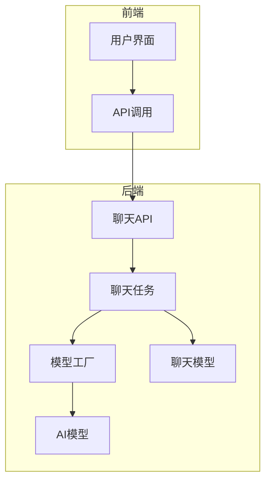
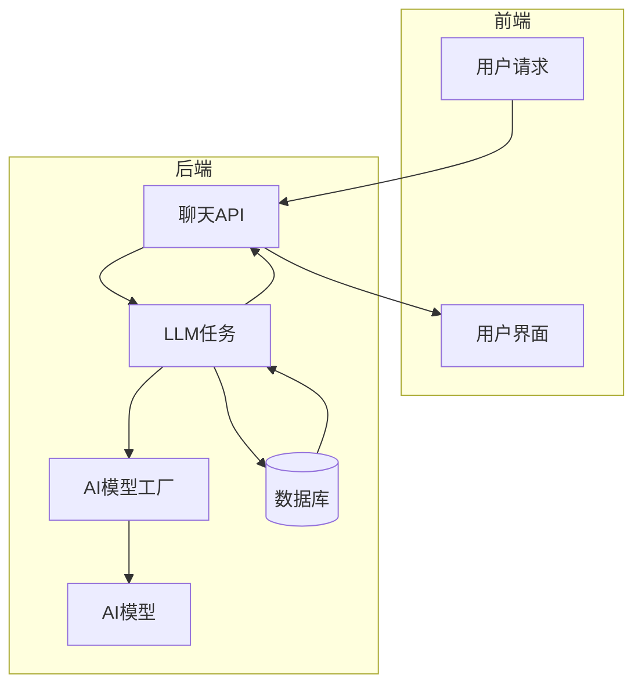
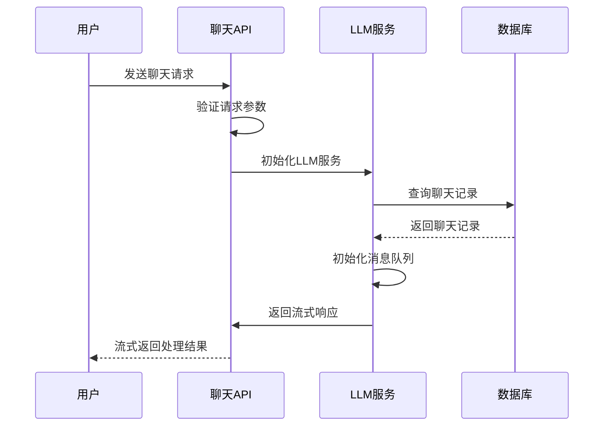
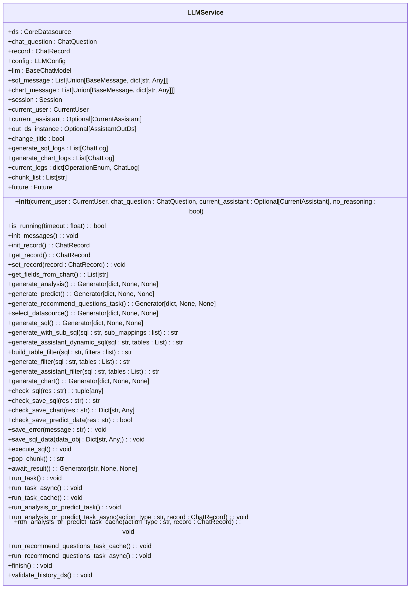
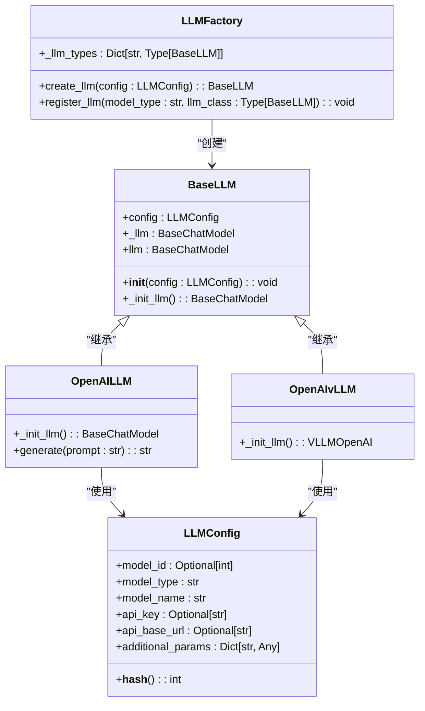
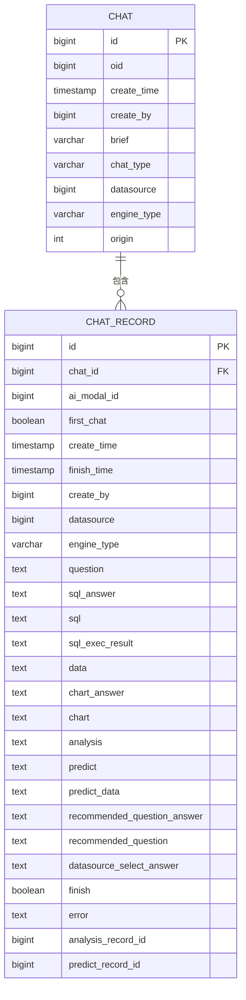
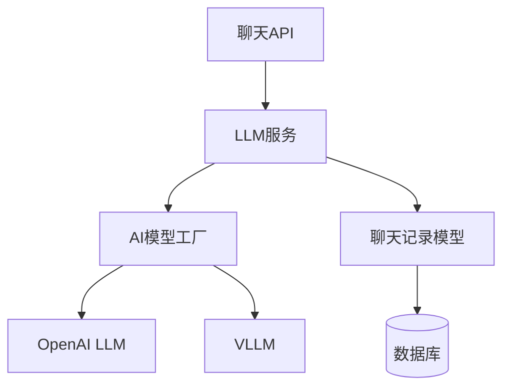

# 自然语言处理

<cite>
**本文档引用的文件**
- [chat.py](file://backend/apps/chat/api/chat.py)
- [llm.py](file://backend/apps/ai_model/openai/llm.py)
- [chat_model.py](file://backend/apps/chat/models/chat_model.py)
- [model_factory.py](file://backend/apps/ai_model/model_factory.py)
- [llm.py](file://backend/apps/chat/task/llm.py)
</cite>

## 目录
1. [简介](#简介)
2. [项目结构](#项目结构)
3. [核心组件](#核心组件)
4. [架构概述](#架构概述)
5. [详细组件分析](#详细组件分析)
6. [依赖分析](#依赖分析)
7. [性能考虑](#性能考虑)
8. [故障排除指南](#故障排除指南)
9. [结论](#结论)

## 简介
本文档详细阐述了自然语言处理模块的完整处理流程，重点分析从用户输入到SQL生成的全过程。文档深入探讨了基于线程池的异步任务处理机制、流式响应的实现方式以及性能优化策略。同时，文档解释了聊天API与LLM任务的调用关系，以及如何通过AI模型工厂动态加载不同类型的AI模型（如OpenAI、通义千问）。此外，还分析了聊天记录模型的设计，包括会话状态管理和上下文保持机制，并提供了针对LLM调用超时、模型响应异常等情况的错误处理方案。

## 项目结构
项目采用分层架构设计，主要分为后端（backend）和前端（frontend）两大部分。后端实现了自然语言处理的核心逻辑，包括AI模型管理、聊天记录处理、数据源管理等功能。前端则提供了用户交互界面，通过API与后端进行通信。

**图表来源**
- [chat.py](file://backend/apps/chat/api/chat.py#L1-L50)
- [llm.py](file://backend/apps/chat/task/llm.py#L1-L100)

**章节来源**
- [chat.py](file://backend/apps/chat/api/chat.py#L1-L229)
- [project_structure](file://#L1-L100)

## 核心组件
本系统的核心组件包括聊天API、LLM服务、AI模型工厂和聊天记录模型。这些组件协同工作，实现从用户输入到SQL生成的完整处理流程。聊天API负责接收用户请求并返回流式响应；LLM服务处理具体的自然语言处理任务；AI模型工厂负责动态加载和管理不同类型的AI模型；聊天记录模型则用于存储和管理聊天会话数据。

**章节来源**
- [chat.py](file://backend/apps/chat/api/chat.py#L1-L229)
- [llm.py](file://backend/apps/chat/task/llm.py#L1-L1191)

## 架构概述
系统采用微服务架构，通过清晰的组件划分实现高内聚低耦合的设计。用户请求首先通过聊天API进入系统，然后由LLM服务处理具体的自然语言处理任务。AI模型工厂负责根据配置动态加载相应的AI模型，而聊天记录模型则负责持久化存储会话数据。

**图表来源**
- [chat.py](file://backend/apps/chat/api/chat.py#L1-L229)
- [llm.py](file://backend/apps/chat/task/llm.py#L1-L1191)

## 详细组件分析

### 聊天API分析
聊天API是系统的入口点，负责处理用户的各种请求，包括开始聊天、重命名聊天、删除聊天等操作。API采用异步处理方式，通过线程池执行耗时操作，确保系统的响应性能。

**图表来源**
- [chat.py](file://backend/apps/chat/api/chat.py#L1-L229)

**章节来源**
- [chat.py](file://backend/apps/chat/api/chat.py#L1-L229)

### LLM服务分析
LLM服务是自然语言处理的核心组件，负责执行具体的语言模型任务。服务采用线程池进行异步任务处理，支持流式响应，能够有效提高系统的并发处理能力。

**图表来源**
- [llm.py](file://backend/apps/chat/task/llm.py#L47-L1112)

**章节来源**
- [llm.py](file://backend/apps/chat/task/llm.py#L1-L1191)

### AI模型工厂分析
AI模型工厂负责动态加载和管理不同类型的AI模型，支持OpenAI、通义千问等多种模型。工厂模式的设计使得系统能够灵活扩展，支持新的AI模型类型。

**图表来源**
- [model_factory.py](file://backend/apps/ai_model/model_factory.py#L85-L144)

**章节来源**
- [model_factory.py](file://backend/apps/ai_model/model_factory.py#L1-L146)

### 聊天记录模型分析
聊天记录模型定义了会话数据的存储结构，包括用户问题、生成的SQL、图表配置等信息。模型设计考虑了会话状态管理和上下文保持的需求。

**图表来源**
- [chat_model.py](file://backend/apps/chat/models/chat_model.py#L76-L103)

**章节来源**
- [chat_model.py](file://backend/apps/chat/models/chat_model.py#L1-L256)

## 依赖分析
系统各组件之间存在明确的依赖关系。聊天API依赖于LLM服务，LLM服务又依赖于AI模型工厂和聊天记录模型。AI模型工厂负责创建具体的AI模型实例，而聊天记录模型则为LLM服务提供数据持久化支持。

**图表来源**
- [chat.py](file://backend/apps/chat/api/chat.py#L1-L229)
- [llm.py](file://backend/apps/chat/task/llm.py#L1-L1191)
- [model_factory.py](file://backend/apps/ai_model/model_factory.py#L1-L146)
- [chat_model.py](file://backend/apps/chat/models/chat_model.py#L1-L256)

**章节来源**
- [chat.py](file://backend/apps/chat/api/chat.py#L1-L229)
- [llm.py](file://backend/apps/chat/task/llm.py#L1-L1191)
- [model_factory.py](file://backend/apps/ai_model/model_factory.py#L1-L146)
- [chat_model.py](file://backend/apps/chat/models/chat_model.py#L1-L256)

## 性能考虑
系统在设计时充分考虑了性能优化。通过使用线程池进行异步任务处理，避免了阻塞主线程，提高了系统的并发处理能力。流式响应机制使得用户可以即时看到处理结果，提升了用户体验。此外，AI模型工厂使用了lru_cache装饰器，对创建的LLM实例进行缓存，避免了重复创建实例的开销。

## 故障排除指南
系统提供了完善的错误处理机制。当LLM调用超时或模型响应异常时，系统会捕获相应的异常并返回友好的错误信息。通过分析聊天记录中的错误字段，可以快速定位问题原因。建议定期检查AI模型的配置和网络连接状态，确保模型能够正常工作。

**章节来源**
- [llm.py](file://backend/apps/chat/task/llm.py#L1-L1191)
- [common/error.py](file://backend/common/error.py#L1-L50)

## 结论
本文档详细阐述了自然语言处理模块的设计和实现。通过清晰的组件划分和合理的架构设计，系统能够高效地处理用户输入并生成相应的SQL查询。AI模型工厂的设计使得系统具有良好的扩展性，可以轻松支持新的AI模型类型。未来可以进一步优化性能，例如通过引入更高效的缓存机制和负载均衡策略。