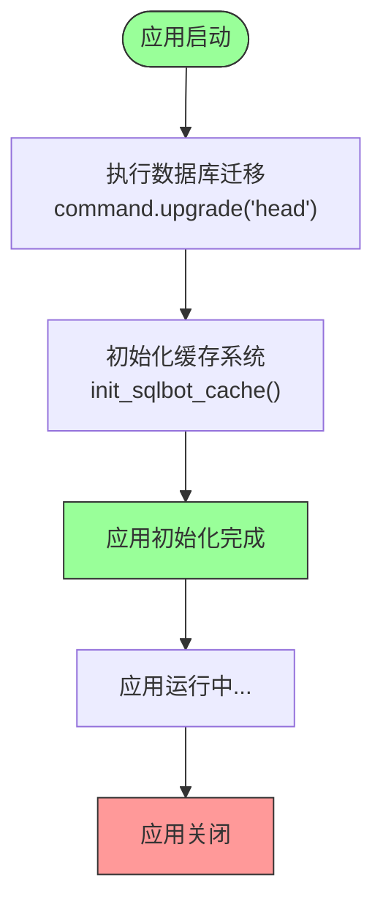
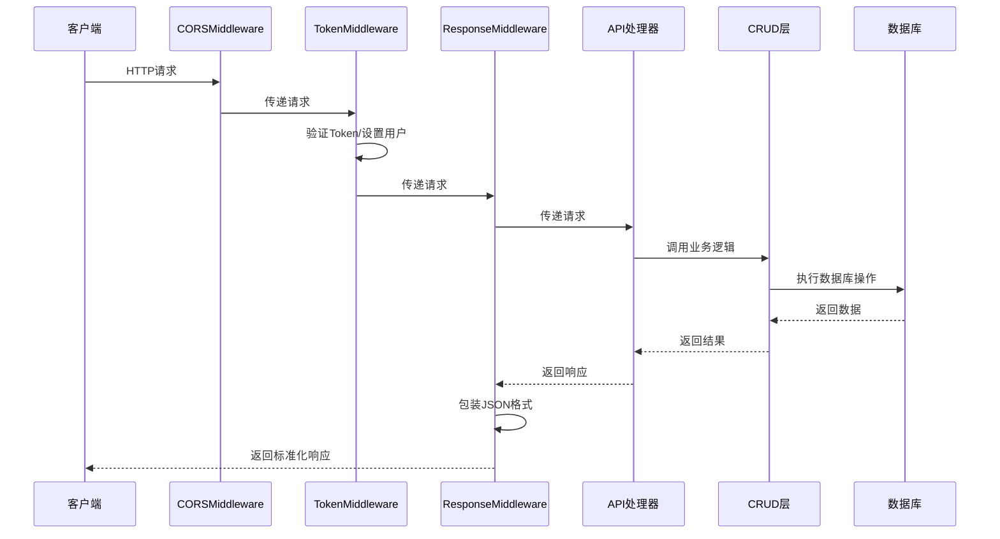

# 后端架构

<cite>
**本文档引用的文件**  
- [main.py](file://backend/main.py)
- [api.py](file://backend/apps/api.py)
- [deps.py](file://backend/common/core/deps.py)
- [response_middleware.py](file://backend/common/core/response_middleware.py)
- [auth.py](file://backend/apps/system/middleware/auth.py)
- [sqlbot_cache.py](file://backend/common/core/sqlbot_cache.py)
- [env.py](file://backend/alembic/env.py)
</cite>

## 目录
1. [项目结构](#项目结构)
2. [FastAPI应用初始化与生命周期管理](#fastapi应用初始化与生命周期管理)
3. [API路由聚合机制](#api路由聚合机制)
4. [依赖注入系统分析](#依赖注入系统分析)
5. [分层架构模式](#分层架构模式)
6. [中间件链执行流程](#中间件链执行流程)
7. [异常处理机制](#异常处理机制)
8. [请求处理时序图](#请求处理时序图)

## 项目结构

本项目采用模块化分层结构，主要分为以下核心目录：

- `backend/`：后端主目录
  - `alembic/`：数据库迁移配置与版本管理
  - `apps/`：业务模块集合，包含chat、dashboard、datasource等独立功能模块
  - `common/`：通用核心组件，包括依赖注入、配置、缓存、中间件等
- `frontend/`：前端代码
- `g2-ssr/`：图表服务端渲染
- `installer/`：安装脚本

各模块遵循高内聚、低耦合的设计原则，通过统一的API网关进行集成。

**Section sources**
- [main.py](file://backend/main.py#L1-L100)

## FastAPI应用初始化与生命周期管理

FastAPI应用通过`main.py`中的`lifespan`事件处理器实现应用的初始化与销毁流程。该机制确保在应用启动和关闭时执行关键操作。

### 数据库迁移流程

在应用启动时，`lifespan`调用`run_migrations()`函数，该函数使用Alembic库执行数据库迁移。具体流程如下：

1. 加载`alembic.ini`配置文件
2. 执行`command.upgrade(alembic_cfg, "head")`将数据库升级至最新版本
3. 所有迁移脚本位于`alembic/versions/`目录下，按版本号顺序执行

此机制确保每次部署时数据库结构自动同步，避免手动干预。

### 缓存初始化流程

`lifespan`同时调用`init_sqlbot_cache()`初始化缓存系统。根据配置`settings.CACHE_TYPE`支持三种模式：

- **memory**：使用内存缓存，适用于单进程模式
- **redis**：使用Redis作为后端，支持多进程部署
- 其他：不启用缓存

缓存系统通过`FastAPICache`集成，为API提供响应缓存能力。



**Diagram sources**
- [main.py](file://backend/main.py#L30-L42)
- [sqlbot_cache.py](file://backend/common/core/sqlbot_cache.py#L124-L139)
- [env.py](file://backend/alembic/env.py#L75-L91)

**Section sources**
- [main.py](file://backend/main.py#L21-L42)
- [sqlbot_cache.py](file://backend/common/core/sqlbot_cache.py#L124-L139)

## API路由聚合机制

系统通过`apps/api.py`中的`api_router`实现API路由的集中聚合管理。该机制将各个业务模块的API路由统一注册到主应用。

### 路由聚合实现

`api_router`是一个`APIRouter`实例，通过`include_router()`方法聚合所有子模块路由：

```python
api_router.include_router(login.router)
api_router.include_router(user.router)
api_router.include_router(chat.router)
# ... 其他模块
```

聚合的模块包括：
- 用户认证：`login`, `user`
- 工作空间：`workspace`
- 助手管理：`assistant`
- 数据源：`datasource`
- 聊天功能：`chat`
- 仪表板：`dashboard_api`
- MCP服务：`mcp`

所有路由通过`main.py`中的`app.include_router(api_router, prefix=settings.API_V1_STR)`注册到主应用，并添加API版本前缀。

**Section sources**
- [api.py](file://backend/apps/api.py#L9-L21)

## 依赖注入系统分析

依赖注入系统位于`common/core/deps.py`，为应用提供统一的依赖管理机制，主要包含以下核心依赖：

### 数据库会话依赖

`SessionDep`提供数据库会话依赖，通过`Depends(get_session)`注入：

```python
SessionDep = Annotated[Session, Depends(get_session)]
```

该依赖确保每个请求获得独立的SQLModel会话实例，实现事务隔离。

### 用户认证依赖

`CurrentUser`依赖用于获取当前认证用户信息：

```python
CurrentUser = Annotated[UserInfoDTO, Depends(get_current_user)]
```

该依赖从`request.state.current_user`中提取用户信息，由`TokenMiddleware`在请求处理前设置。

### 多语言支持依赖

`Trans`依赖提供国际化支持：

```python
Trans = Annotated[I18n, Depends(get_i18n)]
```

允许API处理多语言请求，根据客户端偏好返回本地化消息。

### 助手上下文依赖

`CurrentAssistant`依赖用于处理助手相关的请求上下文：

```python
CurrentAssistant = Annotated[AssistantHeader, Depends(get_current_assistant)]
```

支持通过特定HTTP头（如`X-SQLBOT-ASSISTANT-CERTIFICATE`）传递助手认证信息。

这些依赖在API路由中通过类型注解直接使用，实现声明式依赖管理。

**Section sources**
- [deps.py](file://backend/common/core/deps.py#L11-L20)

## 分层架构模式

系统采用典型的分层架构模式，各层职责分明：

### API层（接口层）

位于`apps/*/api/`目录，负责：
- 接收HTTP请求
- 参数验证与序列化
- 调用业务逻辑层
- 返回标准化响应

例如`apps/chat/api/chat.py`处理聊天相关的API请求。

### 业务逻辑层（隐式层）

虽然没有显式的"service"目录，但业务逻辑隐含在API处理器与数据访问层之间的调用链中。该层负责：
- 业务规则验证
- 事务管理
- 跨模块协调
- 复杂业务流程编排

### 数据访问层（CRUD层）

位于`apps/*/crud/`目录，提供数据持久化操作：
- `chat/crud/chat.py`：聊天记录CRUD
- `datasource/crud/`：数据源相关操作
- `system/crud/`：用户、工作空间等系统管理

该层使用SQLModel实现ORM操作，与数据库交互。

这种分层模式确保关注点分离，提高代码可维护性。

**Section sources**
- [chat.py](file://backend/apps/chat/api/chat.py)
- [chat.py](file://backend/apps/chat/crud/chat.py)

## 中间件链执行流程

系统通过中间件链实现横切关注点的处理，执行顺序如下：

### CORS中间件

配置在`main.py`中，使用`CORSMiddleware`处理跨域请求：

```python
app.add_middleware(
    CORSMiddleware,
    allow_origins=settings.all_cors_origins,
    allow_credentials=True,
    allow_methods=["*"],
    allow_headers=["*"],
)
```

允许配置的源访问API，支持凭证传递。

### TokenMiddleware（认证中间件）

`apps/system/middleware/auth.py`中的`TokenMiddleware`负责用户认证：

1. OPTIONS预检请求直接放行
2. 白名单路径设置默认管理员用户
3. 检查`Authorization`头中的Token
4. 支持三种认证模式：
   - Bearer Token（普通用户）
   - Assistant Token（助手）
   - Embedded Token（嵌入式场景）
5. 验证通过后将用户信息存入`request.state.current_user`

### ResponseMiddleware（响应中间件）

`common/core/response_middleware.py`中的`ResponseMiddleware`统一响应格式：

1. 非200响应直接返回
2. 已为JSONResponse的响应直接返回
3. 其他成功响应包装为标准格式：
```json
{
  "code": 0,
  "data": {真实数据},
  "msg": null
}
```

确保所有API响应格式一致。

中间件执行顺序：CORS → TokenMiddleware → ResponseMiddleware → 业务逻辑。

**Section sources**
- [auth.py](file://backend/apps/system/middleware/auth.py#L20-L198)
- [response_middleware.py](file://backend/common/core/response_middleware.py#L7-L61)

## 异常处理机制

系统通过全局异常处理器实现统一的错误处理：

### HTTP异常处理

`http_exception_handler`处理`HTTPException`：

- 记录错误日志
- 返回标准化JSON响应
- 设置CORS头

### 全局异常处理

`global_exception_handler`处理未捕获的异常：

- 记录详细异常堆栈
- 返回500错误
- 防止服务器内部错误信息泄露

异常处理器在`main.py`中注册：

```python
app.add_exception_handler(StarletteHTTPException, exception_handler.http_exception_handler)
app.add_exception_handler(Exception, exception_handler.global_exception_handler)
```

结合`SingleMessageError`等自定义异常类，实现精细化的错误控制。

**Section sources**
- [response_middleware.py](file://backend/common/core/response_middleware.py#L64-L82)
- [error.py](file://backend/common/error.py#L1-L6)

## 请求处理时序图

以下是后端请求处理的完整时序：



**Diagram sources**
- [main.py](file://backend/main.py#L1-L100)
- [auth.py](file://backend/apps/system/middleware/auth.py#L20-L198)
- [response_middleware.py](file://backend/common/core/response_middleware.py#L7-L61)

**Section sources**
- [main.py](file://backend/main.py#L1-L100)