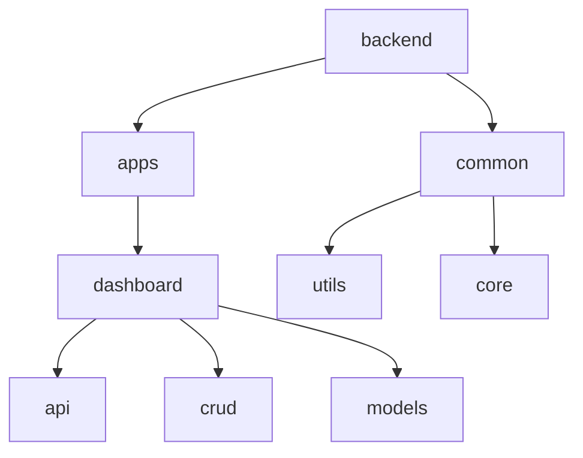
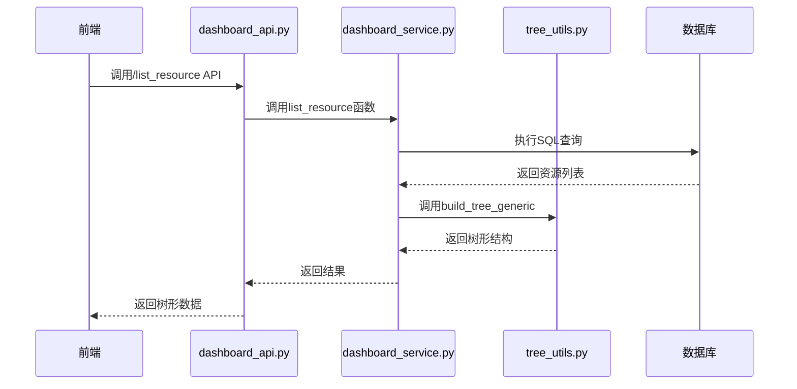
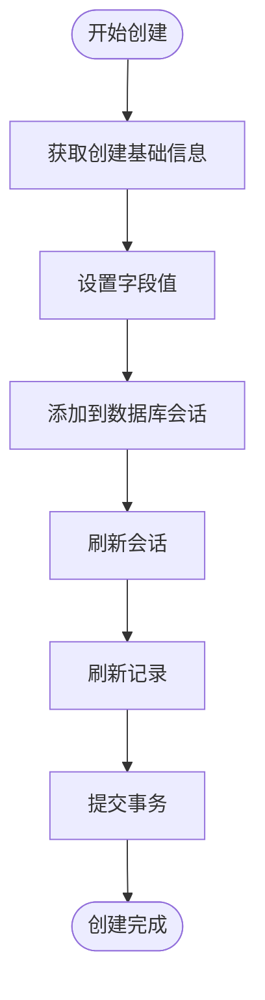
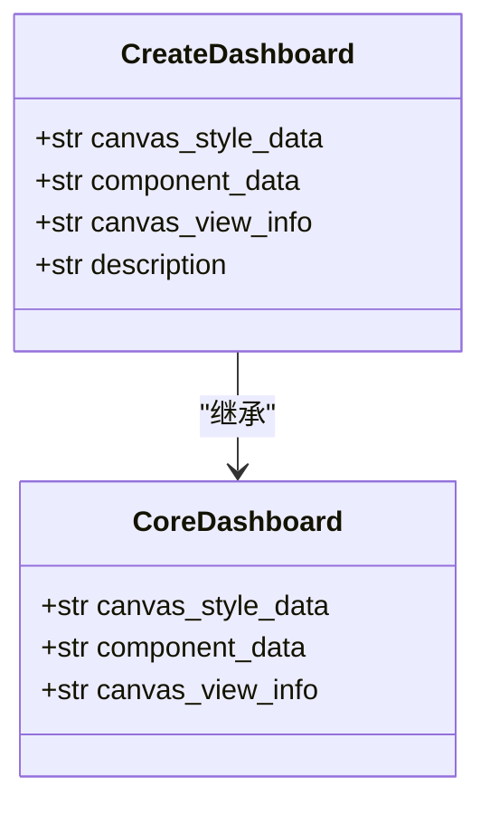
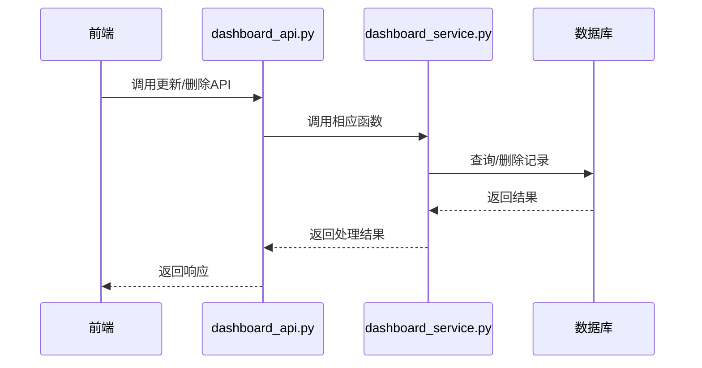
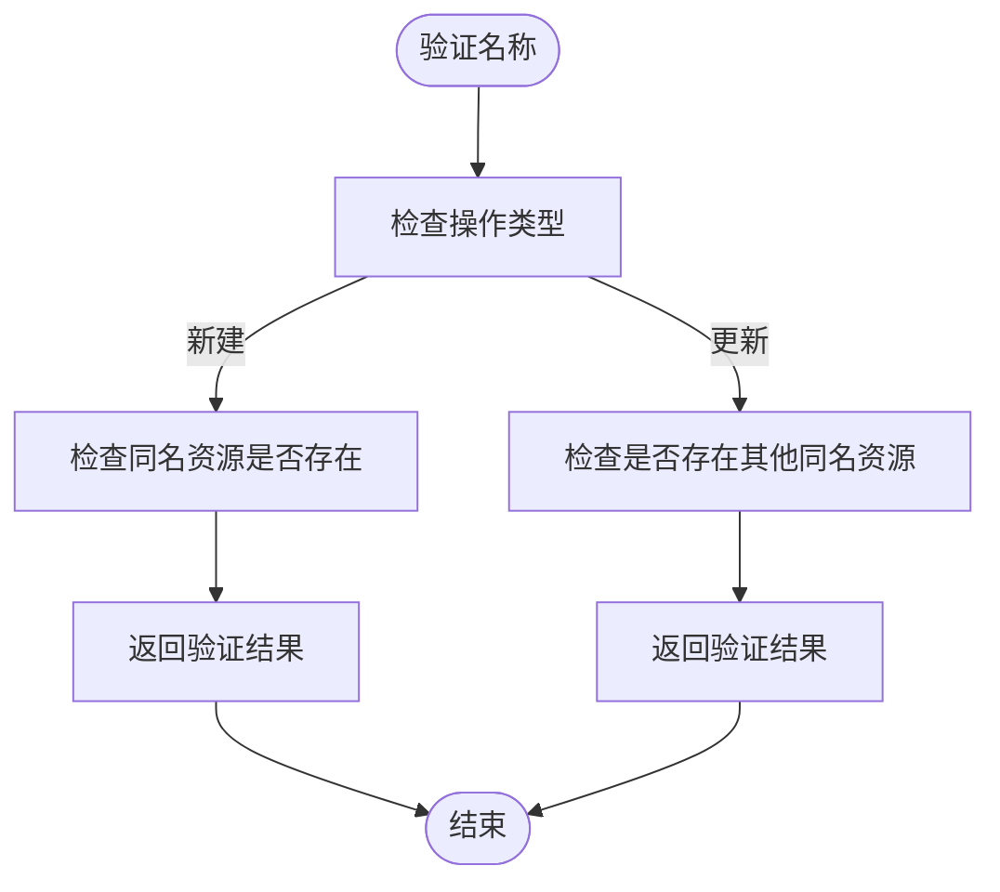
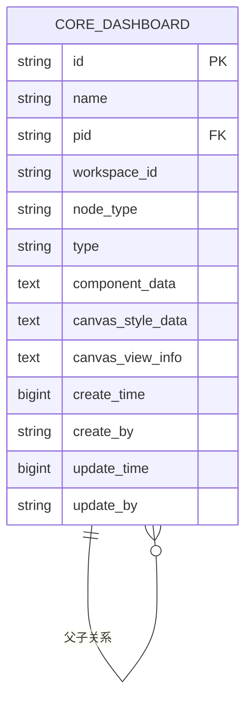
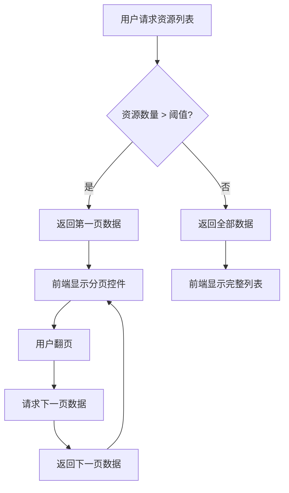

# 仪表板管理

<cite>
**本文档引用的文件**   
- [dashboard_service.py](file://backend/apps/dashboard/crud/dashboard_service.py)
- [dashboard_model.py](file://backend/apps/dashboard/models/dashboard_model.py)
- [tree_utils.py](file://backend/common/utils/tree_utils.py)
- [009_1_add_core_dashboard.py](file://backend/alembic/versions/009_1_add_core_dashboard.py)
- [dashboard_api.py](file://backend/apps/dashboard/api/dashboard_api.py)
</cite>

## 目录
1. [项目结构](#项目结构)
2. [核心组件](#核心组件)
3. [树形结构管理](#树形结构管理)
4. [资源操作实现](#资源操作实现)
5. [资源验证机制](#资源验证机制)
6. [元数据存储策略](#元数据存储策略)
7. [最佳实践](#最佳实践)

## 项目结构

**Diagram sources**
- [dashboard_service.py](file://backend/apps/dashboard/crud/dashboard_service.py)
- [dashboard_model.py](file://backend/apps/dashboard/models/dashboard_model.py)

**Section sources**
- [dashboard_service.py](file://backend/apps/dashboard/crud/dashboard_service.py)
- [dashboard_model.py](file://backend/apps/dashboard/models/dashboard_model.py)

## 核心组件

仪表板管理模块的核心功能由后端服务实现，主要包含资源管理、树形结构构建、数据存储等关键组件。该模块通过API接口为前端提供完整的仪表板生命周期管理能力，包括创建、更新、删除和查询等操作。

**Section sources**
- [dashboard_service.py](file://backend/apps/dashboard/crud/dashboard_service.py)
- [dashboard_model.py](file://backend/apps/dashboard/models/dashboard_model.py)

## 树形结构管理

### 资源列表与树形构建

仪表板资源的树形结构管理通过`list_resource`和`build_tree_generic`两个核心函数实现。系统首先从数据库查询所有相关资源，然后将其转换为树形结构。

**Diagram sources**
- [dashboard_service.py](file://backend/apps/dashboard/crud/dashboard_service.py#L9-L28)
- [tree_utils.py](file://backend/common/utils/tree_utils.py#L11-L21)

#### list_resource函数
该函数负责从数据库中查询仪表板资源列表，根据用户权限和工作区进行过滤，并按创建时间倒序排列。

#### build_tree_generic函数
通用树形结构构建函数，通过`id`和`pid`字段将扁平化的资源列表转换为嵌套的树形结构。算法时间复杂度为O(n)，其中n为节点数量。

**Section sources**
- [dashboard_service.py](file://backend/apps/dashboard/crud/dashboard_service.py#L9-L28)
- [tree_utils.py](file://backend/common/utils/tree_utils.py#L11-L21)

## 资源操作实现

### 创建操作

仪表板的创建通过`create_resource`和`create_canvas`函数实现，系统为每个新资源生成唯一ID并记录创建者信息。

**Diagram sources**
- [dashboard_service.py](file://backend/apps/dashboard/crud/dashboard_service.py#L46-L53)
- [dashboard_service.py](file://backend/apps/dashboard/crud/dashboard_service.py#L75-L85)

### 画布数据存储

画布数据存储功能通过`create_canvas`函数实现，将组件数据、样式数据和视图信息以JSON字符串形式存储在数据库中。

**Diagram sources**
- [dashboard_model.py](file://backend/apps/dashboard/models/dashboard_model.py#L139-L141)
- [dashboard_model.py](file://backend/apps/dashboard/models/dashboard_model.py#L52-L55)

### 更新与删除操作

更新操作通过`update_resource`和`update_canvas`函数实现，删除操作通过`delete_resource`函数实现。

**Diagram sources**
- [dashboard_service.py](file://backend/apps/dashboard/crud/dashboard_service.py#L65-L98)
- [dashboard_service.py](file://backend/apps/dashboard/crud/dashboard_service.py#L130-L136)

**Section sources**
- [dashboard_service.py](file://backend/apps/dashboard/crud/dashboard_service.py#L65-L136)

## 资源验证机制

### 命名冲突防止

`validate_name`函数实现了防止命名冲突的验证机制，根据不同操作类型（新建或更新）采用不同的验证策略。

对于新建操作，系统检查同一工作区和创建者下是否存在同名资源；对于更新操作，系统检查是否存在其他同名资源（排除自身）。

**Diagram sources**
- [dashboard_service.py](file://backend/apps/dashboard/crud/dashboard_service.py#L101-L129)

**Section sources**
- [dashboard_service.py](file://backend/apps/dashboard/crud/dashboard_service.py#L101-L129)

## 元数据存储策略

### JSON格式存储

仪表板元数据（component_data、canvas_style_data）采用JSON格式存储策略，通过Text类型字段在数据库中存储序列化的JSON字符串。

**Diagram sources**
- [009_1_add_core_dashboard.py](file://backend/alembic/versions/009_1_add_core_dashboard.py#L20-L55)
- [dashboard_model.py](file://backend/apps/dashboard/models/dashboard_model.py#L44-L52)

### 查询优化

系统通过以下方式优化元数据查询性能：
1. 使用索引优化：在id、pid、workspace_id等常用查询字段上建立索引
2. 字段分离：将大型JSON数据与常用查询字段分离存储
3. 懒加载：在不需要元数据时仅查询基础信息

**Section sources**
- [dashboard_model.py](file://backend/apps/dashboard/models/dashboard_model.py)
- [009_1_add_core_dashboard.py](file://backend/alembic/versions/009_1_add_core_dashboard.py)

## 最佳实践

### 树形结构缓存

建议在前端实现树形结构缓存，避免频繁请求后端接口。可以使用localStorage或sessionStorage存储树形数据，并设置合理的过期时间。

### 大规模资源列表分页加载

对于大规模资源列表，建议采用分页加载策略：
1. 后端支持分页查询参数
2. 前端实现虚拟滚动
3. 按需加载子节点（懒加载）

**Diagram sources**
- [dashboard_service.py](file://backend/apps/dashboard/crud/dashboard_service.py#L9-L28)

**Section sources**
- [dashboard_service.py](file://backend/apps/dashboard/crud/dashboard_service.py)
- [dashboard_api.py](file://backend/apps/dashboard/api/dashboard_api.py)