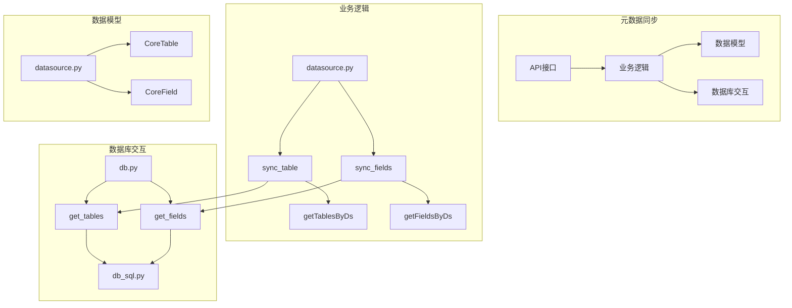
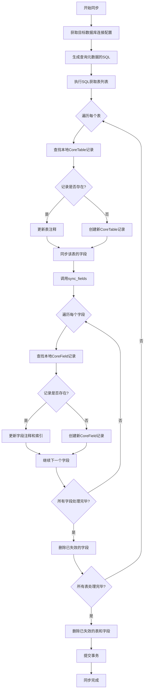
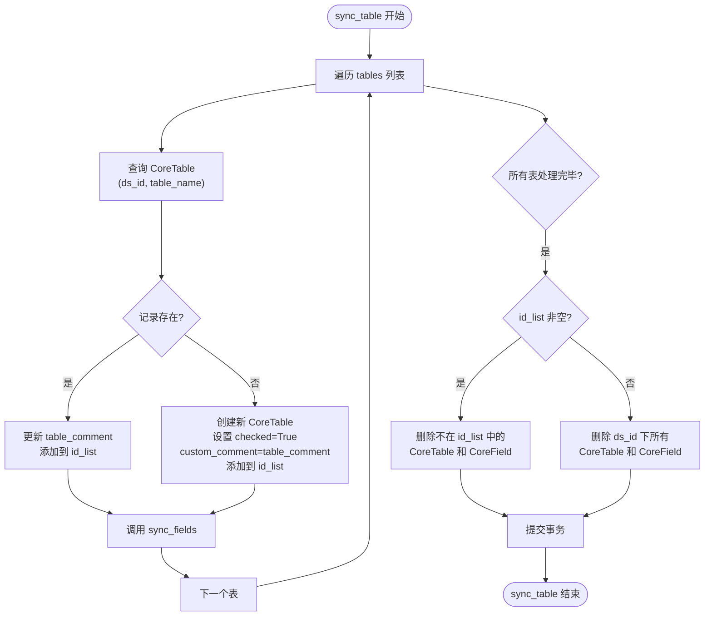
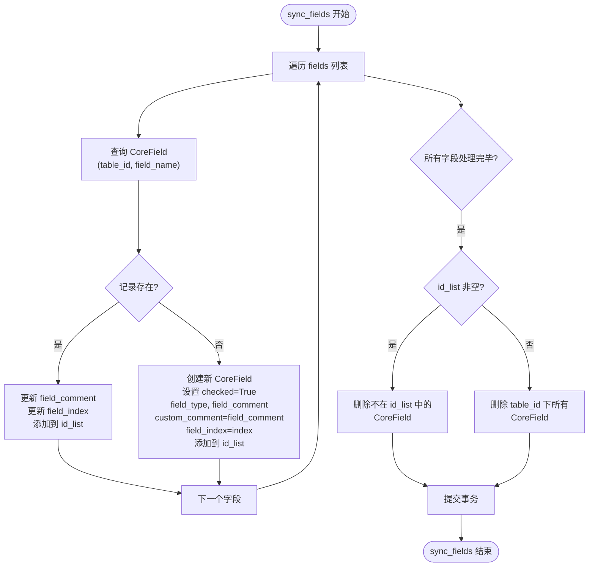
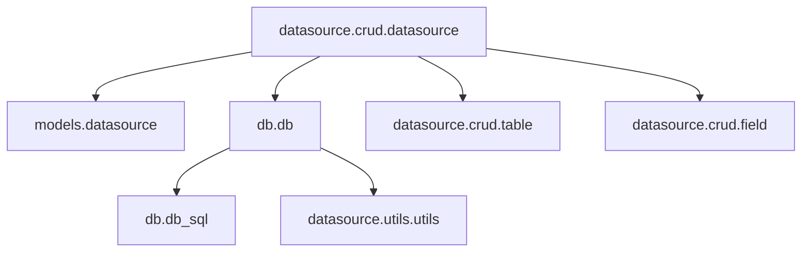

# 元数据同步

<cite>
**本文档引用的文件**
- [table.py](file://backend/apps/datasource/crud/table.py)
- [field.py](file://backend/apps/datasource/crud/field.py)
- [datasource.py](file://backend/apps/datasource/crud/datasource.py)
- [db_sql.py](file://backend/apps/db/db_sql.py)
- [db.py](file://backend/apps/db/db.py)
- [datasource.py](file://backend/apps/datasource/models/datasource.py)
</cite>

## 目录
1. [简介](#简介)
2. [项目结构](#项目结构)
3. [核心组件](#核心组件)
4. [架构概述](#架构概述)
5. [详细组件分析](#详细组件分析)
6. [依赖分析](#依赖分析)
7. [性能考虑](#性能考虑)
8. [故障排除指南](#故障排除指南)
9. [结论](#结论)

## 简介
本文档深入解析 SQLBot 系统中的元数据同步功能，重点阐述 `sync_table` 和 `sync_fields` 方法的执行逻辑。文档详细描述了系统如何从目标数据库提取表结构信息，与内部的 CoreTable 和 CoreField 模型进行比对，并执行相应的增删改操作。同时，文档还说明了字段类型映射规则、注释同步机制、自定义字段处理流程，以及在同步过程中如何通过级联删除和事务控制来维护数据一致性。最后，文档提供了批量操作、索引使用和大库同步策略等性能优化建议。

## 项目结构
元数据同步功能主要分布在 `backend/apps/datasource` 目录下，其核心逻辑由 `crud`（数据操作）和 `models`（数据模型）两个子模块构成。`db` 模块负责与底层数据库的交互，提供跨多种数据库的统一接口。

**图示来源**
- [datasource.py](file://backend/apps/datasource/crud/datasource.py)
- [db.py](file://backend/apps/db/db.py)
- [db_sql.py](file://backend/apps/db/db_sql.py)

**本节来源**
- [backend/apps/datasource](file://backend/apps/datasource)

## 核心组件
元数据同步的核心组件包括 `sync_table` 和 `sync_fields` 两个函数，它们共同实现了从目标数据库到系统内部模型的双向同步。`CoreTable` 和 `CoreField` 模型定义了系统内部存储表和字段元数据的结构。`get_table_sql` 和 `get_field_sql` 函数负责生成针对不同数据库类型的元数据查询语句，而 `get_tables` 和 `get_fields` 函数则封装了执行这些查询并返回标准化结果的逻辑。

**本节来源**
- [datasource.py](file://backend/apps/datasource/crud/datasource.py#L155-L223)
- [datasource.py](file://backend/apps/datasource/models/datasource.py#L20-L58)
- [db_sql.py](file://backend/apps/db/db_sql.py#L10-L186)
- [db.py](file://backend/apps/db/db.py#L172-L225)

## 架构概述
元数据同步的整体架构遵循一个清晰的流程：首先，系统通过 `getTablesByDs` 和 `getFieldsByDs` 方法，利用 `db` 模块从目标数据库获取最新的表和字段列表。然后，`sync_table` 方法将这些外部元数据与数据库中已有的 `CoreTable` 记录进行比对。对于已存在的表，它会更新其注释信息；对于新发现的表，则创建新的 `CoreTable` 记录。在处理完一个表后，会立即调用 `sync_fields` 方法，以同样的增删改逻辑同步该表下的所有字段。整个过程在一个数据库会话中完成，确保了操作的原子性。

**图示来源**
- [datasource.py](file://backend/apps/datasource/crud/datasource.py#L155-L223)
- [db.py](file://backend/apps/db/db.py#L172-L225)

## 详细组件分析
### sync_table 方法分析
`sync_table` 方法是元数据同步的入口，负责处理表级别的增删改操作。它接收一个 `CoreDatasource` 对象和一个 `CoreTable` 对象列表作为参数。方法内部维护一个 `id_list` 列表，用于记录本次同步中所有有效表的ID。

**图示来源**
- [datasource.py](file://backend/apps/datasource/crud/datasource.py#L155-L192)

**本节来源**
- [datasource.py](file://backend/apps/datasource/crud/datasource.py#L155-L192)

### sync_fields 方法分析
`sync_fields` 方法负责同步单个表下的所有字段。它接收一个 `CoreDatasource` 对象、一个 `CoreTable` 对象和一个 `ColumnSchema` 对象列表。与 `sync_table` 类似，它也使用一个 `id_list` 来追踪有效字段。

**图示来源**
- [datasource.py](file://backend/apps/datasource/crud/datasource.py#L195-L223)

**本节来源**
- [datasource.py](file://backend/apps/datasource/crud/datasource.py#L195-L223)

### 字段类型映射与注释同步
系统通过 `get_field_sql` 函数为不同数据库生成获取字段信息的SQL语句。这些SQL语句会返回字段名、数据类型和注释。`get_fields` 函数执行这些SQL，并将结果封装成 `ColumnSchema` 对象列表。在 `sync_fields` 方法中，`field_type` 和 `field_comment` 会直接从 `ColumnSchema` 对象中获取并同步到 `CoreField` 模型。`custom_comment` 字段在创建新字段时会被初始化为 `field_comment` 的值，允许用户后续进行自定义修改。

**本节来源**
- [db_sql.py](file://backend/apps/db/db_sql.py#L90-L186)
- [datasource.py](file://backend/apps/datasource/models/datasource.py#L59-L78)
- [datasource.py](file://backend/apps/datasource/crud/datasource.py#L195-L223)

### 数据一致性维护
元数据同步过程中，数据一致性通过以下机制得到保障：
1.  **事务控制**：整个 `sync_table` 过程（包括其内部调用的 `sync_fields`）在一个数据库会话（`session`）中执行，所有 `add` 和 `delete` 操作最终通过 `commit()` 提交，保证了操作的原子性。
2.  **级联删除**：在同步流程的最后阶段，系统会执行删除操作。`sync_table` 会删除所有 `ds_id` 匹配但不在 `id_list` 中的 `CoreTable` 记录，同时也会删除这些表关联的所有 `CoreField` 记录。`sync_fields` 会删除 `table_id` 匹配但不在 `id_list` 中的 `CoreField` 记录。这确保了系统内部的元数据与目标数据库保持完全一致，任何在目标数据库中被删除的表或字段，都会在系统内部被清理。

**本节来源**
- [datasource.py](file://backend/apps/datasource/crud/datasource.py#L155-L192)
- [datasource.py](file://backend/apps/datasource/crud/datasource.py#L195-L223)

## 依赖分析
元数据同步功能依赖于多个模块的协同工作。`datasource` CRUD 模块是核心，它直接依赖 `models` 模块定义数据结构，并依赖 `db` 模块进行底层数据库操作。`db` 模块又依赖 `db_sql` 模块生成SQL语句，并依赖 `utils` 模块进行配置解密。这种分层架构使得代码职责清晰，易于维护和扩展。

**图示来源**
- [datasource.py](file://backend/apps/datasource/crud/datasource.py)
- [db.py](file://backend/apps/db/db.py)

**本节来源**
- [datasource.py](file://backend/apps/datasource/crud/datasource.py)
- [db.py](file://backend/apps/db/db.py)

## 性能考虑
为了优化元数据同步的性能，可以考虑以下建议：
1.  **批量操作**：当前的 `sync_table` 和 `sync_fields` 方法在循环中对每个记录进行 `add` 和 `commit`。可以优化为在循环中只进行 `add` 操作，将 `commit` 移到循环外部，从而将多次事务提交合并为一次，显著减少I/O开销。
2.  **索引使用**：确保 `CoreTable` 表上的 `(ds_id, table_name)` 组合以及 `CoreField` 表上的 `(table_id, field_name)` 组合存在数据库索引，这对于 `sync_table` 和 `sync_fields` 方法中的 `select` 查询至关重要，能极大提升比对效率。
3.  **大库同步策略**：对于包含大量表和字段的数据库，一次性同步可能导致超时。可以实现分页或分批同步策略，例如，先获取所有表名，然后分批处理每一批表的字段同步。

**本节来源**
- [datasource.py](file://backend/apps/datasource/crud/datasource.py#L155-L223)

## 故障排除指南
在元数据同步过程中可能遇到的问题及解决方法：
-   **连接失败**：检查数据源配置（主机、端口、用户名、密码）是否正确。`check_connection` 函数会尝试建立连接并返回状态。
-   **同步无变化**：确认目标数据库的表结构确实发生了变化。检查 `get_table_sql` 和 `get_field_sql` 生成的SQL语句是否正确，并能在目标数据库中成功执行。
-   **字段类型映射错误**：如果发现字段类型与预期不符，需要检查 `get_field_sql` 函数中针对该数据库类型的SQL语句，确保其返回的 `DATA_TYPE` 字段是准确的。
-   **性能低下**：如果同步过程非常缓慢，应检查数据库索引是否缺失，并考虑实施上述性能优化建议。

**本节来源**
- [datasource.py](file://backend/apps/datasource/crud/datasource.py#L155-L223)
- [db.py](file://backend/apps/db/db.py#L130-L168)

## 结论
SQLBot 的元数据同步功能通过 `sync_table` 和 `sync_fields` 两个核心方法，实现了从多种目标数据库到系统内部模型的高效、一致的元数据同步。该功能设计清晰，通过事务和级联删除机制保障了数据完整性。通过理解其执行逻辑和依赖关系，开发者可以更好地维护此功能，并根据性能需求进行针对性的优化。