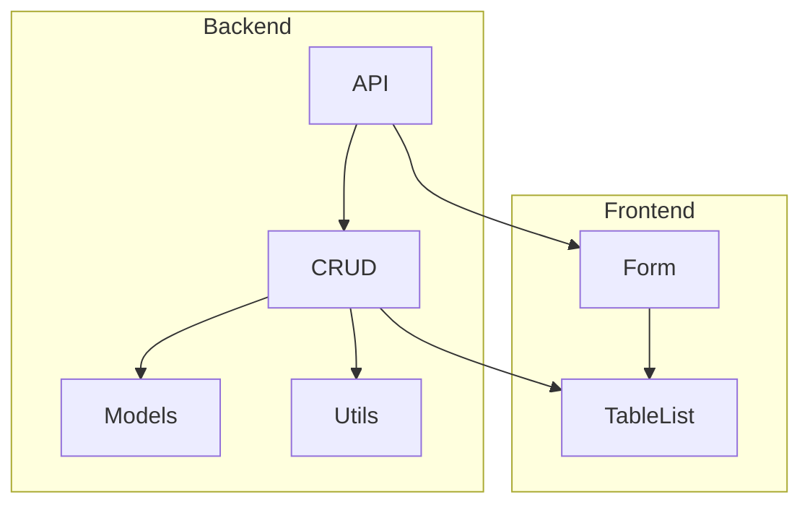
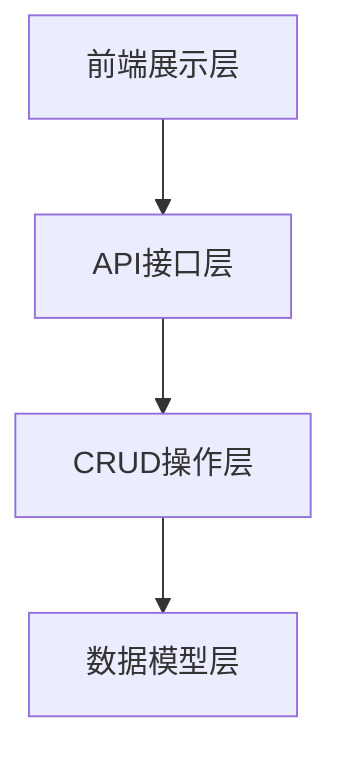
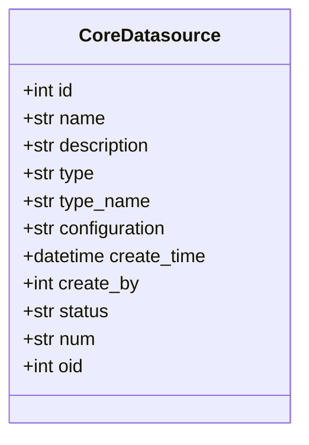
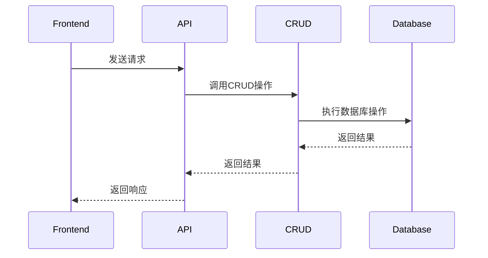
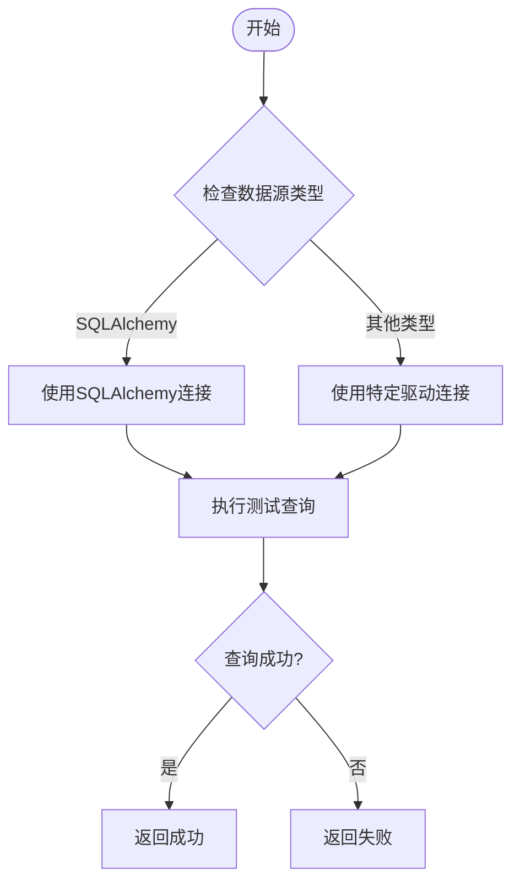
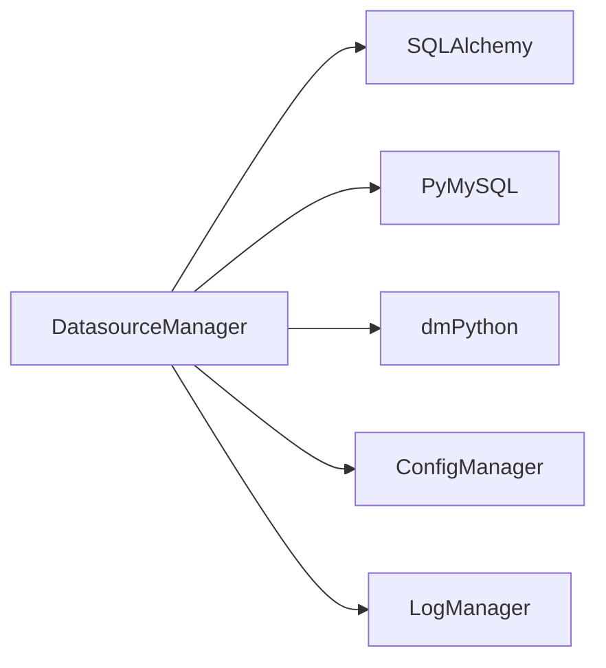

# 数据源管理

<cite>
**本文档引用文件**  
- [datasource.py](file://backend/apps/datasource/api/datasource.py)
- [datasource.py](file://backend/apps/datasource/crud/datasource.py)
- [datasource.py](file://backend/apps/datasource/models/datasource.py)
- [utils.py](file://backend/apps/datasource/utils/utils.py)
- [db.py](file://backend/apps/db/db.py)
- [type.py](file://backend/apps/db/type.py)
- [permission.py](file://backend/apps/datasource/crud/permission.py)
- [form.vue](file://frontend/src/views/ds/form.vue)
- [TableList.vue](file://frontend/src/views/ds/TableList.vue)
- [template.yaml](file://backend/template.yaml)
</cite>

## 目录
1. [简介](#简介)
2. [项目结构](#项目结构)
3. [核心组件](#核心组件)
4. [架构概述](#架构概述)
5. [详细组件分析](#详细组件分析)
6. [依赖分析](#依赖分析)
7. [性能考虑](#性能考虑)
8. [故障排除指南](#故障排除指南)
9. [结论](#结论)

## 简介
本文档详细描述了数据源管理模块的实现，重点涵盖数据源（CoreDatasource）的CRUD操作、连接测试、元数据同步、表字段预览等核心功能。同时，文档解释了列权限和行权限在数据访问中的过滤机制，阐述了多数据库类型的SQL生成策略差异，并提供了数据源配置加密存储和连接池管理的最佳实践。

## 项目结构
数据源管理模块位于`backend/apps/datasource/`目录下，主要包含API接口、CRUD操作、数据模型和工具函数。前端部分位于`frontend/src/views/ds/`目录下，负责用户界面展示和交互。

**图表来源**
- [datasource.py](file://backend/apps/datasource/api/datasource.py)
- [datasource.py](file://backend/apps/datasource/crud/datasource.py)
- [datasource.py](file://backend/apps/datasource/models/datasource.py)
- [form.vue](file://frontend/src/views/ds/form.vue)
- [TableList.vue](file://frontend/src/views/ds/TableList.vue)

**章节来源**
- [datasource.py](file://backend/apps/datasource/api/datasource.py)
- [datasource.py](file://backend/apps/datasource/crud/datasource.py)
- [datasource.py](file://backend/apps/datasource/models/datasource.py)
- [form.vue](file://frontend/src/views/ds/form.vue)
- [TableList.vue](file://frontend/src/views/ds/TableList.vue)

## 核心组件
数据源管理模块的核心组件包括数据源模型（CoreDatasource）、CRUD操作、API接口和前端组件。这些组件共同实现了数据源的创建、读取、更新和删除操作，以及连接测试、元数据同步和表字段预览等功能。

**章节来源**
- [datasource.py](file://backend/apps/datasource/models/datasource.py)
- [datasource.py](file://backend/apps/datasource/crud/datasource.py)
- [datasource.py](file://backend/apps/datasource/api/datasource.py)
- [form.vue](file://frontend/src/views/ds/form.vue)

## 架构概述
数据源管理模块采用分层架构，包括前端展示层、API接口层、CRUD操作层和数据模型层。前端展示层负责用户界面和交互，API接口层处理HTTP请求，CRUD操作层实现业务逻辑，数据模型层定义数据结构。

**图表来源**
- [datasource.py](file://backend/apps/datasource/api/datasource.py)
- [datasource.py](file://backend/apps/datasource/crud/datasource.py)
- [datasource.py](file://backend/apps/datasource/models/datasource.py)
- [form.vue](file://frontend/src/views/ds/form.vue)

## 详细组件分析
### 数据源模型分析
数据源模型（CoreDatasource）定义了数据源的基本属性，包括名称、描述、类型、配置信息等。该模型通过SQLModel实现，支持数据库持久化。

**图表来源**
- [datasource.py](file://backend/apps/datasource/models/datasource.py)

**章节来源**
- [datasource.py](file://backend/apps/datasource/models/datasource.py)

### CRUD操作分析
CRUD操作层实现了数据源的创建、读取、更新和删除功能。通过调用数据库操作函数，实现对数据源的持久化管理。

**图表来源**
- [datasource.py](file://backend/apps/datasource/crud/datasource.py)
- [datasource.py](file://backend/apps/datasource/api/datasource.py)

**章节来源**
- [datasource.py](file://backend/apps/datasource/crud/datasource.py)
- [datasource.py](file://backend/apps/datasource/api/datasource.py)

### 连接测试分析
连接测试功能通过`check_connection`函数实现，该函数根据数据源类型建立数据库连接，并执行简单的查询操作以验证连接的有效性。

**图表来源**
- [db.py](file://backend/apps/db/db.py)

**章节来源**
- [db.py](file://backend/apps/db/db.py)

## 依赖分析
数据源管理模块依赖于多个外部库和内部模块，包括SQLAlchemy、PyMySQL、dmPython等数据库驱动，以及项目内部的配置管理、日志记录等模块。

**图表来源**
- [db.py](file://backend/apps/db/db.py)
- [datasource.py](file://backend/apps/datasource/crud/datasource.py)

**章节来源**
- [db.py](file://backend/apps/db/db.py)
- [datasource.py](file://backend/apps/datasource/crud/datasource.py)

## 性能考虑
在数据源管理模块中，性能优化主要体现在连接池管理和异步操作上。通过使用SQLAlchemy的连接池功能，减少数据库连接的创建和销毁开销。同时，利用异步操作提高API响应速度。

**章节来源**
- [db.py](file://backend/apps/db/db.py)
- [datasource.py](file://backend/apps/datasource/api/datasource.py)

## 故障排除指南
在使用数据源管理模块时，可能会遇到连接失败、查询超时等问题。建议检查数据库配置信息、网络连接状态，并确保数据库服务正常运行。

**章节来源**
- [db.py](file://backend/apps/db/db.py)
- [datasource.py](file://backend/apps/datasource/crud/datasource.py)

## 结论
数据源管理模块通过分层架构和模块化设计，实现了数据源的全生命周期管理。该模块具有良好的扩展性和可维护性，能够支持多种数据库类型，并提供丰富的功能以满足不同场景的需求。