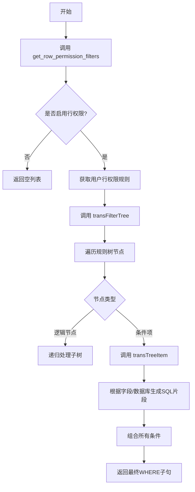
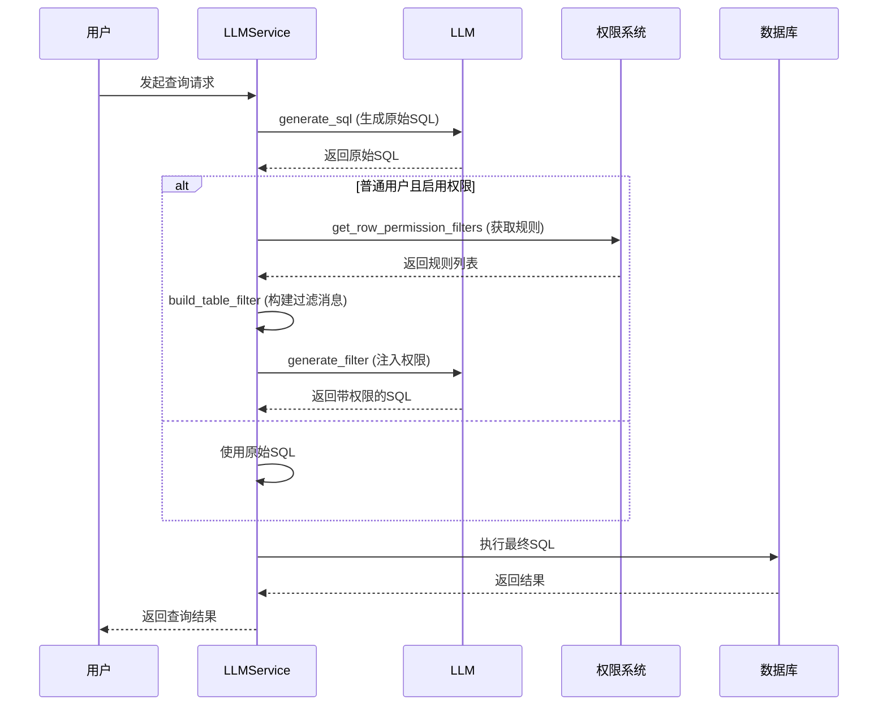

# 权限过滤机制

<cite>
**本文档引用文件**  
- [permission.py](file://backend/apps/datasource/crud/permission.py)
- [row_permission.py](file://backend/apps/datasource/crud/row_permission.py)
- [llm.py](file://backend/apps/chat/task/llm.py)
- [template.yaml](file://backend/template.yaml)
</cite>

## 目录
1. [引言](#引言)
2. [列权限机制](#列权限机制)
3. [行权限机制](#行权限机制)
4. [权限检查执行链路](#权限检查执行链路)
5. [性能影响分析](#性能影响分析)
6. [自定义权限规则开发指南](#自定义权限规则开发指南)
7. [安全审计建议](#安全审计建议)
8. [总结](#总结)

## 引言
本文档详细阐述SQLBot系统中的数据源权限过滤机制，重点分析列权限与行权限的实现方式。尽管当前版本已移除许可证功能导致列权限返回所有字段，仍需说明其设计意图与扩展点。深入解析行级权限如何通过SQL WHERE条件动态注入实现数据隔离。阐述权限检查在查询执行链路中的位置及其对性能的影响。提供自定义权限规则的开发指南和安全审计建议。

## 列权限机制

`get_column_permission_fields`函数负责实现列级别的权限控制。该函数接收数据库会话、当前用户、目标表和字段列表作为参数，理论上应根据用户权限返回可访问的字段子集。然而，由于许可证功能已被移除，当前实现简化为直接返回传入的完整字段列表，不进行任何权限过滤。

此设计保留了列权限的接口和调用链路，为未来重新启用列级权限控制提供了扩展点。开发者可通过在此函数中集成权限检查逻辑（例如查询用户角色对应的字段白名单）来恢复列权限功能。

**Section sources**
- [permission.py](file://backend/apps/datasource/crud/permission.py#L19-L23)

## 行权限机制

行级权限通过`get_row_permission_filters`函数和`transFilterTree`工具函数协同实现。`get_row_permission_filters`是行权限的入口点，接收数据源、用户和目标表等信息，理论上应返回一组WHERE条件过滤器。但当前因许可证功能移除，该函数也简化为返回空列表。

`transFilterTree`函数是行权限的核心转换引擎。它将前端配置的权限规则树（JSON格式）递归转换为SQL WHERE子句。该函数遍历规则树的每个节点，调用`transTreeToWhere`处理逻辑运算符（AND/OR），并调用`transTreeItem`将单个条件项转换为具体的SQL表达式。`transTreeItem`根据字段类型、数据库方言（如SQL Server的N'前缀）和比较操作符（如IN, LIKE, NULL）生成正确的SQL片段，并处理枚举值和字符串转义。

**Diagram sources**
- [permission.py](file://backend/apps/datasource/crud/permission.py#L12-L16)
- [row_permission.py](file://backend/apps/datasource/crud/row_permission.py#L9-L20)

**Section sources**
- [permission.py](file://backend/apps/datasource/crud/permission.py#L12-L16)
- [row_permission.py](file://backend/apps/datasource/crud/row_permission.py#L9-L61)

## 权限检查执行链路

权限检查嵌入在LLM查询生成的执行链路中。当普通用户发起查询时，`LLMService.run_task`方法在生成原始SQL后，会调用`generate_filter`方法。该方法首先调用`get_row_permission_filters`获取行权限规则，然后调用`build_table_filter`方法。

`build_table_filter`方法将原始SQL和权限规则作为输入，通过`template.yaml`中的`permissions`模板，利用大语言模型（LLM）将权限规则动态注入到原始SQL中。该过程通过向LLM发送系统提示和用户提示，指导其将权限过滤条件（以JSON格式提供）正确地添加到SQL的WHERE子句中，同时保持原有SQL结构不变，并处理数据库关键字冲突。

**Diagram sources**
- [llm.py](file://backend/apps/chat/task/llm.py#L859-L1017)
- [template.yaml](file://backend/template.yaml#L194-L216)

**Section sources**
- [llm.py](file://backend/apps/chat/task/llm.py#L859-L1017)
- [template.yaml](file://backend/template.yaml#L194-L216)

## 性能影响分析
当前版本的权限过滤机制对性能影响极小，因为`get_column_permission_fields`和`get_row_permission_filters`函数均被简化为直接返回所有字段或空列表，不涉及数据库查询或复杂计算。

然而，当行权限功能完全启用时，性能影响主要体现在：
1.  **规则转换开销**：`transFilterTree`函数需要递归遍历和转换权限规则树，其复杂度与规则数量和深度成正比。
2.  **LLM调用延迟**：`build_table_filter`方法会发起一次额外的LLM调用，用于注入权限，这会增加查询的总体响应时间。
3.  **SQL复杂度增加**：注入的WHERE条件会使最终执行的SQL更复杂，可能影响数据库查询优化器的效率和执行速度。

## 自定义权限规则开发指南
要重新启用和自定义行权限规则，开发者应：
1.  **恢复权限数据模型**：重新引入`DsPermission`、`DsRules`等权限相关的数据库模型。
2.  **实现权限获取逻辑**：在`get_row_permission_filters`函数中，根据`current_user`和`ds`查询数据库，获取该用户在该数据源上的行权限规则。
3.  **配置权限规则**：在前端界面提供配置入口，允许管理员为不同用户或角色设置基于字段的过滤条件（如`department = 'Sales'`）。
4.  **测试规则转换**：确保`transFilterTree`及其辅助函数能正确处理各种数据库类型和复杂的嵌套逻辑。
5.  **更新LLM提示**：验证`template.yaml`中的`permissions`模板能正确指导LLM合并权限条件。

## 安全审计建议
1.  **输入验证**：严格验证从`get_row_permission_filters`返回的权限规则，防止恶意构造的SQL片段。
2.  **SQL注入防护**：`transTreeItem`函数在拼接SQL时，必须对字段值进行严格的转义和参数化处理，避免SQL注入风险。
3.  **最小权限原则**：确保权限规则的配置遵循最小权限原则，避免过度授权。
4.  **审计日志**：记录权限检查的全过程，包括原始SQL、应用的权限规则和最终生成的SQL，以便进行安全审计和问题排查。
5.  **代码审查**：对权限相关的代码（特别是涉及字符串拼接生成SQL的部分）进行严格的代码审查。

## 总结
SQLBot的权限过滤机制设计为可插拔的架构，通过`get_column_permission_fields`和`get_row_permission_filters`两个核心函数提供扩展点。虽然当前版本因许可证移除而简化了权限控制，但其底层的规则转换引擎（`transFilterTree`）和基于LLM的动态SQL注入机制（`build_table_filter`）依然健在，为未来实现细粒度的数据访问控制奠定了坚实基础。开发者在启用完整权限功能时，需重点关注性能和安全问题。