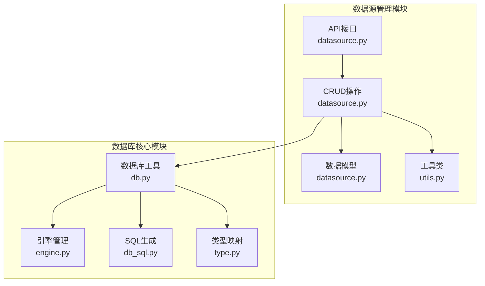
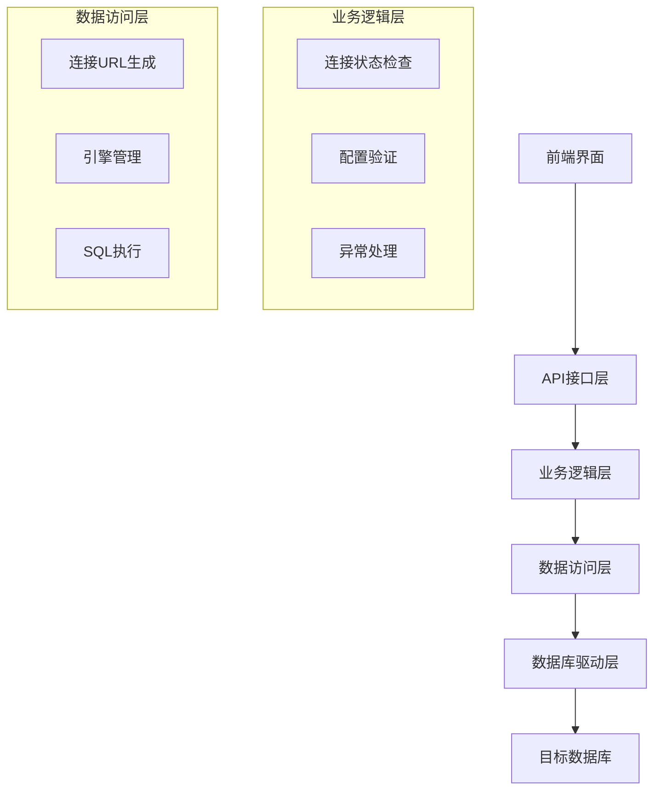
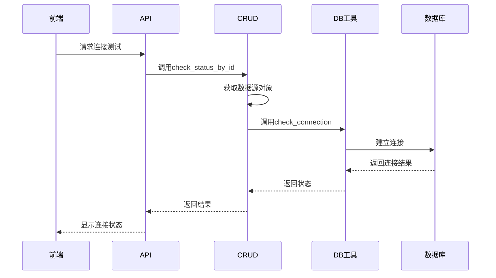
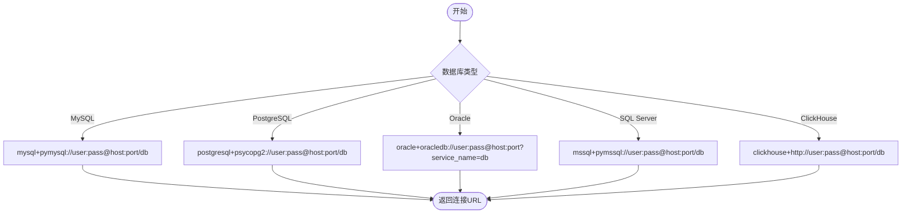
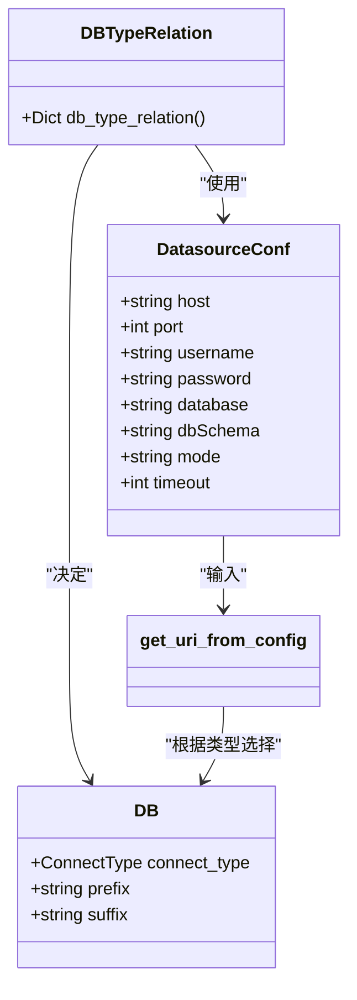
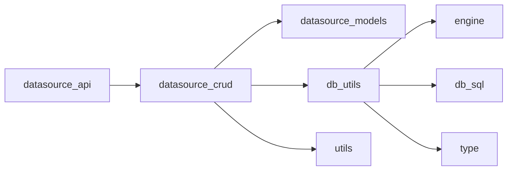
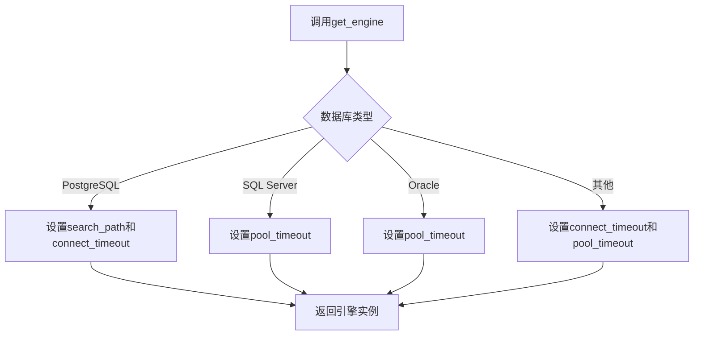
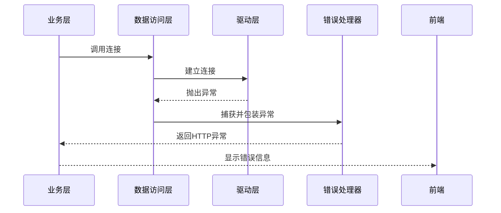

# 连接与状态管理

<cite>
**本文档引用文件**  
- [datasource.py](file://backend/apps/datasource/crud/datasource.py)
- [db.py](file://backend/apps/db/db.py)
- [utils.py](file://backend/apps/datasource/utils/utils.py)
- [engine.py](file://backend/apps/db/engine.py)
- [datasource.py](file://backend/apps/datasource/models/datasource.py)
- [db_sql.py](file://backend/apps/db/db_sql.py)
- [type.py](file://backend/apps/db/type.py)
</cite>

## 目录
1. [简介](#简介)
2. [项目结构](#项目结构)
3. [核心组件](#核心组件)
4. [架构概述](#架构概述)
5. [详细组件分析](#详细组件分析)
6. [依赖分析](#依赖分析)
7. [性能考虑](#性能考虑)
8. [故障排除指南](#故障排除指南)
9. [结论](#结论)

## 简介
本文档详细描述了SQLBot系统中数据源连接与状态管理的实现机制，重点聚焦于连接测试（check_status）功能。文档涵盖连接URL的动态构建、数据库类型差异处理、配置加密存储、连接池与超时设置、异常处理策略等关键方面，旨在为开发者和运维人员提供全面的技术参考。

## 项目结构
系统后端数据源管理模块采用分层架构设计，主要包含API接口、CRUD操作、模型定义和数据库工具四个核心部分。连接管理功能分布在`backend/apps/datasource`和`backend/apps/db`两个主要目录中，通过清晰的职责划分实现高内聚低耦合。

**图示来源**  
- [datasource.py](file://backend/apps/datasource/crud/datasource.py)
- [db.py](file://backend/apps/db/db.py)
- [engine.py](file://backend/apps/db/engine.py)

**本节来源**  
- [datasource.py](file://backend/apps/datasource/crud/datasource.py)
- [db.py](file://backend/apps/db/db.py)

## 核心组件
系统通过`check_status`函数实现数据源连接状态检测，该函数作为核心组件串联了配置解析、连接建立、状态验证等多个关键流程。连接测试过程严格遵循事务安全原则，确保不影响主业务流程。

**本节来源**  
- [datasource.py](file://backend/apps/datasource/crud/datasource.py#L37-L47)
- [db.py](file://backend/apps/db/db.py#L104-L131)

## 架构概述
系统采用分层架构实现数据源连接管理，从上至下分为接口层、业务逻辑层、数据访问层和驱动层。各层之间通过明确定义的接口进行通信，确保系统的可维护性和可扩展性。

**图示来源**  
- [datasource.py](file://backend/apps/datasource/crud/datasource.py)
- [db.py](file://backend/apps/db/db.py)

## 详细组件分析

### 连接状态检查机制分析
系统通过`check_status_by_id`和`check_status`函数实现连接状态检查，该机制支持通过数据源ID或直接传入数据源对象进行状态验证，提供了灵活的调用方式。

**图示来源**  
- [datasource.py](file://backend/apps/datasource/crud/datasource.py#L37-L47)
- [db.py](file://backend/apps/db/db.py#L104-L131)

**本节来源**  
- [datasource.py](file://backend/apps/datasource/crud/datasource.py)
- [db.py](file://backend/apps/db/db.py)

### 连接URL动态构建分析
系统通过`get_uri_from_config`函数根据不同的数据库类型动态构建连接URL，支持MySQL、PostgreSQL、Oracle等多种数据库，每种数据库都有特定的URL格式要求。

**图示来源**  
- [db.py](file://backend/apps/db/db.py#L33-L68)

**本节来源**  
- [db.py](file://backend/apps/db/db.py)

### 数据库类型差异处理分析
系统通过`db_type_relation`函数维护数据库类型与显示名称的映射关系，并在连接过程中根据不同的数据库类型采用相应的连接参数和SQL语法，确保跨数据库兼容性。

**图示来源**  
- [type.py](file://backend/apps/db/type.py#L5-L16)
- [datasource.py](file://backend/apps/datasource/models/datasource.py)
- [db.py](file://backend/apps/db/db.py)

**本节来源**  
- [type.py](file://backend/apps/db/type.py)
- [datasource.py](file://backend/apps/datasource/models/datasource.py)

## 依赖分析
系统各组件之间存在明确的依赖关系，上层组件依赖下层组件提供的服务，形成稳定的调用链。通过依赖注入和接口抽象，降低了组件间的耦合度，提高了系统的可测试性。

**图示来源**  
- [datasource.py](file://backend/apps/datasource/crud/datasource.py)
- [db.py](file://backend/apps/db/db.py)

**本节来源**  
- [datasource.py](file://backend/apps/datasource/crud/datasource.py)
- [db.py](file://backend/apps/db/db.py)

## 性能考虑
系统在连接管理方面进行了多项性能优化，包括连接超时设置、连接池配置、SQL执行优化等。通过合理的超时机制避免长时间等待，通过连接池复用减少连接建立开销。

### 连接池与超时设置
系统通过`get_engine`函数配置连接池和超时参数，确保在高并发场景下能够有效管理数据库连接资源。

**图示来源**  
- [db.py](file://backend/apps/db/db.py#L71-L94)

**本节来源**  
- [db.py](file://backend/apps/db/db.py)

## 故障排除指南
系统提供了完善的异常处理机制，在连接失败时能够捕获具体错误信息并返回有意义的错误提示，帮助用户快速定位和解决问题。

### 异常处理策略
系统采用分层异常处理策略，在不同层级捕获和处理异常，确保错误信息能够准确传递到前端。

**图示来源**  
- [db.py](file://backend/apps/db/db.py#L104-L131)
- [datasource.py](file://backend/apps/datasource/crud/datasource.py#L37-L47)

**本节来源**  
- [db.py](file://backend/apps/db/db.py)
- [datasource.py](file://backend/apps/datasource/crud/datasource.py)

## 结论
本文档详细分析了SQLBot系统中数据源连接与状态管理的实现机制。系统通过分层架构设计，实现了灵活、安全、高效的连接管理功能。通过动态URL构建、多数据库支持、加密存储、连接池优化等技术手段，确保了系统在各种场景下的稳定运行。建议在实际使用中合理配置超时参数，定期检查连接状态，以保证系统的最佳性能。