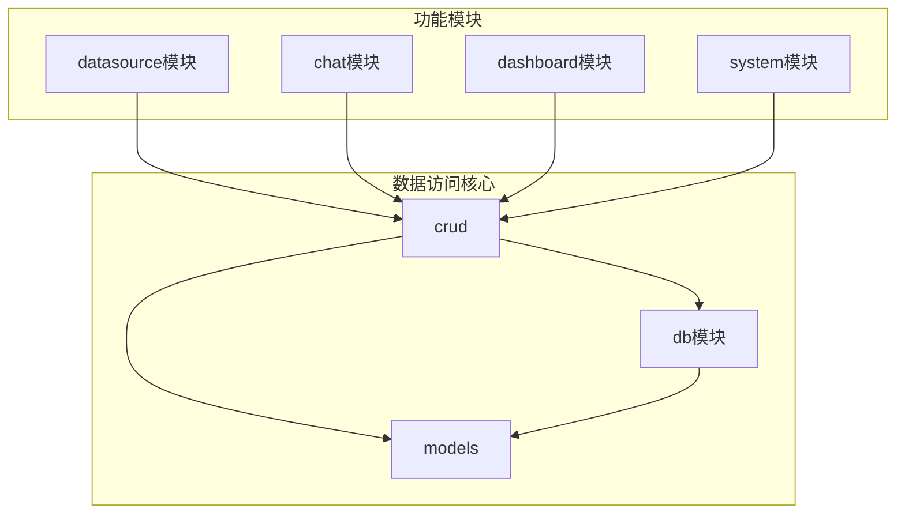
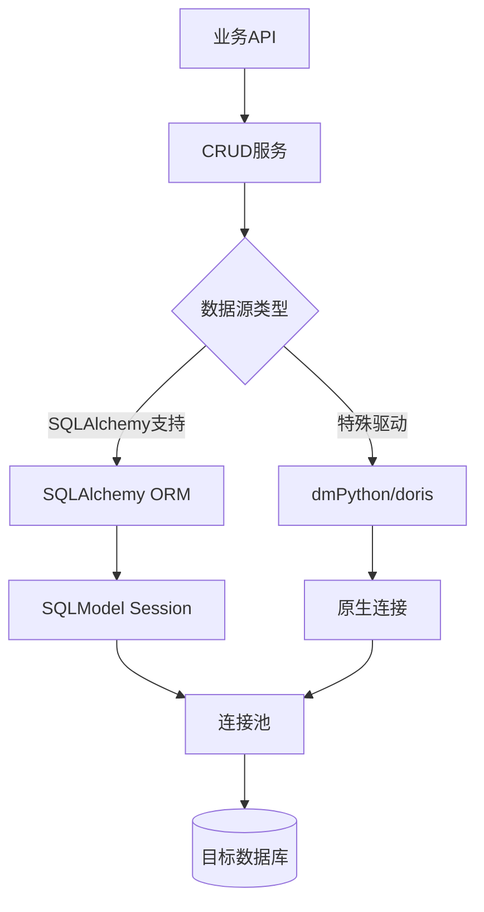
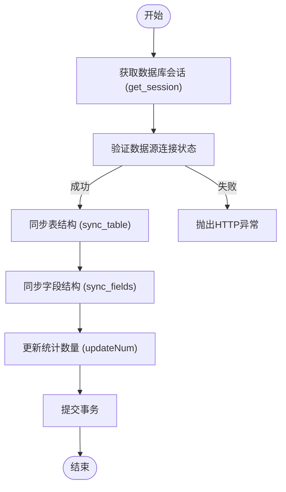
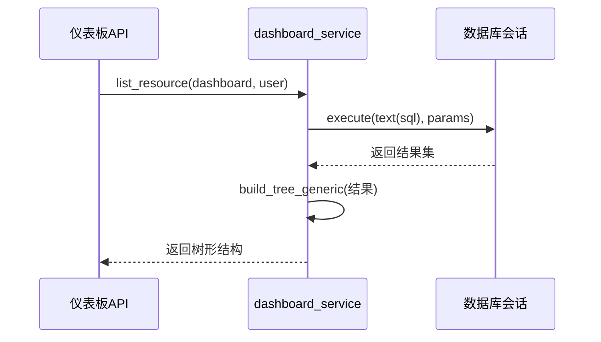
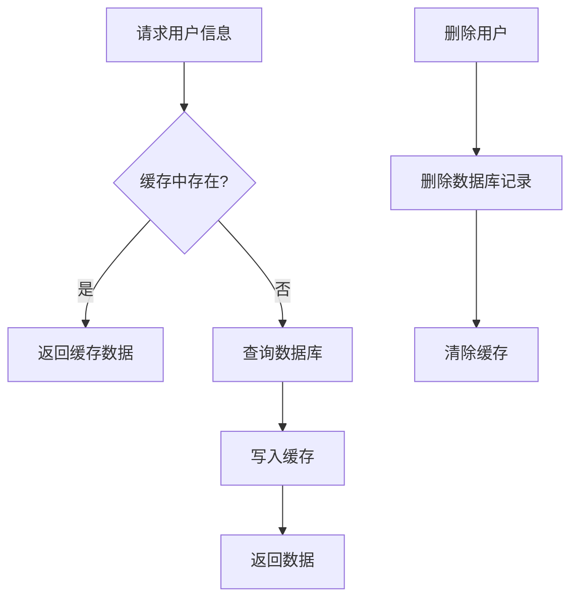
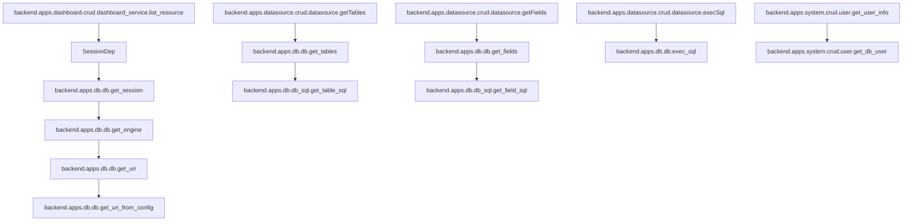

# 数据访问层

<cite>
**本文档中引用的文件**  
- [datasource.py](file://backend/apps/datasource/crud/datasource.py)
- [dashboard_service.py](file://backend/apps/dashboard/crud/dashboard_service.py)
- [user.py](file://backend/apps/system/crud/user.py)
- [assistant.py](file://backend/apps/system/crud/assistant.py)
- [workspace.py](file://backend/apps/system/crud/workspace.py)
- [db.py](file://backend/apps/db/db.py)
- [db_sql.py](file://backend/apps/db/db_sql.py)
- [engine.py](file://backend/apps/db/engine.py)
- [deps.py](file://backend/common/core/deps.py)
- [datasource_model.py](file://backend/apps/datasource/models/datasource.py)
- [chat_model.py](file://backend/apps/chat/models/chat_model.py)
- [dashboard_model.py](file://backend/apps/dashboard/models/dashboard_model.py)
- [system_model.py](file://backend/apps/system/models/system_model.py)
</cite>

## 目录
1. [简介](#简介)
2. [项目结构](#项目结构)
3. [核心组件](#核心组件)
4. [架构概述](#架构概述)
5. [详细组件分析](#详细组件分析)
6. [依赖分析](#依赖分析)
7. [性能考虑](#性能考虑)
8. [故障排除指南](#故障排除指南)
9. [结论](#结论)

## 简介
本文档详细描述了SQLBot项目中数据访问层的实现机制，重点涵盖CRUD操作的封装模式、SQLModel与原生SQL的混合使用策略、数据库会话管理、多数据库引擎支持以及最佳实践。文档分析了`datasource`、`chat`、`dashboard`和`system`模块中的CRUD实现，并深入探讨了底层数据库操作的抽象与优化。

## 项目结构
数据访问层主要分布在`backend/apps`目录下的各个功能模块中，每个模块通过独立的`crud`子目录封装其数据库操作。核心数据库工具和配置位于`backend/apps/db`包中，而通用依赖项定义在`backend/common/core/deps.py`中。

**图示来源**  
- [datasource.py](file://backend/apps/datasource/crud/datasource.py)
- [dashboard_service.py](file://backend/apps/dashboard/crud/dashboard_service.py)
- [user.py](file://backend/apps/system/crud/user.py)
- [db.py](file://backend/apps/db/db.py)

## 核心组件
数据访问层的核心组件包括：基于SQLModel的CRUD操作封装、原生SQL执行引擎、多数据库连接管理、会话依赖注入以及连接池配置。各业务模块（如datasource、dashboard）通过调用这些核心组件实现具体的数据持久化逻辑。

**章节来源**  
- [db.py](file://backend/apps/db/db.py#L1-L287)
- [db_sql.py](file://backend/apps/db/db_sql.py#L1-L186)
- [engine.py](file://backend/apps/db/engine.py#L1-L71)

## 架构概述
系统采用分层架构，上层业务逻辑通过`SessionDep`依赖注入获取数据库会话，调用封装好的CRUD服务。CRUD服务内部根据数据源类型决定使用SQLAlchemy ORM还是原生数据库驱动执行操作。对于元数据查询（如表、字段信息），系统通过`db_sql.py`生成针对不同数据库的专用SQL语句。

**图示来源**  
- [db.py](file://backend/apps/db/db.py#L1-L287)
- [deps.py](file://backend/common/core/deps.py#L1-L36)

## 详细组件分析
本节深入分析数据访问层的关键组件，包括CRUD操作模式、SQLModel与原生SQL的混合使用、会话管理及多数据库支持机制。

### 数据源模块CRUD分析
`datasource`模块的CRUD层负责管理数据源配置、表结构和字段元数据的持久化。它不仅操作本地数据库中的`core_datasource`等表，还通过动态连接查询目标数据库的元数据。

#### CRUD操作模式
该模块实现了标准的CRUD操作，如创建、更新、删除数据源，并通过`sync_table`和`sync_fields`方法同步目标数据库的表和字段结构。所有操作均通过`SessionDep`获取会话实例，确保事务一致性。

**图示来源**  
- [datasource.py](file://backend/apps/datasource/crud/datasource.py#L1-L373)

**章节来源**  
- [datasource.py](file://backend/apps/datasource/crud/datasource.py#L1-L373)

### 仪表板模块CRUD分析
`dashboard`模块的CRUD服务管理仪表板资源的生命周期，包括创建、更新、删除和查询。它直接使用原生SQL进行复杂查询和树形结构构建。

#### 原生SQL使用策略
该模块在`list_resource`和`load_resource`方法中使用`text()`包装的原生SQL，以实现灵活的动态查询和多表连接。这与简单的ORM查询形成互补，用于处理复杂的数据检索场景。

**图示来源**  
- [dashboard_service.py](file://backend/apps/dashboard/crud/dashboard_service.py#L1-L137)

**章节来源**  
- [dashboard_service.py](file://backend/apps/dashboard/crud/dashboard_service.py#L1-L137)

### 系统模块CRUD分析
`system`模块的CRUD组件处理用户、工作区等核心系统实体的管理，集成了缓存机制以提升性能。

#### 缓存与数据库协同
`get_user_info`方法使用`@cache`装饰器，优先从缓存读取用户信息，未命中时才查询数据库。`single_delete`方法则使用`@clear_cache`确保数据删除后缓存同步失效，维护数据一致性。

**图示来源**  
- [user.py](file://backend/apps/system/crud/user.py#L1-L88)

**章节来源**  
- [user.py](file://backend/apps/system/crud/user.py#L1-L88)

## 依赖分析
数据访问层的组件间存在清晰的依赖关系，核心数据库操作被抽象为可复用的服务。

**图示来源**  
- [deps.py](file://backend/common/core/deps.py#L1-L36)
- [db.py](file://backend/apps/db/db.py#L1-L287)
- [db_sql.py](file://backend/apps/db/db_sql.py#L1-L186)

**章节来源**  
- [deps.py](file://backend/common/core/deps.py#L1-L36)
- [db.py](file://backend/apps/db/db.py#L1-L287)

## 性能考虑
系统通过连接池、缓存和批量操作优化数据访问性能。`get_engine`函数创建的SQLAlchemy引擎内置连接池，避免了频繁建立连接的开销。对于元数据查询，系统缓存了常用信息，并通过`get_schema`、`get_tables`等方法高效获取。

## 故障排除指南
当遇到数据库连接问题时，应首先检查`check_connection`方法的执行结果。对于SQL执行错误，可通过`exec_sql`返回的SQL语句进行调试。缓存相关问题可调用`clean_user_cache`等方法手动清除。

**章节来源**  
- [db.py](file://backend/apps/db/db.py#L1-L287)
- [user.py](file://backend/apps/system/crud/user.py#L1-L88)

## 结论
SQLBot的数据访问层设计合理，通过分层和模块化实现了高内聚、低耦合。它灵活地结合了SQLModel的便捷性和原生SQL的强大功能，支持多种数据库，并通过会话依赖和连接池确保了性能与可靠性。遵循本文档的最佳实践，可以有效进行数据库操作和问题排查。