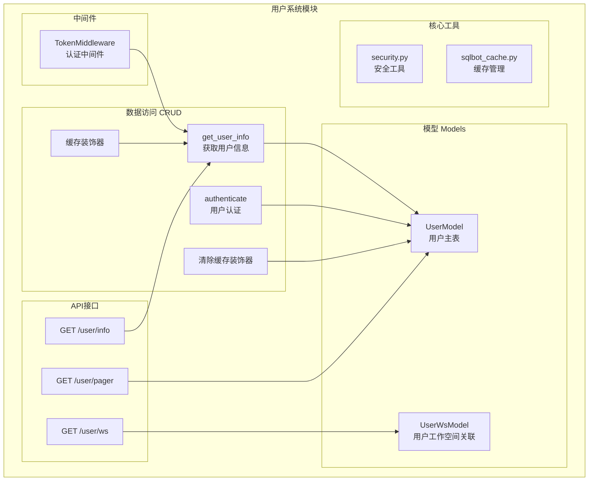
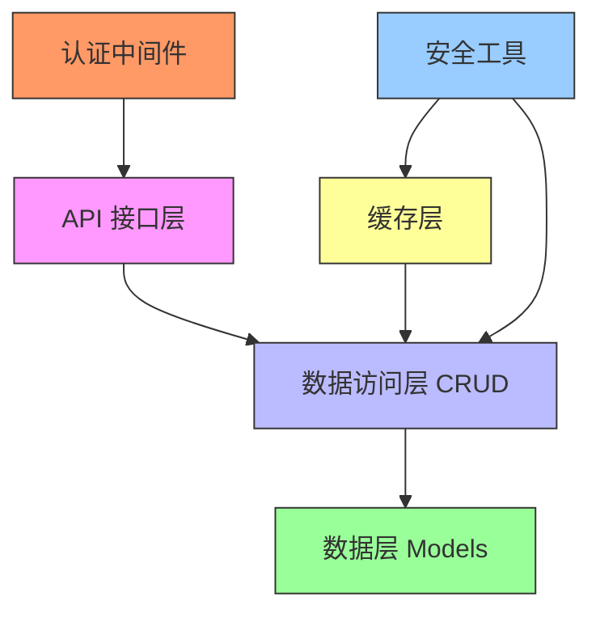
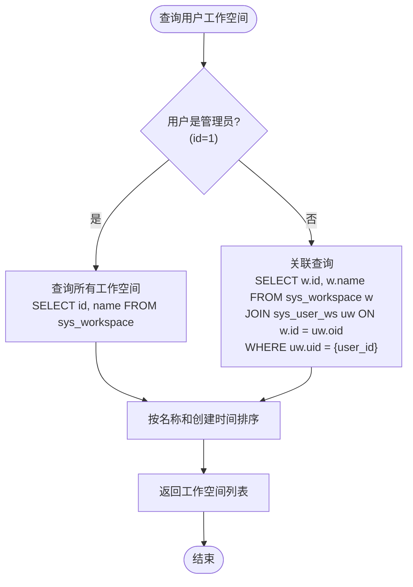
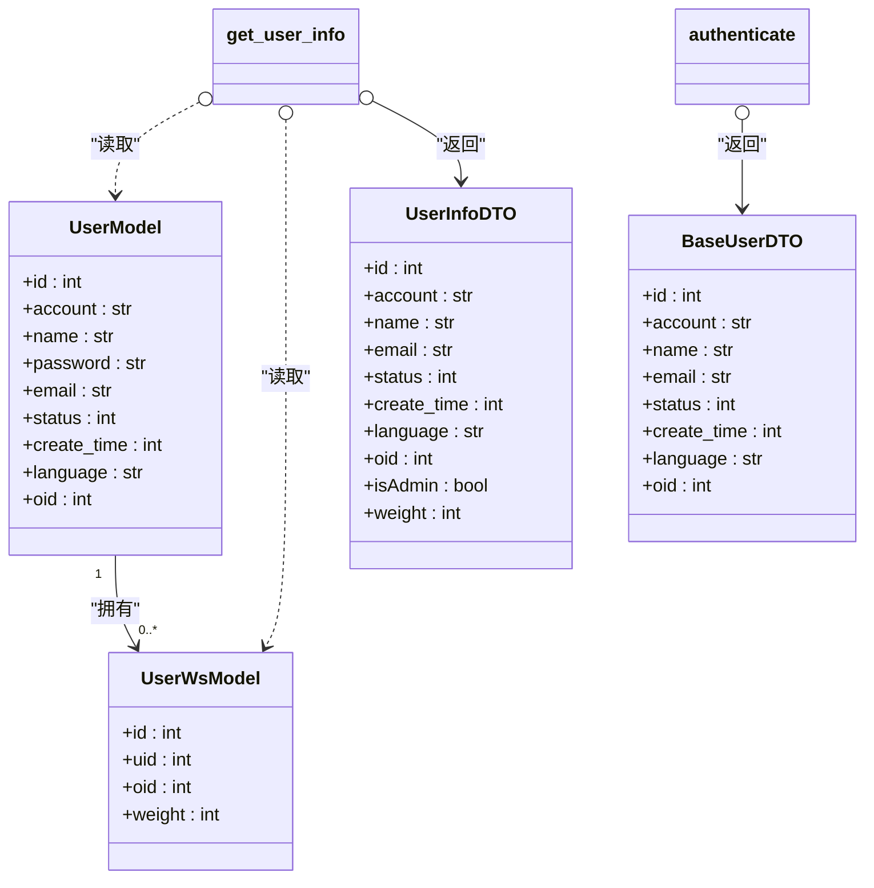
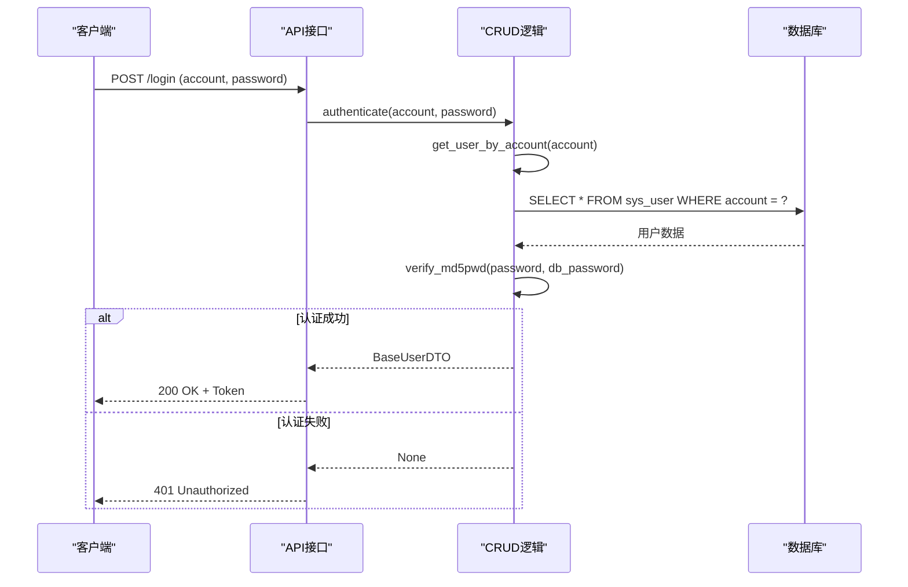
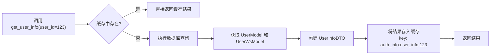
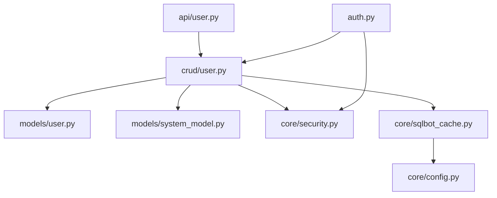

# 用户系统

<cite>
**本文档引用的文件**   
- [user.py](file://backend/apps/system/models/user.py)
- [user.py](file://backend/apps/system/crud/user.py)
- [sqlbot_cache.py](file://backend/common/core/sqlbot_cache.py)
- [user.py](file://backend/apps/system/api/user.py)
- [auth.py](file://backend/apps/system/middleware/auth.py)
- [system_model.py](file://backend/apps/system/models/system_model.py)
- [security.py](file://backend/common/core/security.py)
</cite>

## 目录
1. [简介](#简介)
2. [项目结构](#项目结构)
3. [核心组件](#核心组件)
4. [架构概述](#架构概述)
5. [详细组件分析](#详细组件分析)
6. [依赖分析](#依赖分析)
7. [性能考虑](#性能考虑)
8. [故障排除指南](#故障排除指南)
9. [结论](#结论)

## 简介
本文档详细描述了用户系统数据访问层的设计与实现，重点涵盖用户信息查询、认证机制、缓存策略、权限控制以及数据安全等核心功能。系统基于SQLModel构建数据模型，通过装饰器实现缓存管理，并采用MD5密码验证确保用户凭证安全。文档还阐述了用户与工作空间的关联逻辑及敏感信息的脱敏处理。

## 项目结构
用户系统相关代码主要分布在`backend/apps/system/`目录下，包含模型定义、数据访问逻辑、API接口和中间件四个核心部分。数据模型位于`models`子目录，CRUD操作在`crud`子目录中实现，API路由定义于`api`子目录，而认证中间件则位于`middleware`目录。通用核心功能如缓存和安全工具位于`common/core/`目录。

**Diagram sources**
- [user.py](file://backend/apps/system/models/user.py#L20-L21)
- [system_model.py](file://backend/apps/system/models/system_model.py#L41-L42)
- [user.py](file://backend/apps/system/crud/user.py#L26-L36)
- [user.py](file://backend/apps/system/crud/user.py#L38-L44)
- [sqlbot_cache.py](file://backend/common/core/sqlbot_cache.py#L53-L87)
- [sqlbot_cache.py](file://backend/common/core/sqlbot_cache.py#L89-L121)
- [user.py](file://backend/apps/system/api/user.py#L24-L25)
- [auth.py](file://backend/apps/system/middleware/auth.py#L15-L16)

**Section sources**
- [user.py](file://backend/apps/system/models/user.py#L1-L23)
- [user.py](file://backend/apps/system/crud/user.py#L1-L88)
- [sqlbot_cache.py](file://backend/common/core/sqlbot_cache.py#L1-L140)
- [user.py](file://backend/apps/system/api/user.py#L1-L236)
- [auth.py](file://backend/apps/system/middleware/auth.py#L1-L198)

## 核心组件

用户系统的核心组件包括`UserModel`（用户数据模型）、`UserWsModel`（用户工作空间关联模型）、`get_user_info`（用户信息查询）、`authenticate`（用户认证）以及基于装饰器的缓存机制。这些组件共同实现了用户数据的持久化、查询、认证和高效访问。

**Section sources**
- [user.py](file://backend/apps/system/models/user.py#L20-L21)
- [system_model.py](file://backend/apps/system/models/system_model.py#L41-L42)
- [user.py](file://backend/apps/system/crud/user.py#L26-L36)
- [user.py](file://backend/apps/system/crud/user.py#L38-L44)

## 架构概述

系统采用分层架构，从下至上分别为数据层、数据访问层（DAO）、业务逻辑层和API接口层。`UserModel`和`UserWsModel`构成数据层，定义了数据库表结构。`crud/user.py`中的函数构成数据访问层，封装了对数据库的直接操作。API接口层通过调用这些函数来处理HTTP请求。缓存机制作为横切关注点，通过装饰器注入到关键的数据访问函数中，以提升性能。

**Diagram sources**
- [user.py](file://backend/apps/system/api/user.py#L24-L25)
- [user.py](file://backend/apps/system/crud/user.py#L14-L16)
- [user.py](file://backend/apps/system/models/user.py#L20-L21)
- [sqlbot_cache.py](file://backend/common/core/sqlbot_cache.py#L53-L87)
- [auth.py](file://backend/apps/system/middleware/auth.py#L15-L16)
- [security.py](file://backend/common/core/security.py#L35-L36)

## 详细组件分析

### 用户模型与工作空间关联分析

#### 用户与工作空间关联逻辑

**Diagram sources**
- [user.py](file://backend/apps/system/crud/user.py#L68-L78)

#### 用户信息查询与权限控制

**Diagram sources**
- [user.py](file://backend/apps/system/models/user.py#L10-L18)
- [system_model.py](file://backend/apps/system/models/system_model.py#L36-L39)
- [user.py](file://backend/apps/system/crud/user.py#L26-L36)
- [user.py](file://backend/apps/system/crud/user.py#L38-L44)

### 认证与安全机制分析

#### 用户认证流程

**Diagram sources**
- [user.py](file://backend/apps/system/crud/user.py#L38-L44)
- [security.py](file://backend/common/core/security.py#L35-L36)

#### 缓存机制工作流程

**Diagram sources**
- [user.py](file://backend/apps/system/crud/user.py#L26-L36)
- [sqlbot_cache.py](file://backend/common/core/sqlbot_cache.py#L53-L87)

**Section sources**
- [user.py](file://backend/apps/system/crud/user.py#L26-L36)
- [user.py](file://backend/apps/system/crud/user.py#L38-L44)
- [security.py](file://backend/common/core/security.py#L35-L36)
- [sqlbot_cache.py](file://backend/common/core/sqlbot_cache.py#L53-L87)
- [sqlbot_cache.py](file://backend/common/core/sqlbot_cache.py#L89-L121)

## 依赖分析

系统内部组件间存在清晰的依赖关系。API接口依赖于CRUD函数，CRUD函数依赖于数据模型和核心工具。`get_user_info`函数依赖于`get_db_user`来获取基础用户数据，并依赖`UserWsModel`来查询工作空间权重。缓存装饰器`@cache`和`@clear_cache`依赖于`sqlbot_cache.py`中的`custom_key_builder`和底层缓存后端（内存或Redis）。整个认证流程依赖于`security.py`中的密码验证函数。

**Diagram sources**
- [user.py](file://backend/apps/system/api/user.py#L1-L236)
- [user.py](file://backend/apps/system/crud/user.py#L1-L88)
- [user.py](file://backend/apps/system/models/user.py#L1-L23)
- [system_model.py](file://backend/apps/system/models/system_model.py#L1-L57)
- [security.py](file://backend/common/core/security.py#L1-L43)
- [sqlbot_cache.py](file://backend/common/core/sqlbot_cache.py#L1-L140)
- [auth.py](file://backend/apps/system/middleware/auth.py#L1-L198)

**Section sources**
- [user.py](file://backend/apps/system/api/user.py#L1-L236)
- [user.py](file://backend/apps/system/crud/user.py#L1-L88)
- [user.py](file://backend/apps/system/models/user.py#L1-L23)
- [system_model.py](file://backend/apps/system/models/system_model.py#L1-L57)
- [security.py](file://backend/common/core/security.py#L1-L43)
- [sqlbot_cache.py](file://backend/common/core/sqlbot_cache.py#L1-L140)
- [auth.py](file://backend/apps/system/middleware/auth.py#L1-L198)

## 性能考虑

为优化高并发查询性能，系统采用了多级缓存策略。`@cache`装饰器将`get_user_info`等高频查询结果存储在内存或Redis中，显著减少了数据库压力。缓存键通过`custom_key_builder`函数根据`user_id`生成，确保了缓存的精确性。当用户数据更新时，`@clear_cache`装饰器会自动清除相关缓存，保证数据一致性。对于用户列表分页查询，系统通过先查询ID再批量获取详情的方式，减少了JOIN操作的开销。

## 故障排除指南

常见问题包括用户无法登录、缓存未生效或工作空间权限错误。若用户无法登录，请检查`sys_user`表中的密码是否为MD5哈希值，并确认`verify_md5pwd`函数的逻辑。若缓存未生效，请检查`settings.CACHE_TYPE`配置是否正确（memory或redis），并确认`init_sqlbot_cache`已被调用。工作空间权限问题通常源于`sys_user_ws`表中缺少用户与工作空间的关联记录，或用户的`oid`字段未正确设置。

**Section sources**
- [user.py](file://backend/apps/system/crud/user.py#L38-L44)
- [sqlbot_cache.py](file://backend/common/core/sqlbot_cache.py#L123-L140)
- [user.py](file://backend/apps/system/crud/user.py#L68-L78)

## 结论

本文档全面解析了用户系统数据访问层的实现。系统通过`UserModel`和`UserWsModel`实现了用户数据与工作空间的关联。`authenticate`函数结合`verify_md5pwd`确保了认证安全。基于装饰器的缓存机制（`@cache`和`@clear_cache`）有效提升了查询性能。整体设计清晰，职责分离，为系统的稳定性和可维护性提供了保障。建议在生产环境中使用Redis作为缓存后端以支持多进程部署。