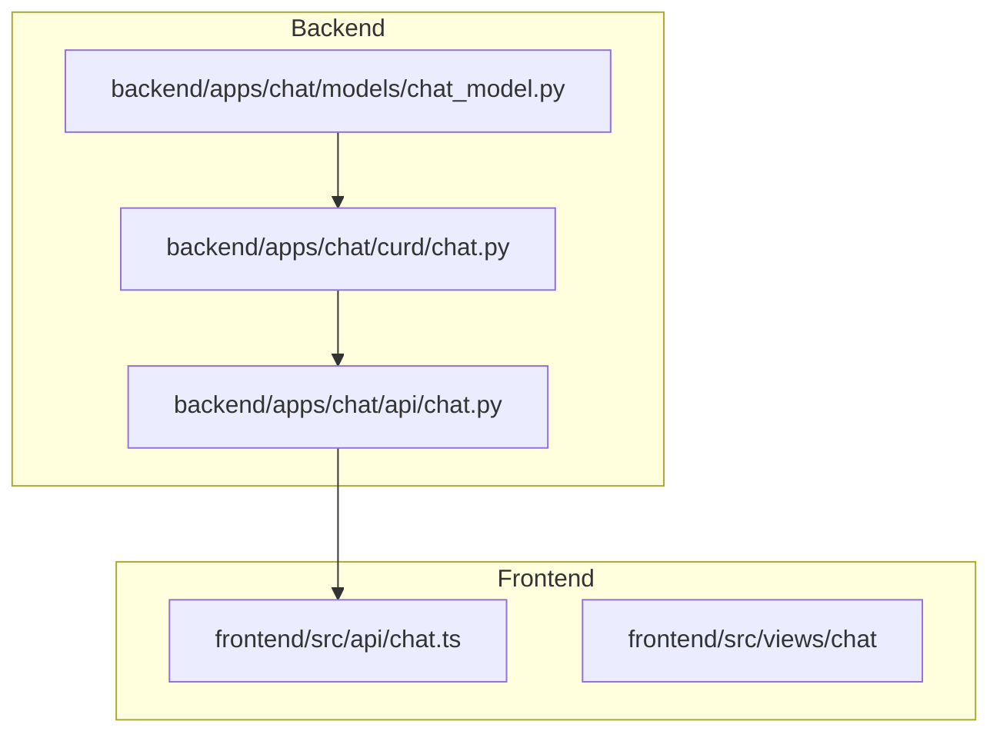
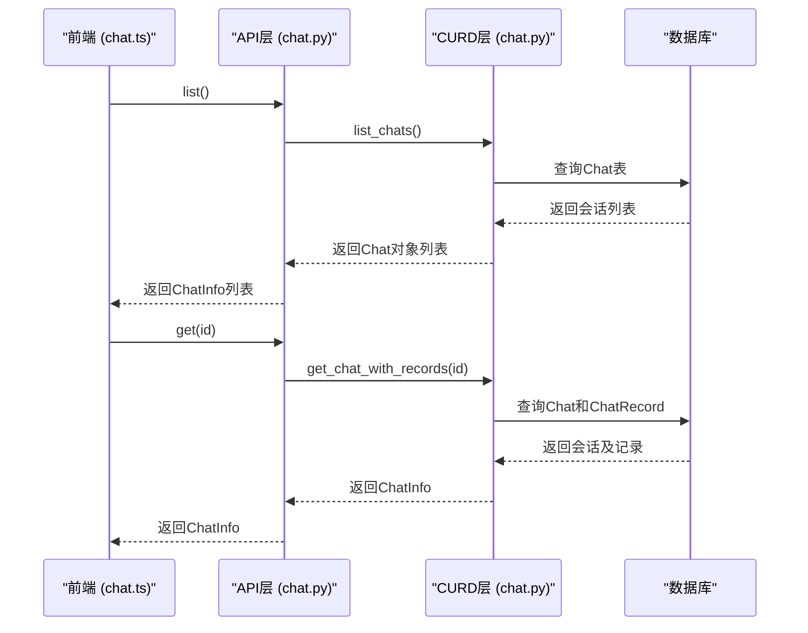
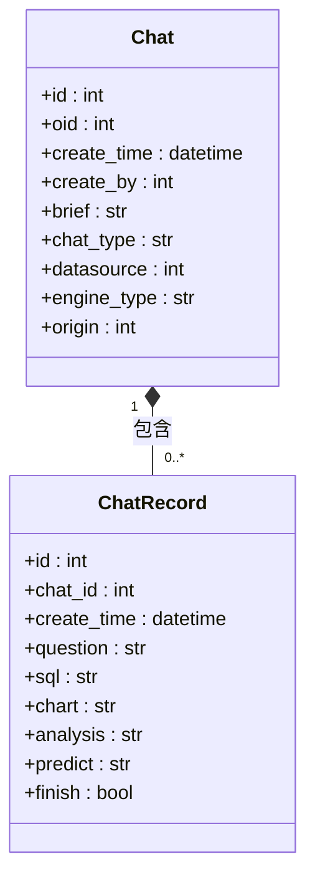
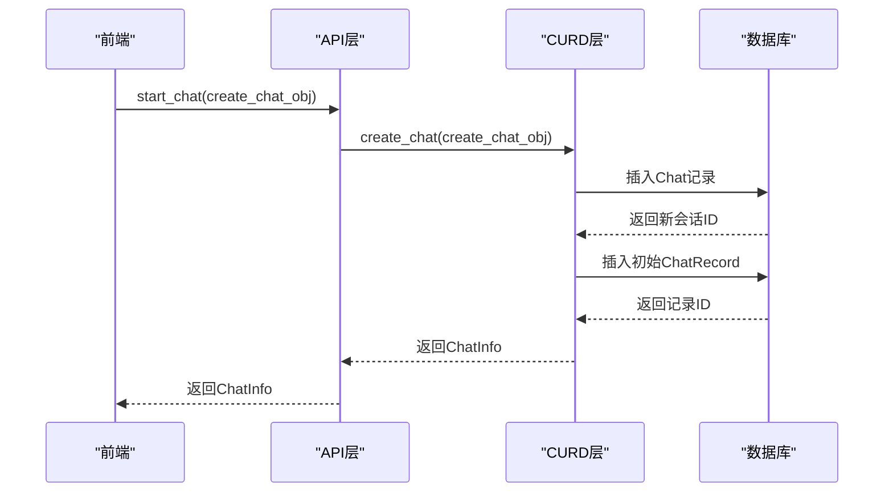
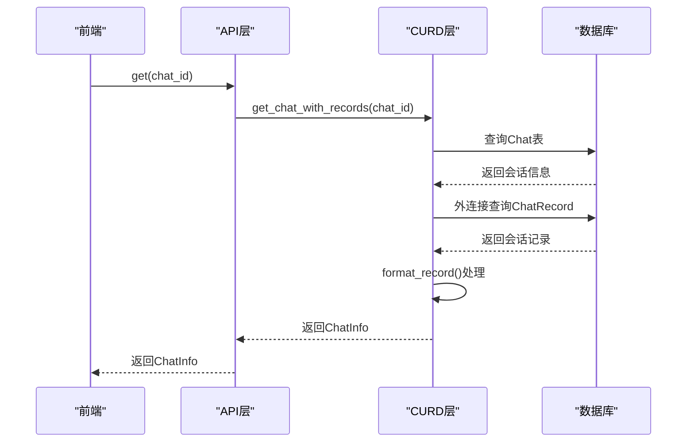
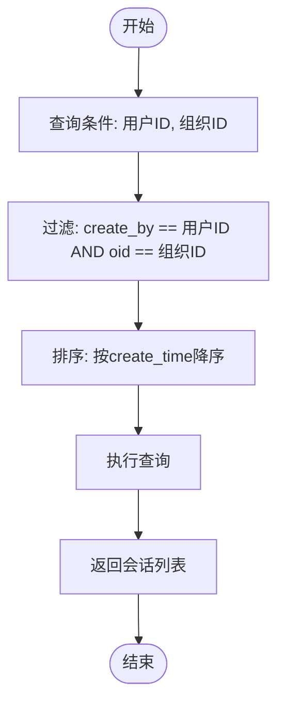
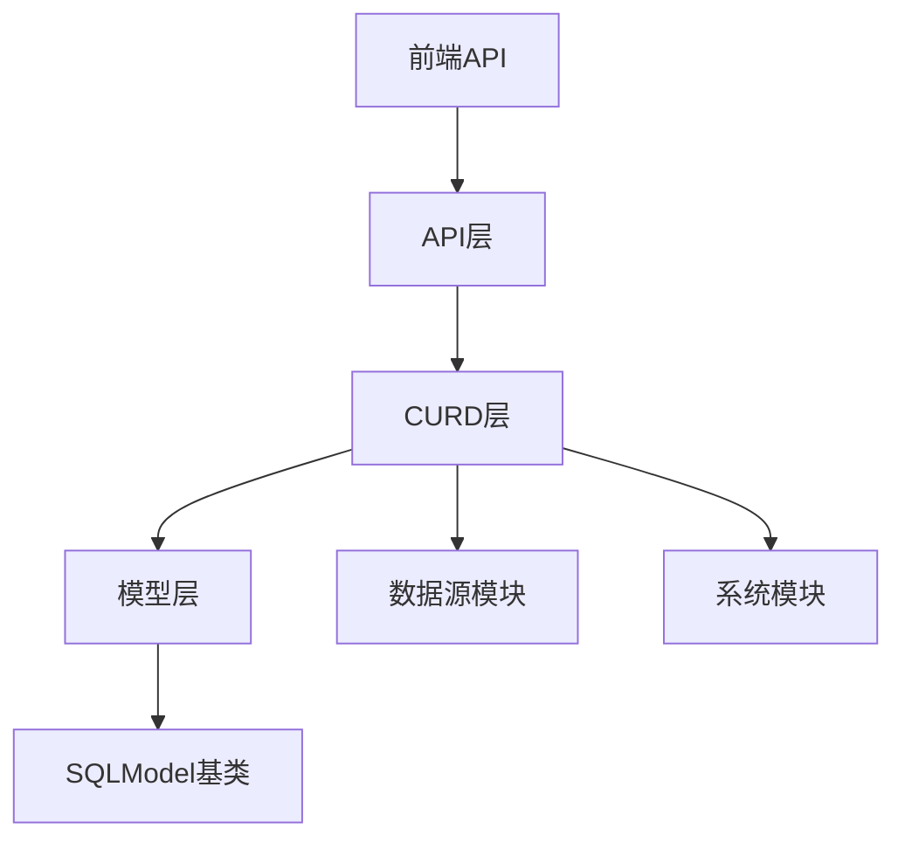

# 会话管理

<cite>
**Referenced Files in This Document**   
- [chat_model.py](file://backend/apps/chat/models/chat_model.py)
- [chat.py](file://backend/apps/chat/curd/chat.py)
- [chat.py](file://backend/apps/chat/api/chat.py)
- [chat.ts](file://frontend/src/api/chat.ts)
</cite>

## 目录
1. [简介](#简介)
2. [项目结构](#项目结构)
3. [核心组件](#核心组件)
4. [架构概述](#架构概述)
5. [详细组件分析](#详细组件分析)
6. [依赖分析](#依赖分析)
7. [性能考虑](#性能考虑)
8. [故障排除指南](#故障排除指南)
9. [结论](#结论)

## 简介
本文档详细阐述了SQLBot系统中会话管理功能的设计与实现。重点分析了聊天会话（Chat）实体的结构设计、业务逻辑以及核心操作的实现机制。文档涵盖了会话创建、上下文加载、分页查询等关键功能，并解释了会话类型、数据源关联、引擎类型等字段的用途和交互逻辑。通过前后端API的协同工作，实现了完整的会话生命周期管理。

## 项目结构
会话管理功能分布在前后端多个模块中，形成了清晰的分层架构。后端主要包含模型定义、数据访问层和API接口，前端则负责API调用和状态管理。

**Diagram sources**
- [chat_model.py](file://backend/apps/chat/models/chat_model.py)
- [chat.py](file://backend/apps/chat/curd/chat.py)
- [chat.py](file://backend/apps/chat/api/chat.py)
- [chat.ts](file://frontend/src/api/chat.ts)

**Section sources**
- [chat_model.py](file://backend/apps/chat/models/chat_model.py)
- [chat.py](file://backend/apps/chat/curd/chat.py)
- [chat.py](file://backend/apps/chat/api/chat.py)
- [chat.ts](file://frontend/src/api/chat.ts)

## 核心组件
会话管理的核心组件包括聊天会话实体（Chat）、聊天记录实体（ChatRecord）以及相关的CURD操作和API接口。这些组件共同实现了会话的创建、查询、更新和删除功能，支持完整的会话生命周期管理。

**Section sources**
- [chat_model.py](file://backend/apps/chat/models/chat_model.py#L62-L73)
- [chat.py](file://backend/apps/chat/curd/chat.py#L29-L33)
- [chat.py](file://backend/apps/chat/api/chat.py#L10-L14)

## 架构概述
会话管理采用典型的分层架构，从前端API调用到后端数据持久化，形成了清晰的数据流。前端通过API接口与后端交互，后端通过CURD层操作数据库，实现了前后端的解耦。

**Diagram sources**
- [chat_model.py](file://backend/apps/chat/models/chat_model.py)
- [chat.py](file://backend/apps/chat/curd/chat.py)
- [chat.py](file://backend/apps/chat/api/chat.py)
- [chat.ts](file://frontend/src/api/chat.ts)

## 详细组件分析

### 聊天会话实体分析
聊天会话实体（Chat）是会话管理的核心数据结构，定义了会话的基本属性和关系。

#### 类图

**Diagram sources**
- [chat_model.py](file://backend/apps/chat/models/chat_model.py#L62-L73)
- [chat_model.py](file://backend/apps/chat/models/chat_model.py#L76-L103)

**Section sources**
- [chat_model.py](file://backend/apps/chat/models/chat_model.py#L62-L103)

### 会话创建与上下文加载分析
会话创建和上下文加载是会话管理的核心操作，涉及前后端的协同工作。

#### 会话创建序列图

**Diagram sources**
- [chat.py](file://backend/apps/chat/curd/chat.py#L202-L245)
- [chat.py](file://backend/apps/chat/api/chat.py#L88-L94)

#### 上下文加载序列图

**Diagram sources**
- [chat.py](file://backend/apps/chat/curd/chat.py#L103-L200)
- [chat.py](file://backend/apps/chat/api/chat.py#L16-L22)

**Section sources**
- [chat.py](file://backend/apps/chat/curd/chat.py#L103-L200)
- [chat.py](file://backend/apps/chat/api/chat.py#L16-L22)

### 分页查询分析
分页查询功能通过list_chats方法实现，支持按用户和组织进行会话列表的查询。

#### 分页查询流程图

**Diagram sources**
- [chat.py](file://backend/apps/chat/curd/chat.py#L29-L33)
- [chat.py](file://backend/apps/chat/api/chat.py#L10-L14)

**Section sources**
- [chat.py](file://backend/apps/chat/curd/chat.py#L29-L33)

## 依赖分析
会话管理组件依赖于多个其他模块，形成了复杂的依赖关系网络。

**Diagram sources**
- [chat.py](file://backend/apps/chat/api/chat.py)
- [chat.py](file://backend/apps/chat/curd/chat.py)
- [chat_model.py](file://backend/apps/chat/models/chat_model.py)

**Section sources**
- [chat.py](file://backend/apps/chat/api/chat.py)
- [chat.py](file://backend/apps/chat/curd/chat.py)
- [chat_model.py](file://backend/apps/chat/models/chat_model.py)

## 性能考虑
会话管理在性能方面有以下考虑和优化：

1. **分页策略**：list_chats方法通过数据库查询直接获取会话列表，避免了全量加载。
2. **外连接优化**：get_chat_with_records方法使用外连接查询，减少了数据库访问次数。
3. **数据格式化**：format_record方法在CURD层处理数据格式化，减轻了数据库负担。
4. **异步处理**：API层使用asyncio.to_thread包装同步方法，提高了接口响应性能。

**Section sources**
- [chat.py](file://backend/apps/chat/curd/chat.py#L29-L33)
- [chat.py](file://backend/apps/chat/curd/chat.py#L103-L200)
- [chat.py](file://backend/apps/chat/api/chat.py#L16-L22)

## 故障排除指南
常见问题及解决方案：

1. **会话无法创建**：检查create_chat_obj中的datasource是否为空，确保数据源存在。
2. **会话记录加载失败**：确认会话ID和用户权限，确保会话属于当前用户。
3. **数据源信息缺失**：检查数据源模块，确保CoreDatasource表中有对应记录。
4. **性能问题**：监控数据库查询性能，必要时添加索引优化查询。

**Section sources**
- [chat.py](file://backend/apps/chat/curd/chat.py#L202-L245)
- [chat.py](file://backend/apps/chat/curd/chat.py#L103-L200)

## 结论
会话管理功能通过清晰的分层架构和合理的数据模型设计，实现了完整的会话生命周期管理。前后端通过定义良好的API接口进行交互，确保了系统的可维护性和扩展性。通过外连接查询和异步处理等优化手段，保证了系统的性能表现。未来可以考虑增加会话搜索、标签管理等高级功能，进一步提升用户体验。