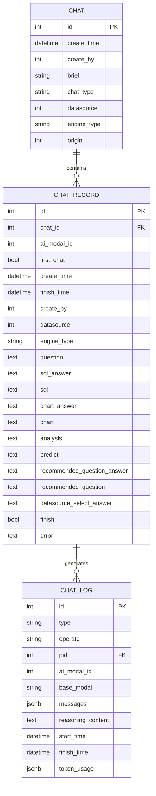
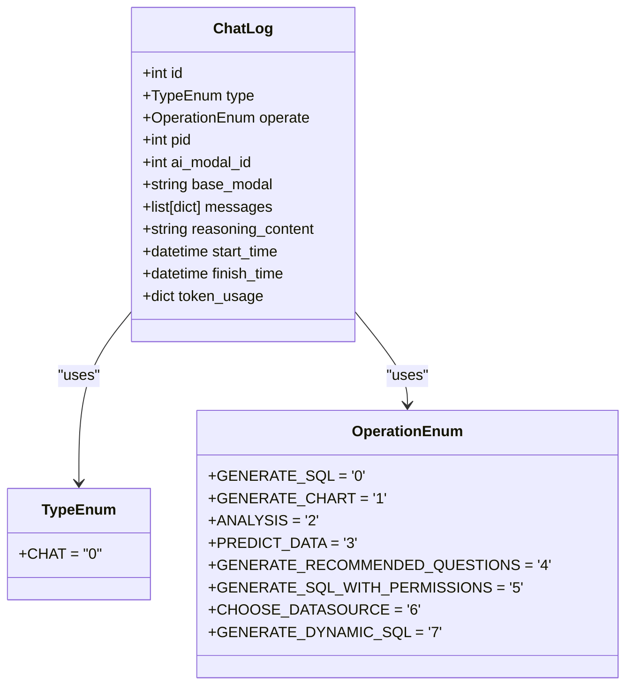
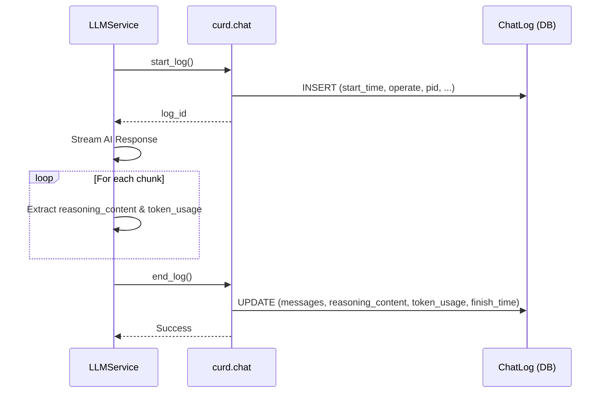
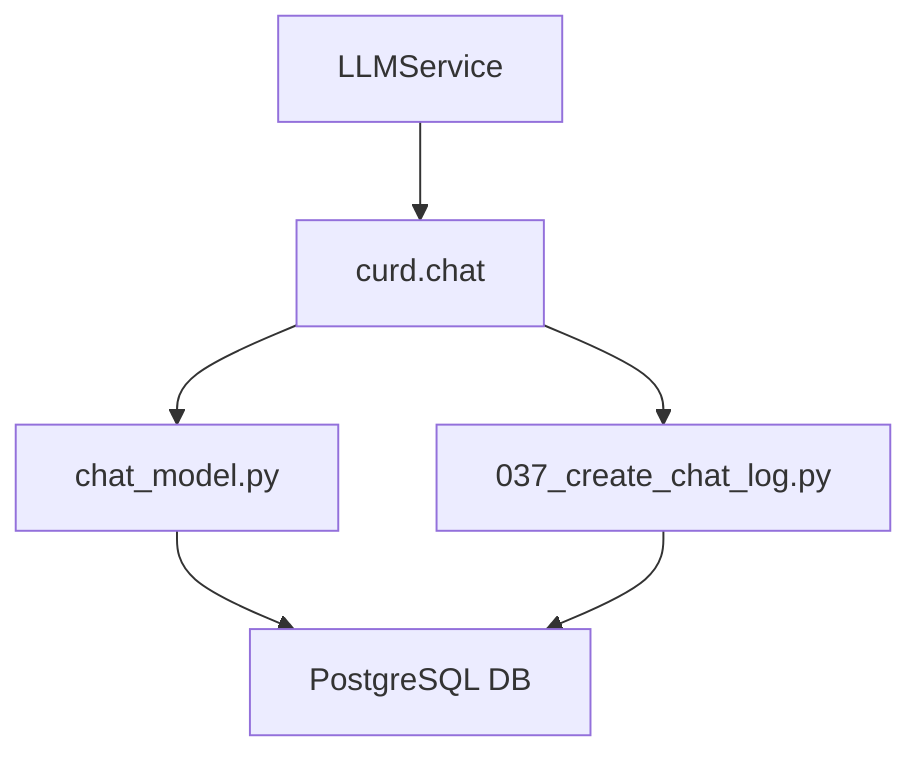

# 日志跟踪

<cite>
**Referenced Files in This Document**   
- [chat_model.py](file://backend/apps/chat/models/chat_model.py)
- [037_create_chat_log.py](file://backend/alembic/versions/037_create_chat_log.py)
- [chat.py](file://backend/apps/chat/curd/chat.py)
- [llm.py](file://backend/apps/chat/task/llm.py)
</cite>

## 目录
1. [简介](#简介)
2. [核心组件](#核心组件)
3. [架构概述](#架构概述)
4. [详细组件分析](#详细组件分析)
5. [依赖分析](#依赖分析)
6. [性能考虑](#性能考虑)
7. [故障排除指南](#故障排除指南)
8. [结论](#结论)

## 简介
本文档详细解析了SQLBot系统中聊天日志（ChatLog）实体的设计与用途。该日志系统用于跟踪AI推理过程、进行性能分析和故障排查。文档重点说明了日志类型（type）、操作类型（operate）、推理内容（reasoning_content）和令牌使用（token_usage）等关键字段的记录机制。同时，阐述了JSONB字段（messages、token_usage）的存储优势和查询模式，并提供了日志数据的查询示例和监控告警配置建议。

## 核心组件
聊天日志功能的核心是`ChatLog`实体，它被设计用于记录AI推理过程中的各种操作。该实体通过`type`和`operate`字段对日志进行分类，利用`messages`字段存储完整的对话消息链，`reasoning_content`字段记录AI的推理过程，`token_usage`字段跟踪令牌消耗情况。这些数据对于理解AI行为、优化性能和诊断问题至关重要。

**Section sources**
- [chat_model.py](file://backend/apps/chat/models/chat_model.py#L45-L59)

## 架构概述
聊天日志系统是SQLBot应用架构中的一个关键组成部分，它与聊天（Chat）、聊天记录（ChatRecord）等实体紧密协作。当用户发起一个会话时，系统会创建一个`Chat`实例，随后的每一个AI操作（如生成SQL、生成图表等）都会被记录为一个`ChatLog`条目。这些日志条目通过`pid`字段关联到其父级`ChatRecord`，从而构建了一个完整的操作历史。

**Diagram sources **
- [chat_model.py](file://backend/apps/chat/models/chat_model.py#L45-L59)

## 详细组件分析

### ChatLog 实体分析
`ChatLog`实体是整个日志跟踪功能的核心，其设计旨在全面记录AI的每一次操作。

#### 字段设计与用途

**Diagram sources **
- [chat_model.py](file://backend/apps/chat/models/chat_model.py#L26-L40)

**Section sources**
- [chat_model.py](file://backend/apps/chat/models/chat_model.py#L45-L59)

#### 日志记录流程
当AI执行一个操作时，系统会启动一个日志记录流程。首先，调用`start_log`函数创建一个`ChatLog`实例并记录开始时间。然后，AI模型开始流式响应，系统会实时捕获每个响应块（chunk）中的`reasoning_content`和`token_usage`信息。最后，当操作完成时，调用`end_log`函数更新日志，填充`messages`、`reasoning_content`、`token_usage`和`finish_time`等字段。

**Diagram sources **
- [llm.py](file://backend/apps/chat/task/llm.py#L228-L254)
- [chat.py](file://backend/apps/chat/curd/chat.py#L403-L427)

#### JSONB 字段优势与查询模式
`messages`和`token_usage`字段采用PostgreSQL的JSONB数据类型，这带来了显著的优势。JSONB以二进制格式存储JSON数据，支持高效的索引和查询，允许在数据库层面直接对JSON内容进行操作。

- **存储优势**：能够灵活存储结构化和半结构化数据，无需预先定义所有字段，非常适合存储AI的对话消息和令牌使用详情。
- **查询模式**：可以使用`->`和`->>`操作符来查询JSON字段。例如，`messages->0->>'content'`可以获取第一条消息的内容，`token_usage->>'total_tokens'`可以获取总令牌数。

**Section sources**
- [chat_model.py](file://backend/apps/chat/models/chat_model.py#L55-L59)

## 依赖分析
聊天日志功能依赖于多个核心模块。`LLMService`类负责与AI模型交互并生成日志数据，`curd.chat`模块提供对`ChatLog`实体的CRUD操作，`chat_model.py`定义了数据模型，而`037_create_chat_log.py`则负责数据库表的创建和迁移。

**Diagram sources **
- [llm.py](file://backend/apps/chat/task/llm.py)
- [chat.py](file://backend/apps/chat/curd/chat.py)
- [chat_model.py](file://backend/apps/chat/models/chat_model.py)
- [037_create_chat_log.py](file://backend/alembic/versions/037_create_chat_log.py)

## 性能考虑
使用JSONB字段虽然提供了灵活性，但也可能影响查询性能，尤其是在对JSON字段进行复杂查询或排序时。建议对频繁查询的JSON路径创建Gin索引。此外，`messages`字段可能存储大量文本，应监控其大小，避免单条日志过大影响数据库性能。

## 故障排除指南
当遇到日志数据缺失或不完整的问题时，应首先检查`LLMService`中的流式处理逻辑，确保`get_token_usage`函数能正确捕获每个响应块的令牌信息。其次，检查`end_log`函数是否被正确调用，这是填充`finish_time`和`token_usage`等关键字段的最后一步。最后，查看数据库迁移脚本`037_create_chat_log.py`，确保表结构正确无误。

**Section sources**
- [llm.py](file://backend/apps/chat/task/llm.py#L242)
- [chat.py](file://backend/apps/chat/curd/chat.py#L417-L427)
- [037_create_chat_log.py](file://backend/alembic/versions/037_create_chat_log.py)

## 结论
聊天日志（ChatLog）实体是SQLBot系统中一个强大且灵活的跟踪工具。它通过结构化的字段设计和JSONB数据类型的结合，有效地记录了AI推理的全过程。该日志系统不仅为性能分析和故障排查提供了宝贵的数据，也为未来的功能优化和用户体验提升奠定了坚实的基础。通过合理利用其查询模式和监控告警机制，可以确保系统的稳定性和高效性。