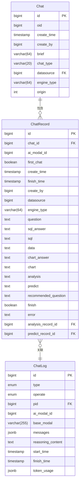
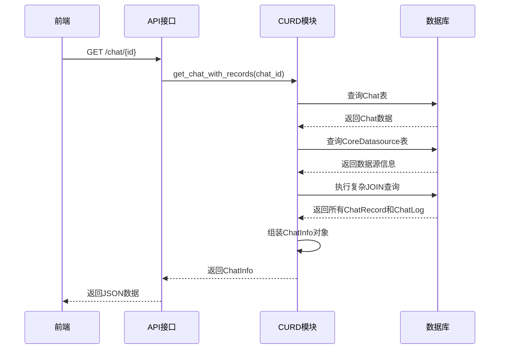
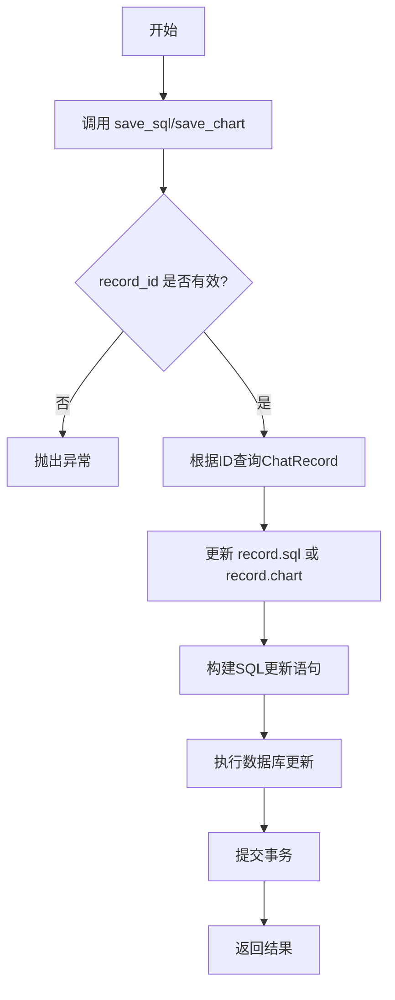
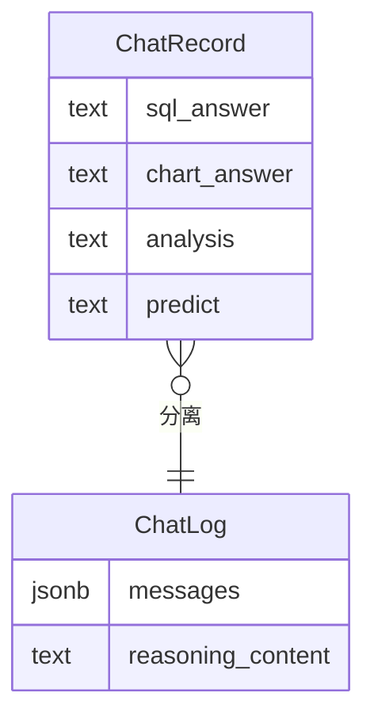
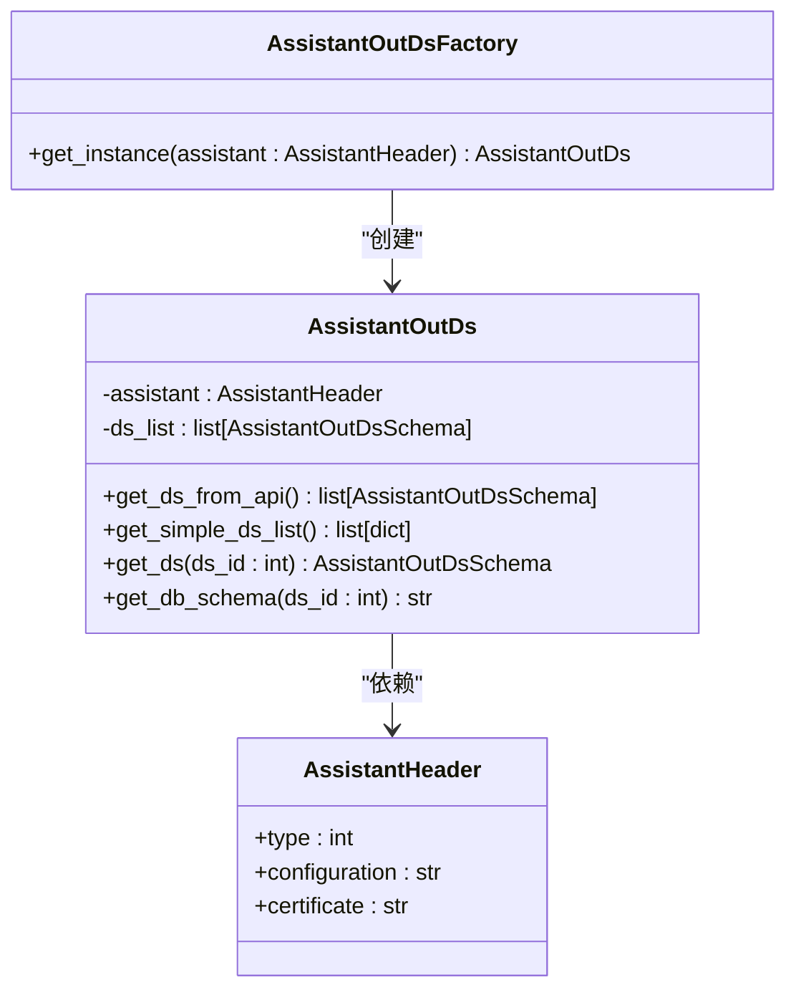

# 聊天记录管理

<cite>
**Referenced Files in This Document**   
- [chat_model.py](file://backend/apps/chat/models/chat_model.py)
- [chat.py](file://backend/apps/chat/curd/chat.py)
- [assistant.py](file://backend/apps/system/crud/assistant.py)
- [037_create_chat_log.py](file://backend/alembic/versions/037_create_chat_log.py)
</cite>

## 目录
1. [简介](#简介)
2. [数据模型](#数据模型)
3. [聊天上下文加载](#聊天上下文加载)
4. [记录分页查询](#记录分页查询)
5. [SQL与图表结果存储](#sql与图表结果存储)
6. [聊天日志与推理跟踪](#聊天日志与推理跟踪)
7. [动态数据源集成](#动态数据源集成)
8. [性能优化建议](#性能优化建议)

## 简介
本文档详细阐述了SQLBot系统中聊天记录管理模块的实现机制。该模块负责管理用户与AI助手的交互会话，包括聊天会话（Chat）、聊天记录（ChatRecord）和聊天日志（ChatLog）等核心数据实体。文档重点分析了聊天上下文加载、记录分页查询、SQL与图表结果的持久化存储、推理过程跟踪以及动态数据源集成等关键功能的实现细节，为系统的维护和优化提供全面的技术参考。

## 数据模型

本模块的核心数据模型定义在 `chat_model.py` 文件中，主要包括 `Chat`、`ChatRecord` 和 `ChatLog` 三个实体。

**Diagram sources**
- [chat_model.py](file://backend/apps/chat/models/chat_model.py#L62-L103)

**Section sources**
- [chat_model.py](file://backend/apps/chat/models/chat_model.py#L62-L103)

### 聊天会话 (Chat)
`Chat` 实体代表一个用户创建的聊天会话。其主要属性包括：
- **id**: 会话的唯一标识符。
- **create_time**: 会话创建时间。
- **create_by**: 创建者用户ID。
- **brief**: 会话的简短描述，通常由第一条问题生成。
- **datasource**: 关联的数据源ID，指明该会话针对哪个数据库。
- **engine_type**: 数据库引擎类型（如MySQL, PostgreSQL等）。

### 聊天记录 (ChatRecord)
`ChatRecord` 实体代表一次具体的用户提问及其AI的响应。它与 `Chat` 是一对多的关系。其关键属性包括：
- **chat_id**: 外键，关联到 `Chat` 表。
- **question**: 用户提出的问题。
- **sql**: AI生成的SQL查询语句。
- **data**: SQL查询执行后返回的原始数据。
- **chart**: 用于生成图表的配置信息。
- **analysis**: AI对数据的分析结果。
- **finish**: 标记该记录的处理是否已完成。

### 聊天日志 (ChatLog)
`ChatLog` 实体用于跟踪AI生成SQL、图表等操作的详细推理过程。其核心属性有：
- **pid**: 外键，指向 `ChatRecord` 的ID，表示该日志属于哪条记录。
- **operate**: 操作类型，如 `GENERATE_SQL` 或 `GENERATE_CHART`。
- **messages**: 与AI模型交互的完整消息历史。
- **reasoning_content**: AI生成的推理内容摘要。

## 聊天上下文加载

聊天上下文的加载通过 `get_chat_with_records` 函数实现，该函数位于 `chat.py` 文件中。其主要职责是根据会话ID，一次性加载会话信息及其所有关联的聊天记录。

**Diagram sources**
- [chat.py](file://backend/apps/chat/curd/chat.py#L103-L200)

**Section sources**
- [chat.py](file://backend/apps/chat/curd/chat.py#L103-L200)

### 实现机制
1.  **加载会话基础信息**: 首先通过 `session.get(Chat, chart_id)` 从数据库中获取指定ID的 `Chat` 对象。
2.  **获取数据源信息**: 根据 `Chat` 对象中的 `datasource` ID，查询 `CoreDatasource` 表以获取数据源的名称和类型。如果会话关联的是动态数据源（`current_assistant.type` 为1或3），则会通过 `AssistantOutDsFactory` 工厂来获取数据源实例。
3.  **关联加载记录与日志**: 使用SQLAlchemy的 `outerjoin` 进行一次复杂的查询，将 `ChatRecord` 表与 `ChatLog` 表进行四次外连接，分别关联 `GENERATE_SQL`、`GENERATE_CHART`、`ANALYSIS` 和 `PREDICT_DATA` 四种操作类型的日志。这确保了在一次数据库查询中就能获取到所有必要的信息。
4.  **数据组装**: 将查询结果映射为 `ChatRecordResult` 对象列表，并通过 `format_record` 函数进行格式化处理（如解析JSON、美化SQL等），最终将记录列表赋值给 `ChatInfo` 对象的 `records` 属性并返回。

此设计通过一次高效的数据库查询，避免了N+1查询问题，显著提升了加载性能。

## 记录分页查询

根据现有代码分析，当前的聊天记录查询实现（`get_chat_with_records`）并未直接实现分页功能。该函数会一次性加载指定会话下的所有聊天记录。

**Section sources**
- [chat.py](file://backend/apps/chat/curd/chat.py#L103-L200)

### 分析与建议
虽然核心CURD函数没有分页，但前端在展示聊天记录时，通常会一次性加载所有记录，因为一个会话内的记录数量通常不会过于庞大。然而，对于历史会话列表的查询（`list_chats` 函数），则通过 `order_by(Chat.create_time.desc()).all()` 获取了所有会话，同样缺乏分页。

**性能优化建议**:
1.  **为 `list_chats` 添加分页**: 应修改 `list_chats` 函数，接受 `page` 和 `page_size` 参数，使用 `limit()` 和 `offset()` 来实现分页，避免在用户拥有大量会话时一次性加载所有数据。
2.  **为 `get_chat_with_records` 提供分页选项**: 可以扩展该函数，增加分页参数，允许前端按需加载最近的N条记录，这对于包含大量交互的长会话非常有用。

## SQL与图表结果存储

SQL和图表结果的存储是通过 `save_sql` 和 `save_chart` 两个独立的函数完成的，它们都位于 `chat.py` 文件中。

**Diagram sources**
- [chat.py](file://backend/apps/chat/curd/chat.py#L554-L609)

**Section sources**
- [chat.py](file://backend/apps/chat/curd/chat.py#L554-L609)

### 实现机制
1.  **参数验证**: 函数首先检查 `record_id` 是否为空，如果为空则抛出异常。
2.  **获取记录**: 调用 `get_chat_record_by_id` 函数，根据 `record_id` 从数据库中获取对应的 `ChatRecord` 对象。
3.  **更新字段**: 将传入的 `sql` 或 `chart` 字符串赋值给记录对象的相应字段。
4.  **持久化更新**: 使用SQLAlchemy的 `update` 语句，构建一个只更新特定字段（`sql` 或 `chart`）的SQL命令，并执行该命令。
5.  **提交事务**: 调用 `session.commit()` 将更改永久保存到数据库。

这种设计将不同的结果（SQL、图表、分析）存储在 `ChatRecord` 表的不同字段中，实现了数据的解耦和独立更新。`save_chart` 函数的逻辑与 `save_sql` 完全一致，只是操作的字段不同。

## 聊天日志与推理跟踪

`ChatLog` 表的设计和迁移脚本 `037_create_chat_log.py` 揭示了其核心功能：将原本存储在 `ChatRecord` 表中的冗长消息和推理内容分离出来，实现更高效的存储和查询。

**Diagram sources**
- [037_create_chat_log.py](file://backend/alembic/versions/037_create_chat_log.py#L0-L131)

**Section sources**
- [037_create_chat_log.py](file://backend/alembic/versions/037_create_chat_log.py#L0-L131)

### 实现机制
1.  **数据分离**: `ChatLog` 表的创建是一次数据库迁移（Alembic Revision）。迁移脚本中的 `upgrade()` 函数首先创建 `chat_log` 表，然后通过一系列 `INSERT INTO ... SELECT` 语句，将 `chat_record` 表中各个操作（生成SQL、生成图表等）的完整消息（`full_sql_message`）和推理内容（`sql_answer->>'reasoning_content'`）抽取出来，存入新的 `chat_log` 表。
2.  **外连接查询优化**: 在 `get_chat_with_records` 函数中，通过 `outerjoin` 将 `ChatRecord` 与 `ChatLog` 进行关联。这使得在加载聊天记录时，可以同时获取到其对应的推理日志，而无需进行额外的查询。
3.  **推理过程跟踪**: `ChatLog` 表的 `messages` 字段存储了与AI模型交互的完整对话历史，`reasoning_content` 字段则存储了AI生成的结构化推理摘要。这为调试AI行为、分析生成质量以及实现“思考过程”可视化提供了数据基础。

## 动态数据源集成

动态数据源的集成是通过 `AssistantOutDsFactory` 工厂模式实现的，该工厂位于 `assistant.py` 文件中。

**Diagram sources**
- [assistant.py](file://backend/apps/system/crud/assistant.py#L183-L222)

**Section sources**
- [assistant.py](file://backend/apps/system/crud/assistant.py#L183-L222)

### 实现机制
1.  **工厂模式**: `AssistantOutDsFactory` 是一个静态工厂，其 `get_instance` 方法接收一个 `AssistantHeader` 对象，并返回一个 `AssistantOutDs` 实例。
2.  **外部数据源获取**: `AssistantOutDs` 类的构造函数会调用 `get_ds_from_api()` 方法。该方法解析 `AssistantHeader` 中的 `configuration` 和 `certificate` 字段，提取出API端点、认证信息（headers, cookies, params），然后向外部系统发起HTTP请求，获取可用的数据源列表。
3.  **数据源实例化**: 当 `get_chat_with_records` 函数检测到当前会话关联的是动态数据源（`current_assistant.type in [1, 3]`）时，它会调用 `AssistantOutDsFactory.get_instance(current_assistant)` 来获取一个 `AssistantOutDs` 实例，然后通过该实例的 `get_ds(chat.datasource)` 方法来获取具体的数据源信息，而不是直接查询本地的 `CoreDatasource` 表。

这种设计实现了与外部数据源管理系统的解耦，使得SQLBot可以灵活地接入由其他平台管理的数据源。

## 性能优化建议

基于对现有代码的分析，提出以下性能优化建议：

1.  **实现分页查询**: 如前所述，为 `list_chats` 和 `get_chat_with_records` 函数添加分页支持，避免在数据量大时出现性能瓶颈和内存溢出。
2.  **索引优化**: 确保在以下字段上建立了合适的数据库索引：
    *   `ChatRecord.chat_id` (用于快速查找会话下的所有记录)
    *   `ChatRecord.create_time` (用于按时间排序)
    *   `ChatLog.pid` (用于快速关联日志和记录)
    *   `Chat.create_by` 和 `Chat.oid` (用于按用户和组织过滤会话)
3.  **查询优化**: `get_chat_with_records` 的查询虽然避免了N+1问题，但其JOIN操作可能在记录数量巨大时变慢。可以考虑在前端需要时，再通过单独的API按需加载特定记录的详细日志，而不是一次性全部加载。
4.  **数据分片存储**: 对于拥有海量聊天记录的大型部署，可以考虑按时间或用户ID对 `ChatRecord` 表进行分片（Sharding），将数据分散到多个数据库实例中，以提升查询和写入性能。