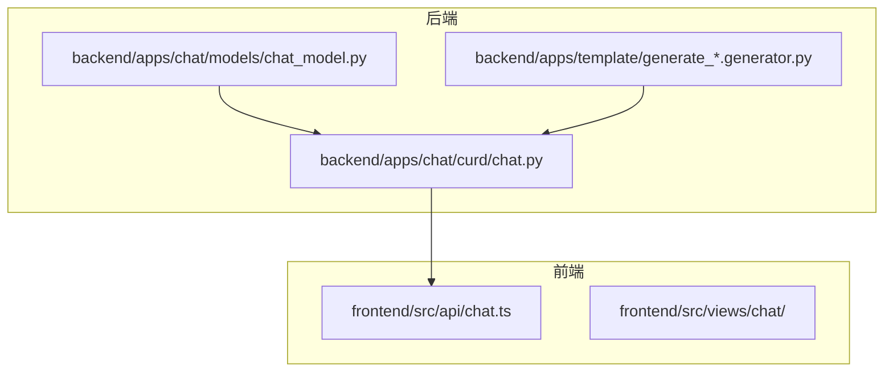
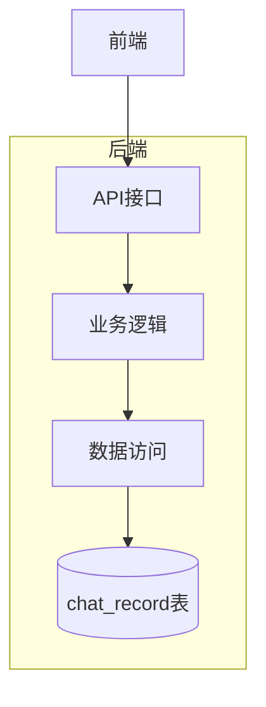
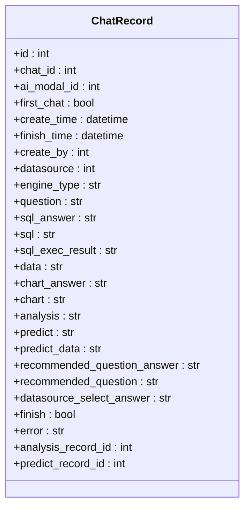
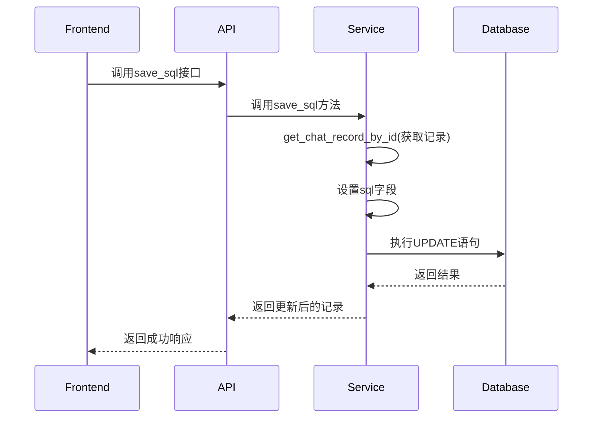
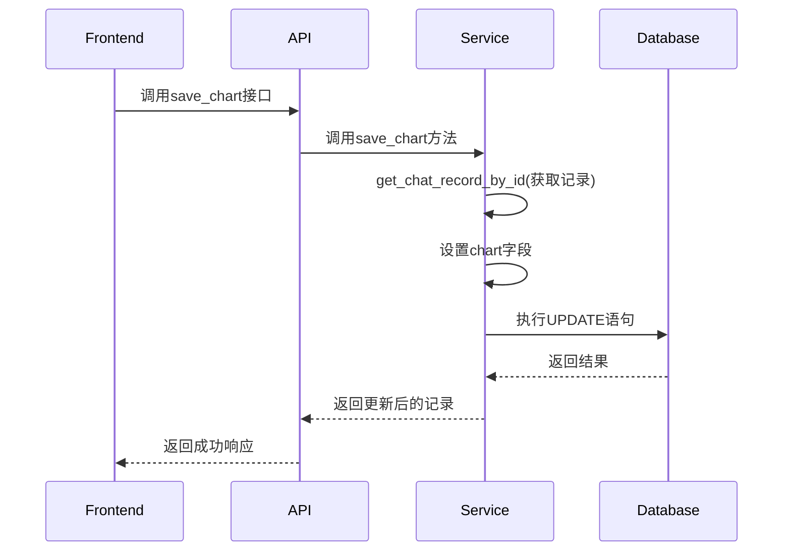
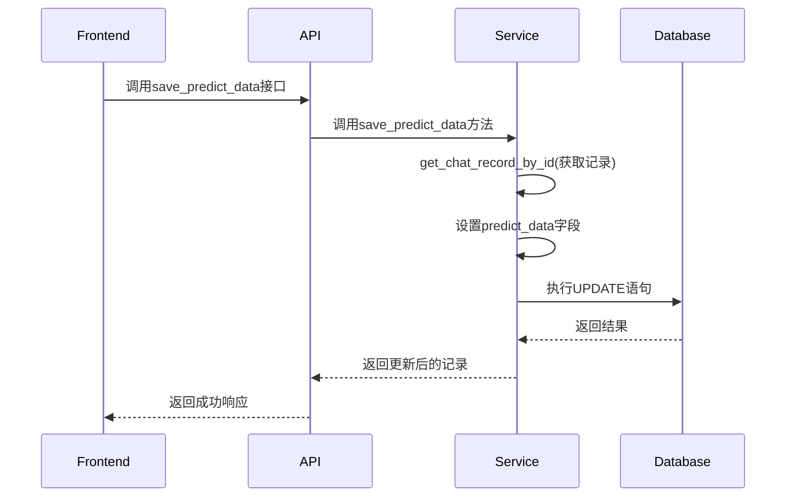
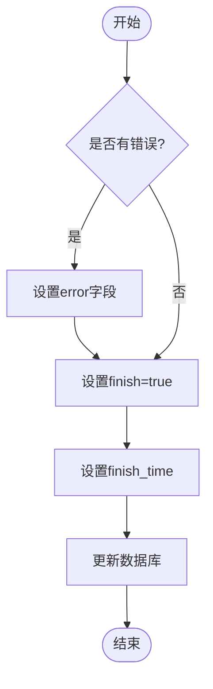
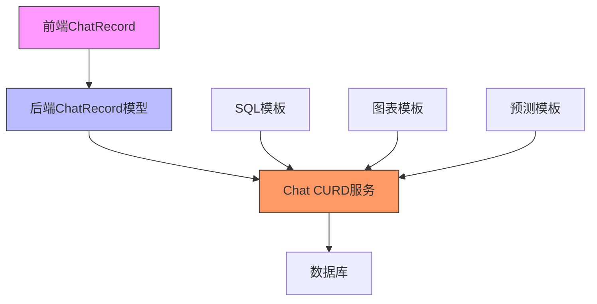

# 记录操作

<cite>
**本文档中引用的文件**  
- [chat_model.py](file://backend/apps/chat/models/chat_model.py)
- [chat.ts](file://frontend/src/api/chat.ts)
- [chat.py](file://backend/apps/chat/curd/chat.py)
- [generator.py](file://backend/apps/template/generate_sql/generator.py)
- [generator.py](file://backend/apps/template/generate_chart/generator.py)
- [generator.py](file://backend/apps/template/generate_predict/generator.py)
</cite>

## 目录
1. [简介](#简介)
2. [项目结构](#项目结构)
3. [核心组件](#核心组件)
4. [架构概述](#架构概述)
5. [详细组件分析](#详细组件分析)
6. [依赖分析](#依赖分析)
7. [性能考虑](#性能考虑)
8. [故障排除指南](#故障排除指南)
9. [结论](#结论)

## 简介
本文档深入分析了SQLBot系统中聊天记录（ChatRecord）的增删改查实现机制。重点阐述了SQL结果存储（save_sql）、图表结果存储（save_chart）、分析与预测数据持久化等关键操作的代码逻辑。同时解释了记录状态（finish）、错误信息（error）、推荐问题（recommended_question）等字段的业务含义和处理流程。通过前后端数据结构对比，说明了数据一致性保障机制，并提供了高并发写入场景下的性能优化和数据一致性保障方案。

## 项目结构
项目采用前后端分离架构，后端基于FastAPI构建，前端使用Vue3 + TypeScript实现。聊天记录相关功能分布在后端`backend/apps/chat/`目录和前端`frontend/src/api/chat.ts`中。

**Diagram sources**
- [chat_model.py](file://backend/apps/chat/models/chat_model.py)
- [chat.py](file://backend/apps/chat/curd/chat.py)
- [chat.ts](file://frontend/src/api/chat.ts)

**Section sources**
- [chat_model.py](file://backend/apps/chat/models/chat_model.py)
- [chat.py](file://backend/apps/chat/curd/chat.py)
- [chat.ts](file://frontend/src/api/chat.ts)

## 核心组件
核心组件包括后端的`ChatRecord`模型、CURD操作类和前端的`ChatRecord`类。这些组件共同实现了聊天记录的全生命周期管理，支持SQL生成、图表生成、数据分析、预测等多种操作类型。

**Section sources**
- [chat_model.py](file://backend/apps/chat/models/chat_model.py#L76-L103)
- [chat.py](file://backend/apps/chat/curd/chat.py#L16-L26)
- [chat.ts](file://frontend/src/api/chat.ts#L30-L126)

## 架构概述
系统采用典型的分层架构，包括数据访问层、业务逻辑层和API接口层。聊天记录操作通过CURD服务封装，确保数据一致性和事务完整性。

**Diagram sources**
- [chat.py](file://backend/apps/chat/curd/chat.py)
- [chat_model.py](file://backend/apps/chat/models/chat_model.py)

## 详细组件分析

### ChatRecord数据结构分析
`ChatRecord`是聊天记录的核心数据模型，定义了所有相关字段。

**Diagram sources**
- [chat_model.py](file://backend/apps/chat/models/chat_model.py#L76-L103)

**Section sources**
- [chat_model.py](file://backend/apps/chat/models/chat_model.py#L76-L103)
- [chat.ts](file://frontend/src/api/chat.ts#L30-L126)

### 关键操作流程分析

#### SQL结果存储流程
`save_sql`方法负责将生成的SQL语句持久化到数据库。

**Diagram sources**
- [chat.py](file://backend/apps/chat/curd/chat.py#L554-L572)
- [chat_model.py](file://backend/apps/chat/models/chat_model.py#L89)

**Section sources**
- [chat.py](file://backend/apps/chat/curd/chat.py#L554-L572)

#### 图表结果存储流程
`save_chart`方法用于存储图表配置和数据。

**Diagram sources**
- [chat.py](file://backend/apps/chat/curd/chat.py#L592-L609)
- [chat_model.py](file://backend/apps/chat/models/chat_model.py#L93)

**Section sources**
- [chat.py](file://backend/apps/chat/curd/chat.py#L592-L609)

#### 分析与预测数据持久化
`save_predict_data`方法处理预测分析结果的存储。

**Diagram sources**
- [chat.py](file://backend/apps/chat/curd/chat.py#L612-L629)
- [chat_model.py](file://backend/apps/chat/models/chat_model.py#L96)

**Section sources**
- [chat.py](file://backend/apps/chat/curd/chat.py#L612-L629)

#### 记录状态与错误处理
`finish_record`和`save_error_message`方法管理记录的完成状态和错误信息。

**Diagram sources**
- [chat.py](file://backend/apps/chat/curd/chat.py#L676-L695)
- [chat.py](file://backend/apps/chat/curd/chat.py#L632-L653)

**Section sources**
- [chat.py](file://backend/apps/chat/curd/chat.py#L632-L695)

## 依赖分析
系统各组件之间存在明确的依赖关系，确保功能的模块化和可维护性。

**Diagram sources**
- [chat_model.py](file://backend/apps/chat/models/chat_model.py)
- [chat.py](file://backend/apps/chat/curd/chat.py)
- [generator.py](file://backend/apps/template/generate_sql/generator.py)
- [generator.py](file://backend/apps/template/generate_chart/generator.py)
- [generator.py](file://backend/apps/template/generate_predict/generator.py)

**Section sources**
- [chat_model.py](file://backend/apps/chat/models/chat_model.py)
- [chat.py](file://backend/apps/chat/curd/chat.py)

## 性能考虑
在高并发写入场景下，系统通过以下方式保障性能和数据一致性：
1. 使用数据库事务确保操作的原子性
2. 采用连接池管理数据库连接
3. 对频繁查询的字段建立索引
4. 使用ORM的批量操作优化性能

## 故障排除指南
常见问题及解决方案：
- **记录无法保存**：检查数据库连接和事务提交
- **字段值为空**：验证前端传参和后端字段映射
- **并发写入冲突**：确保事务隔离级别设置正确
- **性能下降**：检查数据库索引和查询优化

**Section sources**
- [chat.py](file://backend/apps/chat/curd/chat.py#L632-L653)
- [chat.py](file://backend/apps/chat/curd/chat.py#L676-L695)

## 结论
本文档全面分析了SQLBot系统中聊天记录操作的实现细节。通过前后端数据结构的一致性设计、完善的CURD操作封装以及合理的错误处理机制，系统能够高效、可靠地管理聊天记录。在高并发场景下，通过事务管理和数据库优化，确保了数据的一致性和系统的稳定性。