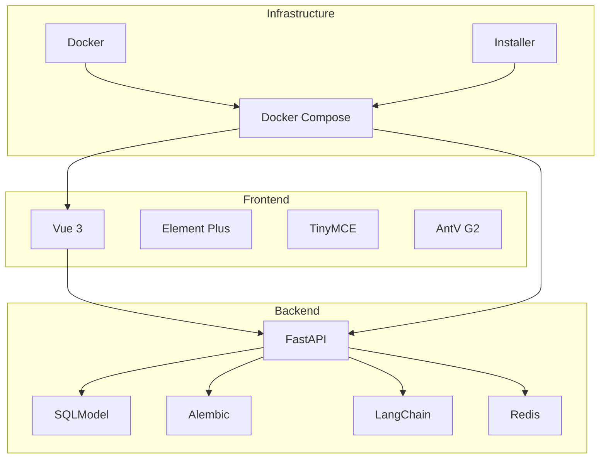
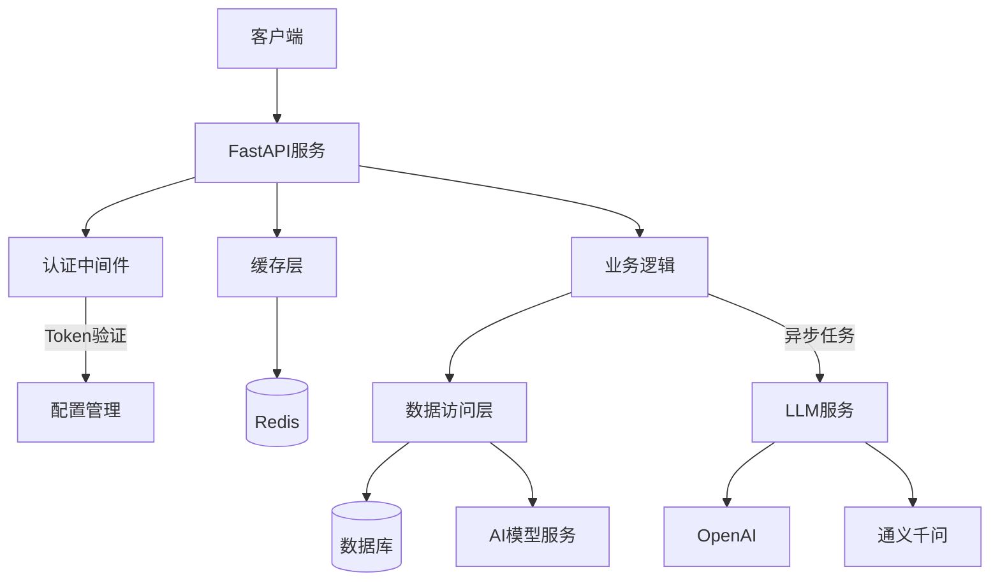
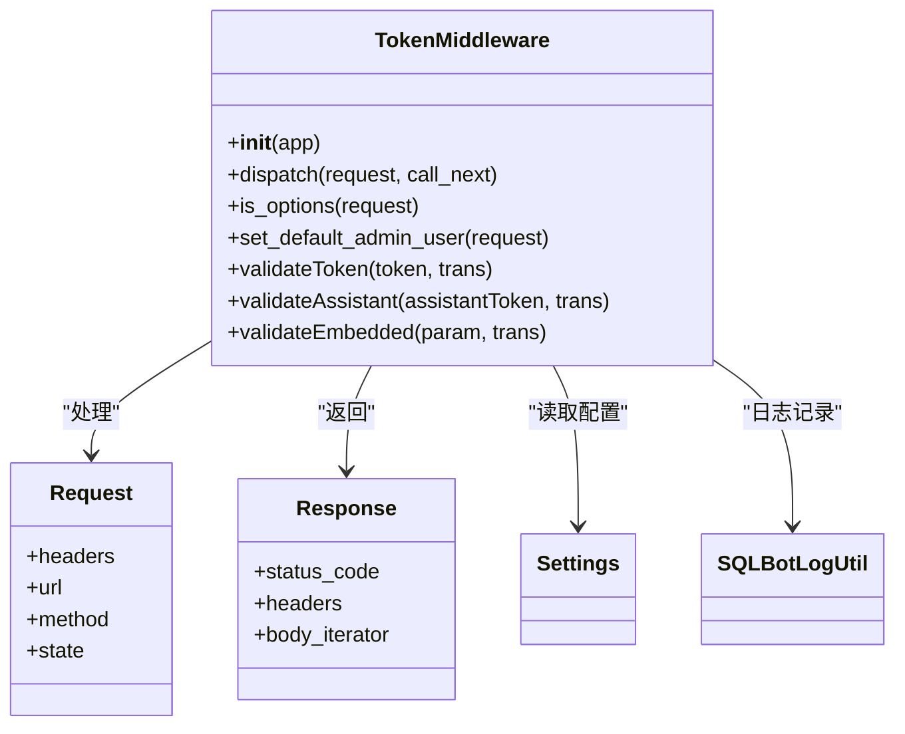
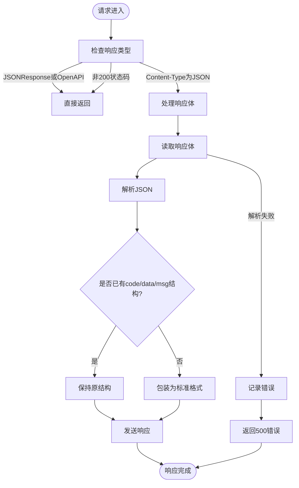
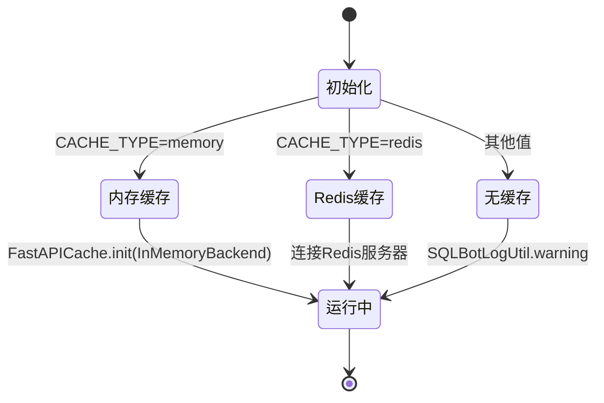
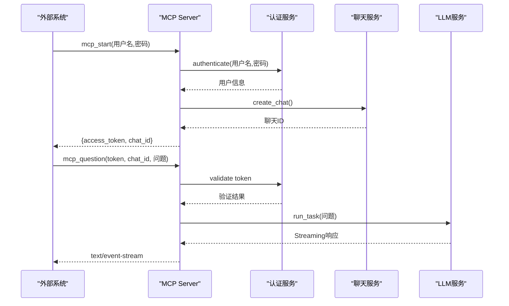
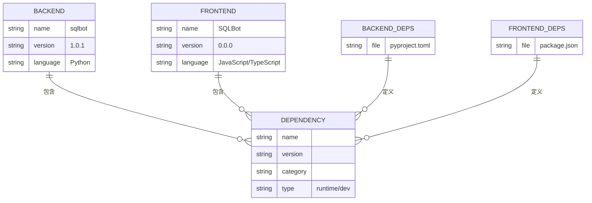

# 开发者指南

<cite>
**本文档中引用的文件**  
- [main.py](file://backend/main.py)
- [pyproject.toml](file://backend/pyproject.toml)
- [package.json](file://frontend/package.json)
- [vite.config.ts](file://frontend/vite.config.ts)
- [format.sh](file://backend/scripts/format.sh)
- [lint.sh](file://backend/scripts/lint.sh)
- [test.sh](file://backend/scripts/test.sh)
- [auth.py](file://backend/apps/system/middleware/auth.py)
- [response_middleware.py](file://backend/common/core/response_middleware.py)
- [sqlbot_cache.py](file://backend/common/core/sqlbot_cache.py)
- [mcp.py](file://backend/apps/mcp/mcp.py)
</cite>

## 目录
1. [简介](#简介)
2. [项目结构](#项目结构)
3. [核心组件](#核心组件)
4. [架构概述](#架构概述)
5. [详细组件分析](#详细组件分析)
6. [依赖分析](#依赖分析)
7. [性能考虑](#性能考虑)
8. [故障排除指南](#故障排除指南)
9. [结论](#结论)

## 简介
本指南为贡献者提供完整的开发环境搭建、代码规范、测试调试、贡献流程及扩展开发指导。涵盖前后端服务配置、质量工具链使用、调试技巧、分支策略和性能优化建议。

## 项目结构
项目采用前后端分离架构，包含后端FastAPI服务、前端Vue应用、数据库迁移脚本和安装部署工具。

**Diagram sources**
- [main.py](file://backend/main.py#L1-L100)
- [vite.config.ts](file://frontend/vite.config.ts#L1-L58)

**Section sources**
- [main.py](file://backend/main.py#L1-L100)
- [vite.config.ts](file://frontend/vite.config.ts#L1-L58)

## 核心组件
核心组件包括FastAPI后端服务、Vue前端框架、数据库ORM层、AI模型集成模块和缓存系统。后端使用SQLModel进行数据库操作，Alembic管理迁移，LangChain集成LLM功能；前端采用Vue 3 + Element Plus构建UI。

**Section sources**
- [main.py](file://backend/main.py#L1-L100)
- [package.json](file://frontend/package.json#L1-L75)

## 架构概述
系统采用分层架构设计，包含API层、业务逻辑层、数据访问层和基础设施层。前后端通过REST API通信，支持JWT认证和CORS跨域。

**Diagram sources**
- [main.py](file://backend/main.py#L1-L100)
- [auth.py](file://backend/apps/system/middleware/auth.py#L1-L200)
- [response_middleware.py](file://backend/common/core/response_middleware.py#L1-L61)

## 详细组件分析

### 认证中间件分析
认证中间件处理JWT令牌验证，支持多种认证模式：Bearer Token、Assistant Token和Embedded Token。

**Diagram sources**
- [auth.py](file://backend/apps/system/middleware/auth.py#L20-L198)

**Section sources**
- [auth.py](file://backend/apps/system/middleware/auth.py#L20-L198)

### 响应中间件分析
响应中间件统一包装API响应格式，确保所有JSON响应符合标准结构。

**Diagram sources**
- [response_middleware.py](file://backend/common/core/response_middleware.py#L7-L61)

**Section sources**
- [response_middleware.py](file://backend/common/core/response_middleware.py#L7-L61)

### 缓存系统分析
缓存系统支持内存和Redis两种后端，可根据配置灵活切换。

**Diagram sources**
- [sqlbot_cache.py](file://backend/common/core/sqlbot_cache.py#L124-L139)

**Section sources**
- [sqlbot_cache.py](file://backend/common/core/sqlbot_cache.py#L124-L139)

### MCP服务分析
MCP服务提供标准化接口供外部系统集成，支持会话启动和问题提问。

**Diagram sources**
- [mcp.py](file://backend/apps/mcp/mcp.py#L1-L113)
- [main.py](file://backend/main.py#L61-L68)

**Section sources**
- [mcp.py](file://backend/apps/mcp/mcp.py#L1-L113)

## 依赖分析
项目依赖分为后端Python依赖和前端JavaScript依赖两大类。

**Diagram sources**
- [pyproject.toml](file://backend/pyproject.toml#L1-L113)
- [package.json](file://frontend/package.json#L1-L75)

**Section sources**
- [pyproject.toml](file://backend/pyproject.toml#L1-L113)
- [package.json](file://frontend/package.json#L1-L75)

## 性能考虑
### 数据库查询优化
- 使用SQLModel的惰性加载和预加载功能
- 对频繁查询的字段建立索引
- 批量操作替代循环单条操作
- 合理使用缓存减少数据库访问

### LLM调用缓存策略
- 对相同问题的查询结果进行缓存
- 设置合理的缓存过期时间
- 使用Redis作为分布式缓存后端
- 缓存键包含用户ID、问题内容等维度

### 前端性能优化
- 使用Vite的代码分割功能
- 图表库按需加载
- 静态资源压缩和CDN分发
- 虚拟滚动处理大量数据

## 故障排除指南
### 常见问题
- **服务无法启动**：检查数据库连接配置和迁移状态
- **认证失败**：验证JWT密钥和令牌格式
- **跨域问题**：确认CORS配置包含正确源
- **缓存不生效**：检查Redis连接和缓存配置

### 调试技巧
- 使用PyCharm调试FastAPI应用，设置断点在路由处理函数
- 利用Vue开发者工具检查组件状态和事件流
- 查看日志文件定位错误详情
- 使用浏览器开发者工具分析网络请求

**Section sources**
- [main.py](file://backend/main.py#L30-L42)
- [auth.py](file://backend/apps/system/middleware/auth.py#L27-L59)

## 结论
本指南提供了全面的开发参考，涵盖了从环境搭建到高级优化的各个方面。遵循文档中的规范和最佳实践，可以有效提升开发效率和代码质量。