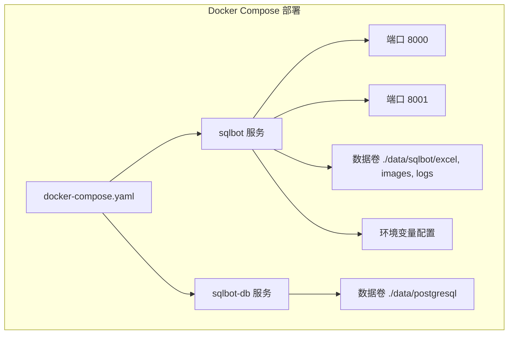
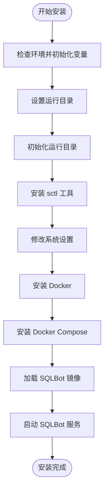

# 快速开始

<cite>
**本文档中引用的文件**  
- [docker-compose.yaml](file://docker-compose.yaml)
- [install.sh](file://installer/install.sh)
- [install.conf](file://installer/install.conf)
- [sqlbot.conf](file://installer/sqlbot/templates/sqlbot.conf)
- [main.py](file://backend/main.py)
- [login.py](file://backend/apps/system/api/login.py)
- [chat.ts](file://frontend/src/api/chat.ts)
- [datasource.ts](file://frontend/src/api/datasource.ts)
- [system.ts](file://frontend/src/api/system.ts)
</cite>

## 目录
1. [简介](#简介)
2. [安装方式一：使用 docker-compose 一键部署](#安装方式一使用-docker-compose-一键部署)
3. [安装方式二：使用安装脚本部署](#安装方式二使用安装脚本部署)
4. [访问系统](#访问系统)
5. [首次使用流程示例](#首次使用流程示例)
6. [常见问题排查](#常见问题排查)
7. [总结](#总结)

## 简介

SQLBot 是一个基于自然语言生成 SQL 并可视化结果的智能数据分析工具。本指南将指导您从零开始部署和使用 SQLBot，涵盖两种主流安装方式：通过 `docker-compose` 一键部署和使用安装脚本自动化部署。文档详细说明了每种方式的先决条件、执行命令、预期输出和验证方法，并提供完整的首次使用流程示例及常见问题解决方案。

**Section sources**
- [main.py](file://backend/main.py#L1-L100)

## 安装方式一：使用 docker-compose 一键部署

### 先决条件
- 系统已安装 Docker（版本 ≥ 20.10）
- 系统已安装 Docker Compose（版本 ≥ v2.16.0）

### 部署步骤
1. 下载 `docker-compose.yaml` 文件：
   ```bash
   wget https://raw.githubusercontent.com/dataease/sqlbot/main/docker-compose.yaml
   ```
2. 启动服务：
   ```bash
   docker-compose up -d
   ```
3. 验证服务状态：
   ```bash
   docker-compose ps
   ```
   预期输出包含 `sqlbot-db` 和 `sqlbot` 两个容器，状态均为 `Up`。

### 配置说明
`docker-compose.yaml` 文件中定义了以下关键配置：
- **端口映射**：前端服务映射到主机 8000 端口，MCP 服务映射到 8001 端口。
- **数据库**：使用 PostgreSQL 17.5 作为内置数据库，数据持久化至 `./data/postgresql` 目录。
- **环境变量**：通过 `environment` 字段配置数据库连接、项目名称、默认密码等。

**Diagram sources**
- [docker-compose.yaml](file://docker-compose.yaml#L1-L59)



**Section sources**
- [docker-compose.yaml](file://docker-compose.yaml#L1-L59)

## 安装方式二：使用安装脚本部署

### 先决条件
- Linux 系统（CentOS/Ubuntu/Debian 等）
- root 或 sudo 权限
- 网络可访问阿里云镜像仓库

### 部署步骤
1. 下载安装包并解压：
   ```bash
   wget https://download.dataease.io/product/sqlbot/installer/sqlbot-installer.tar.gz
   tar -zxvf sqlbot-installer.tar.gz
   cd sqlbot-installer
   ```
2. 执行安装脚本：
   ```bash
   bash install.sh
   ```
3. 安装过程将自动完成以下操作：
   - 检查并准备运行环境
   - 安装 Docker 和 Docker Compose（如未安装）
   - 加载 SQLBot 镜像
   - 启动服务

### 配置文件说明
- `install.conf`：主配置文件，定义安装路径、端口、数据库设置等。
- `sqlbot.conf`：SQLBot 服务的环境变量模板，由 `install.sh` 脚本动态生成。

**Diagram sources**
- [install.sh](file://installer/install.sh#L1-L285)
- [install.conf](file://installer/install.conf#L1-L34)
- [sqlbot.conf](file://installer/sqlbot/templates/sqlbot.conf#L1-L20)



**Section sources**
- [install.sh](file://installer/install.sh#L1-L285)
- [install.conf](file://installer/install.conf#L1-L34)
- [sqlbot.conf](file://installer/sqlbot/templates/sqlbot.conf#L1-L20)

## 访问系统

### 访问地址
- 打开浏览器，访问：`http://<服务器IP>:8000`
- 其中 `<服务器IP>` 替换为实际服务器的公网或内网 IP 地址。

### 登录凭证
- **用户名**：`admin`
- **密码**：`SQLBot@123456`

### 登录验证
成功登录后，您将进入 SQLBot 主界面，可看到左侧导航栏包含“聊天”、“数据源”、“仪表板”等模块。

**Section sources**
- [login.py](file://backend/apps/system/api/login.py#L1-L35)

## 首次使用流程示例

### 步骤 1：登录系统
使用上述默认凭证登录 SQLBot。

### 步骤 2：配置数据源
1. 进入“数据源”模块。
2. 点击“新建数据源”，填写数据库连接信息（如 MySQL、PostgreSQL 等）。
3. 点击“测试连接”确保连通性，然后保存。

**Section sources**
- [datasource.ts](file://frontend/src/api/datasource.ts#L1-L27)

### 步骤 3：选择 AI 模型
1. 进入“系统设置” → “AI 模型”。
2. 添加并配置您的 AI 模型（如 OpenAI API 密钥）。
3. 设置为默认模型。

**Section sources**
- [system.ts](file://frontend/src/api/system.ts#L1-L13)

### 步骤 4：输入自然语言问题
1. 返回“聊天”模块，新建一个聊天会话。
2. 在输入框中输入问题：“上季度销售额最高的产品是什么”。
3. 点击发送。

### 步骤 5：查看结果
系统将自动执行以下流程：
1. **生成 SQL**：在“SQL”标签页中查看生成的 SQL 语句。
2. **执行查询**：系统自动执行 SQL 并获取数据。
3. **生成图表**：在“图表”标签页中查看可视化结果（如柱状图、饼图等）。
4. **分析结果**：在“分析”标签页中查看 AI 对结果的文字解读。

**Section sources**
- [chat.ts](file://frontend/src/api/chat.ts#L1-L337)

## 常见问题排查

### 问题 1：服务无法启动
**现象**：`docker-compose up` 后容器立即退出。
**解决方案**：
- 检查 `docker-compose.yaml` 中的端口是否被占用。
- 查看日志：`docker logs sqlbot`，根据错误信息调整配置。
- 确保 `./data` 目录有写入权限。

### 问题 2：端口冲突
**现象**：8000 或 5432 端口已被其他服务占用。
**解决方案**：
- 修改 `docker-compose.yaml` 中的端口映射，例如将 `8000:8000` 改为 `8080:8000`。
- 或修改 `install.conf` 中的 `SQLBOT_WEB_PORT` 参数后重新安装。

### 问题 3：数据库连接失败
**现象**：测试数据源连接时提示失败。
**解决方案**：
- 确认数据库服务已启动且网络可达。
- 检查数据库用户名、密码、端口是否正确。
- 若使用外部数据库，确保 `SQLBOT_EXTERNAL_DB=true` 并正确配置 `SQLBOT_DB_HOST`。

### 问题 4：AI 模型无法响应
**现象**：提问后无响应或提示模型错误。
**解决方案**：
- 检查 AI 模型配置（如 API 密钥）是否正确。
- 通过“AI 模型”页面的“测试”功能验证连通性。
- 查看后端日志确认网络访问是否正常。

**Section sources**
- [install.sh](file://installer/install.sh#L1-L285)
- [docker-compose.yaml](file://docker-compose.yaml#L1-L59)

## 总结

本文档详细介绍了 SQLBot 的两种部署方式、访问方法、首次使用流程及常见问题解决方案。通过 `docker-compose` 可快速体验，而安装脚本则更适合生产环境的一键化部署。建议根据实际需求选择合适的安装方式，并按照示例流程快速上手使用。