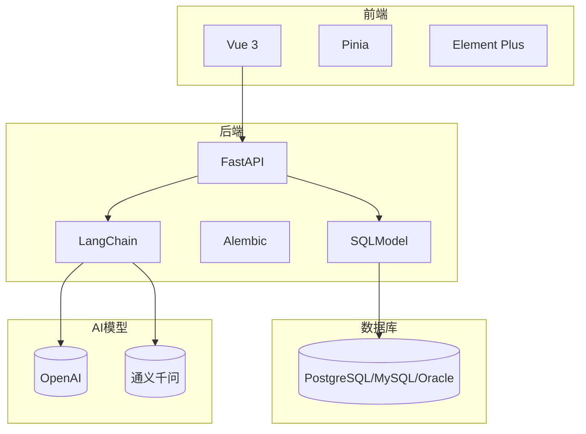
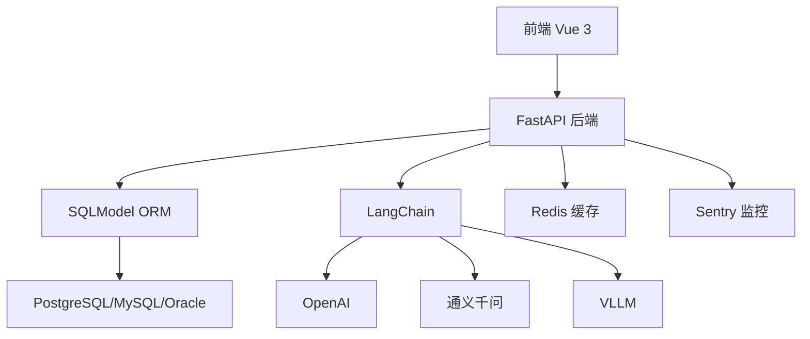
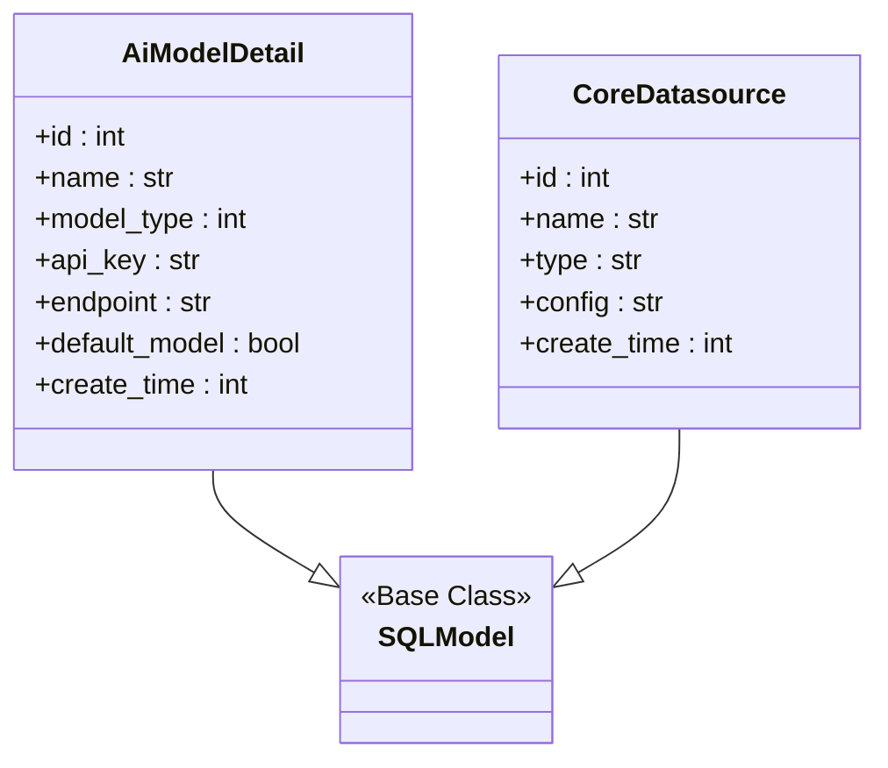
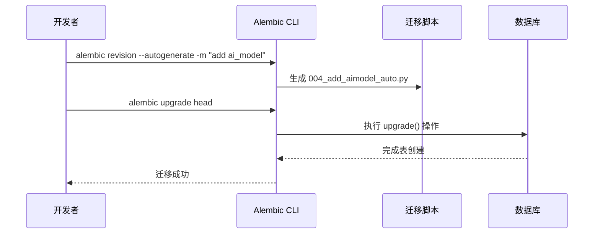
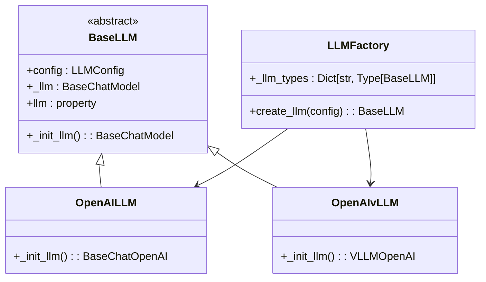
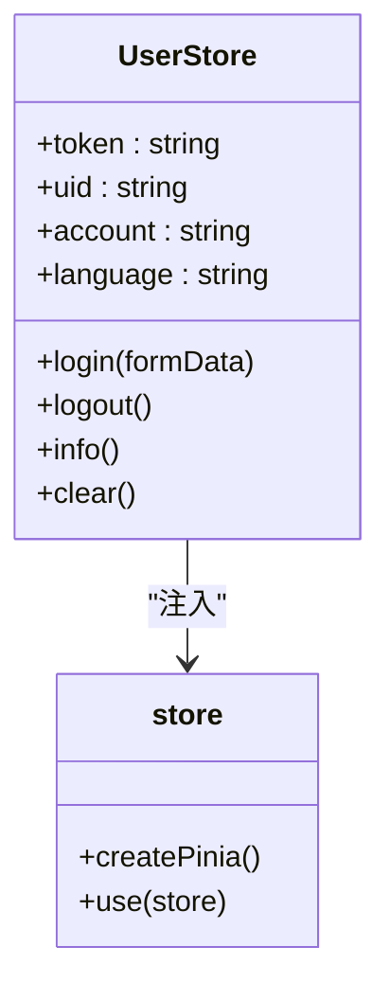
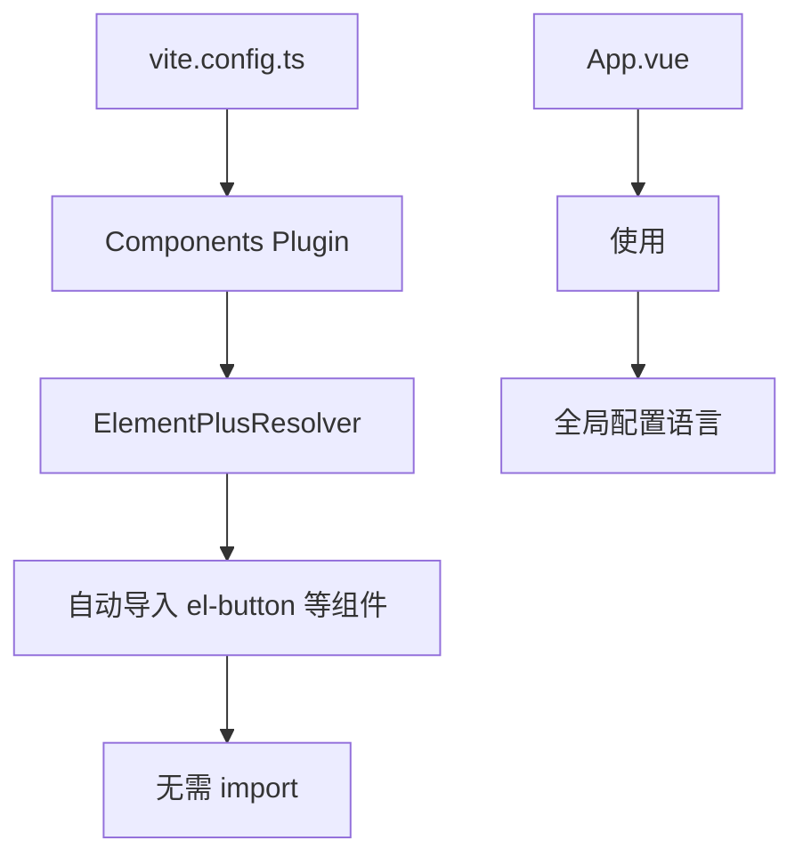
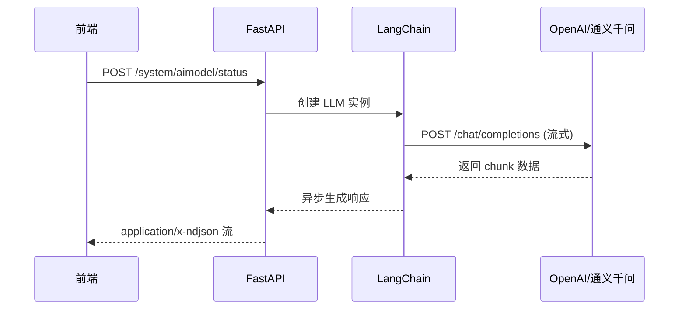
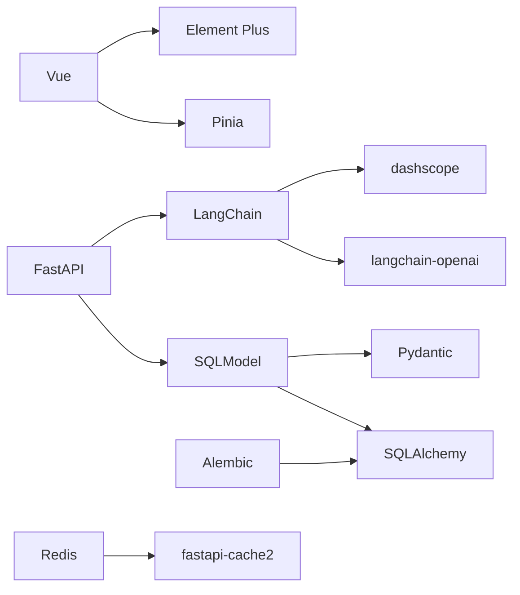

# 技术栈与依赖

<cite>
**本文档引用的文件**
- [pyproject.toml](file://backend/pyproject.toml)
- [package.json](file://frontend/package.json)
- [config.py](file://backend/common/core/config.py)
- [db.py](file://backend/common/core/db.py)
- [env.py](file://backend/alembic/env.py)
- [model_factory.py](file://backend/apps/ai_model/model_factory.py)
- [ai_model_schema.py](file://backend/apps/system/schemas/ai_model_schema.py)
- [aimodel.py](file://backend/apps/system/api/aimodel.py)
- [index.ts](file://frontend/src/stores/index.ts)
- [user.ts](file://frontend/src/stores/user.ts)
- [App.vue](file://frontend/src/App.vue)
- [vite.config.ts](file://frontend/vite.config.ts)
</cite>

## 目录
1. [简介](#简介)
2. [项目结构](#项目结构)
3. [核心组件](#核心组件)
4. [架构概述](#架构概述)
5. [详细组件分析](#详细组件分析)
6. [依赖分析](#依赖分析)
7. [性能考量](#性能考量)
8. [故障排除指南](#故障排除指南)
9. [结论](#结论)

## 简介
SQLBot 是一个集成大语言模型（LLM）的智能数据分析平台，通过自然语言交互生成 SQL 查询并可视化结果。本项目采用前后端分离架构，前端基于 Vue 3 构建现代化用户界面，后端使用 FastAPI 提供高性能 API 服务，支持多种数据库连接，并通过 LangChain 集成 OpenAI、通义千问等主流大模型。系统设计注重可扩展性与灵活性，适用于企业级数据分析场景。

## 项目结构
SQLBot 项目采用模块化分层设计，主要分为前端、后端、安装脚本和容器化配置四大模块。后端以 FastAPI 为核心，通过 SQLModel 实现 ORM 映射，Alembic 管理数据库迁移；前端采用 Vue 3 组合式 API 与 Pinia 状态管理，结合 Element Plus 构建 UI。系统支持多数据库抽象与 LLM 插件化集成，具备良好的可维护性与扩展能力。

**Diagram sources**
- [pyproject.toml](file://backend/pyproject.toml)
- [package.json](file://frontend/package.json)

**Section sources**
- [pyproject.toml](file://backend/pyproject.toml)
- [package.json](file://frontend/package.json)

## 核心组件
SQLBot 的核心组件包括基于 FastAPI 的 RESTful API 服务、SQLModel 驱动的数据访问层、Alembic 管理的数据库迁移系统、LangChain 集成的 LLM 工厂模式，以及 Vue 3 + Pinia 构建的前端交互界面。系统通过配置中心统一管理应用参数，利用 Redis 实现缓存机制，并通过 Sentry 进行错误监控，确保系统的稳定性与可观测性。

**Section sources**
- [pyproject.toml](file://backend/pyproject.toml)
- [package.json](file://frontend/package.json)
- [config.py](file://backend/common/core/config.py)

## 架构概述
SQLBot 采用典型的分层架构，从前端用户界面到后端服务再到数据存储与 AI 集成，各层职责清晰、耦合度低。前端通过 HTTP 请求与后端交互，后端服务处理业务逻辑并调用数据库或 LLM 接口，数据库层支持多种关系型数据库，AI 集成层通过统一接口适配不同大模型服务商。

**Diagram sources**
- [pyproject.toml](file://backend/pyproject.toml)
- [package.json](file://frontend/package.json)
- [config.py](file://backend/common/core/config.py)

## 详细组件分析

### 后端技术栈分析

#### FastAPI 作为 Web 框架的优势
FastAPI 作为现代 Python Web 框架，基于 Starlette 和 Pydantic，提供异步支持、自动 API 文档生成（Swagger UI 和 ReDoc）、类型提示驱动的请求验证，显著提升开发效率与接口可靠性。其高性能特性适合处理高并发的 LLM 请求，同时与 Pydantic v2 深度集成，保障数据校验的准确性与性能。

**Section sources**
- [pyproject.toml](file://backend/pyproject.toml)
- [main.py](file://backend/main.py)

#### SQLModel 在 ORM 中的作用
SQLModel 是由 FastAPI 作者开发的 ORM 框架，融合 SQLAlchemy 的强大功能与 Pydantic 的数据验证能力，允许开发者使用同一套模型定义进行数据库操作与 API 序列化。在 SQLBot 中，SQLModel 被广泛用于定义 `AiModelDetail`、`CoreDatasource` 等实体类，简化了数据层与接口层之间的转换逻辑。

**Diagram sources**
- [ai_model_schema.py](file://backend/apps/system/schemas/ai_model_schema.py)
- [datasource.py](file://backend/apps/datasource/models/datasource.py)

**Section sources**
- [ai_model_schema.py](file://backend/apps/system/schemas/ai_model_schema.py)
- [datasource.py](file://backend/apps/datasource/models/datasource.py)

#### Alembic 用于数据库迁移的机制
Alembic 作为 SQLAlchemy 的官方迁移工具，在 SQLBot 中负责管理数据库模式变更。通过 `alembic.ini` 配置文件与 `env.py` 环境脚本，系统实现了自动化的迁移流程。每次数据库结构调整（如添加 `ai_model` 表）均通过 `alembic revision --autogenerate` 生成版本脚本，并由 `alembic upgrade head` 应用至目标数据库，确保多环境间 schema 的一致性。

**Diagram sources**
- [alembic.ini](file://backend/alembic.ini)
- [env.py](file://backend/alembic/env.py)
- [004_add_aimodel_auto.py](file://backend/alembic/versions/004_add_aimodel_auto.py)

**Section sources**
- [alembic.ini](file://backend/alembic.ini)
- [env.py](file://backend/alembic/env.py)
- [004_add_aimodel_auto.py](file://backend/alembic/versions/004_add_aimodel_auto.py)

#### LangChain 在 LLM 集成中的关键角色
LangChain 提供统一的接口抽象，使 SQLBot 能够无缝集成多种大语言模型。系统通过 `LLMFactory` 工厂模式创建具体的 LLM 实例（如 `OpenAILLM` 或 `OpenAIvLLM`），并利用 LangChain 的 `BaseChatModel` 接口实现流式响应。该设计屏蔽了底层模型差异，便于未来扩展支持更多 LLM 服务。

**Diagram sources**
- [model_factory.py](file://backend/apps/ai_model/model_factory.py)

**Section sources**
- [model_factory.py](file://backend/apps/ai_model/model_factory.py)
- [llm.py](file://backend/apps/ai_model/openai/llm.py)

### 前端技术栈分析

#### Vue 3 的组合式 API 设计
前端采用 Vue 3 的组合式 API（`<script setup>`）提升代码组织性与逻辑复用能力。通过 `ref`、`computed`、`watch` 等响应式 API，组件能更灵活地管理状态。例如在 `SQComponentWrapper.vue` 中，使用 `computed` 动态生成视图 ID，结合 `defineProps` 实现组件配置传递，体现组合式 API 的简洁与高效。

**Section sources**
- [SQComponentWrapper.vue](file://frontend/src/views/dashboard/preview/SQComponentWrapper.vue)

#### Pinia 状态管理
Pinia 作为 Vue 官方推荐的状态管理库，在 SQLBot 中用于集中管理用户认证、工作区、仪表板等全局状态。`UserStore` 存储用户 token、语言偏好等信息，并通过 `setupStore(app)` 插件方式集成到应用实例中，确保状态在路由切换时持久存在。

**Diagram sources**
- [user.ts](file://frontend/src/stores/user.ts)
- [index.ts](file://frontend/src/stores/index.ts)

**Section sources**
- [user.ts](file://frontend/src/stores/user.ts)
- [index.ts](file://frontend/src/stores/index.ts)

#### Element Plus UI 组件库的集成方式
Element Plus 提供丰富的 UI 组件，通过 `unplugin-vue-components-secondary` 插件实现按需引入与自动注册。在 `vite.config.ts` 中配置 `ElementPlusResolver`，结合 `auto-imports.d.ts` 自动生成类型声明，开发者可直接使用 `<el-button>` 等标签而无需手动导入，极大提升开发体验。

**Diagram sources**
- [vite.config.ts](file://frontend/vite.config.ts)
- [App.vue](file://frontend/src/App.vue)

**Section sources**
- [vite.config.ts](file://frontend/vite.config.ts)
- [App.vue](file://frontend/src/App.vue)

### 数据库层面分析

#### 支持多类型数据库的抽象设计
SQLBot 通过 SQLModel 与 SQLAlchemy 的方言机制实现对 PostgreSQL、MySQL、Oracle、ClickHouse 等多种数据库的支持。在 `pyproject.toml` 中声明了 `psycopg`、`pymysql`、`oracledb`、`clickhouse-sqlalchemy` 等驱动依赖，运行时根据数据源配置动态加载对应引擎，实现统一的 SQL 执行接口。

**Section sources**
- [pyproject.toml](file://backend/pyproject.toml)
- [engine.py](file://backend/apps/db/engine.py)

### AI 集成部分分析

#### 通过 HTTP 接口与大模型交互
系统通过 `httpx` 客户端与 OpenAI、通义千问等 LLM 服务进行 HTTP 通信。`LLMFactory` 根据 `LLMConfig` 中的 `api_base_url` 和 `api_key` 初始化对应的 LangChain LLM 实例，支持流式传输（streaming=True），确保用户能实时接收模型输出。`aimodel.py` 中的 `/status` 接口用于测试模型连通性，验证配置有效性。

**Diagram sources**
- [aimodel.py](file://backend/apps/system/api/aimodel.py)
- [model_factory.py](file://backend/apps/ai_model/model_factory.py)

**Section sources**
- [aimodel.py](file://backend/apps/system/api/aimodel.py)
- [model_factory.py](file://backend/apps/ai_model/model_factory.py)

## 依赖分析
SQLBot 的依赖体系清晰划分为生产依赖与开发依赖，通过 `pyproject.toml` 和 `package.json` 分别管理后端与前端依赖。核心依赖之间通过接口抽象降低耦合，如 LangChain 作为 LLM 适配层，SQLModel 作为 ORM 与 Pydantic 的桥梁，Pinia 提供类型安全的状态管理。

**Diagram sources**
- [pyproject.toml](file://backend/pyproject.toml)
- [package.json](file://frontend/package.json)

**Section sources**
- [pyproject.toml](file://backend/pyproject.toml)
- [package.json](file://frontend/package.json)

## 性能考量
系统在性能方面进行了多项优化：后端采用异步非阻塞 I/O 处理 LLM 流式响应，避免请求阻塞；数据库查询通过连接池（psycopg、pymysql）复用连接，减少开销；前端使用 Vite 进行模块化打包，按需加载组件，提升首屏加载速度；Redis 缓存频繁访问的数据（如助手信息），降低数据库压力。此外，LLM 配置使用 `@lru_cache` 装饰器缓存实例，避免重复初始化开销。

**Section sources**
- [model_factory.py](file://backend/apps/ai_model/model_factory.py)
- [sqlbot_cache.py](file://backend/common/core/sqlbot_cache.py)

## 故障排除指南
常见问题包括 LLM 连接失败、数据库迁移错误、前端组件未注册等。排查 LLM 问题时应检查 `api_key` 与 `api_base_url` 配置是否正确，并通过 `/system/aimodel/status` 接口测试连通性；数据库迁移问题可通过查看 Alembic 日志定位 SQL 错误；前端组件问题通常源于未正确配置 `unplugin-vue-components-secondary` 或缺少类型声明，需检查 `vite.config.ts` 与 `auto-imports.d.ts`。

**Section sources**
- [aimodel.py](file://backend/apps/system/api/aimodel.py)
- [alembic.ini](file://backend/alembic.ini)
- [vite.config.ts](file://frontend/vite.config.ts)

## 结论
SQLBot 采用现代化技术栈构建，后端以 FastAPI + SQLModel + Alembic + LangChain 为核心，前端以 Vue 3 + Pinia + Element Plus 为基础，形成高效、可维护的全栈架构。系统通过抽象设计支持多数据库与多 LLM 集成，具备良好的扩展性与适应性。技术选型兼顾开发效率、运行性能与生态成熟度，为智能数据分析提供了坚实的技术基础。