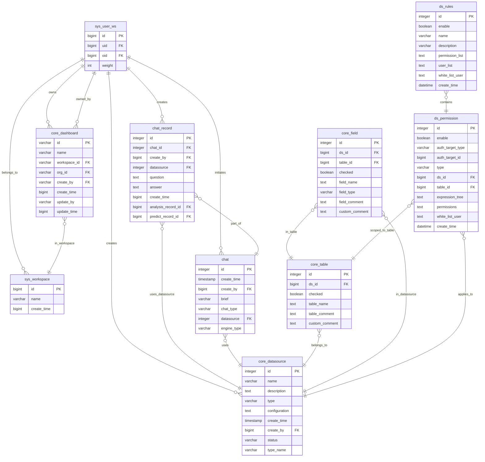

# 关系图

<cite>
**本文档引用的文件**
- [020_workspace_ddl.py](file://backend/alembic/versions/020_workspace_ddl.py)
- [021_user_ws_ddl.py](file://backend/alembic/versions/021_user_ws_ddl.py)
- [009_1_add_core_dashboard.py](file://backend/alembic/versions/009_1_add_core_dashboard.py)
- [007_add_chat.py](file://backend/alembic/versions/007_add_chat.py)
- [003_add_datasource.py](file://backend/alembic/versions/003_add_datasource.py)
- [005_table_and_field.py](file://backend/alembic/versions/005_table_and_field.py)
- [026_row_column_permission.py](file://backend/alembic/versions/026_row_column_permission.py)
</cite>

## 目录
1. [引言](#引言)
2. [核心实体关系图](#核心实体关系图)
3. [用户与工作空间的多对多关系](#用户与工作空间的多对多关系)
4. [聊天记录与数据源的外键关联](#聊天记录与数据源的外键关联)
5. [仪表板与用户的归属关系](#仪表板与用户的归属关系)
6. [字段级与行级权限控制机制](#字段级与行级权限控制机制)
7. [业务逻辑与设计原则](#业务逻辑与设计原则)

## 引言
本文档基于Alembic迁移脚本构建数据库实体关系图（ERD），旨在清晰展示系统核心表之间的关联关系。重点分析用户（user）与工作空间（workspace）的多对多关系、聊天记录（chat_record）与数据源（core_datasource）的外键连接、仪表板（core_dashboard）与用户的归属结构，以及字段级和行级权限控制表的设计。通过图形化方式呈现主外键约束、索引字段及关键业务规则，揭示数据模型背后的资源隔离与权限继承逻辑。

## 核心实体关系图

**图示来源**
- [020_workspace_ddl.py](file://backend/alembic/versions/020_workspace_ddl.py#L1-L50)
- [021_user_ws_ddl.py](file://backend/alembic/versions/021_user_ws_ddl.py#L1-L33)
- [009_1_add_core_dashboard.py](file://backend/alembic/versions/009_1_add_core_dashboard.py#L1-L56)
- [007_add_chat.py](file://backend/alembic/versions/007_add_chat.py#L1-L52)
- [003_add_datasource.py](file://backend/alembic/versions/003_add_datasource.py#L1-L39)
- [005_table_and_field.py](file://backend/alembic/versions/005_table_and_field.py#L1-L49)
- [026_row_column_permission.py](file://backend/alembic/versions/026_row_column_permission.py#L1-L54)

## 用户与工作空间的多对多关系

系统通过 `sys_user_ws` 关联表实现用户与工作空间的多对多关系。每个用户可加入多个工作空间，每个工作空间也可包含多个用户。`sys_user_ws` 表中的 `uid` 字段外键指向用户标识，`oid` 字段外键指向 `sys_workspace` 表的主键 `id`，实现双向关联。`weight` 字段用于表示用户在工作空间中的权重或角色等级。该设计支持工作空间级别的资源隔离，确保用户只能访问其所属工作空间内的数据和功能。

**本节来源**
- [020_workspace_ddl.py](file://backend/alembic/versions/020_workspace_ddl.py#L1-L50)
- [021_user_ws_ddl.py](file://backend/alembic/versions/021_user_ws_ddl.py#L1-L33)

## 聊天记录与数据源的外键关联

`chat_record` 表通过 `datasource` 字段与 `core_datasource` 表建立外键关联。该字段存储所使用的数据源ID，确保每次聊天分析都明确绑定到特定数据源。此外，`chat_record` 表还包含 `analysis_record_id` 和 `predict_record_id` 字段，用于关联分析和预测的子记录，形成完整的对话上下文链。`create_by` 字段外键关联到用户，记录创建者信息。此设计保证了聊天数据的可追溯性和数据源依赖的明确性。

**本节来源**
- [007_add_chat.py](file://backend/alembic/versions/007_add_chat.py#L1-L52)
- [023_modify_chat_record.py](file://backend/alembic/versions/023_modify_chat_record.py#L1-L75)
- [024_modify_chat_record.py](file://backend/alembic/versions/024_modify_chat_record.py#L1-L33)

## 仪表板与用户的归属关系

`core_dashboard` 表通过 `create_by` 字段与用户建立归属关系，记录仪表板的创建者。同时，通过 `workspace_id` 和 `org_id` 字段与 `sys_workspace` 表关联，将仪表板置于特定工作空间和组织单元之下。`org_id` 实际上是工作空间ID的别名，与 `sys_user_ws` 表中的 `oid` 字段对应，从而间接建立仪表板与用户-工作空间关系的连接。这种设计实现了基于工作空间的资源组织和访问控制。

**本节来源**
- [009_1_add_core_dashboard.py](file://backend/alembic/versions/009_1_add_core_dashboard.py#L1-L56)
- [021_user_ws_ddl.py](file://backend/alembic/versions/021_user_ws_ddl.py#L1-L33)

## 字段级与行级权限控制机制

系统通过 `ds_permission` 和 `ds_rules` 两张表实现细粒度的数据权限控制。`ds_permission` 表定义了针对特定数据源（`ds_id`）或数据表（`table_id`）的权限规则，支持字段级（column）和行级（row）控制。`auth_target_type` 和 `auth_target_id` 字段指定权限应用的目标（如用户或角色），`expression_tree` 字段存储行级过滤表达式。`ds_rules` 表作为权限规则的容器，可包含多个 `ds_permission` 规则，并通过 `user_list` 和 `white_list_user` 实现用户级别的权限分配。此分层设计支持灵活的权限继承和批量管理。

**本节来源**
- [026_row_column_permission.py](file://backend/alembic/versions/026_row_column_permission.py#L1-L54)
- [005_table_and_field.py](file://backend/alembic/versions/005_table_and_field.py#L1-L49)

## 业务逻辑与设计原则

数据库关系设计体现了清晰的业务逻辑：工作空间（`sys_workspace`）作为资源隔离的核心单元，所有用户、仪表板、聊天记录和数据源均通过 `sys_user_ws` 关联表或直接字段与之绑定，确保数据边界清晰。权限控制体系（`ds_permission`）直接作用于数据源和数据表，支持在工作空间内实现精细化的访问控制。聊天记录与数据源的强关联保证了分析上下文的完整性。整体设计遵循模块化、可扩展和安全隔离的原则，为多租户场景下的数据管理和访问控制提供了坚实基础。

**本节来源**
- [020_workspace_ddl.py](file://backend/alembic/versions/020_workspace_ddl.py#L1-L50)
- [021_user_ws_ddl.py](file://backend/alembic/versions/021_user_ws_ddl.py#L1-L33)
- [026_row_column_permission.py](file://backend/alembic/versions/026_row_column_permission.py#L1-L54)
- [009_1_add_core_dashboard.py](file://backend/alembic/versions/009_1_add_core_dashboard.py#L1-L56)