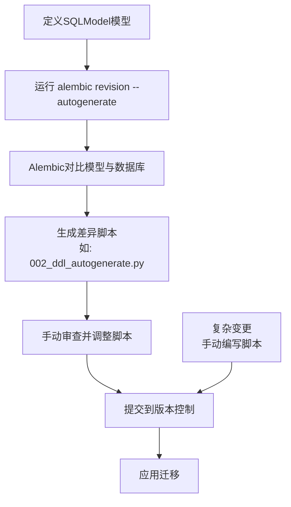
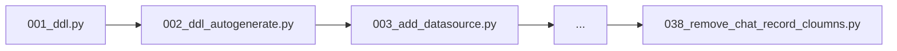
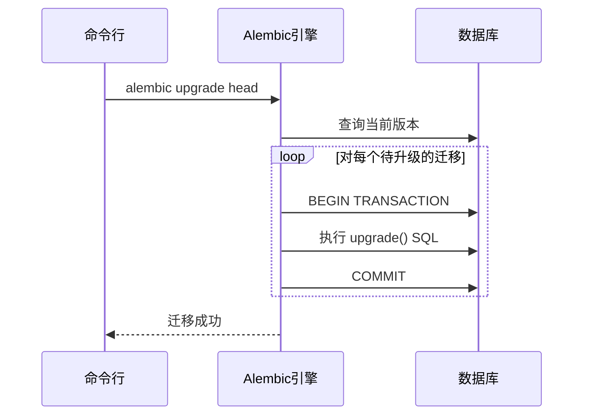

# 迁移策略

<cite>
**本文档中引用的文件**   
- [002_ddl_autogenerate.py](file://backend/alembic/versions/002_ddl_autogenerate.py)
- [017_rsa_ddl.py](file://backend/alembic/versions/017_rsa_ddl.py)
- [038_remove_chat_record_cloumns.py](file://backend/alembic/versions/038_remove_chat_record_cloumns.py)
- [env.py](file://backend/alembic/env.py)
- [alembic.ini](file://backend/alembic.ini)
- [auto.sh](file://backend/scripts/alembic/auto.sh)
- [exec.sh](file://backend/scripts/alembic/exec.sh)
</cite>

## 目录
1. [引言](#引言)
2. [迁移脚本版本控制](#迁移脚本版本控制)
3. [混合迁移模式](#混合迁移模式)
4. [迁移脚本标准结构](#迁移脚本标准结构)
5. [依赖关系管理](#依赖关系管理)
6. [执行流程](#执行流程)
7. [生产环境最佳实践](#生产环境最佳实践)
8. [常用命令指南](#常用命令指南)
9. [自动化脚本使用说明](#自动化脚本使用说明)
10. [数据安全考虑](#数据安全考虑)

## 引言
本文档详细阐述了基于Alembic的数据库迁移策略。项目在`backend/alembic/versions`目录下维护了38个迁移文件，形成了一条清晰的数据库演进路径。这些迁移脚本通过`upgrade()`和`downgrade()`方法定义了数据库的正向升级和反向回滚操作，确保了数据库模式变更的安全性和可逆性。本策略结合了自动与手动迁移的优势，旨在为开发和运维团队提供一套高效、可靠且安全的数据库变更管理方案。

## 迁移脚本版本控制
数据库的演进路径由`backend/alembic/versions`目录下的38个有序迁移文件精确记录。每个文件的命名遵循`<序号>_<描述>.py`的模式（如`001_ddl.py`, `002_ddl_autogenerate.py`），清晰地展示了数据库从初始状态到当前版本的完整历史。这种基于文件名的排序机制，配合Alembic内部的`down_revision`字段，共同构建了一个有向无环图（DAG），确保了迁移可以按正确的顺序应用或回滚。

**Section sources**
- [001_ddl.py](file://backend/alembic/versions/001_ddl.py)
- [007_add_chat.py](file://backend/alembic/versions/007_add_chat.py)
- [012_license_ddl.py](file://backend/alembic/versions/012_license_ddl.py)

## 混合迁移模式
项目采用自动与手动迁移相结合的混合模式。`002_ddl_autogenerate.py`文件是自动迁移的典型示例，其内容由Alembic根据模型定义的差异自动生成。该脚本创建了`terms`表，并包含`### commands auto generated by Alembic - please adjust! ###`的注释，提示开发者在必要时进行手动调整。对于复杂的逻辑变更或数据迁移，则采用手动编写脚本的方式，以确保精确控制。

**Diagram sources**
- [002_ddl_autogenerate.py](file://backend/alembic/versions/002_ddl_autogenerate.py)
- [env.py](file://backend/alembic/env.py)

**Section sources**
- [002_ddl_autogenerate.py](file://backend/alembic/versions/002_ddl_autogenerate.py)

## 迁移脚本标准结构
每个迁移脚本都遵循一个标准的结构。脚本开头包含元数据，如`Revision ID`、`Revises`（前一个版本的ID）和`Create Date`。核心是`upgrade()`和`downgrade()`两个函数。`upgrade()`函数定义了如何将数据库从上一个版本迁移到当前版本，而`downgrade()`函数则定义了如何安全地回滚到上一个版本。这种成对的设计是实现迁移可逆性的基础。

**Section sources**
- [002_ddl_autogenerate.py](file://backend/alembic/versions/002_ddl_autogenerate.py)
- [017_rsa_ddl.py](file://backend/alembic/versions/017_rsa_ddl.py)
- [038_remove_chat_record_cloumns.py](file://backend/alembic/versions/038_remove_chat_record_cloumns.py)

## 依赖关系管理
迁移脚本之间的依赖关系通过`down_revision`字段进行管理。该字段的值是当前脚本所依赖的前一个迁移脚本的`Revision ID`。Alembic在执行迁移时，会根据这个字段构建执行顺序，确保所有前置依赖都已成功应用。例如，`038_remove_chat_record_cloumns.py`的`down_revision`指向`68a06302cf70`，表明它必须在ID为`68a06302cf70`的迁移之后执行。

**Diagram sources**
- [038_remove_chat_record_cloumns.py](file://backend/alembic/versions/038_remove_chat_record_cloumns.py)

**Section sources**
- [038_remove_chat_record_cloumns.py](file://backend/alembic/versions/038_remove_chat_record_cloumns.py)

## 执行流程
迁移的执行流程由`backend/alembic/env.py`配置。该文件定义了`run_migrations_online()`函数，它负责创建数据库连接，并在事务中执行迁移。`alembic.ini`配置文件指定了脚本位置（`script_location = alembic`）和日志级别。当执行`alembic upgrade head`命令时，Alembic会连接到数据库，检查当前版本，并按`down_revision`链的顺序，依次应用所有未执行的`upgrade()`函数。

**Diagram sources**
- [env.py](file://backend/alembic/env.py)
- [alembic.ini](file://backend/alembic.ini)

**Section sources**
- [env.py](file://backend/alembic/env.py)
- [alembic.ini](file://backend/alembic.ini)

## 生产环境最佳实践
在生产环境中应用迁移时，必须遵循严格的最佳实践。首先，务必在应用迁移前对数据库进行完整备份。其次，所有迁移脚本都必须经过代码审查，确保其正确性和安全性。`env.py`中的`compare_type=True`配置确保了列类型变更会被检测到。所有迁移都在数据库事务中执行，如果任何一步失败，整个迁移将回滚，保证数据库的一致性。回滚方案依赖于`downgrade()`函数，但应在非生产环境充分测试。

**Section sources**
- [env.py](file://backend/alembic/env.py)

## 常用命令指南
- **生成新迁移**: `alembic revision -m "描述信息"` (手动) 或 `alembic revision --autogenerate -m "描述信息"` (自动)
- **应用迁移**: `alembic upgrade head` (升级到最新版本)
- **查看状态**: `alembic history` (查看迁移历史), `alembic current` (查看当前版本)

**Section sources**
- [env.py](file://backend/alembic/env.py)

## 自动化脚本使用说明
项目提供了两个自动化脚本以简化操作。`backend/scripts/alembic/auto.sh`是一个封装了自动迁移生成的Shell脚本，它接受一个迁移消息作为参数，调用`alembic revision --autogenerate`并生成以消息命名的迁移文件。`backend/scripts/alembic/exec.sh`则是一个简单的单行脚本，直接执行`alembic upgrade head`命令，用于应用所有待处理的迁移。

**Section sources**
- [auto.sh](file://backend/scripts/alembic/auto.sh)
- [exec.sh](file://backend/scripts/alembic/exec.sh)

## 数据安全考虑
迁移过程中的数据安全至关重要。`017_rsa_ddl.py`脚本在创建`rsa`表时，明确指定了`private_key`和`public_key`等敏感字段的类型为`Text()`，并设置了默认值，体现了对敏感数据的谨慎处理。`038_remove_chat_record_cloumns.py`脚本展示了如何安全地删除字段：它通过`op.drop_column()`移除不再需要的token和消息字段，而`downgrade()`函数则精确地重建了这些字段，确保了变更的可逆性，避免了数据丢失风险。

**Section sources**
- [017_rsa_ddl.py](file://backend/alembic/versions/017_rsa_ddl.py)
- [038_remove_chat_record_cloumns.py](file://backend/alembic/versions/038_remove_chat_record_cloumns.py)