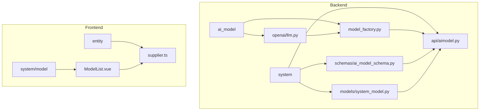
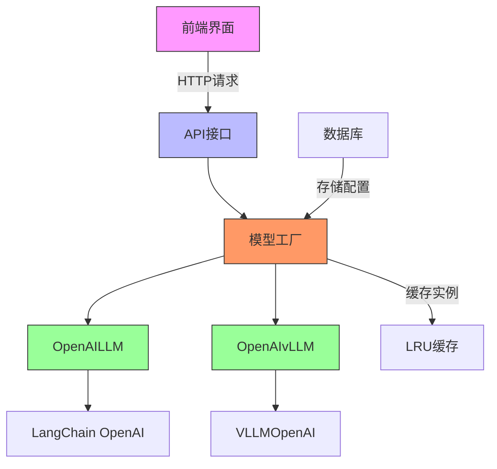
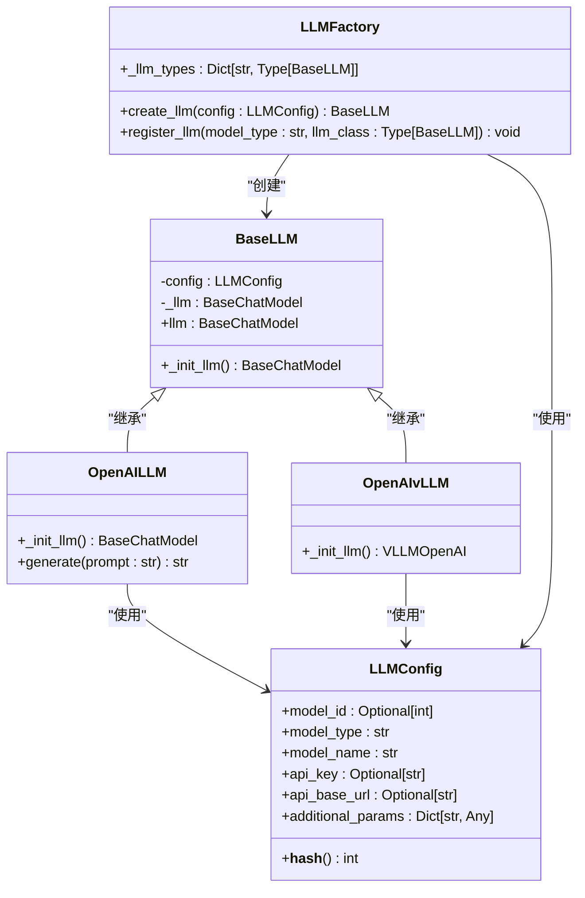
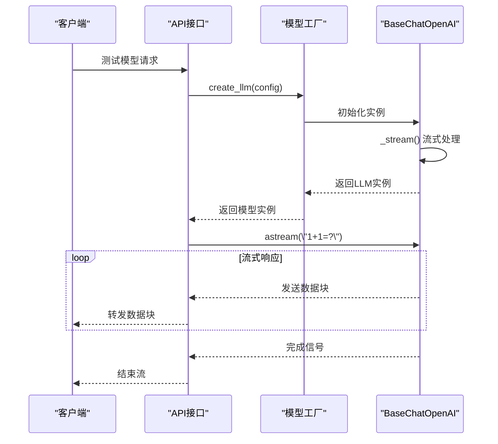
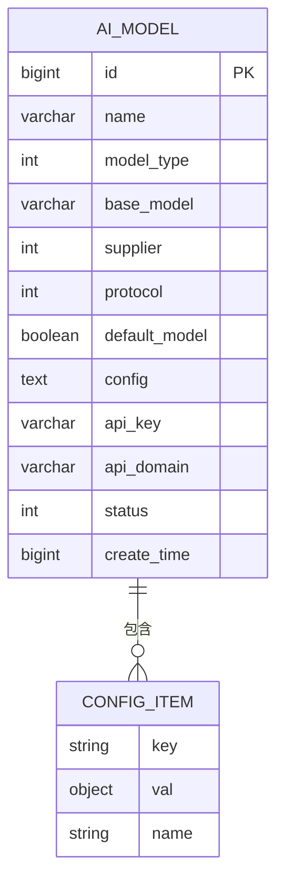
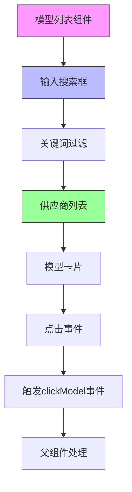
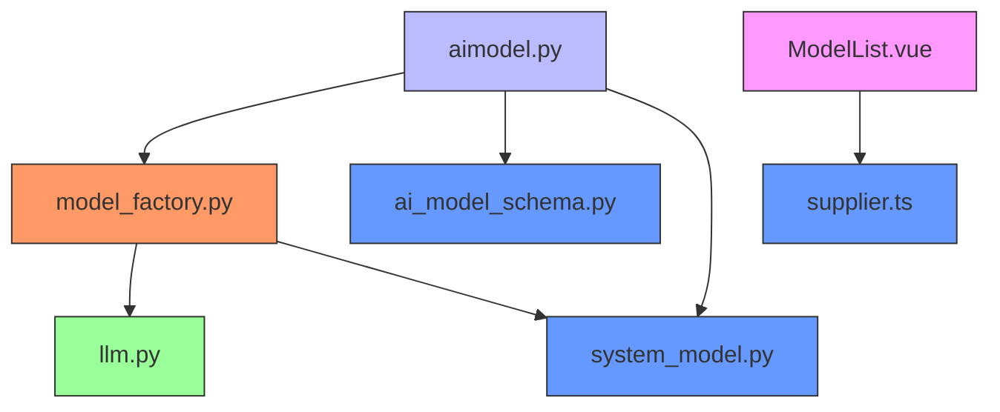

# AI模型集成

<cite>
**本文档中引用的文件**
- [model_factory.py](file://backend/apps/ai_model/model_factory.py)
- [llm.py](file://backend/apps/ai_model/openai/llm.py)
- [aimodel.py](file://backend/apps/system/api/aimodel.py)
- [ModelList.vue](file://frontend/src/views/system/model/ModelList.vue)
- [ai_model_schema.py](file://backend/apps/system/schemas/ai_model_schema.py)
- [system_model.py](file://backend/apps/system/models/system_model.py)
- [supplier.ts](file://frontend/src/entity/supplier.ts)
</cite>

## 目录
1. [简介](#简介)
2. [项目结构](#项目结构)
3. [核心组件](#核心组件)
4. [架构概述](#架构概述)
5. [详细组件分析](#详细组件分析)
6. [依赖分析](#依赖分析)
7. [性能考虑](#性能考虑)
8. [故障排除指南](#故障排除指南)
9. [结论](#结论)

## 简介
本文档详细介绍了SQLBot系统中AI模型集成的实现机制。重点阐述了模型工厂模式的设计原理、多模型支持机制、配置管理体系以及前后端交互流程。文档涵盖了从模型实例化、API调用到前端管理界面的完整技术栈，为开发者提供全面的集成指导和扩展方案。

## 项目结构
AI模型相关功能在项目中采用分层架构设计，主要分布在backend/apps/ai_model和frontend/src/views/system/model目录下。后端实现模型工厂和LLM封装，前端提供可视化管理界面。

**图示来源**
- [model_factory.py](file://backend/apps/ai_model/model_factory.py)
- [llm.py](file://backend/apps/ai_model/openai/llm.py)
- [aimodel.py](file://backend/apps/system/api/aimodel.py)
- [ModelList.vue](file://frontend/src/views/system/model/ModelList.vue)

**本节来源**
- [model_factory.py](file://backend/apps/ai_model/model_factory.py)
- [aimodel.py](file://backend/apps/system/api/aimodel.py)
- [ModelList.vue](file://frontend/src/views/system/model/ModelList.vue)

## 核心组件
系统AI模型集成的核心组件包括模型工厂（LLMFactory）、基础LLM抽象类（BaseLLM）、具体实现类（OpenAILLM、OpenAIvLLM）以及配置管理类（LLMConfig）。这些组件共同实现了模型的动态创建、统一调用和配置管理功能。

**本节来源**
- [model_factory.py](file://backend/apps/ai_model/model_factory.py#L85-L105)
- [llm.py](file://backend/apps/ai_model/openai/llm.py#L72-L166)

## 架构概述
系统采用工厂模式实现AI模型的统一管理和动态实例化。通过配置驱动的方式，支持OpenAI、通义千问、VLLM等多种模型协议。前后端通过REST API进行模型管理操作，前端界面提供模型的增删改查和测试功能。

**图示来源**
- [model_factory.py](file://backend/apps/ai_model/model_factory.py)
- [aimodel.py](file://backend/apps/system/api/aimodel.py)
- [llm.py](file://backend/apps/ai_model/openai/llm.py)

## 详细组件分析

### 模型工厂模式分析
模型工厂（LLMFactory）采用类方法和LRU缓存机制，实现模型实例的高效创建和复用。通过注册机制支持扩展新的模型类型。

**图示来源**
- [model_factory.py](file://backend/apps/ai_model/model_factory.py#L85-L105)

**本节来源**
- [model_factory.py](file://backend/apps/ai_model/model_factory.py#L85-L105)

### 统一接口设计分析
BaseChatOpenAI类封装了LangChain的ChatOpenAI，提供了流式响应处理、使用量统计和错误恢复等增强功能。

**图示来源**
- [llm.py](file://backend/apps/ai_model/openai/llm.py#L72-L166)
- [aimodel.py](file://backend/apps/system/api/aimodel.py#L4-L28)

**本节来源**
- [llm.py](file://backend/apps/ai_model/openai/llm.py#L72-L166)
- [aimodel.py](file://backend/apps/system/api/aimodel.py#L4-L28)

### 配置管理机制分析
系统通过数据库表ai_model存储模型配置，前端通过标准化的配置项列表进行参数设置。

**图示来源**
- [system_model.py](file://backend/apps/system/models/system_model.py#L7-L21)
- [ai_model_schema.py](file://backend/apps/system/schemas/ai_model_schema.py#L1-L28)

**本节来源**
- [system_model.py](file://backend/apps/system/models/system_model.py#L7-L21)
- [ai_model_schema.py](file://backend/apps/system/schemas/ai_model_schema.py#L1-L28)

### 前端管理界面分析
前端模型管理界面提供供应商选择、搜索过滤和模型添加功能，通过事件机制与父组件通信。

**图示来源**
- [ModelList.vue](file://frontend/src/views/system/model/ModelList.vue)
- [supplier.ts](file://frontend/src/entity/supplier.ts)

**本节来源**
- [ModelList.vue](file://frontend/src/views/system/model/ModelList.vue)
- [supplier.ts](file://frontend/src/entity/supplier.ts)

## 依赖分析
系统AI模型模块的依赖关系清晰，采用分层设计避免循环依赖。核心依赖包括LangChain框架、FastAPI、SQLModel等。

**图示来源**
- [model_factory.py](file://backend/apps/ai_model/model_factory.py)
- [llm.py](file://backend/apps/ai_model/openai/llm.py)
- [aimodel.py](file://backend/apps/system/api/aimodel.py)
- [ModelList.vue](file://frontend/src/views/system/model/ModelList.vue)

**本节来源**
- [model_factory.py](file://backend/apps/ai_model/model_factory.py)
- [aimodel.py](file://backend/apps/system/api/aimodel.py)

## 性能考虑
模型工厂采用LRU缓存机制（最大32个实例）避免重复创建开销。流式响应处理通过服务器发送事件（SSE）实现，减少内存占用和响应延迟。数据库查询使用索引优化，按默认模型优先排序。

## 故障排除指南
常见问题包括模型测试失败、API密钥错误、流式响应中断等。系统提供详细的错误日志记录和用户友好的错误提示。建议检查网络连接、API端点可达性、密钥有效性以及模型配置参数。

**本节来源**
- [aimodel.py](file://backend/apps/system/api/aimodel.py#L10-L26)
- [llm.py](file://backend/apps/ai_model/openai/llm.py#L77-L78)

## 结论
SQLBot的AI模型集成方案采用工厂模式实现灵活的模型管理，通过统一接口封装简化调用复杂性。系统支持多种模型协议，提供完整的配置管理和前端操作界面。该设计具有良好的扩展性和维护性，为集成新模型类型提供了清晰的开发路径。