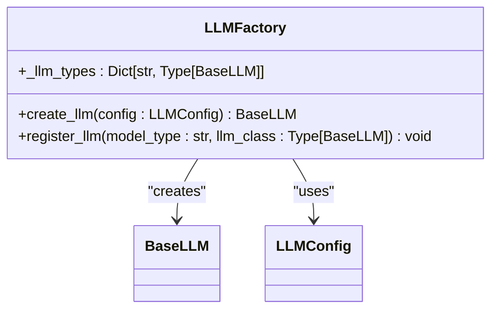
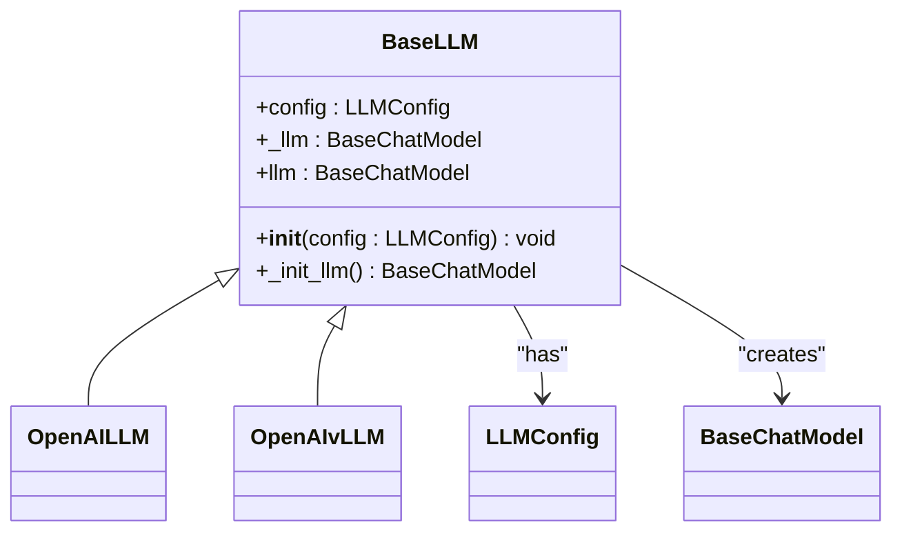
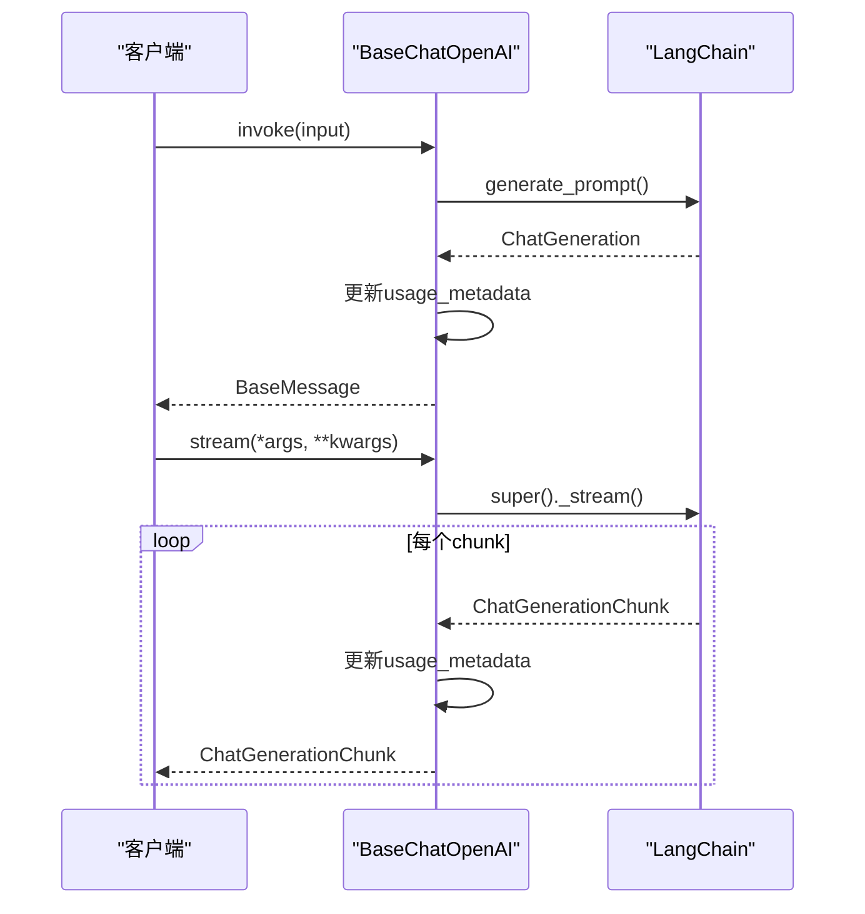
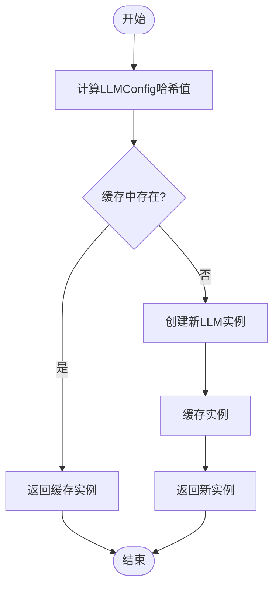

# 模型扩展与集成

<cite>
**Referenced Files in This Document**   
- [model_factory.py](file://backend/apps/ai_model/model_factory.py)
- [llm.py](file://backend/apps/ai_model/openai/llm.py)
- [system_model.py](file://backend/apps/system/models/system_model.py)
- [llm.py](file://backend/apps/chat/task/llm.py)
</cite>

## 目录
1. [简介](#简介)
2. [核心组件](#核心组件)
3. [工厂模式与注册机制](#工厂模式与注册机制)
4. [抽象基类设计](#抽象基类设计)
5. [LangChain扩展实现](#langchain扩展实现)
6. [模型实例生命周期管理](#模型实例生命周期管理)
7. [新模型类型扩展指南](#新模型类型扩展指南)
8. [集成示例](#集成示例)
9. [结论](#结论)

## 简介
本文档详细阐述了SQLBot系统中AI模型扩展与集成机制的设计原理和实现细节。系统采用工厂模式和抽象基类设计，通过LLMFactory工厂类统一管理不同类型的大型语言模型（LLM）实例的创建和注册。BaseLLM作为抽象基类定义了所有LLM实现的通用接口和初始化流程，而BaseChatOpenAI则对LangChain框架进行了扩展，实现了流式响应处理、usage_metadata追踪和_chunk转换等高级功能。文档还详细说明了如何通过register_llm方法注册新模型类型，以及如何利用lru_cache装饰器实现模型实例的缓存控制和配置哈希计算机制。

**Section sources**
- [model_factory.py](file://backend/apps/ai_model/model_factory.py#L1-L145)
- [llm.py](file://backend/apps/ai_model/openai/llm.py#L1-L168)

## 核心组件
系统的核心组件包括LLMFactory工厂类、BaseLLM抽象基类和BaseChatOpenAI扩展类。LLMFactory负责根据配置创建和管理LLM实例，通过_register_llm_types字典维护支持的模型类型映射。BaseLLM定义了所有LLM实现的通用接口，包括配置初始化和LLM实例创建的抽象方法。BaseChatOpenAI继承自LangChain的ChatOpenAI类，扩展了流式响应处理、usage_metadata追踪和_chunk转换功能，为系统提供了与OpenAI API的兼容性。

**Section sources**
- [model_factory.py](file://backend/apps/ai_model/model_factory.py#L85-L105)
- [model_factory.py](file://backend/apps/ai_model/model_factory.py#L45-L60)
- [llm.py](file://backend/apps/ai_model/openai/llm.py#L72-L166)

## 工厂模式与注册机制
LLMFactory类采用工厂模式设计，通过_register_llm_types类变量维护一个字典，将模型类型字符串映射到相应的LLM实现类。create_llm方法使用lru_cache装饰器实现缓存策略，根据LLMConfig配置对象的哈希值缓存已创建的LLM实例，避免重复创建开销。register_llm类方法允许动态注册新的模型类型，将模型类型标识符与对应的LLM实现类关联，从而扩展系统支持的模型类型。



**Diagram sources **
- [model_factory.py](file://backend/apps/ai_model/model_factory.py#L85-L105)

**Section sources**
- [model_factory.py](file://backend/apps/ai_model/model_factory.py#L85-L105)
- [model_factory.py](file://backend/apps/ai_model/model_factory.py#L17-L42)

## 抽象基类设计
BaseLLM抽象基类继承自Python的ABC（Abstract Base Classes），定义了所有LLM实现的通用接口。其构造函数接收LLMConfig配置对象，调用抽象的_init_llm方法创建具体的LLM实例，并通过llm属性提供对LangChain LLM实例的访问。这种设计模式确保了所有LLM实现都遵循统一的初始化流程和接口规范，提高了代码的可维护性和扩展性。



**Diagram sources **
- [model_factory.py](file://backend/apps/ai_model/model_factory.py#L45-L60)

**Section sources**
- [model_factory.py](file://backend/apps/ai_model/model_factory.py#L45-L60)

## LangChain扩展实现
BaseChatOpenAI类对LangChain的ChatOpenAI进行了扩展，实现了流式响应处理、usage_metadata追踪和_chunk转换等高级功能。通过重写_invoke和_stream方法，系统能够捕获和存储每次调用的token使用情况。_convert_chunk_to_generation_chunk方法负责将API返回的原始chunk数据转换为LangChain的消息块对象，并处理usage_metadata的传递。这种扩展机制确保了系统能够准确追踪和报告LLM调用的资源消耗。



**Diagram sources **
- [llm.py](file://backend/apps/ai_model/openai/llm.py#L72-L166)

**Section sources**
- [llm.py](file://backend/apps/ai_model/openai/llm.py#L72-L166)

## 模型实例生命周期管理
系统通过lru_cache装饰器和LLMConfig类的__hash__方法实现模型实例的生命周期管理。LLMConfig类的__hash__方法将配置对象的所有属性（包括嵌套的additional_params字典）转换为不可变的哈希值，确保相同配置的LLM实例能够被正确缓存和复用。当配置发生变化时，哈希值也会相应改变，从而触发新的LLM实例创建。这种机制有效平衡了内存使用和性能需求。



**Diagram sources **
- [model_factory.py](file://backend/apps/ai_model/model_factory.py#L17-L42)
- [model_factory.py](file://backend/apps/ai_model/model_factory.py#L85-L105)

**Section sources**
- [model_factory.py](file://backend/apps/ai_model/model_factory.py#L17-L42)
- [model_factory.py](file://backend/apps/ai_model/model_factory.py#L85-L105)

## 新模型类型扩展指南
要扩展新的AI模型类型，首先需要创建一个继承自BaseLLM的新类，实现_init_llm抽象方法以初始化具体的LLM实例。然后通过LLMFactory的register_llm类方法注册新模型类型，将模型类型标识符与新创建的LLM类关联。在_init_llm方法中，需要根据配置参数正确初始化底层的LLM库，并处理特定于该模型类型的参数。

**Section sources**
- [model_factory.py](file://backend/apps/ai_model/model_factory.py#L62-L82)

## 集成示例
以下示例展示了如何集成一个新的AI服务提供商：

```python
class CustomLLM(BaseLLM):
    def _init_llm(self) -> BaseChatModel:
        return CustomChatModel(
            api_key=self.config.api_key,
            endpoint=self.config.api_base_url,
            model=self.config.model_name,
            **self.config.additional_params
        )

LLMFactory.register_llm("custom", CustomLLM)
```

**Section sources**
- [model_factory.py](file://backend/apps/ai_model/model_factory.py#L103-L105)

## 结论
SQLBot系统的AI模型扩展与集成机制通过工厂模式、抽象基类和装饰器缓存等设计模式，实现了灵活、可扩展的LLM管理架构。这种设计不仅简化了新模型类型的集成过程，还通过缓存机制优化了性能。BaseChatOpenAI对LangChain的扩展确保了与主流LLM服务的兼容性，而详细的配置管理和生命周期控制则保证了系统的稳定性和可靠性。

**Section sources**
- [model_factory.py](file://backend/apps/ai_model/model_factory.py#L1-L145)
- [llm.py](file://backend/apps/ai_model/openai/llm.py#L1-L168)