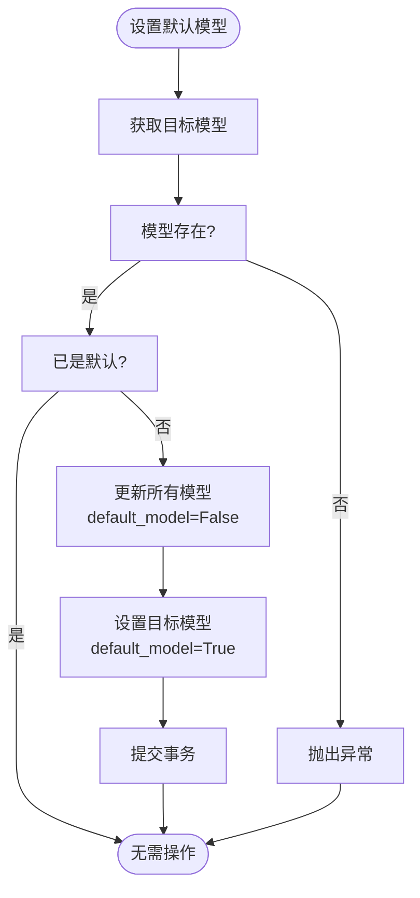
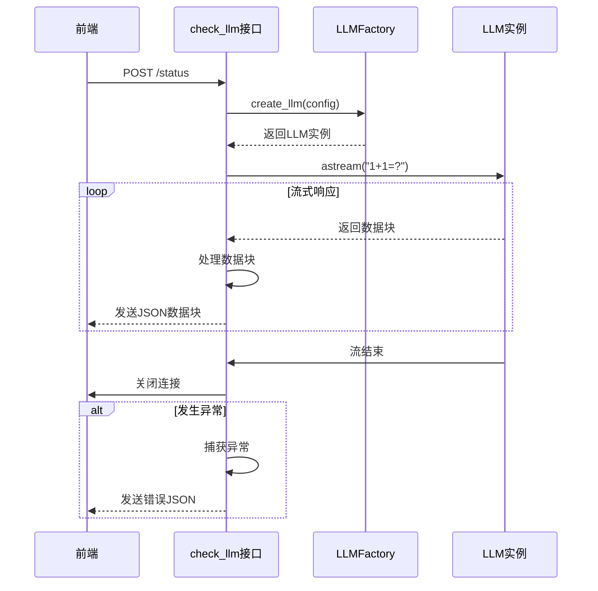
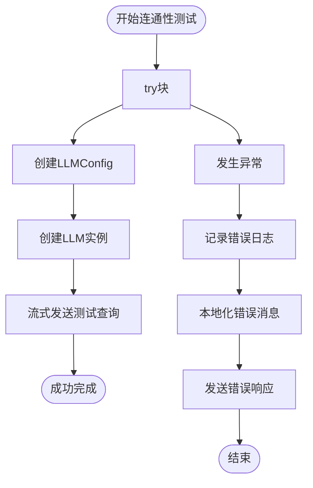
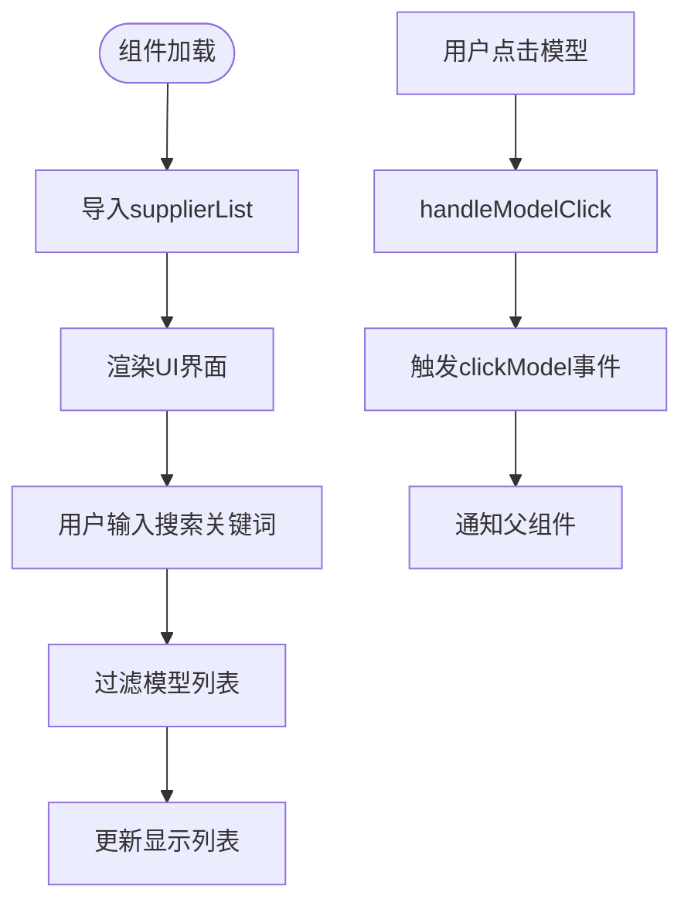
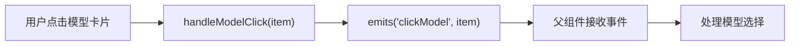
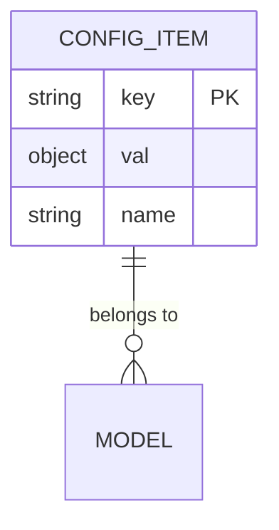
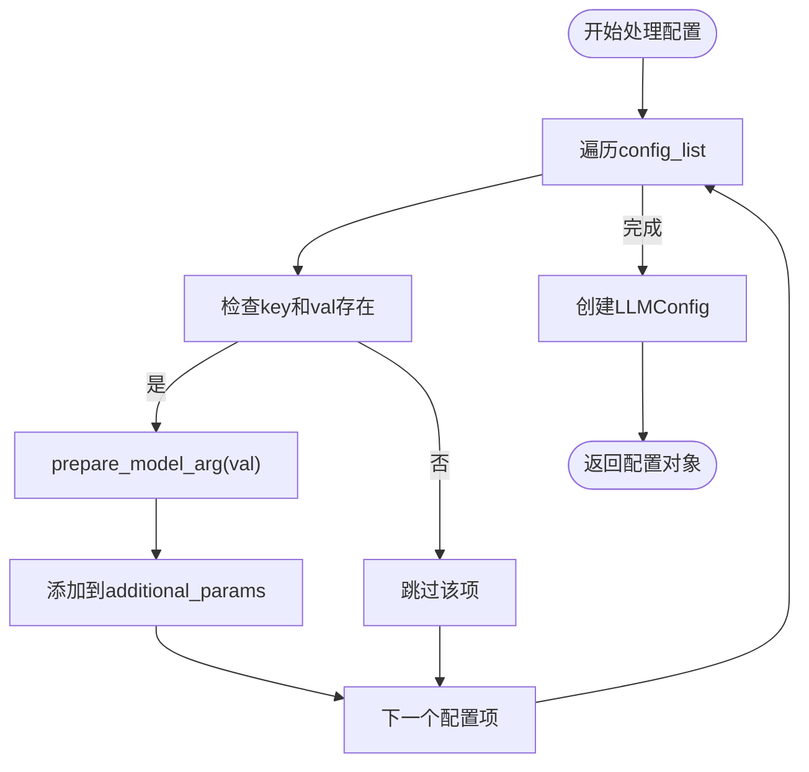
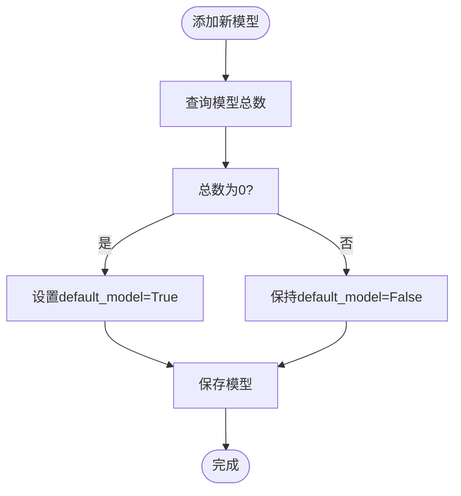
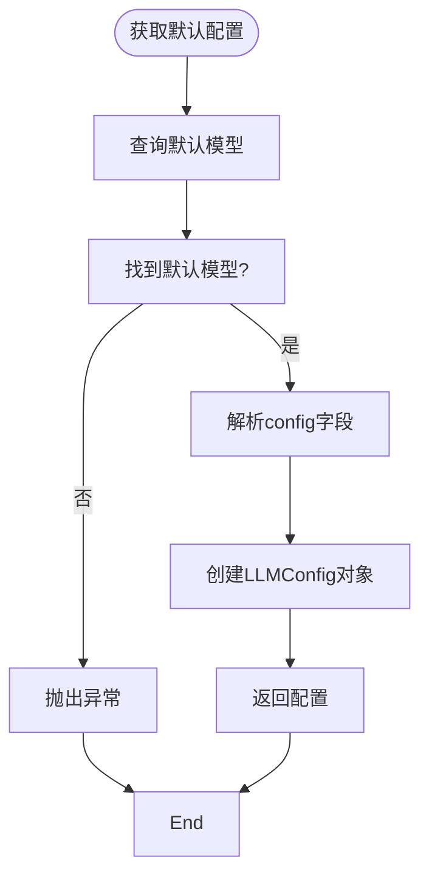

# 模型配置与管理

<cite>
**本文档中引用的文件**
- [aimodel.py](file://backend/apps/system/api/aimodel.py)
- [ModelList.vue](file://frontend/src/views/system/model/ModelList.vue)
- [ai_model_schema.py](file://backend/apps/system/schemas/ai_model_schema.py)
- [model_factory.py](file://backend/apps/ai_model/model_factory.py)
- [system_model.py](file://backend/apps/system/models/system_model.py)
</cite>

## 目录
1. [简介](#简介)
2. [后端API功能详解](#后端api功能详解)
3. [前端用户交互流程](#前端用户交互流程)
4. [模型配置存储结构](#模型配置存储结构)
5. [配置示例](#配置示例)
6. [默认模型设置逻辑](#默认模型设置逻辑)

## 简介
本文档详细说明了SQLBot系统中AI模型配置与管理功能的实现机制。涵盖后端API接口、前端组件交互、配置存储结构及默认模型管理等核心功能，为开发者和系统管理员提供全面的技术参考。

## 后端API功能详解

### 模型增删改查接口
后端通过`aimodel.py`文件中的FastAPI路由实现了对AI模型的完整CRUD操作。`query`接口支持按名称关键字搜索模型，并按默认模型优先、名称和创建时间排序返回结果。`add_model`接口接收`AiModelCreator`对象，将配置列表序列化为JSON字符串后存储到数据库。`update_model`接口使用`sqlmodel_update`方法实现模型信息的更新。`delete_model`接口在删除前会检查是否为默认模型，防止系统失去默认配置。

**Section sources**
- [aimodel.py](file://backend/apps/system/api/aimodel.py#L70-L153)

### 默认模型设置
`set_default`接口负责设置指定ID的模型为系统默认模型。实现逻辑为：首先将所有现有模型的`default_model`字段设为False，然后将目标模型的该字段设为True并提交事务。此操作确保系统中始终有且仅有一个默认模型。

**Diagram sources**
- [aimodel.py](file://backend/apps/system/api/aimodel.py#L52-L68)

### 连通性测试功能
`check_llm`接口实现了模型连通性检测功能，采用流式响应机制。该接口创建一个异步生成器函数，通过`LLMFactory`创建LLM实例，并向模型发送测试查询"1+1=?"。响应以`application/x-ndjson`媒体类型流式传输，每个数据块包含内容或错误信息的JSON编码。

#### 流式响应机制

**Diagram sources**
- [aimodel.py](file://backend/apps/system/api/aimodel.py#L17-L41)
- [model_factory.py](file://backend/apps/ai_model/model_factory.py#L85-L105)

#### 错误处理策略
连通性测试具有完善的错误处理机制。当检测过程中发生异常时，系统会捕获异常，记录错误日志，并通过流式响应返回格式化的错误信息。错误消息通过国际化函数`trans`进行本地化处理，确保用户能理解错误原因。

**Diagram sources**
- [aimodel.py](file://backend/apps/system/api/aimodel.py#L17-L41)

## 前端用户交互流程

### 供应商模型选择
`ModelList.vue`组件实现了供应商模型的选择界面。组件通过`supplierList`导入供应商列表，并使用计算属性`modelListWithSearch`实现搜索过滤功能。用户点击模型卡片时，通过`emits('clickModel', item)`触发事件，将选中的模型信息传递给父组件。

**Diagram sources**
- [ModelList.vue](file://frontend/src/views/system/model/ModelList.vue#L1-L99)

### 搜索过滤机制
搜索过滤功能基于Vue的计算属性实现。`modelListWithSearch`计算属性监听`keywords`变量的变化，当关键词不为空时，过滤`supplierList`中名称包含关键词的项目（不区分大小写）。若搜索结果为空，则显示"未找到相关内容"的空状态提示。

**Section sources**
- [ModelList.vue](file://frontend/src/views/system/model/ModelList.vue#L1-L99)

### 点击事件处理
点击事件处理流程如下：用户点击模型卡片触发`handleModelClick`方法，该方法接收被点击的模型对象作为参数，然后通过`emits`函数触发`clickModel`自定义事件，将模型数据传递给父组件进行后续处理。

**Diagram sources**
- [ModelList.vue](file://frontend/src/views/system/model/ModelList.vue#L1-L99)

## 模型配置存储结构

### 配置字段JSON格式
模型配置信息存储在数据库的`config`字段中，采用JSON序列化格式。该字段存储一个对象数组，每个对象包含`key`、`val`和`name`三个属性，分别表示配置项的键名、值和显示名称。这种设计支持灵活的动态参数配置。

**Diagram sources**
- [ai_model_schema.py](file://backend/apps/system/schemas/ai_model_schema.py#L1-L29)
- [system_model.py](file://backend/apps/system/models/system_model.py#L14-L21)

### 动态参数传递机制
`additional_params`机制实现了动态参数的传递。在创建`LLMConfig`时，系统遍历`config_list`，将每个配置项的键值对转换为字典。`prepare_model_arg`工具函数负责处理参数值的预处理，确保不同类型的数据能正确传递给LLM实例。

**Diagram sources**
- [aimodel.py](file://backend/apps/system/api/aimodel.py#L17-L41)
- [model_factory.py](file://backend/apps/ai_model/model_factory.py#L17-L42)

## 配置示例

### OpenAI模型配置
OpenAI模型配置需要提供API密钥、基础URL和温度参数。示例如下：
- **API密钥**: `sk-xxxxxxxxxxxxxxxxxxxxxxxxxxxxxxxx`
- **基础URL**: `https://api.openai.com/v1`
- **温度参数**: `0.7`
- **其他参数**: 可通过`config`字段添加`max_tokens`、`top_p`等高级参数

**Section sources**
- [ai_model_schema.py](file://backend/apps/system/schemas/ai_model_schema.py#L1-L29)

### VLLM模型配置
VLLM模型配置与OpenAI类似，但协议类型不同。示例如下：
- **API密钥**: `Empty` (VLLM可能不需要或使用其他认证方式)
- **基础URL**: `http://vllm-server:8000/v1`
- **温度参数**: `0.8`
- **模型名称**: `llama-2-70b-chat`

**Section sources**
- [model_factory.py](file://backend/apps/ai_model/model_factory.py#L85-L105)

## 默认模型设置逻辑

### 自动设置逻辑
系统在创建第一个模型时会自动将其设为默认模型。`add_model`接口通过查询数据库中现有模型的数量，若数量为0，则将`default_model`字段设为True。这确保了系统初始化后立即拥有可用的默认配置。

**Diagram sources**
- [aimodel.py](file://backend/apps/system/api/aimodel.py#L120-L130)

### 系统初始化处理
系统初始化时，`get_default_config`函数负责获取默认模型配置。该函数查询数据库中`default_model`为True的记录，若未找到则抛出异常。获取到模型后，解析其`config`字段中的附加参数，并构造`LLMConfig`对象返回，供系统其他组件使用。

**Diagram sources**
- [model_factory.py](file://backend/apps/ai_model/model_factory.py#L120-L144)