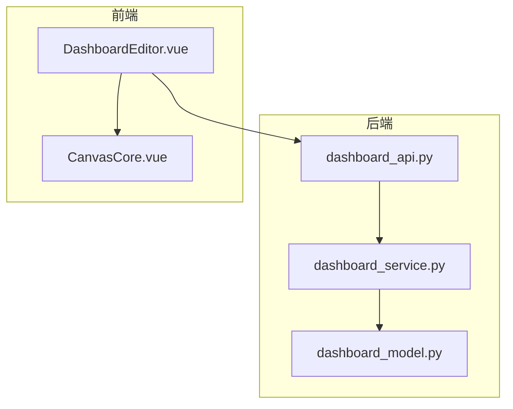
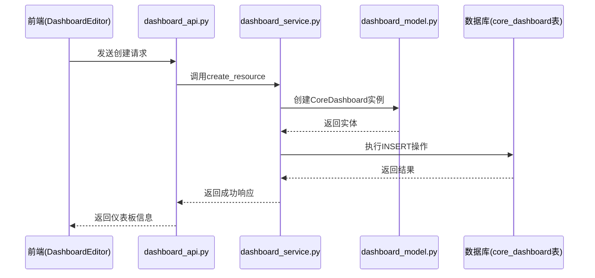
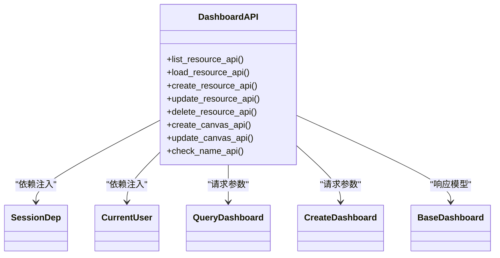
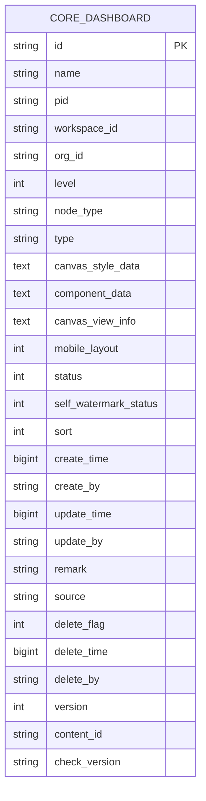
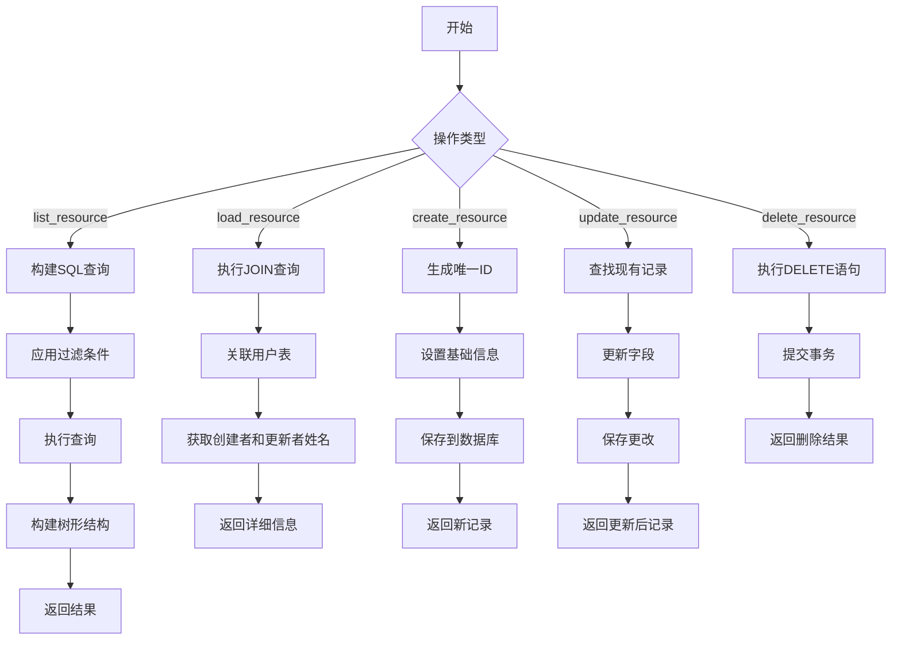
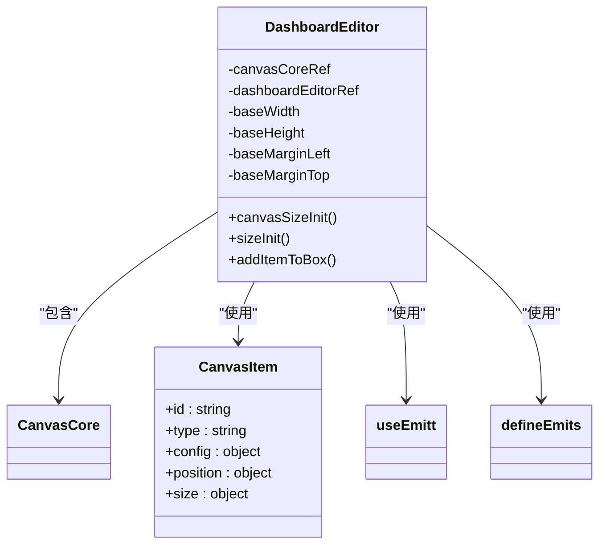
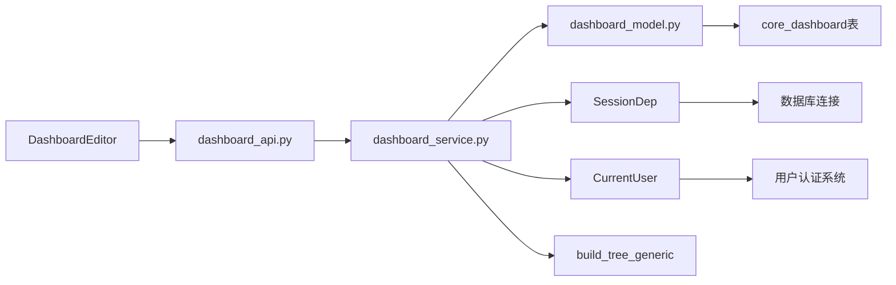

# 仪表板管理

<cite>
**本文档中引用的文件**  
- [dashboard_api.py](file://backend/apps/dashboard/api/dashboard_api.py)
- [dashboard_model.py](file://backend/apps/dashboard/models/dashboard_model.py)
- [dashboard_service.py](file://backend/apps/dashboard/crud/dashboard_service.py)
- [DashboardEditor.vue](file://frontend/src/views/dashboard/editor/DashboardEditor.vue)
</cite>

## 目录
1. [简介](#简介)
2. [项目结构](#项目结构)
3. [核心组件](#核心组件)
4. [架构概述](#架构概述)
5. [详细组件分析](#详细组件分析)
6. [依赖分析](#依赖分析)
7. [性能考虑](#性能考虑)
8. [故障排除指南](#故障排除指南)
9. [结论](#结论)

## 简介
本文档详细阐述了SQLBot系统中仪表板管理功能的实现。重点分析了仪表板的创建、读取、更新和删除（CRUD）操作，涵盖后端API接口、数据模型、业务逻辑以及前端编辑器组件的设计与实现。文档还探讨了权限控制机制和并发编辑处理策略，为开发者提供全面的技术参考。

## 项目结构
仪表板管理功能分布在后端和前端两个主要模块中。后端实现位于`backend/apps/dashboard/`目录下，分为API接口、数据模型和业务逻辑三层。前端实现位于`frontend/src/views/dashboard/`目录下，采用Vue 3组合式API构建响应式用户界面。

**图表来源**  
- [dashboard_api.py](file://backend/apps/dashboard/api/dashboard_api.py#L1-L48)
- [dashboard_model.py](file://backend/apps/dashboard/models/dashboard_model.py#L1-L164)
- [dashboard_service.py](file://backend/apps/dashboard/crud/dashboard_service.py#L1-L137)
- [DashboardEditor.vue](file://frontend/src/views/dashboard/editor/DashboardEditor.vue#L1-L152)

**章节来源**  
- [dashboard_api.py](file://backend/apps/dashboard/api/dashboard_api.py#L1-L48)
- [dashboard_model.py](file://backend/apps/dashboard/models/dashboard_model.py#L1-L164)
- [dashboard_service.py](file://backend/apps/dashboard/crud/dashboard_service.py#L1-L137)
- [DashboardEditor.vue](file://frontend/src/views/dashboard/editor/DashboardEditor.vue#L1-L152)

## 核心组件
仪表板管理功能的核心组件包括RESTful API端点、CoreDashboard数据模型、仪表板服务业务逻辑以及DashboardEditor前端组件。这些组件协同工作，实现了完整的仪表板生命周期管理功能。

**章节来源**  
- [dashboard_api.py](file://backend/apps/dashboard/api/dashboard_api.py#L1-L48)
- [dashboard_model.py](file://backend/apps/dashboard/models/dashboard_model.py#L1-L164)
- [dashboard_service.py](file://backend/apps/dashboard/crud/dashboard_service.py#L1-L137)
- [DashboardEditor.vue](file://frontend/src/views/dashboard/editor/DashboardEditor.vue#L1-L152)

## 架构概述
系统采用前后端分离架构，后端提供RESTful API服务，前端通过HTTP请求与后端交互。数据持久化通过SQLModel实现，前端采用Vue 3 Composition API构建响应式UI。

**图表来源**  
- [dashboard_api.py](file://backend/apps/dashboard/api/dashboard_api.py#L1-L48)
- [dashboard_service.py](file://backend/apps/dashboard/crud/dashboard_service.py#L1-L137)
- [dashboard_model.py](file://backend/apps/dashboard/models/dashboard_model.py#L1-L164)

## 详细组件分析

### 后端API接口分析
`dashboard_api.py`文件定义了仪表板管理的所有RESTful API端点，采用FastAPI框架实现。每个端点对应特定的HTTP方法和URL路径，处理前端的请求并返回相应的响应。

**图表来源**  
- [dashboard_api.py](file://backend/apps/dashboard/api/dashboard_api.py#L1-L48)

**章节来源**  
- [dashboard_api.py](file://backend/apps/dashboard/api/dashboard_api.py#L1-L48)

### 数据模型分析
`CoreDashboard`实体类定义了仪表板在数据库中的数据结构，映射到`core_dashboard`表。该模型包含丰富的字段，支持复杂的仪表板配置和元数据管理。

**图表来源**  
- [dashboard_model.py](file://backend/apps/dashboard/models/dashboard_model.py#L5-L126)

**章节来源**  
- [dashboard_model.py](file://backend/apps/dashboard/models/dashboard_model.py#L5-L126)

### 业务逻辑分析
`dashboard_service.py`文件实现了仪表板管理的核心业务逻辑，包括资源列表获取、资源加载、创建、更新、删除等操作。服务层负责处理业务规则和数据验证。

**图表来源**  
- [dashboard_service.py](file://backend/apps/dashboard/crud/dashboard_service.py#L1-L137)

**章节来源**  
- [dashboard_service.py](file://backend/apps/dashboard/crud/dashboard_service.py#L1-L137)

### 前端组件分析
`DashboardEditor.vue`是仪表板编辑器的主要组件，负责管理画布的布局、组件拖拽和状态管理。它采用Vue 3的组合式API，通过ref和props实现响应式数据绑定。

**图表来源**  
- [DashboardEditor.vue](file://frontend/src/views/dashboard/editor/DashboardEditor.vue#L1-L152)

**章节来源**  
- [DashboardEditor.vue](file://frontend/src/views/dashboard/editor/DashboardEditor.vue#L1-L152)

## 依赖分析
仪表板管理功能依赖于多个系统组件，包括数据库会话、当前用户信息、树形结构工具等。这些依赖通过依赖注入机制提供给各个服务。

**图表来源**  
- [dashboard_api.py](file://backend/apps/dashboard/api/dashboard_api.py#L1-L48)
- [dashboard_service.py](file://backend/apps/dashboard/crud/dashboard_service.py#L1-L137)
- [dashboard_model.py](file://backend/apps/dashboard/models/dashboard_model.py#L1-L164)

**章节来源**  
- [dashboard_api.py](file://backend/apps/dashboard/api/dashboard_api.py#L1-L48)
- [dashboard_service.py](file://backend/apps/dashboard/crud/dashboard_service.py#L1-L137)
- [dashboard_model.py](file://backend/apps/dashboard/models/dashboard_model.py#L1-L164)

## 性能考虑
系统在设计时考虑了多个性能优化点。后端采用参数化SQL查询防止SQL注入，同时通过索引优化查询性能。前端实现了响应式布局计算，确保在不同屏幕尺寸下都能正确渲染。

对于大型仪表板，建议：
1. 限制单个仪表板的组件数量
2. 使用虚拟滚动技术处理大量数据
3. 实现数据懒加载机制
4. 优化数据库查询索引

## 故障排除指南
常见问题及解决方案：

1. **仪表板创建失败**：检查`workspace_id`和`create_by`字段是否正确设置
2. **组件无法拖拽**：确保`moveInActive`属性正确绑定
3. **布局错乱**：检查`baseMatrixCount`配置是否合理
4. **名称重复错误**：使用`check_name`API端点预先验证名称唯一性
5. **权限不足**：确认当前用户具有操作目标工作空间的权限

**章节来源**  
- [dashboard_service.py](file://backend/apps/dashboard/crud/dashboard_service.py#L1-L137)
- [DashboardEditor.vue](file://frontend/src/views/dashboard/editor/DashboardEditor.vue#L1-L152)

## 结论
仪表板管理功能实现了完整的CRUD操作，支持复杂的布局配置和组件管理。系统采用分层架构，前后端职责分明，代码结构清晰。通过合理的数据模型设计和业务逻辑封装，确保了功能的可维护性和扩展性。未来可考虑增加版本控制、协作编辑等高级功能。