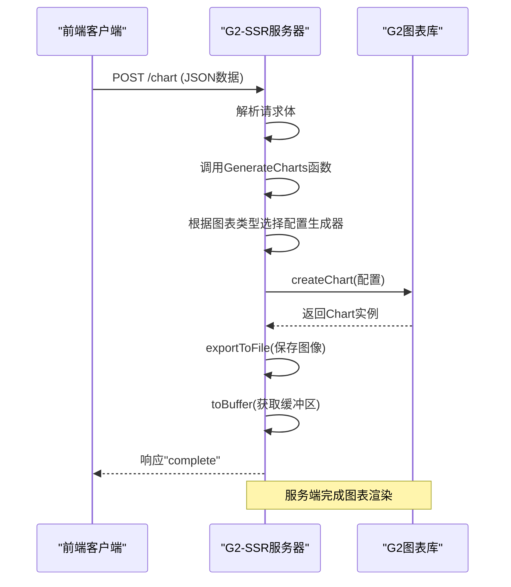
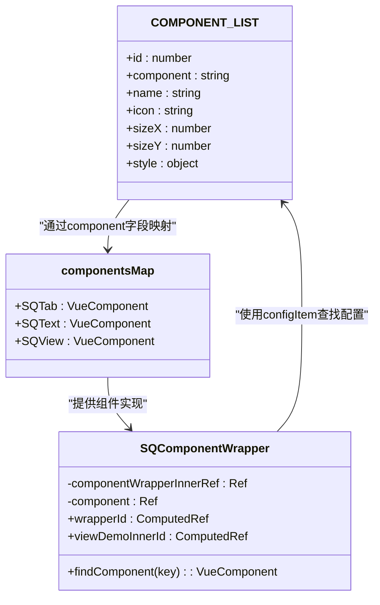
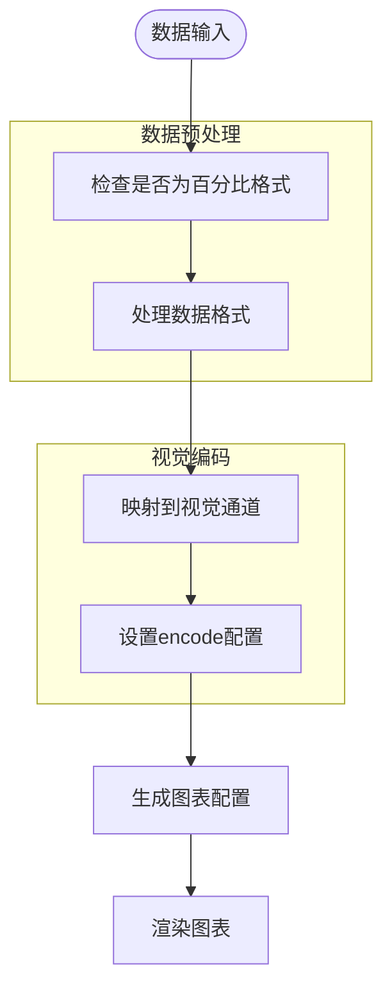

# 图表组件库

<cite>
**Referenced Files in This Document**   
- [g2-ssr/charts/bar.js](file://g2-ssr/charts/bar.js)
- [g2-ssr/charts/line.js](file://g2-ssr/charts/line.js)
- [g2-ssr/charts/pie.js](file://g2-ssr/charts/pie.js)
- [g2-ssr/charts/utils.js](file://g2-ssr/charts/utils.js)
- [g2-ssr/app.js](file://g2-ssr/app.js)
- [frontend/src/views/dashboard/components/component-list.ts](file://frontend/src/views/dashboard/components/component-list.ts)
- [frontend/src/views/dashboard/preview/SQComponentWrapper.vue](file://frontend/src/views/dashboard/preview/SQComponentWrapper.vue)
</cite>

## 目录
1. [简介](#简介)
2. [项目结构](#项目结构)
3. [核心图表实现](#核心图表实现)
4. [服务端渲染架构](#服务端渲染架构)
5. [组件注册与动态加载](#组件注册与动态加载)
6. [数据映射与视觉编码](#数据映射与视觉编码)
7. [配置选项与样式属性](#配置选项与样式属性)
8. [交互行为与事件处理](#交互行为与事件处理)
9. [渲染优化策略](#渲染优化策略)
10. [客户端水合过程](#客户端水合过程)
11. [配置示例](#配置示例)
12. [结论](#结论)

## 简介
本文档全面阐述了G2-SSR服务中图表组件库的技术实现。该系统通过服务端渲染(SSR)技术生成高质量的静态图表图像，显著提升了首屏加载性能。文档详细分析了柱状图、折线图、饼图等核心图表的JavaScript实现原理，包括数据映射、视觉编码和渲染优化策略。同时，文档解释了前端Vue组件如何作为通用包装器实现图表的动态加载和生命周期管理，以及组件注册机制如何与后端数据模型进行映射。

## 项目结构
图表组件库的代码分布在两个主要目录中：`g2-ssr`目录包含服务端图表渲染逻辑，而`frontend`目录包含前端Vue组件和交互逻辑。这种分离架构实现了服务端生成静态内容与客户端动态交互的完美结合。

```mermaid
graph TB
subgraph "服务端 (G2-SSR)"
SSR["g2-ssr/"]
Bar["charts/bar.js"]
Line["charts/line.js"]
Pie["charts/pie.js"]
Utils["charts/utils.js"]
App["app.js"]
SSR --> Bar
SSR --> Line
SSR --> Pie
SSR --> Utils
SSR --> App
end
subgraph "前端 (Vue)"
Frontend["frontend/"]
ComponentList["components/component-list.ts"]
Wrapper["SQComponentWrapper.vue"]
Frontend --> ComponentList
Frontend --> Wrapper
end
SSR <--> Frontend
SSR -.-> Frontend: "HTTP API"
Frontend -.-> SSR: "HTTP API"
```

**Diagram sources**
- [g2-ssr/charts/bar.js](file://g2-ssr/charts/bar.js)
- [g2-ssr/charts/line.js](file://g2-ssr/charts/line.js)
- [g2-ssr/charts/pie.js](file://g2-ssr/charts/pie.js)
- [frontend/src/views/dashboard/components/component-list.ts](file://frontend/src/views/dashboard/components/component-list.ts)
- [frontend/src/views/dashboard/preview/SQComponentWrapper.vue](file://frontend/src/views/dashboard/preview/SQComponentWrapper.vue)

**Section sources**
- [g2-ssr](file://g2-ssr)
- [frontend](file://frontend)

## 核心图表实现

文档分析了三种核心图表类型的实现：柱状图(bar.js)、折线图(line.js)和饼图(pie.js)。每种图表都通过独立的JavaScript模块实现，遵循一致的设计模式，即接收基础配置、坐标轴定义和数据集，返回G2图表库所需的完整配置对象。

**Section sources**
- [g2-ssr/charts/bar.js](file://g2-ssr/charts/bar.js)
- [g2-ssr/charts/line.js](file://g2-ssr/charts/line.js)
- [g2-ssr/charts/pie.js](file://g2-ssr/charts/pie.js)

## 服务端渲染架构

G2-SSR服务采用Node.js HTTP服务器架构，通过`app.js`文件中的`http.createServer`方法启动服务。该服务监听3000端口，处理GET和POST请求。POST请求携带图表类型、坐标轴配置和数据集，服务端根据这些信息生成相应的图表图像并保存到文件系统。



**Diagram sources**
- [g2-ssr/app.js](file://g2-ssr/app.js#L1-L77)

**Section sources**
- [g2-ssr/app.js](file://g2-ssr/app.js#L1-L77)

## 组件注册与动态加载

`component-list.ts`文件定义了前端可用的组件注册机制。该机制通过`COMPONENT_LIST`数组维护所有可插入的组件元数据，包括ID、组件名称、图标和默认布局属性。`componentsMap`对象将组件名称映射到实际的Vue组件，实现了组件的动态加载。



**Diagram sources**
- [frontend/src/views/dashboard/components/component-list.ts](file://frontend/src/views/dashboard/components/component-list.ts#L1-L77)
- [frontend/src/views/dashboard/preview/SQComponentWrapper.vue](file://frontend/src/views/dashboard/preview/SQComponentWrapper.vue#L1-L79)

**Section sources**
- [frontend/src/views/dashboard/components/component-list.ts](file://frontend/src/views/dashboard/components/component-list.ts#L1-L77)
- [frontend/src/views/dashboard/preview/SQComponentWrapper.vue](file://frontend/src/views/dashboard/preview/SQComponentWrapper.vue#L1-L79)

## 数据映射与视觉编码

图表组件库实现了复杂的数据映射和视觉编码逻辑。`utils.js`文件中的`checkIsPercent`函数负责检测数据是否为百分比格式，并在必要时进行预处理。所有图表配置生成函数都使用`encode`属性将数据字段映射到视觉通道（如x、y、color），实现了数据到视觉元素的转换。



**Diagram sources**
- [g2-ssr/charts/utils.js](file://g2-ssr/charts/utils.js#L1-L36)
- [g2-ssr/charts/bar.js](file://g2-ssr/charts/bar.js#L1-L117)

**Section sources**
- [g2-ssr/charts/utils.js](file://g2-ssr/charts/utils.js#L1-L36)
- [g2-ssr/charts/bar.js](file://g2-ssr/charts/bar.js#L1-L117)
- [g2-ssr/charts/line.js](file://g2-ssr/charts/line.js#L1-L100)
- [g2-ssr/charts/pie.js](file://g2-ssr/charts/pie.js#L1-L53)

## 配置选项与样式属性

每种图表类型都支持丰富的配置选项和样式属性。基础配置在`app.js`中定义，包括图表尺寸、图像格式和主题。特定图表的配置则在各自的JavaScript文件中扩展，例如柱状图支持圆角样式，折线图支持平滑曲线，饼图支持外部标签布局。

**Section sources**
- [g2-ssr/app.js](file://g2-ssr/app.js#L15-L25)
- [g2-ssr/charts/bar.js](file://g2-ssr/charts/bar.js#L45-L55)
- [g2-ssr/charts/line.js](file://g2-ssr/charts/line.js#L35-L40)
- [g2-ssr/charts/pie.js](file://g2-ssr/charts/pie.js#L15-L20)

## 交互行为与事件处理

虽然服务端渲染生成的是静态图像，但前端组件库提供了丰富的交互行为。`SQComponentWrapper.vue`通过Vue的`<component :is="...">`动态组件机制，实现了不同图表组件的按需加载和渲染。组件的激活状态、位置显示等属性通过props传递，实现了灵活的交互控制。

**Section sources**
- [frontend/src/views/dashboard/preview/SQComponentWrapper.vue](file://frontend/src/views/dashboard/preview/SQComponentWrapper.vue#L10-L30)

## 渲染优化策略

系统采用了多项渲染优化策略。服务端通过G2-SSR库直接生成PNG图像，避免了客户端复杂的渲染过程，显著提升了首屏加载速度。数据预处理在服务端完成，减少了客户端的计算负担。同时，通过HTTP API的异步处理机制，确保了服务端能够高效处理多个图表生成请求。

**Section sources**
- [g2-ssr/app.js](file://g2-ssr/app.js#L60-L75)
- [g2-ssr/charts/utils.js](file://g2-ssr/charts/utils.js#L5-L35)

## 客户端水合过程

尽管文档未直接分析水合过程的具体实现，但基于Vue的SSR架构可以推断，前端应用在加载后会通过`SQComponentWrapper`组件接管服务端渲染的静态内容，添加交互事件监听器，并根据用户操作动态更新组件状态，完成客户端水合过程。

## 配置示例

以下配置示例展示了如何自定义图表颜色、标签格式和交互事件。通过修改`component-list.ts`中的组件配置或直接调用G2-SSR API，可以实现高度定制化的图表展示。

**Section sources**
- [frontend/src/views/dashboard/components/component-list.ts](file://frontend/src/views/dashboard/components/component-list.ts#L10-L70)
- [g2-ssr/app.js](file://g2-ssr/app.js#L45-L55)

## 结论

G2-SSR图表组件库通过服务端渲染技术实现了高性能的图表生成，同时结合前端Vue组件库提供了灵活的动态加载和交互能力。该架构有效分离了静态内容生成与动态交互逻辑，既保证了首屏加载速度，又不失用户体验的丰富性。组件注册机制和通用包装器设计使得系统具有良好的可扩展性和维护性，为未来添加新的图表类型提供了清晰的实现路径。