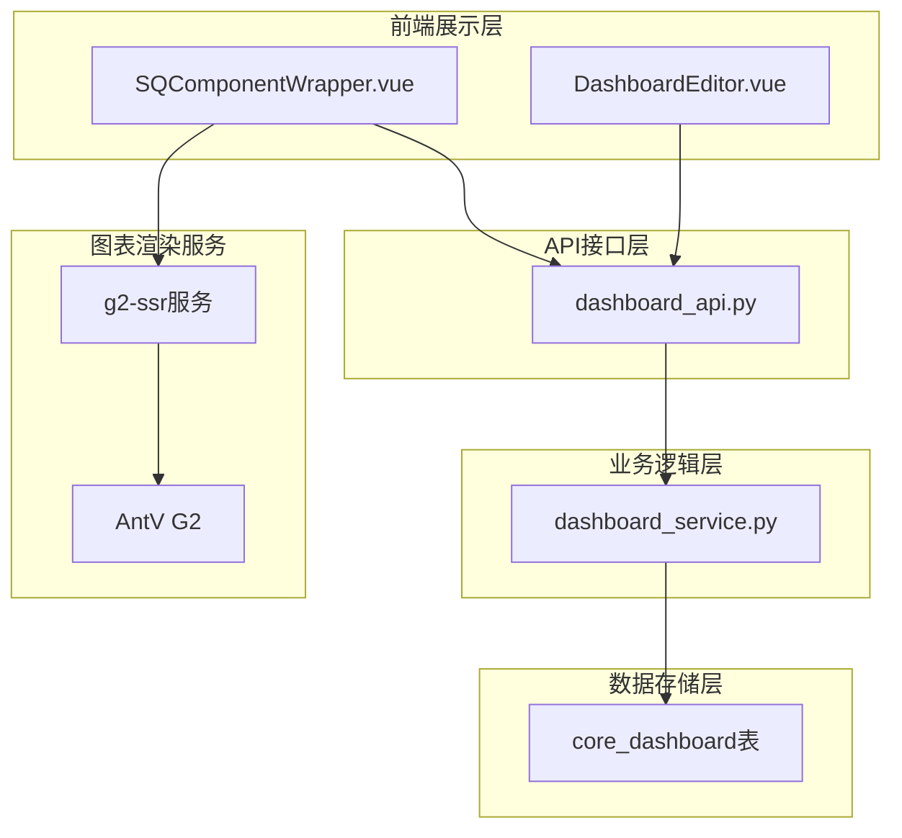
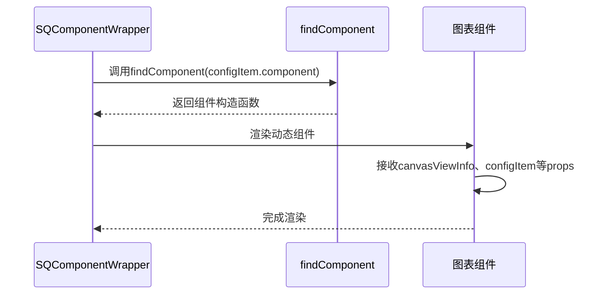
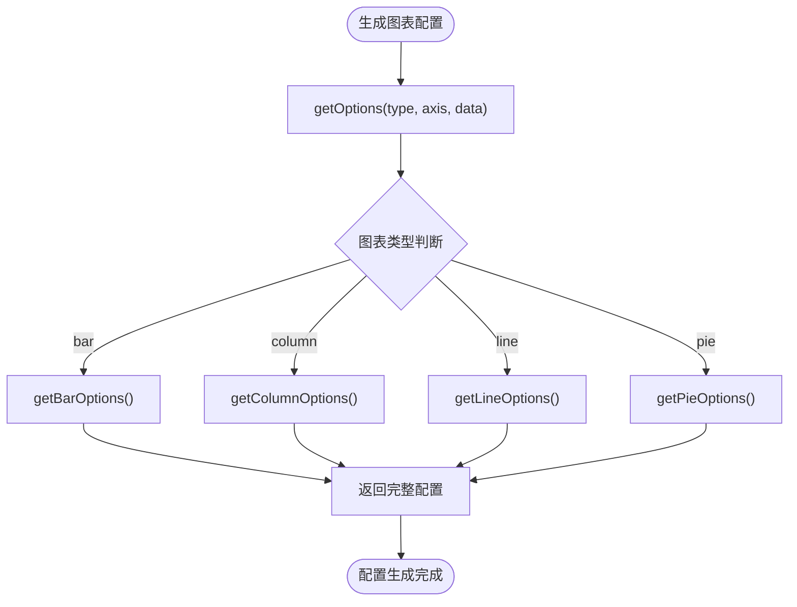
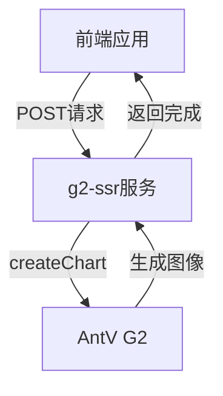

# 数据可视化

<cite>
**本文档引用的文件**  
- [dashboard_api.py](file://backend/apps/dashboard/api/dashboard_api.py)
- [dashboard_model.py](file://backend/apps/dashboard/models/dashboard_model.py)
- [SQComponentWrapper.vue](file://frontend/src/views/dashboard/preview/SQComponentWrapper.vue)
- [app.js](file://g2-ssr/app.js)
- [bar.js](file://g2-ssr/charts/bar.js)
- [column.js](file://g2-ssr/charts/column.js)
- [line.js](file://g2-ssr/charts/line.js)
- [pie.js](file://g2-ssr/charts/pie.js)
- [utils.js](file://g2-ssr/charts/utils.js)
</cite>

## 目录
1. [引言](#引言)
2. [仪表板系统架构设计](#仪表板系统架构设计)
3. [后端CRUD操作实现](#后端crud操作实现)
4. [前端组件动态渲染机制](#前端组件动态渲染机制)
5. [支持的图表类型与配置](#支持的图表类型与配置)
6. [创建与自定义仪表板示例](#创建与自定义仪表板示例)
7. [服务端渲染(SSR)实现与性能分析](#服务端渲染ssr实现与性能分析)
8. [结论](#结论)

## 引言
本文档全面介绍SQLBot系统中数据可视化功能的设计与实现。重点阐述仪表板系统的整体架构、后端API与数据模型设计、前端组件渲染机制以及服务端图表生成技术。文档涵盖从数据结构定义到用户交互的完整技术链条，为开发者和系统维护人员提供详尽的技术参考。

## 仪表板系统架构设计

仪表板系统采用前后端分离架构，由后端API服务、数据库模型、前端组件和独立的图表渲染服务（g2-ssr）组成。整体架构分为四个主要层次：数据存储层、业务逻辑层、API接口层和前端展示层。



**图示来源**  
- [dashboard_api.py](file://backend/apps/dashboard/api/dashboard_api.py#L1-L48)
- [dashboard_model.py](file://backend/apps/dashboard/models/dashboard_model.py#L1-L164)
- [SQComponentWrapper.vue](file://frontend/src/views/dashboard/preview/SQComponentWrapper.vue#L1-L79)
- [app.js](file://g2-ssr/app.js#L1-L77)

## 后端CRUD操作实现

仪表板系统的后端CRUD操作通过FastAPI框架实现，提供了完整的资源管理接口。系统基于SQLModel定义数据模型，并通过CRUD服务层与数据库进行交互。

### 仪表板数据结构设计

`CoreDashboard`模型定义了仪表板的核心数据结构，包含以下关键字段：

- **基础信息**：id、name、pid（父节点ID）、node_type（节点类型）、type（资源类型）
- **组织信息**：workspace_id（工作区ID）、org_id（组织ID）
- **布局数据**：canvas_style_data（画布样式）、component_data（组件数据）、canvas_view_info（视图信息）
- **状态信息**：status（状态）、delete_flag（删除标志）、version（版本号）
- **审计信息**：create_time、create_by、update_time、update_by

该设计支持树形结构的资源组织，通过pid字段实现父子节点关系，便于构建多级仪表板目录。

### CRUD操作实现细节

后端API通过`dashboard_api.py`文件暴露RESTful接口，具体实现如下：

- **创建操作**：`create_resource_api`接收`CreateDashboard`模型，调用`create_resource`服务创建新仪表板
- **读取操作**：`list_resource_api`和`load_resource_api`分别用于获取资源列表和加载特定资源
- **更新操作**：`update_resource_api`接收更新请求，调用`update_resource`服务修改仪表板信息
- **删除操作**：`delete_resource_api`通过ID删除指定资源，使用原生SQL执行删除操作

所有操作均通过`SessionDep`依赖注入实现数据库会话管理，并结合`CurrentUser`进行权限验证。

**本节来源**  
- [dashboard_api.py](file://backend/apps/dashboard/api/dashboard_api.py#L1-L48)
- [dashboard_model.py](file://backend/apps/dashboard/models/dashboard_model.py#L1-L164)
- [dashboard_service.py](file://backend/apps/dashboard/crud/dashboard_service.py#L9-L136)

## 前端组件动态渲染机制

前端通过`SQComponentWrapper.vue`组件实现图表的动态渲染和交互功能，采用Vue 3的组合式API和动态组件机制。

### 组件渲染流程

`SQComponentWrapper`组件接收配置项`configItem`，通过`findComponent`函数从组件映射表中查找对应的图表组件，然后使用Vue的`<component>`标签进行动态渲染。



**图示来源**  
- [SQComponentWrapper.vue](file://frontend/src/views/dashboard/preview/SQComponentWrapper.vue#L1-L79)
- [component-list.ts](file://frontend/src/views/dashboard/components/component-list.ts#L71-L74)

### 动态组件查找机制

`findComponent`函数是动态渲染的核心，它接收组件标识符（如'SQBar'、'SQLine'等），在预定义的`componentsMap`中查找对应的组件。如果未找到匹配组件，则返回默认的`SQEmpty`组件，确保系统稳定性。

组件通过`canvasViewInfo`和`configItem`两个关键属性接收配置信息：
- `canvasViewInfo`：包含视图的布局、样式等全局信息
- `configItem`：包含组件自身的配置，如数据源、图表类型、交互设置等

## 支持的图表类型与配置

系统通过g2-ssr服务支持多种图表类型，每种图表类型都有特定的配置选项和渲染逻辑。

### 支持的图表类型

| 图表类型 | 文件路径 | 主要特性 |
|---------|--------|--------|
| 柱状图 | g2-ssr/charts/column.js | 支持堆叠、圆角、标签位置自动调整 |
| 条形图 | g2-ssr/charts/bar.js | 横向显示，支持堆叠和负值处理 |
| 折线图 | g2-ssr/charts/line.js | 平滑曲线，带数据点标记和标签 |
| 饼图 | g2-ssr/charts/pie.js | 环形布局，支持外部标签和百分比显示 |

### 图表配置结构

所有图表共享统一的配置结构，通过`getOptions`函数根据图表类型分发到相应的配置生成函数：



**图示来源**  
- [app.js](file://g2-ssr/app.js#L1-L77)
- [bar.js](file://g2-ssr/charts/bar.js#L1-L117)
- [column.js](file://g2-ssr/charts/column.js#L1-L117)
- [line.js](file://g2-ssr/charts/line.js#L1-L100)
- [pie.js](file://g2-ssr/charts/pie.js#L1-L53)

### 配置选项详解

#### 通用配置
- **尺寸**：width=640, height=480
- **主题**：白色背景(viewFill: '#FFFFFF')
- **坐标系**：支持转置(transpose)和极坐标(theta)

#### 特定配置
- **柱状图/条形图**：支持堆叠(transform: stackY)、圆角样式(radiusTopLeft/Right等)
- **折线图**：支持平滑曲线(shape: smooth)、数据点标记
- **饼图**：支持环形布局(outerRadius: 0.8)、底部居中图例

#### 数据处理
`utils.js`中的`checkIsPercent`函数自动检测数据是否为百分比格式，并进行相应处理：
- 检测数据末尾是否包含'%'符号
- 如果是百分比数据，移除'%'并转换为数值
- 在标签和提示框中重新添加'%'符号显示

## 创建与自定义仪表板示例

### 创建新仪表板

```python
# 创建仪表板请求示例
{
    "name": "销售分析仪表板",
    "type": "dashboard",
    "node_type": "folder",
    "canvas_style_data": "{\"background\":\"#f5f5f5\",\"grid\":{\"show\":true}}",
    "component_data": "[]",
    "canvas_view_info": "{}",
    "workspace_id": "ws_123",
    "org_id": "org_456"
}
```

### 添加图表组件

1. 在画布编辑器中选择图表类型（柱状图、折线图等）
2. 配置数据源和字段映射
3. 调整布局参数（位置、大小）
4. 设置图表样式和交互选项
5. 保存配置到`component_data`字段

### 调整布局

通过修改`canvas_style_data`中的网格设置和`component_data`中组件的位置信息，可以实现灵活的布局调整：

```json
{
  "canvas_style_data": {
    "grid": {
      "show": true,
      "size": 20
    },
    "background": "#ffffff"
  },
  "component_data": [
    {
      "id": "chart_1",
      "component": "SQBar",
      "x": 20,
      "y": 20,
      "width": 400,
      "height": 300
    }
  ]
}
```

**本节来源**  
- [dashboard_model.py](file://backend/apps/dashboard/models/dashboard_model.py#L1-L164)
- [SQComponentWrapper.vue](file://frontend/src/views/dashboard/preview/SQComponentWrapper.vue#L1-L79)

## 服务端渲染(SSR)实现与性能分析

### SSR服务架构

g2-ssr服务基于Node.js构建，通过HTTP接口接收图表生成请求，使用AntV G2库在服务端生成图表图像。



**图示来源**  
- [app.js](file://g2-ssr/app.js#L1-L77)

### 实现方式

SSR服务通过以下步骤实现图表渲染：
1. 创建HTTP服务器监听3000端口
2. 接收POST请求，解析图表配置
3. 根据图表类型调用相应的配置生成函数
4. 使用`createChart`生成图表实例
5. 导出为PNG图像文件或返回二进制数据

关键代码逻辑：
- 使用`createChart`异步函数生成图表
- 支持`exportToFile`导出文件和`toBuffer`返回内存数据
- 处理GET和POST两种请求方法

### 性能影响分析

#### 优势
- **减轻客户端负担**：复杂图表的渲染工作由服务端完成，降低前端设备的CPU和内存消耗
- **一致性保证**：所有用户看到的图表渲染效果完全一致，不受设备性能影响
- **SEO友好**：服务端生成的静态内容更利于搜索引擎抓取
- **快速加载**：前端只需加载预渲染的图像，无需等待复杂的JavaScript执行

#### 挑战
- **服务端资源消耗**：图表渲染是计算密集型操作，可能增加服务器负载
- **网络延迟**：需要额外的HTTP请求来获取图表图像
- **扩展性限制**：单个SSR服务实例的并发处理能力有限

#### 优化建议
1. **缓存机制**：对常用图表配置进行结果缓存，避免重复渲染
2. **队列处理**：使用消息队列异步处理图表生成请求，防止阻塞主线程
3. **资源限制**：设置渲染超时和资源使用上限，防止异常请求影响服务稳定性
4. **集群部署**：部署多个SSR服务实例，通过负载均衡提高并发处理能力

**本节来源**  
- [app.js](file://g2-ssr/app.js#L1-L77)
- [bar.js](file://g2-ssr/charts/bar.js#L1-L117)
- [column.js](file://g2-ssr/charts/column.js#L1-L117)
- [line.js](file://g2-ssr/charts/line.js#L1-L100)
- [pie.js](file://g2-ssr/charts/pie.js#L1-L53)

## 结论
SQLBot的数据可视化系统通过清晰的分层架构和模块化设计，实现了功能丰富且性能优良的仪表板功能。后端通过标准化的CRUD接口和数据模型确保数据一致性，前端利用动态组件机制实现灵活的界面展示，而独立的SSR服务则解决了复杂图表渲染的性能问题。整体系统设计合理，具有良好的可维护性和扩展性，为用户提供高效的数据可视化体验。