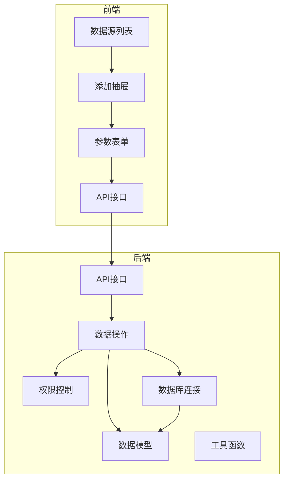
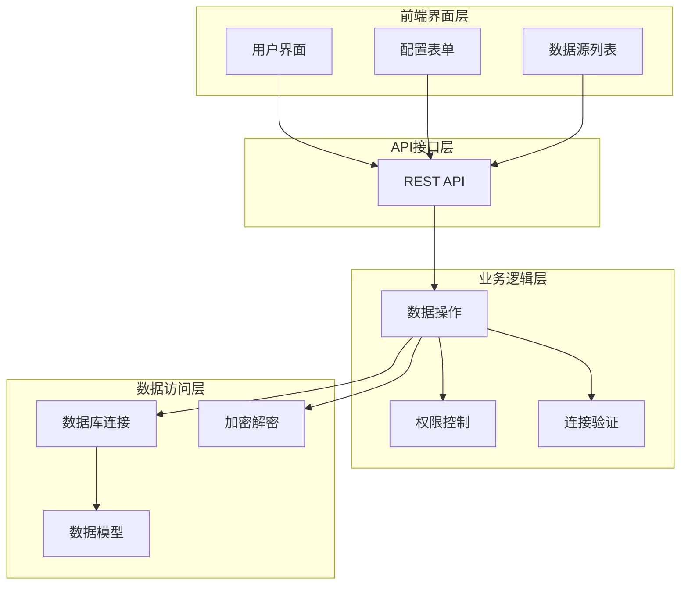
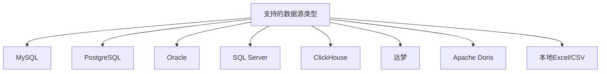
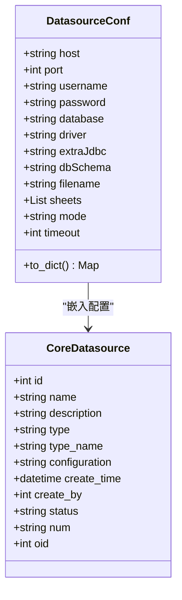
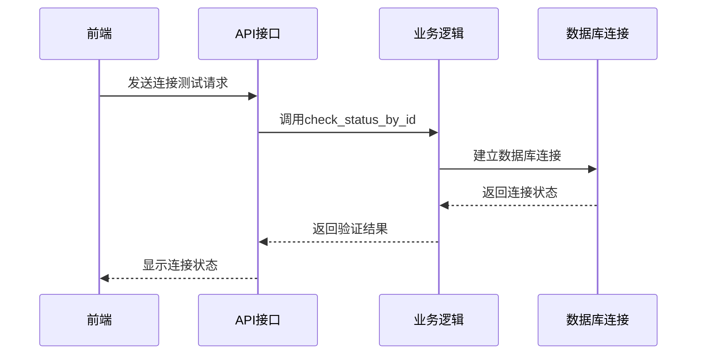
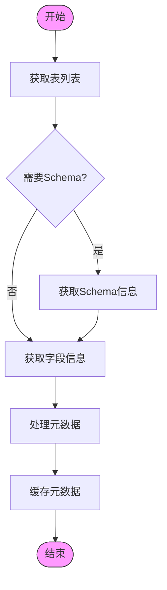
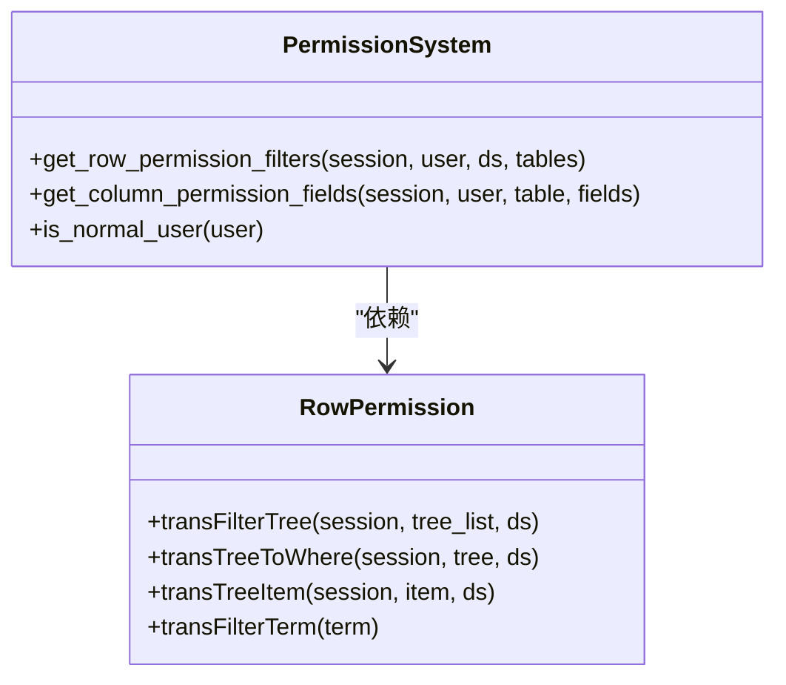
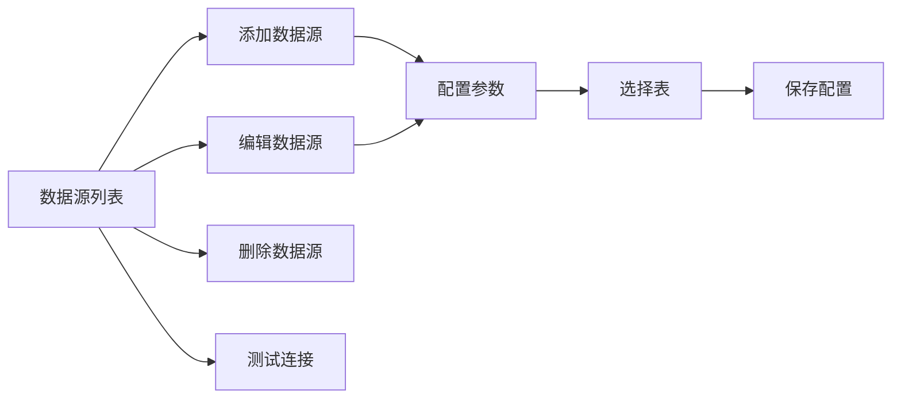
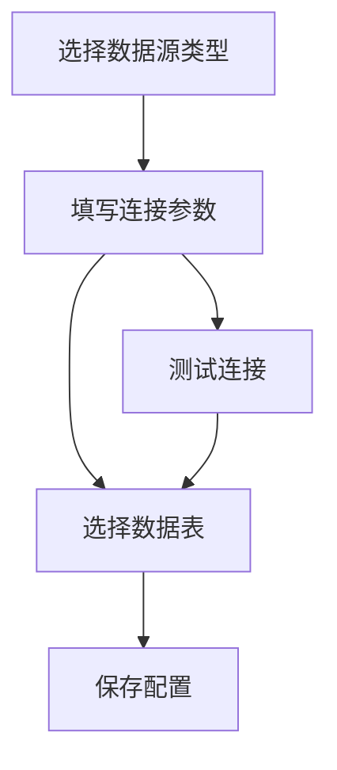
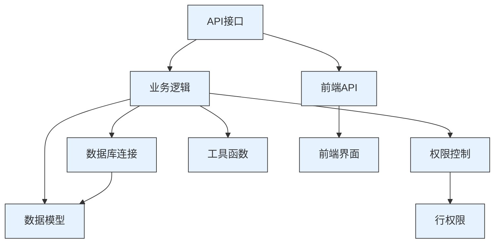

# 数据源管理

<cite>
**本文档引用文件**   
- [datasource.py](file://backend/apps/datasource/api/datasource.py)
- [datasource.py](file://backend/apps/datasource/crud/datasource.py)
- [datasource.py](file://backend/apps/datasource/models/datasource.py)
- [permission.py](file://backend/apps/datasource/crud/permission.py)
- [row_permission.py](file://backend/apps/datasource/crud/row_permission.py)
- [utils.py](file://backend/apps/datasource/utils/utils.py)
- [db.py](file://backend/apps/db/db.py)
- [ds-type.ts](file://frontend/src/views/ds/js/ds-type.ts)
- [DatasourceList.vue](file://frontend/src/views/ds/DatasourceList.vue)
- [ParamsForm.vue](file://frontend/src/views/ds/ParamsForm.vue)
- [AddDrawer.vue](file://frontend/src/views/ds/AddDrawer.vue)
- [datasource.ts](file://frontend/src/api/datasource.ts)
</cite>

## 目录
1. [引言](#引言)
2. [项目结构](#项目结构)
3. [核心组件](#核心组件)
4. [架构概述](#架构概述)
5. [详细组件分析](#详细组件分析)
6. [依赖分析](#依赖分析)
7. [性能考虑](#性能考虑)
8. [故障排除指南](#故障排除指南)
9. [结论](#结论)

## 引言
本文档全面解释了数据源管理功能的配置流程、API实现、权限控制机制以及前后端交互逻辑。系统支持多种数据库类型，提供完整的连接配置、测试验证和元数据获取功能。

## 项目结构
数据源管理功能分布在前后端多个模块中，形成了完整的功能闭环。

**图示来源**
- [DatasourceList.vue](file://frontend/src/views/ds/DatasourceList.vue)
- [AddDrawer.vue](file://frontend/src/views/ds/AddDrawer.vue)
- [ParamsForm.vue](file://frontend/src/views/ds/ParamsForm.vue)
- [datasource.ts](file://frontend/src/api/datasource.ts)
- [datasource.py](file://backend/apps/datasource/api/datasource.py)
- [datasource.py](file://backend/apps/datasource/crud/datasource.py)
- [datasource.py](file://backend/apps/datasource/models/datasource.py)
- [permission.py](file://backend/apps/datasource/crud/permission.py)
- [db.py](file://backend/apps/db/db.py)

**本节来源**
- [DatasourceList.vue](file://frontend/src/views/ds/DatasourceList.vue)
- [AddDrawer.vue](file://frontend/src/views/ds/AddDrawer.vue)
- [ParamsForm.vue](file://frontend/src/views/ds/ParamsForm.vue)

## 核心组件
数据源管理功能的核心组件包括数据源配置、连接验证、元数据获取和权限控制等模块。系统通过AES加密存储数据库连接信息，支持多种数据库类型的连接配置。

**本节来源**
- [datasource.py](file://backend/apps/datasource/api/datasource.py)
- [datasource.py](file://backend/apps/datasource/crud/datasource.py)
- [datasource.py](file://backend/apps/datasource/models/datasource.py)
- [utils.py](file://backend/apps/datasource/utils/utils.py)

## 架构概述
数据源管理系统的架构分为前端界面层、API接口层、业务逻辑层和数据访问层，各层之间通过清晰的接口进行通信。

**图示来源**
- [datasource.py](file://backend/apps/datasource/api/datasource.py)
- [datasource.py](file://backend/apps/datasource/crud/datasource.py)
- [datasource.py](file://backend/apps/datasource/models/datasource.py)
- [utils.py](file://backend/apps/datasource/utils/utils.py)
- [db.py](file://backend/apps/db/db.py)

## 详细组件分析

### 数据源配置与连接

#### 支持的数据库类型
系统支持多种数据库类型，包括关系型数据库和文件型数据源。

**图示来源**
- [ds-type.ts](file://frontend/src/views/ds/js/ds-type.ts)

#### 连接参数配置
不同类型的数据库需要配置相应的连接参数，系统通过统一的配置模型进行管理。

**图示来源**
- [datasource.py](file://backend/apps/datasource/models/datasource.py)

#### 连接验证机制
系统提供两种连接验证方式：通过数据源ID验证和通过配置信息验证。

**图示来源**
- [datasource.py](file://backend/apps/datasource/api/datasource.py)
- [datasource.py](file://backend/apps/datasource/crud/datasource.py)
- [db.py](file://backend/apps/db/db.py)

### 元数据获取流程
系统通过统一的接口获取数据库的元数据信息，包括表结构和字段信息。

**图示来源**
- [datasource.py](file://backend/apps/datasource/api/datasource.py)
- [datasource.py](file://backend/apps/datasource/crud/datasource.py)
- [db.py](file://backend/apps/db/db.py)

### 权限控制机制

#### 行级和列级权限
系统设计了行级和列级权限控制机制，但当前版本暂未实现具体权限控制逻辑。

**图示来源**
- [permission.py](file://backend/apps/datasource/crud/permission.py)
- [row_permission.py](file://backend/apps/datasource/crud/row_permission.py)

### 前端界面功能

#### 数据源管理界面
前端提供了完整的数据源管理界面，支持数据源的增删改查操作。

**图示来源**
- [DatasourceList.vue](file://frontend/src/views/ds/DatasourceList.vue)
- [AddDrawer.vue](file://frontend/src/views/ds/AddDrawer.vue)
- [ParamsForm.vue](file://frontend/src/views/ds/ParamsForm.vue)

#### 连接参数配置表单
系统提供分步式的配置向导，引导用户完成数据源配置。

**图示来源**
- [AddDrawer.vue](file://frontend/src/views/ds/AddDrawer.vue)
- [ParamsForm.vue](file://frontend/src/views/ds/ParamsForm.vue)

**本节来源**
- [datasource.py](file://backend/apps/datasource/api/datasource.py)
- [datasource.py](file://backend/apps/datasource/crud/datasource.py)
- [datasource.py](file://backend/apps/datasource/models/datasource.py)
- [permission.py](file://backend/apps/datasource/crud/permission.py)
- [row_permission.py](file://backend/apps/datasource/crud/row_permission.py)
- [utils.py](file://backend/apps/datasource/utils/utils.py)
- [db.py](file://backend/apps/db/db.py)
- [ds-type.ts](file://frontend/src/views/ds/js/ds-type.ts)
- [DatasourceList.vue](file://frontend/src/views/ds/DatasourceList.vue)
- [ParamsForm.vue](file://frontend/src/views/ds/ParamsForm.vue)
- [AddDrawer.vue](file://frontend/src/views/ds/AddDrawer.vue)
- [datasource.ts](file://frontend/src/api/datasource.ts)

## 依赖分析
数据源管理功能依赖于多个核心模块，形成了复杂的依赖关系网络。

**图示来源**
- [datasource.py](file://backend/apps/datasource/api/datasource.py)
- [datasource.py](file://backend/apps/datasource/crud/datasource.py)
- [datasource.py](file://backend/apps/datasource/models/datasource.py)
- [permission.py](file://backend/apps/datasource/crud/permission.py)
- [row_permission.py](file://backend/apps/datasource/crud/row_permission.py)
- [utils.py](file://backend/apps/datasource/utils/utils.py)
- [db.py](file://backend/apps/db/db.py)
- [datasource.ts](file://frontend/src/api/datasource.ts)
- [DatasourceList.vue](file://frontend/src/views/ds/DatasourceList.vue)
- [AddDrawer.vue](file://frontend/src/views/ds/AddDrawer.vue)
- [ParamsForm.vue](file://frontend/src/views/ds/ParamsForm.vue)

**本节来源**
- [datasource.py](file://backend/apps/datasource/api/datasource.py)
- [datasource.py](file://backend/apps/datasource/crud/datasource.py)
- [datasource.py](file://backend/apps/datasource/models/datasource.py)
- [permission.py](file://backend/apps/datasource/crud/permission.py)
- [row_permission.py](file://backend/apps/datasource/crud/row_permission.py)
- [utils.py](file://backend/apps/datasource/utils/utils.py)
- [db.py](file://backend/apps/db/db.py)
- [datasource.ts](file://frontend/src/api/datasource.ts)

## 性能考虑
系统在设计时考虑了多个性能优化点，包括连接池管理、元数据缓存和异步操作等。

- 使用asyncio.to_thread处理阻塞操作，避免阻塞事件循环
- 通过get_schema_by_conf接口预获取Schema信息，减少重复查询
- 在preview_data操作中限制返回数据量（LIMIT 100），防止大数据量查询
- 使用连接池管理数据库连接，提高连接复用率

## 故障排除指南
当数据源连接出现问题时，可以按照以下步骤进行排查：

1. 检查数据库连接参数是否正确
2. 验证数据库服务是否正常运行
3. 检查网络连接是否通畅
4. 查看系统日志中的错误信息
5. 测试使用相同参数的其他数据库客户端是否能连接

**本节来源**
- [datasource.py](file://backend/apps/datasource/api/datasource.py)
- [datasource.py](file://backend/apps/datasource/crud/datasource.py)
- [db.py](file://backend/apps/db/db.py)

## 结论
数据源管理功能提供了完整的数据源配置、连接验证和元数据获取能力。系统架构清晰，模块划分合理，支持多种数据库类型。虽然当前版本的权限控制功能尚未完全实现，但已预留了相应的扩展接口。前端界面友好，操作流程清晰，为用户提供了良好的使用体验。