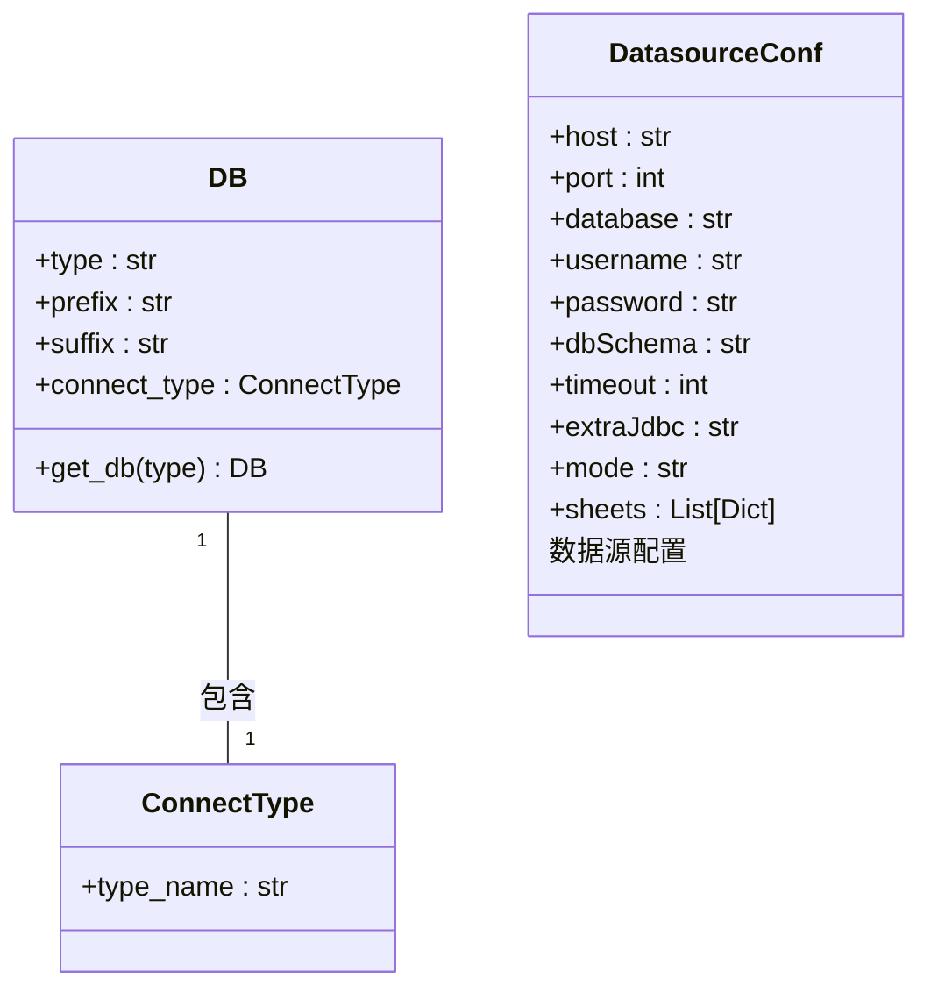
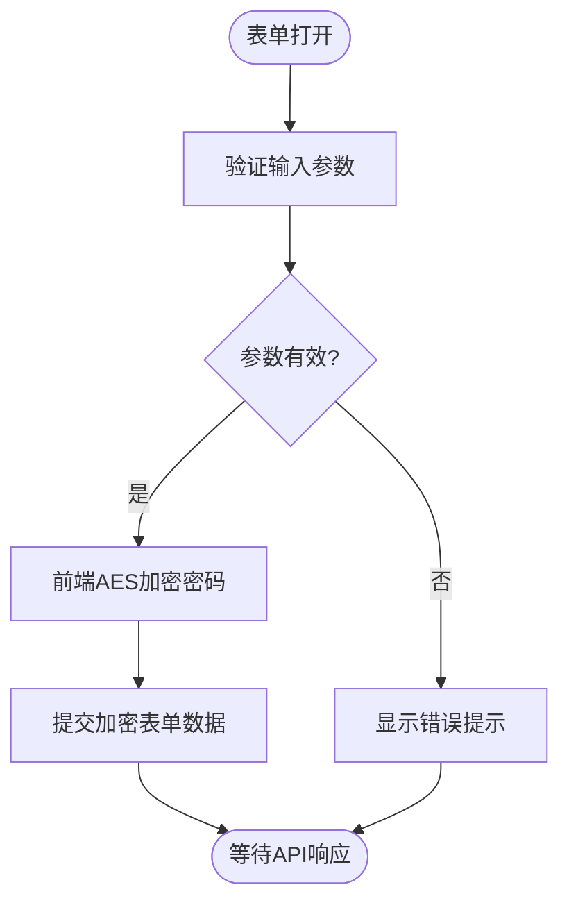
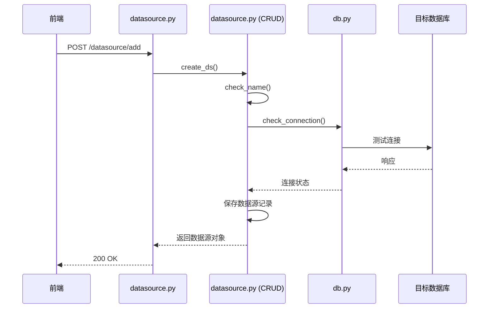
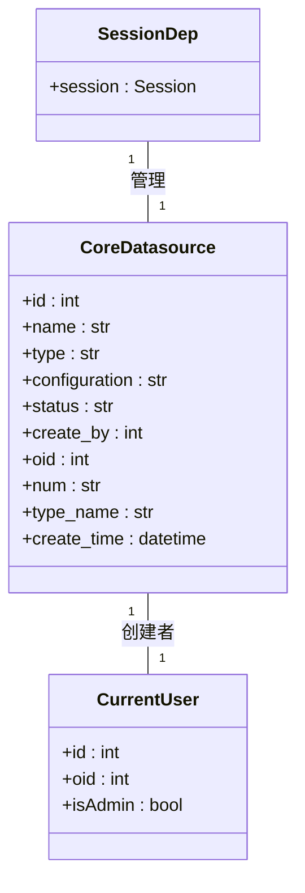

# 数据源连接

<cite>
**本文档引用的文件**
- [datasource.py](file://backend/apps/datasource/api/datasource.py)
- [ParamsForm.vue](file://frontend/src/views/ds/ParamsForm.vue)
- [aes.ts](file://frontend/src/views/ds/js/aes.ts)
- [db.py](file://backend/apps/db/db.py)
- [datasource.py](file://backend/apps/datasource/crud/datasource.py)
- [constant.py](file://backend/apps/db/constant.py)
</cite>

## 目录
1. [简介](#简介)
2. [支持的数据库类型与驱动配置](#支持的数据库类型与驱动配置)
3. [连接参数表单详解](#连接参数表单详解)
4. [后端API实现逻辑](#后端api实现逻辑)
5. [前端连接测试交互流程](#前端连接测试交互流程)
6. [数据库引擎管理与多租户隔离](#数据库引擎管理与多租户隔离)
7. [实际代码示例](#实际代码示例)
8. [连接泄露预防与性能调优](#连接泄露预防与性能调优)
9. [结论](#结论)

## 简介
本文档详细说明了SQLBot系统中数据源连接功能的实现机制。涵盖前端表单设计、后端API逻辑、敏感信息加密存储、数据库连接池管理以及多租户环境下的连接隔离策略。通过分析核心代码组件，为开发者和系统管理员提供全面的技术参考。

## 支持的数据库类型与驱动配置

SQLBot系统支持多种主流数据库类型，每种类型采用特定的驱动和连接方式：

- **PostgreSQL (pg)**：使用`psycopg2`驱动，通过`postgresql+psycopg2://`协议连接
- **MySQL**：使用`pymysql`驱动，通过`mysql+pymysql://`协议连接
- **SQL Server**：使用`pymssql`驱动，通过`mssql+pymssql://`协议连接
- **Oracle**：使用`oracledb`驱动，支持服务名和SID两种模式
- **ClickHouse (ck)**：使用HTTP接口，通过`clickhouse+http://`协议连接
- **达梦数据库 (dm)**：使用`dmPython`原生驱动，采用独立连接方式
- **Doris**：使用`pymysql`兼容协议连接
- **Excel**：作为特殊数据源类型，通过`postgresql+psycopg2://`连接到内置数据库

系统通过`DB`枚举类定义了不同数据库的元信息，包括SQL标识符的引号格式（如MySQL使用反引号`` ` ``，PostgreSQL使用双引号`"`）和连接类型。



**Diagram sources**
- [constant.py](file://backend/apps/db/constant.py#L14-L35)
- [db.py](file://backend/apps/db/db.py#L71-L94)

**Section sources**
- [constant.py](file://backend/apps/db/constant.py#L14-L35)
- [db.py](file://backend/apps/db/db.py#L71-L94)

## 连接参数表单详解

前端`ParamsForm.vue`组件通过`DatasourceForm`子组件实现数据源连接参数的配置界面。表单字段与验证规则如下：

- **主机 (host)**：必填项，IP地址或域名格式验证
- **端口 (port)**：必填项，数值范围1-65535验证
- **数据库名 (database)**：必填项，非空验证
- **用户名 (username)**：必填项，非空验证
- **密码 (password)**：必填项，非空验证，前端加密后传输
- **模式/Schema (dbSchema)**：可选项，用于PostgreSQL、Oracle等支持Schema的数据库
- **连接超时 (timeout)**：可选项，数值类型，单位秒
- **高级选项 (extraJdbc)**：可选项，用于传递额外的JDBC参数

表单通过Vue的响应式机制管理状态，并在提交前进行完整性验证。密码字段在前端通过AES加密后才发送到后端，确保传输安全。



**Diagram sources**
- [ParamsForm.vue](file://frontend/src/views/ds/ParamsForm.vue#L1-L70)
- [aes.ts](file://frontend/src/views/ds/js/aes.ts#L4-L9)

**Section sources**
- [ParamsForm.vue](file://frontend/src/views/ds/ParamsForm.vue#L1-L70)
- [aes.ts](file://frontend/src/views/ds/js/aes.ts#L4-L9)

## 后端API实现逻辑

### 创建与测试连接API

后端`datasource.py`中的API路由实现了数据源的创建和连接测试功能：

- **创建数据源 (`/add`)**：接收加密的配置信息，验证名称唯一性，保存到数据库
- **测试连接 (`/check`)**：调用`check_connection`函数验证数据库连通性



**Diagram sources**
- [datasource.py](file://backend/apps/datasource/api/datasource.py#L100-L115)
- [datasource.py](file://backend/apps/datasource/crud/datasource.py#L63-L83)
- [db.py](file://backend/apps/db/db.py#L104-L143)

**Section sources**
- [datasource.py](file://backend/apps/datasource/api/datasource.py#L100-L115)
- [datasource.py](file://backend/apps/datasource/crud/datasource.py#L63-L83)

### 敏感信息加密存储

系统采用AES-ECB模式对数据库密码等敏感信息进行加密存储：

- **前端加密**：使用`crypto-js`库在浏览器端加密
- **密钥**：固定密钥`SQLBot1234567890`
- **模式**：ECB模式，PKCS7填充
- **后端处理**：接收加密字符串，直接存储到数据库`configuration`字段

```typescript
// 前端加密逻辑
export const encrypted = (str: string) => {
  return CryptoJS.AES.encrypt(str, key, {
    mode: CryptoJS.mode.ECB,
    padding: CryptoJS.pad.Pkcs7,
  }).toString()
}
```

当后端需要使用密码时，通过`aes_decrypt`工具函数进行解密。

### 连接池初始化机制

`get_engine`函数负责初始化数据库连接池：

- 根据数据源类型创建相应的SQLAlchemy引擎
- 设置连接超时和池超时参数
- 对PostgreSQL支持Schema搜索路径配置
- 使用`connect_args`传递数据库特定参数

连接池的生命周期由SQLAlchemy管理，确保连接的复用和高效性。

## 前端连接测试交互流程

前端连接测试的完整交互流程如下：

1. 用户填写连接参数并点击"测试连接"
2. 前端对密码进行AES加密
3. 发送POST请求到`/datasource/check`接口
4. 后端执行连接测试逻辑
5. 根据响应结果更新UI状态

**成功场景**：
- 显示绿色"连接成功"提示
- 允许用户继续配置表和字段
- 可以保存数据源配置

**失败场景**：
- 显示红色错误提示，包含具体错误信息
- 高亮显示可能出错的配置项
- 阻止保存操作，要求用户修正配置

系统通过`check_by_id`接口支持已保存数据源的连接状态检查，便于运维监控。

**Section sources**
- [datasource.py](file://backend/apps/datasource/api/datasource.py#L85-L95)
- [datasource.py](file://backend/apps/datasource/crud/datasource.py#L46-L47)

## 数据库引擎管理与多租户隔离

### 数据库引擎管理

`db.py`文件中的`get_engine`和`get_session`函数构成了数据库访问的核心：

- `get_engine`：根据数据源配置创建SQLAlchemy引擎
- `get_session`：基于引擎创建会话实例
- 连接参数从加密的配置中动态解析

### 多租户环境下连接隔离策略

系统通过以下机制实现多租户隔离：

- **数据隔离**：每个数据源记录包含`oid`（组织ID）字段
- **权限控制**：`get_datasource_list`函数根据当前用户`oid`过滤结果
- **管理员例外**：管理员用户可以访问指定`oid`的所有数据源
- **连接独立**：每个数据源使用独立的连接配置，避免跨租户访问



**Diagram sources**
- [db.py](file://backend/apps/db/db.py#L97-L101)
- [datasource.py](file://backend/apps/datasource/crud/datasource.py#L1-L20)

**Section sources**
- [db.py](file://backend/apps/db/db.py#L97-L101)
- [datasource.py](file://backend/apps/datasource/crud/datasource.py#L1-L20)

## 实际代码示例

以下是通过API创建PostgreSQL数据源的示例：

```python
# 创建数据源请求
POST /datasource/add
{
  "name": "Production DB",
  "type": "pg",
  "configuration": "U2FsdGVkX1+...",
  "status": "Success"
}

# configuration字段解密后的内容
{
  "host": "192.168.1.100",
  "port": 5432,
  "database": "analytics",
  "username": "sqlbot_user",
  "password": "secure_password",
  "dbSchema": "public",
  "timeout": 30
}
```

后端处理流程：
1. 接收JSON请求
2. 验证数据源名称唯一性
3. 测试数据库连接
4. 加密保存配置
5. 创建数据源记录
6. 返回创建的数据源对象

## 连接泄露预防与性能调优

### 连接泄露预防

系统通过以下机制预防连接泄露：

- **上下文管理器**：使用`with`语句确保连接自动关闭
- **连接超时**：设置合理的`connect_timeout`和`pool_timeout`
- **资源清理**：删除Excel数据源时自动清理相关表
- **异常处理**：完善的try-catch机制确保资源释放

### 性能调优建议

1. **连接池配置**：根据并发需求调整SQLAlchemy连接池大小
2. **超时设置**：合理设置连接超时，避免长时间等待
3. **查询优化**：预览数据时限制返回行数（当前为100行）
4. **索引利用**：确保常用查询字段有适当索引
5. **批量操作**：Excel导入时使用`copy_expert`提高性能
6. **缓存策略**：考虑对元数据查询结果进行缓存

对于高并发场景，建议：
- 增加数据库连接池最大连接数
- 使用连接池预热机制
- 监控连接使用情况，及时发现瓶颈
- 考虑读写分离架构

## 结论

SQLBot的数据源连接功能提供了安全、可靠且易于扩展的数据库集成方案。通过前端加密、后端安全存储、多租户隔离和完善的连接管理机制，系统能够安全地管理多种数据库类型的连接。建议在生产环境中根据具体需求调整连接池参数和超时设置，以获得最佳性能表现。未来可考虑增加连接池监控和自动调优功能，进一步提升系统稳定性。