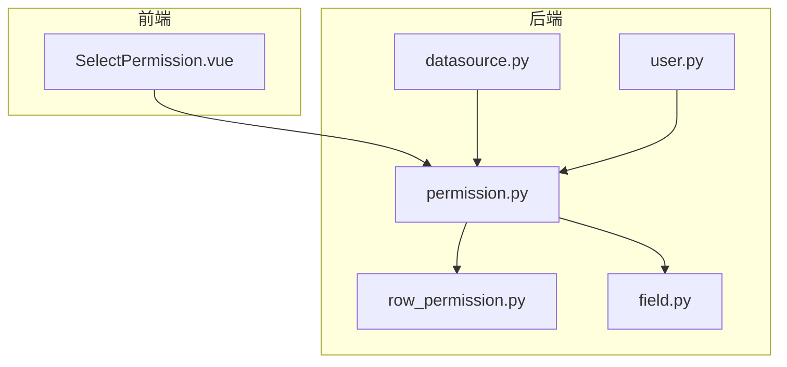
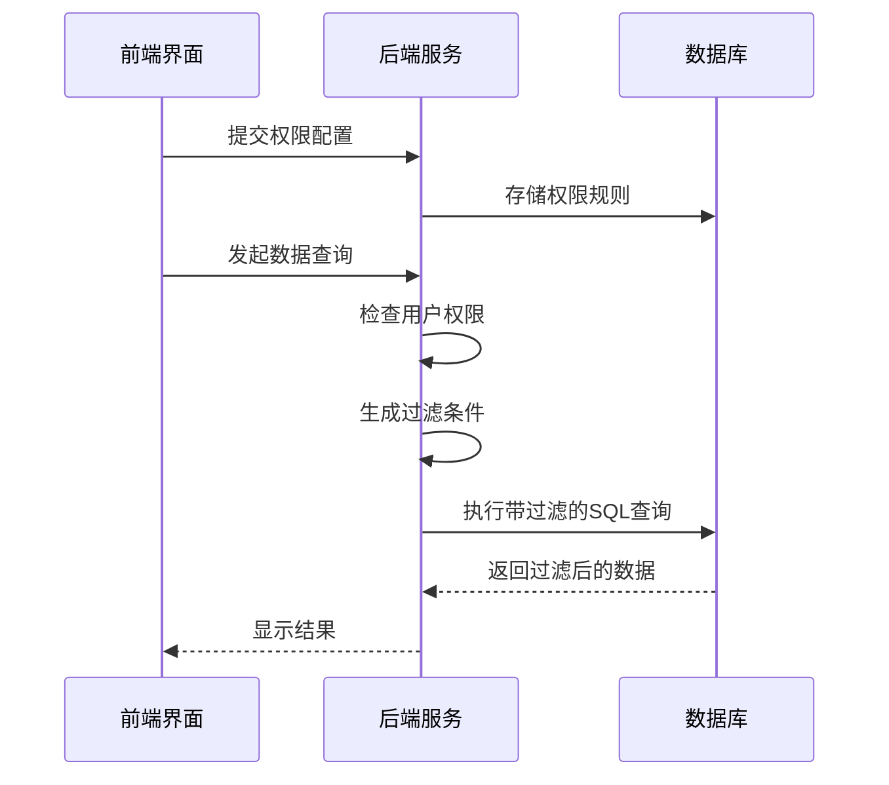
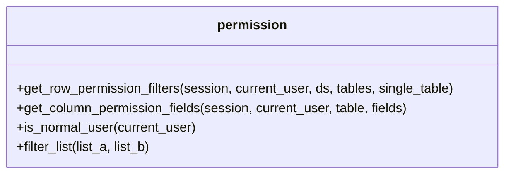
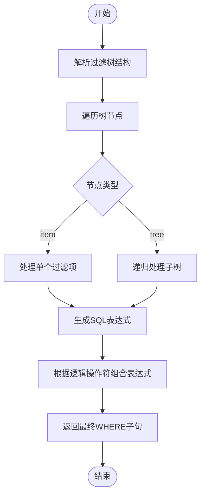
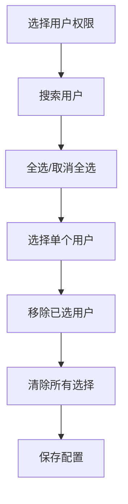
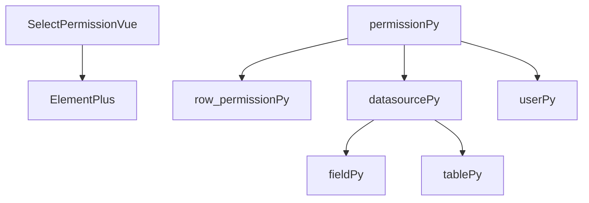

# 权限控制

<cite>
**本文档引用的文件**
- [permission.py](file://backend/apps/datasource/crud/permission.py)
- [row_permission.py](file://backend/apps/datasource/crud/row_permission.py)
- [field.py](file://backend/apps/datasource/crud/field.py)
- [SelectPermission.vue](file://frontend/src/views/system/permission/SelectPermission.vue)
- [datasource.py](file://backend/apps/datasource/crud/datasource.py)
- [user.py](file://backend/apps/system/crud/user.py)
- [datasource.py](file://backend/apps/datasource/models/datasource.py)
</cite>

## 目录
1. [介绍](#介绍)
2. [项目结构](#项目结构)
3. [核心组件](#核心组件)
4. [架构概述](#架构概述)
5. [详细组件分析](#详细组件分析)
6. [依赖分析](#依赖分析)
7. [性能考虑](#性能考虑)
8. [故障排除指南](#故障排除指南)
9. [结论](#结论)

## 介绍
本文件详细阐述了SQLBot系统中数据源权限控制功能的实现机制。重点分析了列级和行级权限的实现方式，包括权限策略的存储结构、校验流程、行过滤规则引擎、字段可见性控制以及前端权限配置界面的交互逻辑。文档还结合系统用户角色模型，说明了权限评估的优先级顺序，并提供了具体的配置示例和缓存失效策略。

## 项目结构
系统权限控制功能分布在后端和前端两个主要部分。后端权限逻辑位于`backend/apps/datasource/crud/`目录下，主要包括`permission.py`、`row_permission.py`和`field.py`等文件。前端配置界面位于`frontend/src/views/system/permission/`目录下，以`SelectPermission.vue`为核心组件。用户角色和工作区信息则通过`backend/apps/system/crud/user.py`进行管理。

**图源**
- [SelectPermission.vue](file://frontend/src/views/system/permission/SelectPermission.vue)
- [permission.py](file://backend/apps/datasource/crud/permission.py)
- [row_permission.py](file://backend/apps/datasource/crud/row_permission.py)
- [field.py](file://backend/apps/datasource/crud/field.py)
- [datasource.py](file://backend/apps/datasource/crud/datasource.py)
- [user.py](file://backend/apps/system/crud/user.py)

**节源**
- [SelectPermission.vue](file://frontend/src/views/system/permission/SelectPermission.vue)
- [permission.py](file://backend/apps/datasource/crud/permission.py)

## 核心组件
权限控制系统由四个核心部分组成：权限策略存储与校验（`permission.py`）、行级过滤规则引擎（`row_permission.py`）、字段可见性控制（`field.py`）和前端配置界面（`SelectPermission.vue`）。这些组件协同工作，确保用户只能访问其被授权的数据。

**节源**
- [permission.py](file://backend/apps/datasource/crud/permission.py#L12-L23)
- [row_permission.py](file://backend/apps/datasource/crud/row_permission.py#L8-L126)
- [field.py](file://backend/apps/datasource/crud/field.py#L12-L19)
- [SelectPermission.vue](file://frontend/src/views/system/permission/SelectPermission.vue#L1-L320)

## 架构概述
权限控制架构采用分层设计，从前端配置到后端执行形成完整闭环。用户在前端界面配置权限规则，这些规则被存储在数据库中。当用户发起数据查询请求时，系统根据当前用户身份和数据源信息，动态生成相应的SQL过滤条件，从而实现行级和列级的数据访问控制。

**图源**
- [SelectPermission.vue](file://frontend/src/views/system/permission/SelectPermission.vue#L1-L320)
- [permission.py](file://backend/apps/datasource/crud/permission.py#L12-L23)
- [row_permission.py](file://backend/apps/datasource/crud/row_permission.py#L8-L126)
- [datasource.py](file://backend/apps/datasource/crud/datasource.py#L240-L294)

## 详细组件分析

### 权限策略存储与校验
`permission.py`文件定义了权限策略的存储结构和校验流程。系统通过`get_row_permission_filters`和`get_column_permission_fields`两个函数分别处理行级和列级权限。值得注意的是，当前版本的代码注释表明，由于许可证功能被移除，这些函数暂时返回空列表或所有字段，不进行实际的权限控制。

**图源**
- [permission.py](file://backend/apps/datasource/crud/permission.py#L12-L37)

**节源**
- [permission.py](file://backend/apps/datasource/crud/permission.py#L12-L37)

### 行级过滤规则引擎
`row_permission.py`实现了基于SQL表达式的行过滤规则引擎。`transFilterTree`函数将前端传递的过滤树结构转换为SQL WHERE子句。该引擎支持多种过滤条件，包括枚举值匹配、范围比较、模糊查询等，并能根据数据库类型（如SQL Server）自动处理NCHAR/NVARCHAR字段的前缀。

**图源**
- [row_permission.py](file://backend/apps/datasource/crud/row_permission.py#L8-L126)

**节源**
- [row_permission.py](file://backend/apps/datasource/crud/row_permission.py#L8-L126)

### 字段可见性控制
`field.py`中的函数主要负责字段级别的操作，如根据数据源ID删除字段、根据表ID获取字段列表以及更新字段信息。虽然该文件本身不直接处理权限，但`get_fields_by_table_id`函数获取的字段列表会作为输入传递给`permission.py`中的权限校验函数，从而影响最终暴露给用户的元数据范围。

**节源**
- [field.py](file://backend/apps/datasource/crud/field.py#L12-L19)

### 前端权限配置界面
`SelectPermission.vue`是权限配置的前端界面，允许管理员选择受限制的用户。界面采用双面板设计，左侧显示所有可用用户，右侧显示已选用户。用户可以通过搜索框快速定位目标用户，并通过全选/取消全选功能批量操作。该组件通过`open`方法接收用户数据并初始化界面状态。

**图源**
- [SelectPermission.vue](file://frontend/src/views/system/permission/SelectPermission.vue#L1-L320)

**节源**
- [SelectPermission.vue](file://frontend/src/views/system/permission/SelectPermission.vue#L1-L320)

## 依赖分析
权限控制系统依赖于多个模块的协同工作。前端`SelectPermission.vue`依赖于Element Plus组件库实现UI交互。后端`permission.py`依赖于`row_permission.py`进行行过滤规则的转换，并依赖于`datasource.py`中的数据源和表结构信息。用户权限的判断依赖于`user.py`中定义的用户角色模型，特别是通过`get_user_info`函数判断用户是否为管理员。

**图源**
- [SelectPermission.vue](file://frontend/src/views/system/permission/SelectPermission.vue)
- [permission.py](file://backend/apps/datasource/crud/permission.py)
- [row_permission.py](file://backend/apps/datasource/crud/row_permission.py)
- [datasource.py](file://backend/apps/datasource/crud/datasource.py)
- [user.py](file://backend/apps/system/crud/user.py)
- [field.py](file://backend/apps/datasource/crud/field.py)
- [table.py](file://backend/apps/datasource/crud/table.py)

**节源**
- [permission.py](file://backend/apps/datasource/crud/permission.py#L1-L37)
- [user.py](file://backend/apps/system/crud/user.py#L26-L36)

## 性能考虑
当前权限系统的性能表现良好，因为核心的权限校验函数（`get_row_permission_filters`和`get_column_permission_fields`）在许可证功能移除后直接返回结果，不进行复杂的数据库查询。然而，`transFilterTree`函数在处理复杂的嵌套过滤条件时可能会产生较长的SQL表达式，这可能会影响查询性能。此外，`preview`函数在生成预览SQL时会为不同数据库类型生成特定的语法，这增加了代码的复杂性但保证了兼容性。

## 故障排除指南
如果权限配置未生效，请首先检查`permission.py`中的函数是否仍处于简化模式（返回空列表或所有字段）。其次，验证前端传递的过滤树结构是否符合预期格式。对于SQL生成错误，应检查`row_permission.py`中的`transTreeItem`函数是否正确处理了字段类型和数据库类型的组合。最后，确认用户角色是否正确，特别是管理员账户（ID为1）是否被正确识别。

**节源**
- [permission.py](file://backend/apps/datasource/crud/permission.py#L12-L23)
- [row_permission.py](file://backend/apps/datasource/crud/row_permission.py#L45-L126)
- [user.py](file://backend/apps/system/crud/user.py#L26-L36)

## 结论
尽管当前代码库中的权限控制功能因许可证移除而被简化，但其架构设计仍然清晰合理。系统通过分层的方式将权限配置、规则转换和SQL生成分离，为未来重新启用完整的权限功能奠定了良好的基础。建议在重新实现权限功能时，充分利用现有的`transFilterTree`引擎，并加强缓存机制以提高性能。