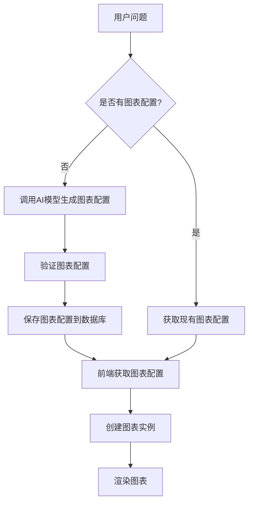
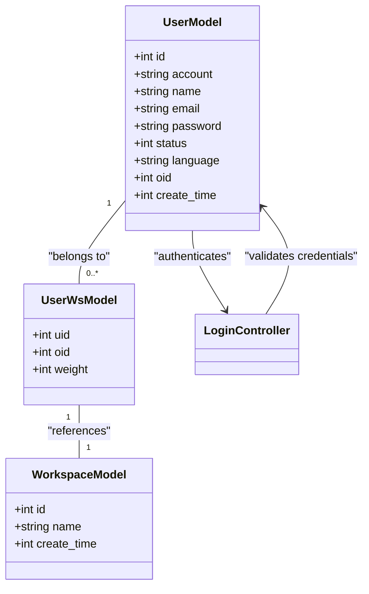
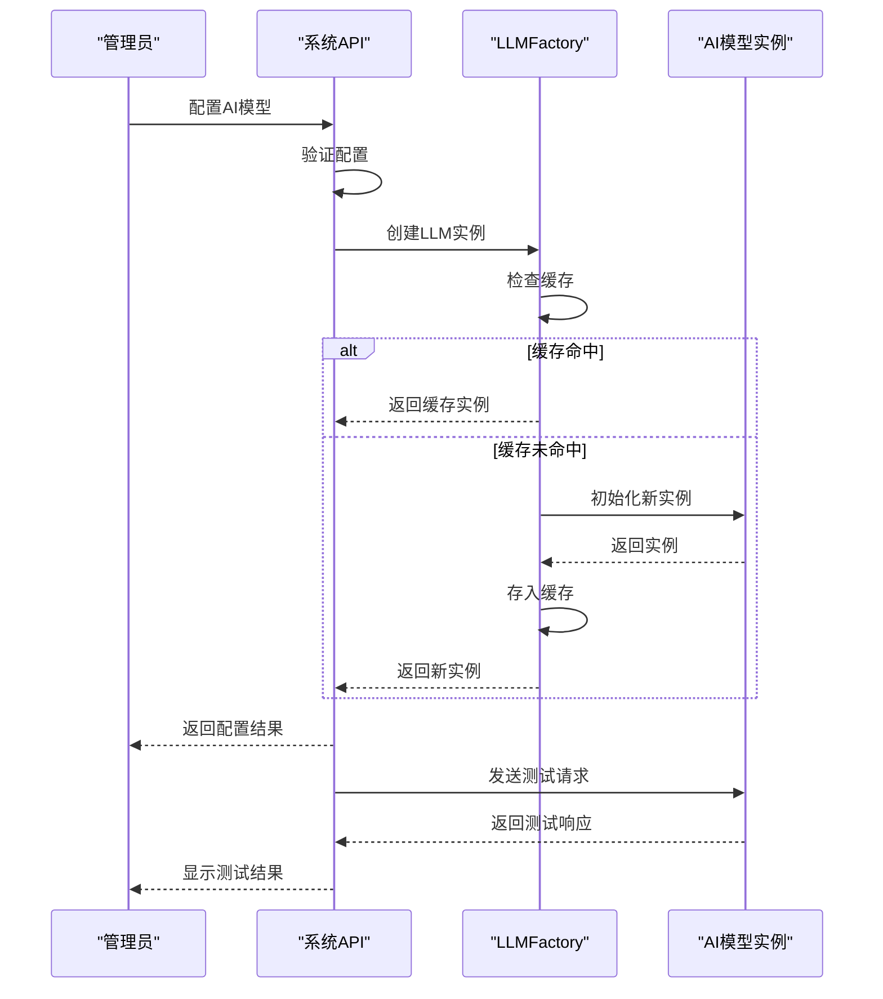
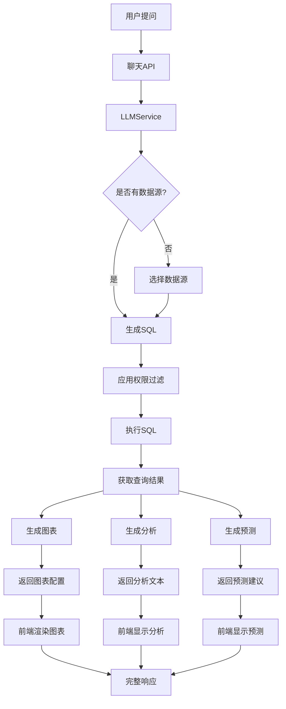

# 核心功能

<cite>
**本文档引用的文件**   
- [llm.py](file://backend/apps/chat/task/llm.py)
- [chat.py](file://backend/apps/chat/api/chat.py)
- [datasource.py](file://backend/apps/datasource/models/datasource.py)
- [system_model.py](file://backend/apps/system/models/system_model.py)
- [user.py](file://backend/apps/system/models/user.py)
- [ai_model_schema.py](file://backend/apps/system/schemas/ai_model_schema.py)
- [model_factory.py](file://backend/apps/ai_model/model_factory.py)
- [chat_model.py](file://backend/apps/chat/models/chat_model.py)
- [datasource.py](file://backend/apps/datasource/crud/datasource.py)
- [aimodel.py](file://backend/apps/system/api/aimodel.py)
- [user.py](file://backend/apps/system/api/user.py)
- [login.py](file://backend/apps/system/api/login.py)
- [BaseChart.ts](file://frontend/src/views/chat/component/BaseChart.ts)
- [index.vue](file://frontend/src/views/dashboard/components/sq-view/index.vue)
- [generator.py](file://backend/apps/template/generate_chart/generator.py)
</cite>

## 目录
1. [自然语言问答](#自然语言问答)
2. [数据可视化](#数据可视化)
3. [数据源管理](#数据源管理)
4. [用户系统](#用户系统)
5. [AI模型集成](#ai模型集成)
6. [功能集成与协同工作流程](#功能集成与协同工作流程)
7. [实际业务场景用例分析](#实际业务场景用例分析)

## 自然语言问答

SQLBot的核心功能之一是自然语言问答，允许用户以自然语言形式提出问题，系统自动将其转换为SQL查询并执行。该功能主要由`LLMService`类实现，该类负责处理用户问题、生成SQL、执行查询和返回结果。

当用户在聊天界面输入问题时，系统通过`stream_sql` API端点接收请求，创建`LLMService`实例并初始化记录。`LLMService`首先检查是否需要选择数据源，如果当前会话没有关联的数据源，则调用`select_datasource`方法让用户选择或自动选择合适的数据源。选择数据源后，系统使用AI模型生成SQL查询。

SQL生成过程采用流式处理，允许前端实时显示生成进度。系统将用户问题和数据库模式信息组合成提示词，发送给AI模型。AI模型返回的响应经过解析和验证，确保生成的SQL语法正确且安全。验证通过后，SQL被保存到数据库并执行，查询结果随后被返回给用户。

**Section sources**
- [llm.py](file://backend/apps/chat/task/llm.py#L47-L1112)
- [chat.py](file://backend/apps/chat/api/chat.py#L109-L152)

## 数据可视化

SQLBot提供强大的数据可视化功能，能够将查询结果自动转换为各种图表类型，包括柱状图、折线图、饼图和表格等。该功能由前端`BaseChart`抽象类和后端图表生成器共同实现。

后端通过`generate_chart`方法生成图表配置。该方法将SQL查询结果和用户问题作为输入，利用AI模型生成包含图表类型、轴配置和数据映射的JSON格式图表配置。生成的配置经过验证后保存到数据库，前端通过API获取这些配置并渲染图表。

前端实现了多种图表类型，所有图表类都继承自`BaseChart`基类。`ChartComponent`组件负责根据接收到的图表配置动态创建相应的图表实例。用户可以在聊天界面中通过图表弹出菜单切换不同的图表类型，系统会重新渲染图表以反映用户的偏好。

**Diagram sources **
- [llm.py](file://backend/apps/chat/task/llm.py#L665-L703)
- [BaseChart.ts](file://frontend/src/views/chat/component/BaseChart.ts#L0-L31)
- [index.vue](file://frontend/src/views/dashboard/components/sq-view/index.vue#L100-L165)
- [generator.py](file://backend/apps/template/generate_chart/generator.py#L0-L5)

**Section sources**
- [llm.py](file://backend/apps/chat/task/llm.py#L665-L703)
- [BaseChart.ts](file://frontend/src/views/chat/component/BaseChart.ts#L0-L31)

## 数据源管理

数据源管理功能允许用户配置和管理各种数据库连接，包括MySQL、PostgreSQL、SQL Server、Oracle等关系型数据库，以及Excel文件等。该功能由`CoreDatasource`模型和相关CRUD操作实现。

`CoreDatasource`模型定义了数据源的基本属性，包括名称、描述、类型、配置信息和状态等。配置信息以加密的JSON格式存储，包含数据库连接所需的主机、端口、用户名、密码等敏感信息。系统提供了完整的CRUD接口，支持创建、读取、更新和删除数据源。

数据源配置过程中，系统会验证连接的有效性，确保提供的凭据能够成功连接到目标数据库。配置完成后，系统会自动获取数据库的元数据信息，包括表结构和字段信息，并允许用户选择需要访问的表和字段。对于权限管理，系统支持行级和列级权限控制，确保用户只能访问其被授权的数据。

**Section sources**
- [datasource.py](file://backend/apps/datasource/models/datasource.py#L0-L30)
- [datasource.py](file://backend/apps/datasource/crud/datasource.py#L0-L373)

## 用户系统

用户系统是SQLBot安全架构的核心，负责用户身份验证、权限管理和个人设置。该功能由`UserModel`和相关API端点实现，支持用户注册、登录、密码修改和状态管理。

`UserModel`模型定义了用户的基本信息，包括账号、姓名、邮箱、密码（MD5加密存储）、状态和语言偏好等。系统采用基于JWT的认证机制，用户登录成功后会获得一个访问令牌，用于后续API调用的身份验证。管理员用户具有特殊权限，可以管理其他用户账户，包括启用/禁用账户和重置密码。

用户系统还实现了工作区（Workspace）概念，允许用户在不同的工作区之间切换。每个用户可以被分配到一个或多个工作区，不同工作区可能关联不同的数据源和AI模型配置。用户语言偏好设置会影响系统界面语言和AI模型生成内容的语言。

**Diagram sources **
- [user.py](file://backend/apps/system/models/user.py#L0-L23)
- [system_model.py](file://backend/apps/system/models/system_model.py#L45-L57)
- [login.py](file://backend/apps/system/api/login.py#L0-L34)
- [user.py](file://backend/apps/system/api/user.py#L0-L19)

**Section sources**
- [user.py](file://backend/apps/system/models/user.py#L0-L23)
- [login.py](file://backend/apps/system/api/login.py#L0-L34)

## AI模型集成

AI模型集成功能是SQLBot智能能力的基础，支持多种大语言模型的配置和使用。该功能由`AiModelDetail`模型和`LLMFactory`工厂类实现，允许系统管理员配置多个AI模型实例，并指定默认模型。

`AiModelDetail`模型定义了AI模型的配置参数，包括供应商、模型类型、基础模型名称、API密钥、API域、协议类型和配置参数等。系统支持OpenAI兼容的API和VLLM等开源模型服务。`LLMFactory`类作为工厂模式的实现，负责根据配置创建相应的LLM实例，并提供缓存机制以提高性能。

系统支持对AI模型进行测试验证，确保配置的API密钥和端点能够正常工作。管理员可以设置默认模型，该模型将被用于所有用户的查询请求，除非在会话中指定了其他模型。模型配置中的额外参数（如temperature、max_tokens等）会被传递给底层LLM实例，以控制生成行为。

**Diagram sources **
- [system_model.py](file://backend/apps/system/models/system_model.py#L7-L21)
- [ai_model_schema.py](file://backend/apps/system/schemas/ai_model_schema.py#L1-L28)
- [model_factory.py](file://backend/apps/ai_model/model_factory.py#L88-L126)
- [aimodel.py](file://backend/apps/system/api/aimodel.py#L0-L14)

**Section sources**
- [system_model.py](file://backend/apps/system/models/system_model.py#L7-L21)
- [model_factory.py](file://backend/apps/ai_model/model_factory.py#L88-L126)

## 功能集成与协同工作流程

SQLBot的各个功能模块通过精心设计的集成关系协同工作，形成一个完整的智能数据分析工作流。当用户在聊天界面提问时，系统会协调多个服务完成从问题理解到结果展示的全过程。

工作流程始于用户输入问题，触发`stream_sql` API端点。该端点创建`LLMService`实例，该实例作为协调者管理整个处理流程。首先，服务检查并确保有合适的数据源可用，然后使用AI模型生成SQL查询。生成的SQL经过权限过滤器处理，确保符合行级和列级权限规则，然后在目标数据库上执行。

查询结果返回后，系统再次调用AI模型生成数据可视化配置。同时，系统会生成相关的分析解释和预测建议。所有这些结果被整合并通过流式响应返回给前端，前端根据接收到的数据类型动态更新界面，显示SQL、图表、分析文本和推荐问题。

**Diagram sources **
- [llm.py](file://backend/apps/chat/task/llm.py#L47-L1112)
- [chat.py](file://backend/apps/chat/api/chat.py#L109-L152)
- [datasource.py](file://backend/apps/datasource/crud/datasource.py#L0-L373)

**Section sources**
- [llm.py](file://backend/apps/chat/task/llm.py#L47-L1112)
- [chat.py](file://backend/apps/chat/api/chat.py#L109-L152)

## 实际业务场景用例分析

考虑一个销售数据分析的典型场景：用户希望了解"上个季度各地区的销售额和利润情况"。当用户在聊天界面输入这个问题时，系统启动完整的处理流程。

首先，系统识别到当前会话未关联数据源，于是调用`select_datasource`方法。由于用户属于特定工作区，系统查询该工作区可用的数据源列表，并使用AI模型推荐最可能包含销售数据的数据源。用户确认选择后，系统获取该数据源的数据库模式信息。

接下来，系统调用AI模型生成SQL查询。提示词中包含了数据库模式、用户问题和生成指令。AI模型返回类似`SELECT region, SUM(sales) as total_sales, SUM(profit) as total_profit FROM sales_data WHERE quarter = 'Q3' GROUP BY region`的SQL。系统验证SQL语法后，在目标数据库上执行，获取查询结果。

获得查询结果后，系统再次调用AI模型生成图表配置。AI模型建议使用柱状图展示各地区销售额，并使用折线图叠加显示利润。同时，系统生成对数据的分析解释，如"华东地区销售额最高，达到120万元，但利润率仅为15%，低于平均水平"。系统还生成预测建议，如"根据历史趋势，预计下季度销售额将增长8%"。

最后，所有这些结果通过流式响应返回前端。前端界面动态更新，显示生成的SQL、交互式图表、分析文本和预测建议。用户可以进一步与图表交互，如切换图表类型或导出数据，形成一个完整的智能数据分析闭环。

**Section sources**
- [llm.py](file://backend/apps/chat/task/llm.py#L47-L1112)
- [chat_model.py](file://backend/apps/chat/models/chat_model.py#L160-L222)
- [datasource.py](file://backend/apps/datasource/crud/datasource.py#L0-L373)