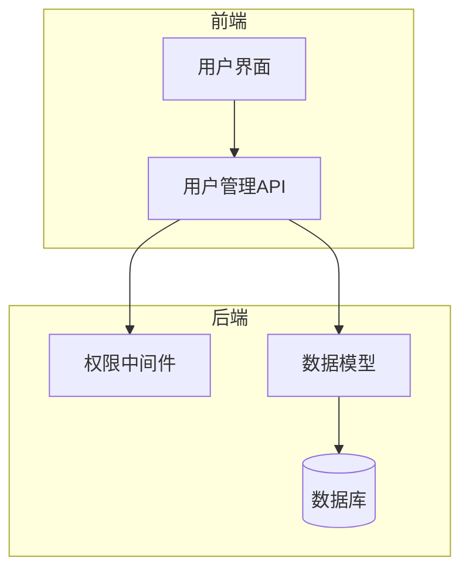
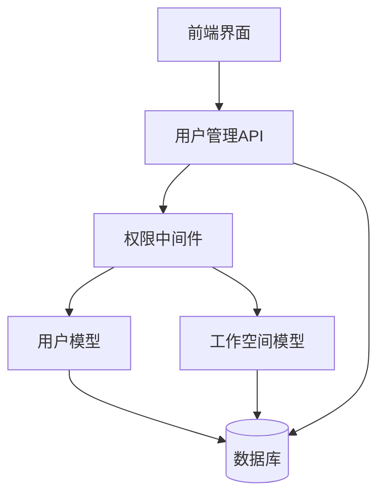
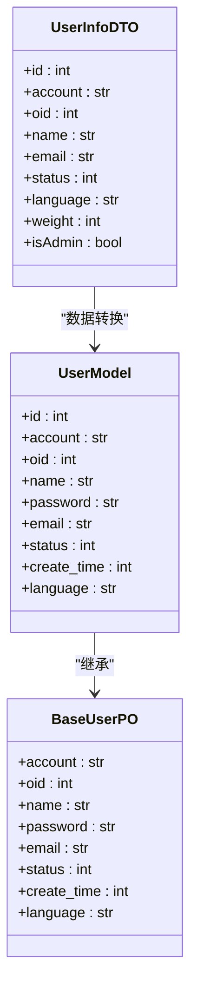
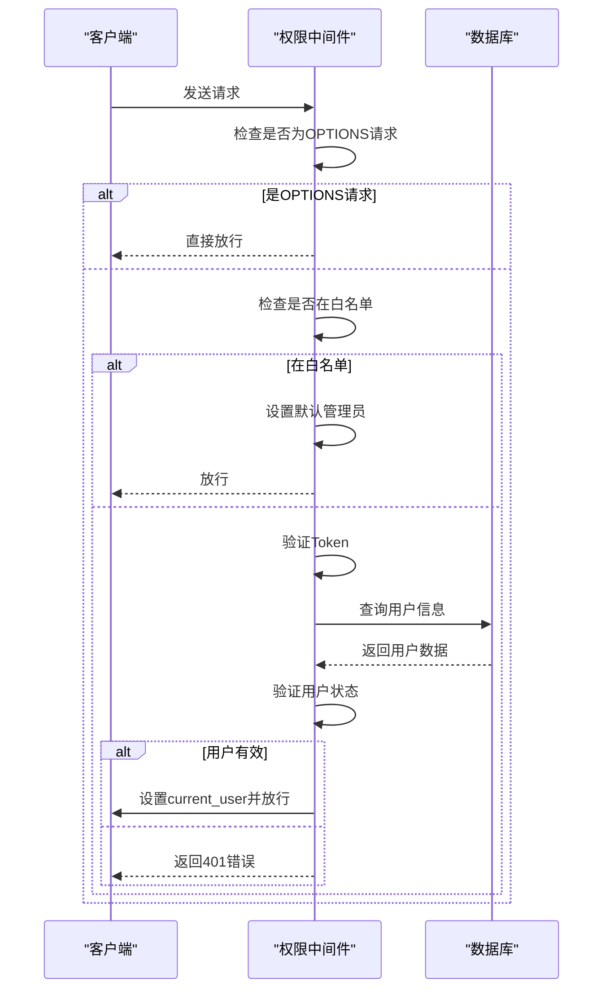
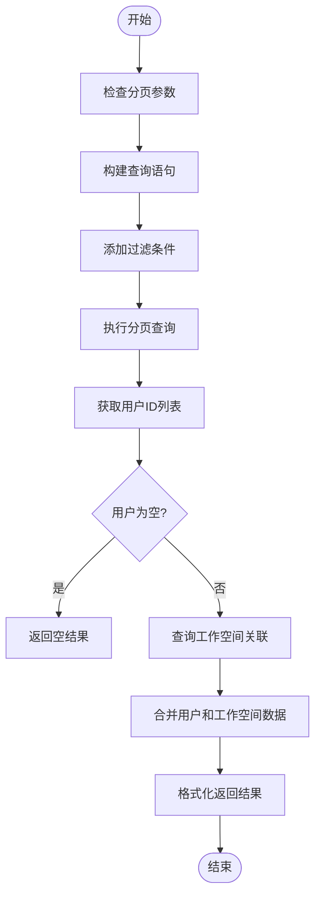
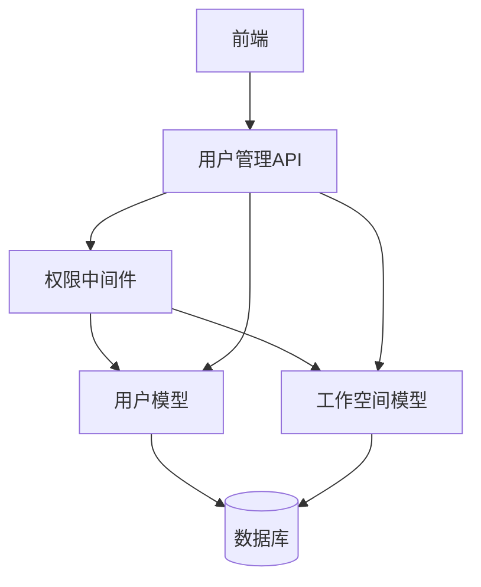

# 权限管理

<cite>
**本文档引用的文件**
- [user.py](file://backend/apps/system/models/user.py)
- [system_model.py](file://backend/apps/system/models/system_model.py)
- [auth.py](file://backend/apps/system/middleware/auth.py)
- [user.py](file://backend/apps/system/api/user.py)
- [user.ts](file://frontend/src/api/user.ts)
- [index.vue](file://frontend/src/views/system/user/index.vue)
</cite>

## 目录
1. [简介](#简介)
2. [项目结构](#项目结构)
3. [核心组件](#核心组件)
4. [架构概述](#架构概述)
5. [详细组件分析](#详细组件分析)
6. [依赖分析](#依赖分析)
7. [性能考虑](#性能考虑)
8. [故障排除指南](#故障排除指南)
9. [结论](#结论)

## 简介
本文档详细描述了基于用户角色和工作空间的权限控制体系。系统通过用户模型、工作空间关联和中间件实现细粒度的访问控制，支持多租户环境下的资源隔离。文档涵盖了用户数据模型、API端点实现、权限判断逻辑以及前端用户管理界面的功能。

## 项目结构
系统权限管理功能主要分布在后端API、数据模型和中间件中，前端通过API调用与后端交互。核心文件包括用户模型定义、权限中间件、用户管理API和前端用户界面。

**图表来源**
- [user.py](file://backend/apps/system/models/user.py#L1-L24)
- [auth.py](file://backend/apps/system/middleware/auth.py#L1-L199)
- [index.vue](file://frontend/src/views/system/user/index.vue#L1-L417)

**章节来源**
- [user.py](file://backend/apps/system/models/user.py#L1-L24)
- [auth.py](file://backend/apps/system/middleware/auth.py#L1-L199)

## 核心组件
权限管理系统的核心组件包括用户数据模型、工作空间关联模型、权限中间件和用户管理API。这些组件共同实现了基于角色和工作空间的细粒度访问控制。

**章节来源**
- [user.py](file://backend/apps/system/models/user.py#L1-L24)
- [system_model.py](file://backend/apps/system/models/system_model.py#L1-L58)

## 架构概述
系统采用分层架构，前端通过API与后端交互，中间件负责权限验证，数据模型定义用户和工作空间的结构，数据库持久化存储数据。

**图表来源**
- [user.py](file://backend/apps/system/models/user.py#L1-L24)
- [system_model.py](file://backend/apps/system/models/system_model.py#L1-L58)
- [auth.py](file://backend/apps/system/middleware/auth.py#L1-L199)

## 详细组件分析

### 用户数据模型分析
用户数据模型定义了用户的核心属性和权限相关字段，是权限判断的基础。

#### 用户模型类图

**图表来源**
- [user.py](file://backend/apps/system/models/user.py#L10-L21)
- [system_schema.py](file://backend/apps/system/schemas/system_schema.py#L82-L85)

### 权限中间件分析
权限中间件负责处理所有请求的认证和授权，是权限控制的核心组件。

#### 权限验证序列图

**图表来源**
- [auth.py](file://backend/apps/system/middleware/auth.py#L20-L198)
- [user.py](file://backend/apps/system/models/user.py#L1-L24)

### 用户管理API分析
用户管理API提供了用户生命周期管理的完整功能，包括查询、创建、更新、删除和密码修改。

#### 用户查询流程图

**图表来源**
- [user.py](file://backend/apps/system/api/user.py#L22-L81)
- [user.py](file://backend/apps/system/models/user.py#L1-L24)

## 依赖分析
权限管理系统各组件之间存在紧密的依赖关系，形成了完整的权限控制链条。

**图表来源**
- [auth.py](file://backend/apps/system/middleware/auth.py#L1-L199)
- [user.py](file://backend/apps/system/api/user.py#L1-L237)
- [system_model.py](file://backend/apps/system/models/system_model.py#L1-L58)

**章节来源**
- [auth.py](file://backend/apps/system/middleware/auth.py#L1-L199)
- [user.py](file://backend/apps/system/api/user.py#L1-L237)

## 性能考虑
权限管理系统在设计时考虑了性能优化，包括缓存机制、批量操作和数据库查询优化。

## 故障排除指南
当遇到权限相关问题时，可以按照以下步骤进行排查：

**章节来源**
- [auth.py](file://backend/apps/system/middleware/auth.py#L1-L199)
- [user.py](file://backend/apps/system/api/user.py#L1-L237)

## 结论
本文档详细介绍了权限管理系统的架构和实现，涵盖了用户模型、权限中间件、API端点和前端界面。系统通过基于角色和工作空间的权限控制，实现了细粒度的访问控制和多租户支持。