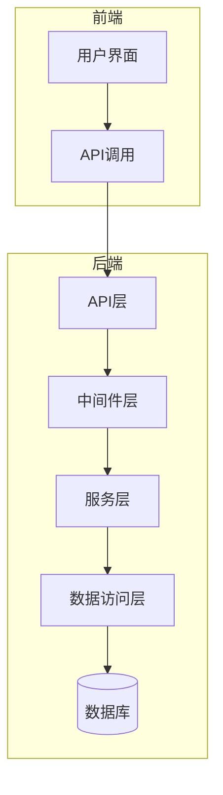
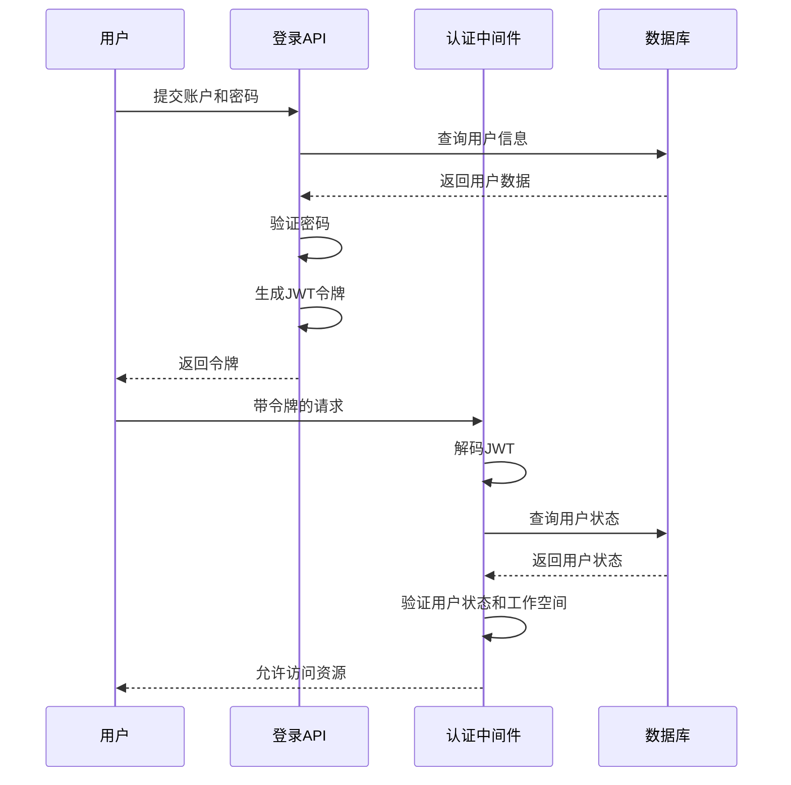
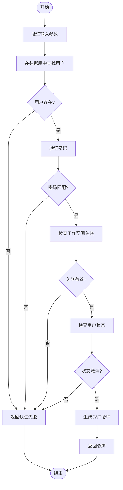
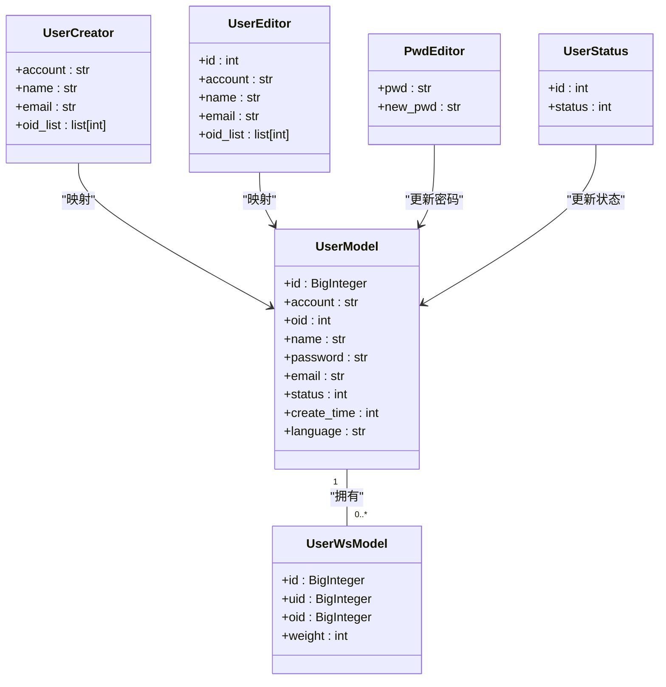
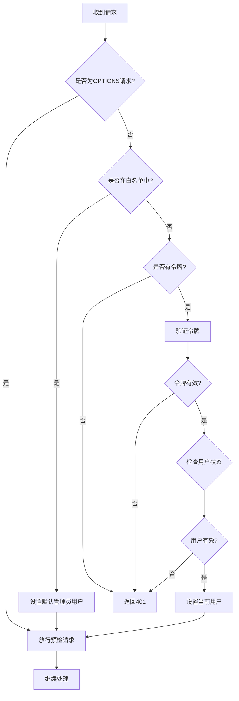
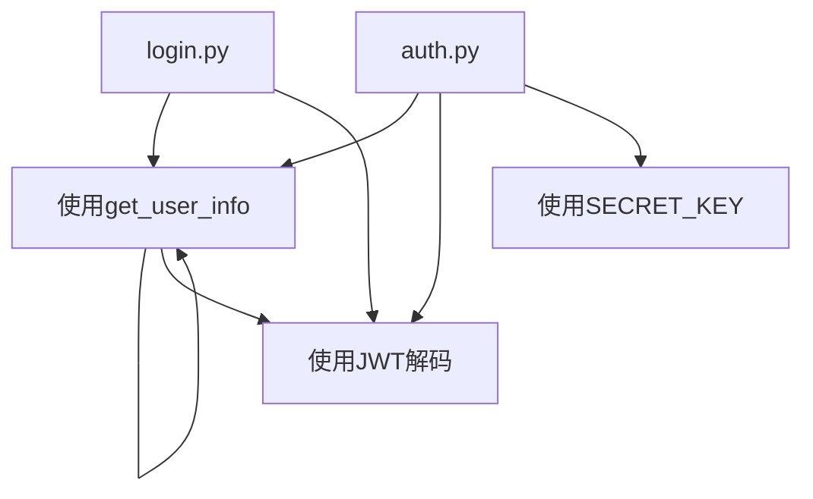

# 用户系统

<cite>
**本文档引用文件**   
- [login.py](file://backend/apps/system/api/login.py)
- [user.py](file://backend/apps/system/api/user.py)
- [auth.py](file://backend/apps/system/middleware/auth.py)
- [user.py](file://backend/apps/system/crud/user.py)
- [security.py](file://backend/common/core/security.py)
</cite>

## 目录
1. [简介](#简介)
2. [项目结构](#项目结构)
3. [核心组件](#核心组件)
4. [架构概述](#架构概述)
5. [详细组件分析](#详细组件分析)
6. [依赖分析](#依赖分析)
7. [性能考虑](#性能考虑)
8. [故障排除指南](#故障排除指南)
9. [结论](#结论)

## 简介
本文档详细描述了SQLBot系统中的用户管理系统，涵盖用户认证与授权机制、用户管理CRUD操作、权限分级体系以及工作空间级别的访问控制。系统采用JWT令牌进行身份验证，通过中间件实现请求拦截，并结合缓存机制提升性能。用户角色基于ID和账户名进行管理，工作空间（Workspace）作为核心隔离单元，实现多租户环境下的数据隔离。前端界面提供完整的用户生命周期管理功能，包括创建、编辑、删除和权限分配。

## 项目结构
用户系统主要由后端API、中间件、数据访问层和前端界面组成。后端采用分层架构，API层处理HTTP请求，业务逻辑层实现核心功能，数据访问层与数据库交互。前端通过Vue.js框架构建用户界面，与后端REST API进行通信。

**图示来源**
- [login.py](file://backend/apps/system/api/login.py#L1-L34)
- [user.py](file://backend/apps/system/api/user.py#L1-L236)
- [auth.py](file://backend/apps/system/middleware/auth.py#L1-L198)

**本节来源**
- [login.py](file://backend/apps/system/api/login.py#L1-L34)
- [user.py](file://backend/apps/system/api/user.py#L1-L236)

## 核心组件
核心组件包括用户认证接口、用户管理API、认证中间件、JWT令牌生成与验证服务以及工作空间管理功能。认证流程通过`login.py`中的`local_login`函数实现，用户管理操作由`user.py`中的多个端点处理，所有受保护的路由通过`auth.py`中的`TokenMiddleware`进行访问控制。系统使用MD5算法对密码进行哈希存储，并通过`security.py`中的工具函数管理令牌生命周期。

**本节来源**
- [login.py](file://backend/apps/system/api/login.py#L1-L34)
- [user.py](file://backend/apps/system/api/user.py#L1-L236)
- [auth.py](file://backend/apps/system/middleware/auth.py#L1-L198)
- [security.py](file://backend/common/core/security.py#L1-L43)

## 架构概述
系统采用基于JWT的无状态认证架构。用户登录时，系统验证凭据并生成包含用户信息的JWT令牌。后续请求通过`TokenMiddleware`验证令牌的有效性，并将用户信息注入请求上下文。权限管理结合用户角色（仅ID为1且账户名为admin的用户为管理员）和工作空间关联实现。缓存机制用于存储用户信息，减少数据库查询。

**图示来源**
- [login.py](file://backend/apps/system/api/login.py#L1-L34)
- [auth.py](file://backend/apps/system/middleware/auth.py#L1-L198)
- [security.py](file://backend/common/core/security.py#L1-L43)

## 详细组件分析

### 用户认证分析
用户认证流程从客户端提交用户名和密码开始，系统通过`authenticate`函数验证凭据，成功后调用`create_access_token`生成JWT令牌。

**图示来源**
- [login.py](file://backend/apps/system/api/login.py#L1-L34)
- [user.py](file://backend/apps/system/crud/user.py#L38-L44)
- [security.py](file://backend/common/core/security.py#L14-L20)

**本节来源**
- [login.py](file://backend/apps/system/api/login.py#L1-L34)
- [user.py](file://backend/apps/system/crud/user.py#L38-L44)

### 用户管理CRUD分析
用户管理API提供完整的CRUD操作，包括创建、读取、更新和删除用户，以及密码修改和状态管理。

**图示来源**
- [user.py](file://backend/apps/system/api/user.py#L1-L236)
- [user.py](file://backend/apps/system/models/user.py#L1-L22)

**本节来源**
- [user.py](file://backend/apps/system/api/user.py#L1-L236)
- [user.py](file://backend/apps/system/crud/user.py#L1-L88)

### 认证中间件分析
`TokenMiddleware`负责拦截请求并验证JWT令牌，确保只有经过认证的用户才能访问受保护的资源。

**图示来源**
- [auth.py](file://backend/apps/system/middleware/auth.py#L1-L198)

**本节来源**
- [auth.py](file://backend/apps/system/middleware/auth.py#L1-L198)

## 依赖分析
系统组件间存在明确的依赖关系，API层依赖于中间件和业务逻辑层，业务逻辑层依赖于数据访问层和安全服务。

**图示来源**
- [login.py](file://backend/apps/system/api/login.py#L1-L34)
- [user.py](file://backend/apps/system/api/user.py#L1-L236)
- [auth.py](file://backend/apps/system/middleware/auth.py#L1-L198)
- [security.py](file://backend/common/core/security.py#L1-L43)

**本节来源**
- [login.py](file://backend/apps/system/api/login.py#L1-L34)
- [user.py](file://backend/apps/system/api/user.py#L1-L236)
- [auth.py](file://backend/apps/system/middleware/auth.py#L1-L198)

## 性能考虑
系统通过缓存用户信息减少数据库查询，`get_user_info`函数使用`@cache`装饰器实现结果缓存。当用户信息更新时，`@clear_cache`装饰器确保相关缓存被清除。这种机制在高并发场景下能显著提升响应速度，同时保证数据一致性。

## 故障排除指南
常见问题包括登录失败、权限不足和令牌过期。登录失败通常由账户密码错误、用户被禁用或未关联工作空间导致。权限不足问题多出现在非管理员用户尝试执行管理操作时。令牌过期错误可通过重新登录获取新令牌解决。系统日志记录了详细的认证失败信息，便于排查问题。

**本节来源**
- [login.py](file://backend/apps/system/api/login.py#L1-L34)
- [auth.py](file://backend/apps/system/middleware/auth.py#L1-L198)

## 结论
SQLBot用户系统实现了完整的用户生命周期管理和基于JWT的认证授权机制。系统设计注重安全性，采用密码哈希存储和令牌验证，同时通过工作空间隔离实现多租户支持。API设计遵循REST原则，前端界面提供直观的管理功能。缓存机制和清晰的分层架构确保了系统的高性能和可维护性。